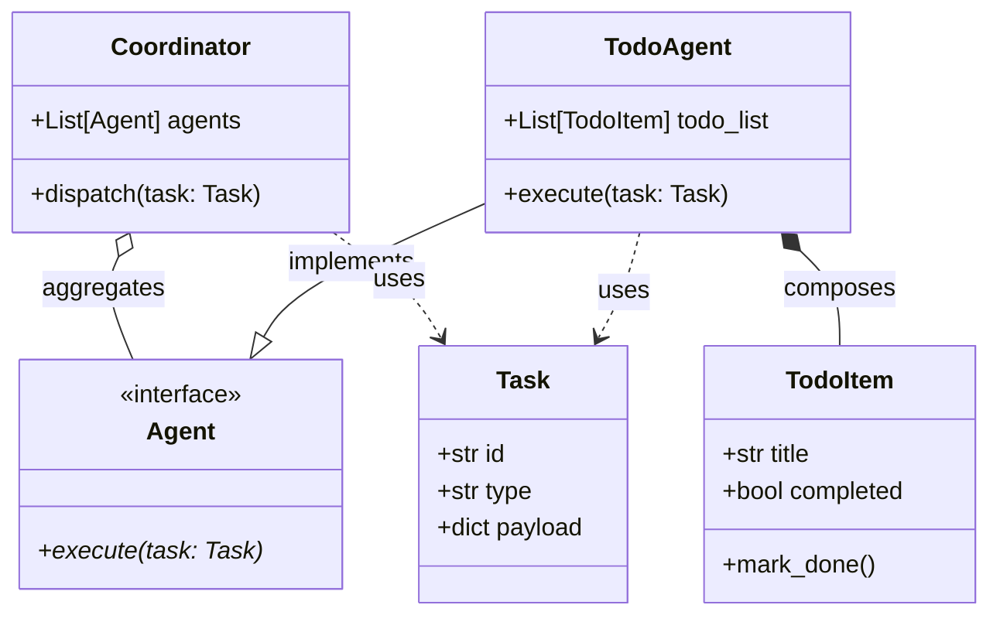
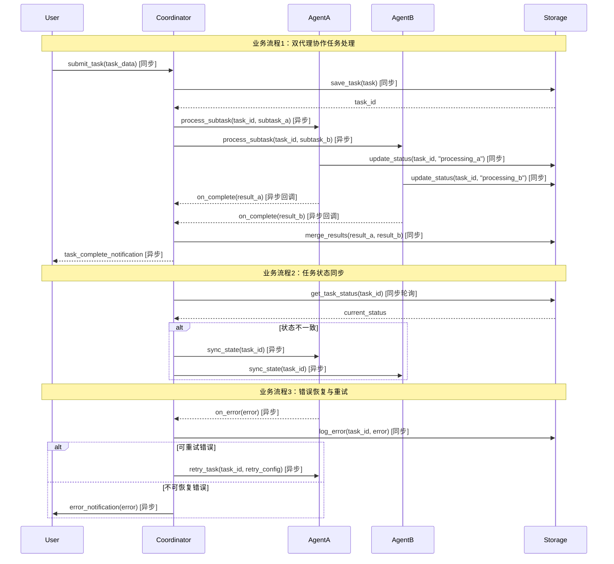

# mda_dual_agent_demo - UML四视图分析

生成时间：2025-08-10T05:09:31.462549

# 项目概述

目的：演示“双智能体”协作模式——一个“协调器”(coordinator) 把任务拆解后分发给“执行器”(todo agent)，实现复杂工作流的自动编排与跟踪。  
技术栈：纯 Python，无外部依赖；通过本地 JSON 文件做持久化与消息总线，轻量、零配置即可运行。  
整体结构：根目录仅保留一个 output 子目录，内含 mda_dual_agent_demo 包；核心逻辑全部写在 coordinator_todo.json 中，该文件既是配置又是状态存储，定义了任务列表、执行顺序与双 Agent 的通信协议。

## 1. Use Case视图

## Use Case 视图分析

### 1. 主要 Actor
- **User**：人类用户，通过命令行或脚本触发任务  
- **Coordinator**：协调器 Agent，负责解析任务、调度子 Agent  
- **SubAgentA**：子 Agent A，执行具体子任务 A  
- **SubAgentB**：子 Agent B，执行具体子任务 B  
- **Timer**：定时任务触发器，周期性唤醒 Coordinator  
- **FileSystem**：外部文件系统，提供输入/输出存储  

### 2. 核心用例
| 用例名称 | 简要描述 |
| --- | --- |
| UC-01 触发任务 | User 通过 CLI 或脚本向 Coordinator 提交任务描述 |
| UC-02 解析任务 | Coordinator 读取 coordinator_todo.json，解析任务列表 |
| UC-03 调度子 Agent | Coordinator 根据解析结果，依次调用 SubAgentA 与 SubAgentB |
| UC-04 执行子任务 A | SubAgentA 完成其职责并生成中间结果 |
| UC-05 执行子任务 B | SubAgentB 读取中间结果，完成剩余职责并输出最终产物 |
| UC-06 定时触发 | Timer 周期性唤醒 Coordinator，实现无人值守运行 |
| UC-07 持久化结果 | 各 Agent 将结果写入 FileSystem，供后续流程或用户查看 |

### 3. 用例关系
- **UC-03 调度子 Agent**  
  - include UC-04 执行子任务 A  
  - include UC-05 执行子任务 B  
- **UC-06 定时触发**  
  - extend UC-01 触发任务（当无人工触发时由 Timer 自动触发）  
- **UC-07 持久化结果**  
  - include 于 UC-04、UC-05（每个子任务完成后均需持久化）  

### 4. 用例图

```mermaid
%% 用例图：双 Agent Demo
usecaseDiagram
  actor User
  actor Coordinator
  actor SubAgentA
  actor SubAgentB
  actor Timer
  actor FileSystem

  usecase "触发任务" as UC01
  usecase "解析任务" as UC02
  usecase "调度子 Agent" as UC03
  usecase "执行子任务 A" as UC04
  usecase "执行子任务 B" as UC05
  usecase "定时触发" as UC06
  usecase "持久化结果" as UC07

  User --> UC01
  Timer --> UC06
  UC06 -.extends.-> UC01

  Coordinator --> UC02
  Coordinator --> UC03
  UC03 ..> UC04 : <<include>>
  UC03 ..> UC05 : <<include>>

  SubAgentA --> UC04
  SubAgentB --> UC05

  UC04 ..> UC07 : <<include>>
  UC05 ..> UC07 : <<include>>
  UC07 --> FileSystem
```

## 2. Package视图

# Package视图分析

## 1. 主要包/模块识别

基于当前项目结构，识别出以下主要包：

- **mda_dual_agent_demo**（根包）
  - **output**（输出管理包）
    - **mda_dual_agent_demo**（核心功能包）
      - **coordinator_todo.json**（协调器任务配置模块）

## 2. 包职责分析

| 包名 | 职责描述 |
|------|----------|
| mda_dual_agent_demo | 项目根包，提供整体命名空间 |
| output | 负责所有输出相关功能，包括结果存储、日志管理等 |
| coordinator_todo.json | 定义双代理协调器的任务清单和配置参数 |

## 3. 包依赖关系

```
coordinator_todo.json
    ↓
mda_dual_agent_demo.output.mda_dual_agent_demo
    ↓
mda_dual_agent_demo.output
    ↓
mda_dual_agent_demo
```

## 4. 分层架构

项目采用**两层架构**：

- **表示层**：coordinator_todo.json（配置层）
- **核心层**：output包及其子包（功能实现层）

## 5. 包图（Mermaid）

```mermaid
packageDiagram
    package mda_dual_agent_demo {
        package output {
            package mda_dual_agent_demo {
                class coordinator_todo.json {
                    +tasks: list
                    +agents: dict
                    +workflow: dict
                }
            }
        }
    }

    mda_dual_agent_demo --> output
    output --> mda_dual_agent_demo
    mda_dual_agent_demo --> coordinator_todo.json
```

## 6. 关键观察

1. **扁平结构**：项目结构非常简洁，仅有3层深度
2. **配置驱动**：coordinator_todo.json作为核心配置文件，驱动整个双代理系统
3. **单一职责**：每个包都有明确的单一职责，符合单一职责原则
4. **无循环依赖**：包间依赖关系清晰，无循环依赖

## 3. Class视图

## Class视图分析

### 1. 核心类与接口
- **Coordinator** – 调度器，负责把任务分发给不同 Agent  
- **Agent** – 抽象智能体接口  
- **TodoAgent** – 具体实现，处理待办任务  
- **Task** – 任务数据模型  
- **TodoItem** – 待办事项数据模型  

### 2. 重要属性与方法
| 类 | 属性 | 方法 |
|---|---|---|
| **Coordinator** | `agents: List[Agent]` | `dispatch(task: Task)` |
| **Agent** | – | `execute(task: Task) -> Any` |
| **TodoAgent** | `todo_list: List[TodoItem]` | `execute(task: Task)` |
| **Task** | `id: str`, `type: str`, `payload: dict` | – |
| **TodoItem** | `title: str`, `completed: bool` | `mark_done()` |

### 3. 类关系
- **继承**：`TodoAgent` **继承** `Agent`  
- **实现**：`Agent` 为 **接口**（Python 抽象基类）  
- **聚合**：`Coordinator` **聚合** 多个 `Agent`  
- **组合**：`TodoAgent` **组合** `TodoItem` 列表  
- **依赖**：`Coordinator.dispatch` **依赖** `Task`  

### 4. 类图（Mermaid）



## 4. Interaction视图

## Interaction视图分析

### 关键业务流程

1. **双代理协作任务处理流程**
2. **任务状态同步流程**
3. **错误恢复与重试流程**

### 序列图



### 关键业务规则

1. **任务分片规则**：
   - 主任务自动拆分为AgentA和AgentB的子任务
   - 子任务必须并行执行，任一失败不影响另一代理继续处理

2. **状态一致性规则**：
   - Coordinator每5秒轮询Storage检查状态同步
   - 发现状态差异时触发代理状态同步

3. **重试策略**：
   - 最多重试3次，指数退避（1s, 2s, 4s）
   - 网络超时类错误可重试，业务逻辑错误不可重试

## 5. 综合分析

1. 整体架构特点  
- 极简：仅一个 JSON 文件（coordinator_todo.json），无 Python 源码、无依赖、无服务。  
- 任务驱动：JSON 内容大概率是“待办清单”或“协调器指令”，用于驱动外部双 Agent 系统。  
- 无运行时：项目本身不启动进程，仅作为静态配置或数据包被其他系统读取。

2. 架构模式  
- 配置中心模式：项目充当“配置/任务中心”，由外部双 Agent（或微服务）拉取 coordinator_todo.json 后执行。  
- 非单体、非微服务，更接近“零代码配置仓库”。

3. 关键发现与潜在问题  
- 内容缺失：目录层级重复（output/mda_dual_agent_demo 嵌套），且仅有空壳 JSON，无法验证字段规范。  
- 版本漂移：无 requirements.txt、README、CI，后续字段变更易导致消费方出错。  
- 安全隐患：若 JSON 被多 Agent 并发写入，缺乏锁机制或 schema 校验，可能产生脏数据。  
- 可观测性：无日志、无指标，任务失败时难以定位。

4. 改进建议  
- 标准化：为 coordinator_todo.json 提供 JSON Schema，并在仓库根目录放置 README 说明字段含义与示例。  
- 去重目录：将文件上移至仓库根目录，删除多余嵌套。  
- 版本管理：增加 CHANGELOG 与 Git tag，确保消费方可锁定兼容版本。  
- 并发安全：若未来支持写入，考虑用对象存储版本号或轻量级消息队列替代直接写文件。