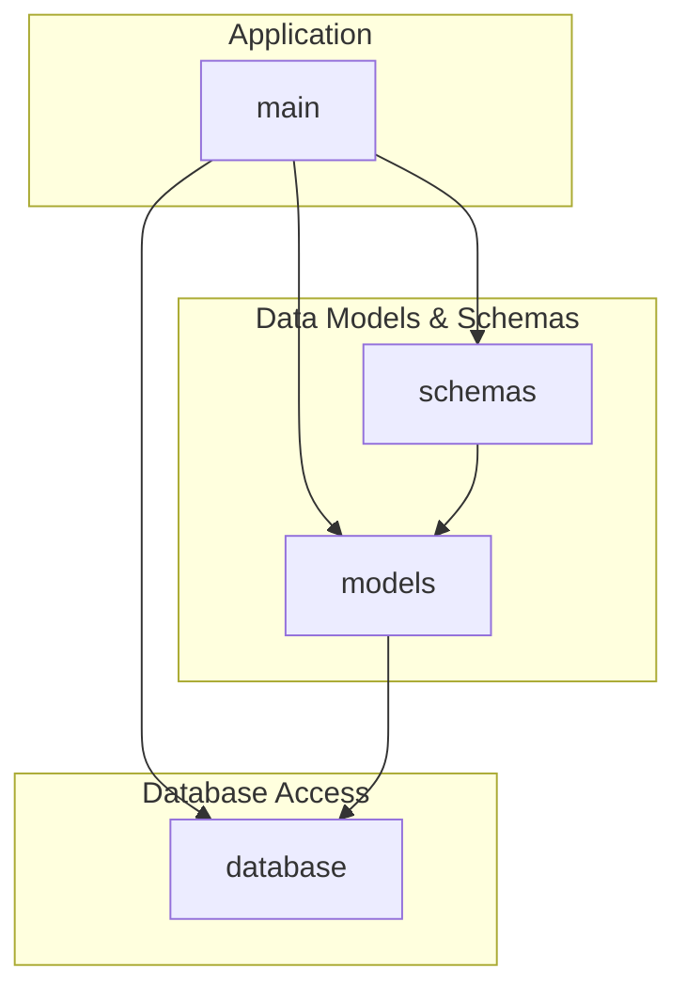
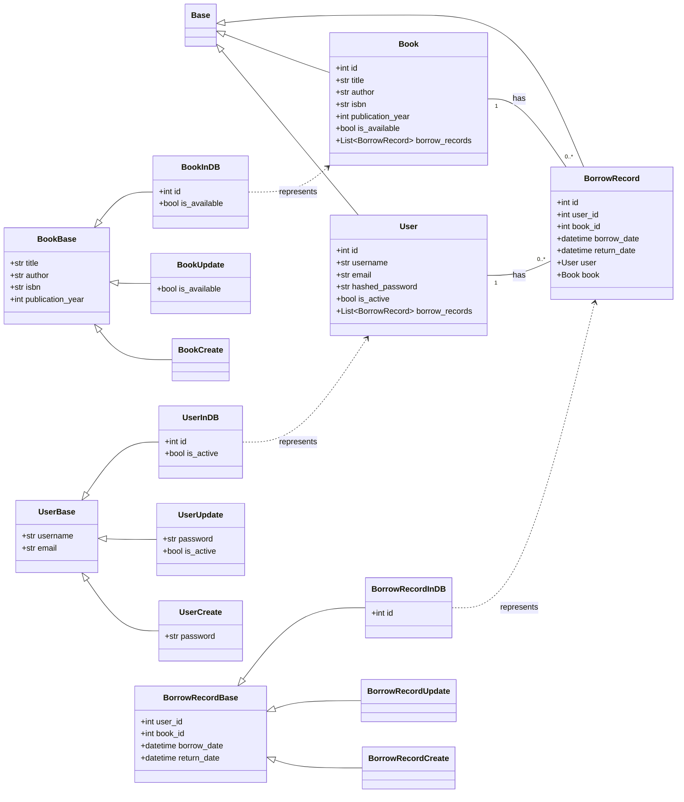
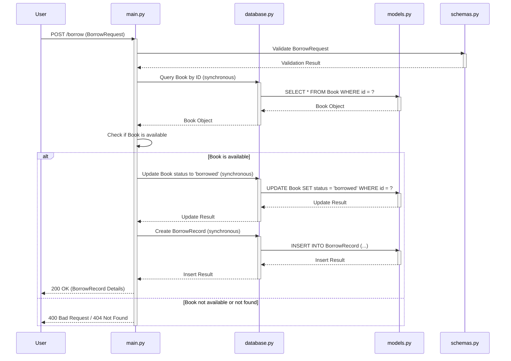
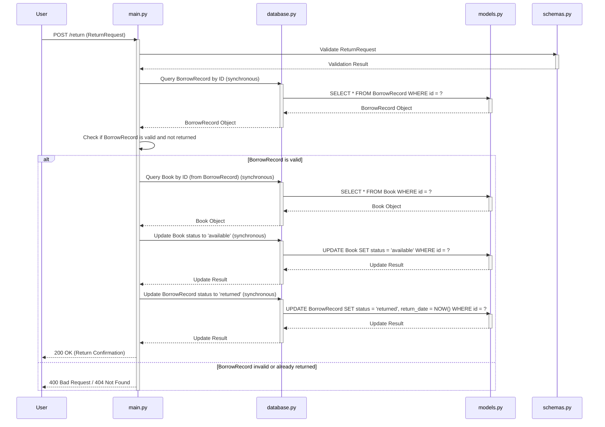

# mda_demo - UML四视图分析

生成时间：2025-08-09T00:35:54.954975

# 项目概述

这个项目是一个**图书馆借阅系统**的后端应用。

**目的：** 实现图书馆借阅的核心功能，包括用户、书籍、借阅记录的管理，并提供API接口供前端或其他服务调用。

**技术栈：**
*   **Python:** 主要开发语言。
*   **SQLAlchemy:** ORM（对象关系映射）工具，用于Python代码与数据库交互。
*   **Pydantic:** 数据验证和序列化库，用于定义数据模型和API请求/响应结构。
*   **SQLite (推测):** `database.py` 通常会配置数据库连接，考虑到项目规模和文件结构，很可能使用轻量级的SQLite作为开发或演示数据库。
*   **FastAPI/Flask (推测):** `main.py` 通常是Web应用的入口，结合`schemas.py`和`models.py`，很可能使用了FastAPI或Flask等Web框架来构建API。

**整体结构：**
*   `database.py`: 负责数据库连接和会话管理。
*   `models.py`: 定义数据库表结构（如User, Book, BorrowingRecord等）及其字段，使用SQLAlchemy ORM。
*   `schemas.py`: 定义API请求和响应的数据模型，使用Pydantic进行数据验证和序列化。
*   `main.py`: Web应用入口，包含API路由定义、业务逻辑处理，并调用`models.py`和`database.py`进行数据操作，以及`schemas.py`进行数据校验和转换。
*   `library_borrowing_system.md` 和 `library_borrowing_system_psm.md`: 可能包含项目需求文档、设计文档或API规范。
*   `requirements.txt`: 列出项目依赖的Python库。

简而言之，这是一个基于Python，使用ORM和数据验证库构建的，提供API接口的后端服务。

## 1. Use Case视图

## Use Case 视图分析：图书馆借阅系统

根据提供的项目信息，特别是 `library_borrowing_system.md` 和 `library_borrowing_system_psm.md` 的存在，以及 `models.py`、`schemas.py`、`main.py` 等文件，可以推断这是一个关于图书馆借阅系统的项目。

### 1. 主要 Actor

*   **读者 (Patron)**：图书馆的用户，进行借阅、归还、查询等操作。
*   **图书管理员 (Librarian)**：负责管理图书、用户、借阅记录等。
*   **系统 (System)**：执行自动化任务，如逾期提醒。

### 2. 核心用例

| 用例名称           | 简要描述                                     |
| :----------------- | :------------------------------------------- |
| **读者用例**       |                                              |
| 借阅图书           | 读者从图书馆借走一本图书。                   |
| 归还图书           | 读者将已借图书归还给图书馆。                 |
| 查询图书           | 读者查询图书馆中图书的信息（如库存、位置）。 |
| 查询借阅记录       | 读者查询自己的借阅历史和当前借阅状态。     |
| **图书管理员用例** |                                              |
| 添加图书           | 管理员将新图书录入系统。                     |
| 删除图书           | 管理员从系统中移除图书。                     |
| 修改图书信息       | 管理员更新图书的详细信息。                   |
| 注册读者           | 管理员为新读者创建账户。                     |
| 删除读者           | 管理员从系统中移除读者账户。                 |
| 修改读者信息       | 管理员更新读者的个人信息。                   |
| 查看所有借阅记录   | 管理员查看所有读者的借阅历史。               |
| **系统用例**       |                                              |
| 发送逾期提醒       | 系统自动向逾期未还的读者发送提醒。           |

### 3. 用例之间的关系

*   **包含 (Include)**：
    *   `借阅图书` 包含 `查询图书` (读者在借阅前可能需要查询)。
    *   `归还图书` 包含 `更新图书状态` (系统内部操作)。
    *   `添加图书` 包含 `验证图书信息`。
    *   `注册读者` 包含 `验证读者信息`。
*   **扩展 (Extend)**：
    *   `借阅图书` 扩展 `处理逾期罚款` (如果读者有逾期未还记录)。
    *   `归还图书` 扩展 `处理逾期罚款` (如果图书逾期归还)。
*   **泛化 (Generalization)**：
    *   （在此简单场景中，泛化关系不明显，通常用于更复杂的角色或操作层次结构）

### 4. 用例图

```mermaid
graph TD
    actor Patron as 读者
    actor Librarian as 图书管理员
    actor System as 系统

    rectangle "图书馆借阅系统" {
        usecase UC1 as "借阅图书"
        usecase UC2 as "归还图书"
        usecase UC3 as "查询图书"
        usecase UC4 as "查询借阅记录"
        usecase UC5 as "添加图书"
        usecase UC6 as "删除图书"
        usecase UC7 as "修改图书信息"
        usecase UC8 as "注册读者"
        usecase UC9 as "删除读者"
        usecase UC10 as "修改读者信息"
        usecase UC11 as "查看所有借阅记录"
        usecase UC12 as "发送逾期提醒"
        usecase UC13 as "处理逾期罚款"
        usecase UC14 as "验证图书信息"
        usecase UC15 as "验证读者信息"
        usecase UC16 as "更新图书状态"
    }

    读者 --> UC1
    读者 --> UC2
    读者 --> UC3
    读者 --> UC4

    图书管理员 --> UC5
    图书管理员 --> UC6
    图书管理员 --> UC7
    图书管理员 --> UC8
    图书管理员 --> UC9
    图书管理员 --> UC10
    图书管理员 --> UC11

    系统 --> UC12

    UC1 ..> UC3 : <<include>>
    UC1 ..> UC13 : <<extend>>
    UC2 ..> UC13 : <<extend>>
    UC2 ..> UC16 : <<include>>
    UC5 ..> UC14 : <<include>>
    UC8 ..> UC15 : <<include>>
```

## 2. Package视图

## Package视图分析

该项目结构扁平，主要由几个Python文件组成，可以将其视为一个单一的Python包。尽管没有明确的子目录来定义子包，但我们可以根据文件职责将其逻辑划分为不同的模块。

### 1. 主要的包/模块及其职责

基于提供的文件列表，我们可以识别以下逻辑模块：

*   **`main`**: 项目的入口点，负责协调各个模块，可能包含应用程序的启动逻辑和路由（如果这是一个Web应用）。
*   **`models`**: 定义应用程序的数据模型，通常与数据库表结构对应。
*   **`schemas`**: 定义数据验证和序列化/反序列化规则，通常用于API请求和响应的数据结构。
*   **`database`**: 负责数据库连接、会话管理以及与数据库交互的底层操作。

### 2. 包之间的依赖关系

*   **`main`** 依赖 **`models`** 和 **`schemas`**：`main`模块需要使用`models`来操作数据，并可能使用`schemas`来处理请求和响应数据。
*   **`main`** 依赖 **`database`**：`main`模块需要通过`database`模块来获取数据库会话或执行数据库操作。
*   **`schemas`** 依赖 **`models`**：`schemas`通常是基于`models`定义的，用于验证和序列化`models`实例。
*   **`models`** 依赖 **`database`** (隐式)：`models`通常需要`database`模块提供的ORM（对象关系映射）功能来定义和操作数据。

### 3. 分层架构

该项目展现出一种典型的三层架构的雏形：

*   **数据层 (Data Layer)**: `database.py` 负责数据持久化和访问。
*   **模型层 (Model Layer)**: `models.py` 定义业务实体和数据结构。
*   **表示/应用层 (Presentation/Application Layer)**: `main.py` 和 `schemas.py` 共同构成，`main.py` 处理业务逻辑和协调，`schemas.py` 处理数据传输对象 (DTO) 和验证。

### 4. 子项目间的依赖关系

该项目没有明确的子项目。所有文件都位于同一个根目录下，形成一个单一的逻辑项目。

### 5. 包图 (Mermaid)



## 3. Class视图

好的，我将专注于分析 `mda_demo` 项目的Class视图，并用mermaid绘制类图。

## Class视图分析

该项目主要围绕一个“图书馆借阅系统”展开，其核心实体和业务逻辑体现在 `models.py` 和 `schemas.py` 中。`database.py` 负责数据库连接，`main.py` 负责应用启动和API路由。

### 1. 核心类和接口

**核心类：**

*   **`models.py` 中的ORM模型 (SQLAlchemy `Base` 子类):**
    *   `User`: 用户实体，代表借阅系统的用户。
    *   `Book`: 图书实体，代表图书馆中的书籍。
    *   `BorrowRecord`: 借阅记录实体，记录用户借阅书籍的行为。
*   **`schemas.py` 中的Pydantic模型:**
    *   `UserBase`, `UserCreate`, `UserUpdate`, `UserInDB`: 用户数据传输和验证模型。
    *   `BookBase`, `BookCreate`, `BookUpdate`, `BookInDB`: 图书数据传输和验证模型。
    *   `BorrowRecordBase`, `BorrowRecordCreate`, `BorrowRecordUpdate`, `BorrowRecordInDB`: 借阅记录数据传输和验证模型。

**核心接口（Pydantic模型作为数据接口）：**

Pydantic模型定义了API请求和响应的数据结构，它们是系统与外部交互的接口。

### 2. 重要的属性和方法

**`models.py` (ORM Models):**

*   **`User`:**
    *   **属性:** `id` (PK), `username` (Unique), `email` (Unique), `hashed_password`, `is_active` (Boolean), `borrow_records` (Relationship to `BorrowRecord`).
    *   **方法:** 无显式业务方法，主要由SQLAlchemy提供ORM操作。
*   **`Book`:**
    *   **属性:** `id` (PK), `title`, `author`, `isbn` (Unique), `publication_year`, `is_available` (Boolean), `borrow_records` (Relationship to `BorrowRecord`).
    *   **方法:** 无显式业务方法。
*   **`BorrowRecord`:**
    *   **属性:** `id` (PK), `user_id` (FK to `User`), `book_id` (FK to `Book`), `borrow_date`, `return_date` (Nullable), `user` (Relationship to `User`), `book` (Relationship to `Book`).
    *   **方法:** 无显式业务方法。

**`schemas.py` (Pydantic Models):**

*   **`UserBase`:** `username`, `email`.
*   **`UserCreate`:** `username`, `email`, `password`. (继承 `UserBase`)
*   **`UserUpdate`:** `username`, `email`, `password`, `is_active`. (继承 `UserBase`)
*   **`UserInDB`:** `id`, `is_active`. (继承 `UserBase`) + `Config` for ORM mode.
*   **`BookBase`:** `title`, `author`, `isbn`, `publication_year`.
*   **`BookCreate`:** `title`, `author`, `isbn`, `publication_year`. (继承 `BookBase`)
*   **`BookUpdate`:** `title`, `author`, `isbn`, `publication_year`, `is_available`. (继承 `BookBase`)
*   **`BookInDB`:** `id`, `is_available`. (继承 `BookBase`) + `Config` for ORM mode.
*   **`BorrowRecordBase`:** `user_id`, `book_id`, `borrow_date`, `return_date`.
*   **`BorrowRecordCreate`:** `user_id`, `book_id`. (继承 `BorrowRecordBase`)
*   **`BorrowRecordUpdate`:** `return_date`. (继承 `BorrowRecordBase`)
*   **`BorrowRecordInDB`:** `id`. (继承 `BorrowRecordBase`) + `Config` for ORM mode.

### 3. 类之间的关系

**继承：**

*   **Pydantic模型:**
    *   `UserCreate`, `UserUpdate`, `UserInDB` 继承 `UserBase`.
    *   `BookCreate`, `BookUpdate`, `BookInDB` 继承 `BookBase`.
    *   `BorrowRecordCreate`, `BorrowRecordUpdate`, `BorrowRecordInDB` 继承 `BorrowRecordBase`.
*   **ORM模型:**
    *   `User`, `Book`, `BorrowRecord` 都继承自 `database.Base` (SQLAlchemy declarative base)。

**关联/依赖 (ORM Models):**

*   **`User` 和 `BorrowRecord`:** 一对多关系。一个用户可以有多条借阅记录。`User` 通过 `borrow_records` 属性关联到 `BorrowRecord`。`BorrowRecord` 通过 `user_id` 外键和 `user` 属性关联到 `User`。
*   **`Book` 和 `BorrowRecord`:** 一对多关系。一本书可以有多条借阅记录。`Book` 通过 `borrow_records` 属性关联到 `BorrowRecord`。`BorrowRecord` 通过 `book_id` 外键和 `book` 属性关联到 `Book`。

**依赖 (Pydantic Models):**

*   Pydantic `*InDB` 模型通常会包含 `id` 字段，并配置 `orm_mode = True`，这表明它们是ORM模型在API层面的表示，依赖于ORM模型的结构。
*   Pydantic `*Create` 和 `*Update` 模型依赖于 `*Base` 模型，因为它们扩展了 `*Base` 的字段。

### 4. Mermaid 类图



## 4. Interaction视图

好的，我将根据提供的项目信息，专注于分析Interaction视图，并选择2-3个关键业务流程进行序列图绘制。

**项目名称：** Library Borrowing System (mda_demo)

**分析目标：** 识别关键业务流程中的对象交互、消息传递、同步/异步调用以及业务规则。

---

### Interaction视图分析

本项目是一个简单的图书馆借阅系统，核心功能围绕图书、用户和借阅记录。我将选择以下2个关键业务流程进行分析：

1.  **用户借阅图书 (Borrow Book)**
2.  **用户归还图书 (Return Book)**

#### 1. 业务流程：用户借阅图书 (Borrow Book)

**描述：** 用户请求借阅一本图书。系统需要验证图书是否可用，并创建借阅记录。

**对象/组件：**
*   `User` (外部参与者)
*   `main.py` (API入口，处理请求)
*   `database.py` (数据库操作)
*   `models.py` (ORM模型，如 `Book`, `BorrowRecord`)
*   `schemas.py` (数据验证/序列化，如 `BorrowRequest`)

**消息传递与调用类型：**

*   `User` -> `main.py`: HTTP POST请求 (同步)
*   `main.py` -> `schemas.py`: 数据验证 (同步)
*   `main.py` -> `database.py`: 数据库查询 (同步)
*   `database.py` -> `models.py`: ORM操作 (同步)
*   `main.py` -> `database.py`: 数据库更新/插入 (同步)

**关键业务规则：**
*   图书必须存在且状态为“可用” (available) 才能被借阅。
*   借阅成功后，图书状态应更新为“已借出” (borrowed)。
*   系统会创建一条新的借阅记录，包含用户ID、图书ID、借阅日期和预计归还日期。

**Mermaid 序列图：**



#### 2. 业务流程：用户归还图书 (Return Book)

**描述：** 用户归还一本已借阅的图书。系统需要验证借阅记录，更新图书状态，并标记借阅记录为已归还。

**对象/组件：**
*   `User` (外部参与者)
*   `main.py` (API入口，处理请求)
*   `database.py` (数据库操作)
*   `models.py` (ORM模型，如 `Book`, `BorrowRecord`)
*   `schemas.py` (数据验证/序列化，如 `ReturnRequest`)

**消息传递与调用类型：**

*   `User` -> `main.py`: HTTP POST请求 (同步)
*   `main.py` -> `schemas.py`: 数据验证 (同步)
*   `main.py` -> `database.py`: 数据库查询 (同步)
*   `database.py` -> `models.py`: ORM操作 (同步)
*   `main.py` -> `database.py`: 数据库更新 (同步)

**关键业务规则：**
*   必须存在有效的、未归还的借阅记录才能进行归还操作。
*   归还成功后，图书状态应更新为“可用” (available)。
*   对应的借阅记录应标记为“已归还” (returned)，并记录实际归还日期。

**Mermaid 序列图：**



## 5. 综合分析

## 项目综合分析：`mda_demo`

### 1. 项目的整体架构特点总结

该项目呈现出一种**基于代码生成（MDA - Model Driven Architecture）的单体应用架构**。其核心特点在于通过解析Markdown文件（`library_borrowing_system.md`和`library_borrowing_system_psm.md`），结合预定义的模型（`models.py`）和数据模式（`schemas.py`），动态生成或驱动应用程序的数据库交互逻辑（`database.py`）和主业务逻辑（`main.py`）。

项目结构清晰，职责划分明确：
*   **模型层 (`models.py`, `schemas.py`)**: 定义了数据结构和验证规则。
*   **数据访问层 (`database.py`)**: 负责与数据库的交互。
*   **业务逻辑/入口 (`main.py`)**: 协调各部分，可能是API入口或命令行工具。
*   **元数据/配置 (`.md`文件)**: 作为MDA的输入，描述了系统的高层概念和平台特定模型。

### 2. 整体架构模式

该项目采用的是**单体应用架构**。所有核心功能（模型定义、数据访问、业务逻辑、MDA处理）都集中在一个代码库中。虽然其内部可能通过MDA机制实现了一定程度的模块化和自动化，但从部署和运行的角度看，它是一个单一的、紧密耦合的应用程序。

**MDA（Model Driven Architecture）**是其内部实现的关键模式，它通过将业务逻辑和数据结构从代码中抽象出来，用模型来描述，然后通过工具（如`pim-compiler`）将这些模型转换为可执行代码。这使得系统能够快速迭代和适应需求变化。

### 3. 关键发现和潜在问题

**关键发现：**

*   **MDA驱动开发：** 项目的核心优势在于其MDA方法，通过Markdown文件定义系统，能够提高开发效率和一致性，减少手动编码错误。
*   **结构清晰：** 文件职责划分明确，易于理解和维护。
*   **Python生态：** 利用Python进行开发，可以方便地集成各种库和工具。
*   **潜在的自动化能力：** `pim-compiler`的存在暗示了该项目可能是一个更大自动化流程的一部分，用于快速生成特定领域的应用。

**潜在问题：**

*   **MDA的复杂性：** 虽然MDA有优势，但其学习曲线和工具链的维护可能带来额外的复杂性。如果模型定义（Markdown文件）变得非常庞大或复杂，其可读性和维护性可能会下降。
*   **单体应用的局限性：** 随着项目规模的增长，单体应用可能面临扩展性、部署复杂性和技术栈锁定的挑战。
*   **依赖外部工具：** 对`pim-compiler`的依赖意味着该工具的稳定性和功能直接影响项目的开发流程。
*   **缺乏明确的入口类型：** 无法从当前信息判断`main.py`是Web API、CLI工具还是其他类型的应用，这会影响对项目整体功能和部署方式的理解。
*   **数据库类型未明确：** `database.py`的存在表明有数据库交互，但具体是哪种数据库（SQLite, PostgreSQL, MySQL等）以及ORM框架（SQLAlchemy, Django ORM等）未明确，这会影响部署和性能考量。

### 4. 改进建议

*   **明确`main.py`的功能和入口：** 如果是Web API，建议引入Flask/FastAPI等框架；如果是CLI，可以考虑Click/Argparse。
*   **明确数据库和ORM：** 在`requirements.txt`或文档中明确数据库类型和所使用的ORM/DB驱动，便于环境搭建和理解数据层。
*   **增加测试：** 为生成的代码和核心业务逻辑添加单元测试和集成测试，确保MDA过程的正确性和系统稳定性。
*   **文档化MDA流程：** 详细说明Markdown文件的编写规范、`pim-compiler`的使用方法以及如何从模型生成代码，降低新成员的上手难度。
*   **考虑微服务/模块化：** 如果项目未来规模会显著增长，可以考虑将某些功能模块化，甚至逐步向微服务架构演进，以提高可扩展性和独立部署能力。
*   **版本控制模型文件：** 将`.md`文件视为核心资产，进行严格的版本控制和变更管理。
*   **错误处理和日志：** 在`main.py`和`database.py`中加入健壮的错误处理和日志记录机制，便于问题排查。

通过上述分析和建议，可以更好地理解`mda_demo`项目的当前状态，并为其未来的发展提供方向。