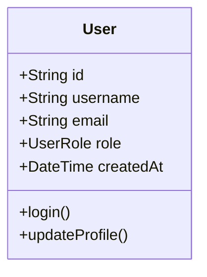

# /mda-reverse

## 描述
从现有的FastAPI代码反向生成或更新PIM（Platform Independent Model）模型文档。

## 语法
```
/mda-reverse source=<源代码路径> model=<模型输出路径> [update=<是否更新>] [scope=<扫描范围>]
```

## 参数
- `source` (必需): FastAPI服务的源代码根目录
- `model` (必需): 输出的PIM模型文件路径
- `update` (可选): 是否更新已存在的模型文件
  - `true`: 合并新发现的内容到现有模型
  - `false`: 创建新文件或覆盖（默认）
- `scope` (可选): 扫描范围
  - `full`: 完整扫描（默认）
  - `models`: 仅扫描数据模型
  - `api`: 仅扫描API接口

## 功能说明

### 1. 代码分析

#### 扫描内容
- **Pydantic模型**: 提取所有BaseModel子类
- **SQLAlchemy实体**: 分析数据库表结构
- **API路由**: 解析FastAPI路由定义
- **Service层**: 识别业务逻辑方法
- **验证规则**: 提取字段验证器
- **依赖关系**: 分析模型间引用

#### 智能识别
- 自动识别实体关系（一对一、一对多、多对多）
- 提取业务方法签名
- 识别枚举类型
- 发现验证规则和约束

### 2. 模型生成

#### Mermaid类图生成


#### 业务规则提取
- 从验证器提取字段约束
- 从注释提取业务说明
- 从API装饰器提取权限要求

### 3. 更新模式

#### 创建模式（update=false）
- 生成全新的PIM文档
- 覆盖已存在的文件
- 适用于首次反向工程

#### 更新模式（update=true）
- 保留原有的业务描述
- 添加新发现的实体和属性
- 标记已删除的元素
- 合并冲突时保留手工编辑

## 使用示例

### 基础反向工程
```bash
# 从用户服务生成模型
/mda-reverse source=services/user-service model=models/domain/用户管理.md
```

### 更新现有模型
```bash
# 将代码变更同步到模型
/mda-reverse source=services/order-service model=models/domain/订单系统.md update=true
```

### 部分扫描
```bash
# 仅更新数据模型部分
/mda-reverse source=services/payment-service model=models/domain/支付流程.md scope=models
```

## 反向工程规则

### 1. 实体识别
```python
# Pydantic模型 → PIM实体
class UserCreate(BaseModel):
    username: str = Field(..., min_length=3, max_length=20)
    email: EmailStr
    password: str = Field(..., min_length=8)

# 生成的PIM描述
- username: 长度3-20个字符
- email: 必须是有效的邮箱格式
- password: 最少8个字符
```

### 2. 关系推断
```python
# 外键关系 → 实体关联
class Order(Base):
    user_id: str = Column(String, ForeignKey("users.id"))
    user: User = relationship("User", back_populates="orders")

# 生成的Mermaid关系
User "1" --> "0..*" Order : has
```

### 3. API映射
```python
# FastAPI路由 → API设计意图
@router.get("/users/{user_id}", response_model=UserResponse)
async def get_user(user_id: str, current_user: User = Depends(get_current_user)):
    # 生成的API说明：
    # - GET /users/{user_id} - 获取用户详情
    # - 需要认证
    # - 返回UserResponse格式
```

### 4. 业务规则提取
```python
# 验证器 → 业务规则
@validator('email')
def email_must_be_unique(cls, v):
    # 检查邮箱唯一性
    if user_exists_with_email(v):
        raise ValueError('Email already registered')
    return v

# 生成的业务规则：
# - 用户邮箱必须唯一
```

## 输出格式

生成的PIM文档结构：
```markdown
# [领域名称]领域模型

## 业务描述
[自动生成的描述或保留原有描述]

## 实体模型
[Mermaid类图]

## 枚举类型
[识别的枚举定义]

## 业务规则
[提取的验证规则和约束]

## API设计意图
[从路由提取的API信息]

## 集成点
[识别的外部依赖]

## 元数据
生成时间: 2024-01-20 10:30:00
源代码版本: git commit hash
反向工程工具版本: 1.0.0
```

## 冲突处理

### 更新冲突类型
1. **属性类型变更**: 代码中类型与模型不一致
2. **实体删除**: 模型中存在但代码中已删除
3. **业务规则冲突**: 代码实现与文档描述不符

### 冲突标记
```markdown
## 业务规则
- 用户名长度3-20个字符
- ⚠️ 密码长度要求（模型：8个字符，代码：10个字符）
- ❌ 已删除：用户必须验证手机号
```

## 高级特性

### 1. 注释提取
支持从代码注释提取业务信息：
```python
class User(BaseModel):
    """用户实体
    
    管理系统中的用户信息，支持多角色权限管理。
    """
    username: str = Field(..., description="用户名，系统内唯一标识")
```

### 2. 文档字符串解析
```python
def calculate_discount(order: Order, user: User) -> float:
    """计算用户订单折扣
    
    业务规则：
    - VIP用户享受9折
    - 订单满100减10
    - 优惠不可叠加
    """
```

### 3. 装饰器信息
```python
@router.post("/orders", dependencies=[Depends(require_admin)])
# 提取信息：需要管理员权限
```

## 配置选项

在`.mda/reverse.yml`中配置：

```yaml
reverse:
  # 扫描选项
  scan:
    include_tests: false      # 是否扫描测试代码
    include_migrations: false # 是否扫描数据库迁移
    max_depth: 5             # 目录扫描深度
    
  # 提取规则
  extraction:
    extract_comments: true    # 提取注释
    extract_docstrings: true  # 提取文档字符串
    extract_validators: true  # 提取验证器
    
  # 输出选项
  output:
    include_metadata: true    # 包含元数据
    format: markdown         # 输出格式
    diagram_style: mermaid   # 图表格式
    
  # 忽略规则
  ignore:
    patterns:
      - "*_test.py"
      - "test_*.py"
      - "__pycache__"
```

## 最佳实践

### 1. 定期同步
- 建立定期反向工程机制
- 代码评审时检查模型一致性
- CI/CD集成自动检查

### 2. 注释规范
```python
# 为反向工程提供更好的信息
class Order(BaseModel):
    """订单实体
    
    业务说明：
    - 订单一旦创建不可删除，只能取消
    - 支付后24小时内可申请退款
    """
    
    status: OrderStatus = Field(
        ..., 
        description="订单状态，遵循状态机转换规则"
    )
```

### 3. 版本追踪
- 在PIM文档中记录最后同步时间
- 使用版本控制跟踪模型变化
- 建立模型变更日志

## 注意事项

1. **代码质量影响**
   - 代码结构清晰有助于准确反向
   - 良好的命名提高识别准确性
   - 完整的类型注解必不可少

2. **性能考虑**
   - 大型项目扫描可能耗时
   - 可以使用scope参数限制范围
   - 考虑增量更新而非全量扫描

3. **准确性限制**
   - 复杂业务逻辑可能无法完全提取
   - 动态生成的代码可能被遗漏
   - 建议人工审核生成结果

## 相关命令
- `/mda-validate`: 验证模型与代码一致性
- `/mda-diff`: 显示模型与代码差异
- `/mda-sync`: 双向同步模型和代码