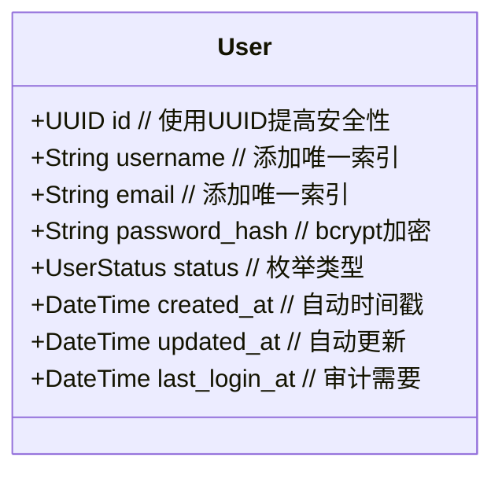
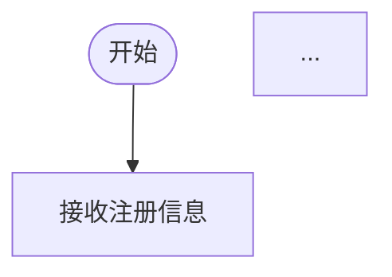

# /pim2FastapiPsm

## 描述
将平台无关模型（PIM）转换为FastAPI平台特定模型（PSM）。这个命令读取纯业务的PIM模型，并基于FastAPI最佳实践生成包含技术细节的PSM模型。

## 语法
```
/pim2FastapiPsm pim=<PIM文件名> psm=<PSM文件名> [features=<特性列表>]
```

## 参数
- `pim` (必需): PIM模型文件名称，对应models/domain/目录下的_pim.md文件（不含路径和扩展名）
- `psm` (必需): 生成的PSM模型文件名称（不含路径和扩展名）
- `features` (可选): 逗号分隔的特性列表，如：jwt,redis,oauth2,websocket

## 功能说明

### 1. PIM分析
- 读取PIM模型中的业务概念
- 理解实体关系和业务规则
- 提取非功能需求
- 识别业务流程和约束

### 2. 技术决策
根据PIM中的需求，智能选择合适的技术方案：

#### 认证方案选择
- 简单系统 → API Key
- 标准Web应用 → JWT
- 企业级应用 → OAuth2
- 需要实时状态 → Session + Redis

#### 数据存储选择
- 关系型数据 → PostgreSQL
- 需要全文搜索 → PostgreSQL + ElasticSearch
- 高并发读取 → PostgreSQL + Redis缓存
- 文档型数据 → MongoDB

#### 性能优化选择
- 高并发要求 → 添加缓存层、连接池优化
- 实时性要求 → WebSocket支持
- 大数据量 → 分页、懒加载、数据分片

### 3. PSM生成内容

#### 技术架构增强
- FastAPI框架特性（依赖注入、中间件）
- 数据库设计（索引、约束、优化）
- API设计（RESTful、版本控制）
- 安全机制（加密、防护、审计）
- **可调试性分析**（自动检测流程图）

#### 具体技术映射
| PIM概念 | FastAPI PSM映射 |
|---------|----------------|
| 用户 | User + JWT认证 + bcrypt密码 |
| 角色 | Role + RBAC权限系统 |
| 会话 | Redis Session + Token管理 |
| 活动记录 | 审计日志 + 时序数据库 |
| 业务规则 | Pydantic验证器 + 业务服务层 |
| 性能要求 | 缓存策略 + 异步处理 |

### 4. 智能增强

根据业务特点自动添加：
- **安全增强**：
  - OWASP Top 10 防护
  - 速率限制
  - CORS配置
  - SQL注入防护

- **性能增强**：
  - Redis缓存策略
  - 数据库连接池
  - 异步任务队列
  - CDN静态资源

- **运维增强**：
  - 健康检查端点
  - Prometheus指标
  - 结构化日志
  - 容器化支持

- **可调试性增强**：
  - 自动检测PIM中的流程图
  - 为有流程图的方法添加 `⚡ 可调试` 标记
  - 生成对应的调试器支持代码
  - 创建可视化调试界面入口

## 使用示例

### 基础转换
```bash
/pim2FastapiPsm pim=用户管理_pim psm=用户管理_psm
```

### 指定特性
```bash
/pim2FastapiPsm pim=用户管理_pim psm=用户管理_psm features=jwt,redis,websocket
```

### 转换流程示例

**输入PIM**：
```markdown
### 用户 (User)
**属性**：
- 标识符：唯一识别用户
- 登录名：用户登录时使用的名称
- 电子邮箱：用户的电子邮件地址
```

**输出PSM**：
```markdown
### User实体


**技术规格**：
- 认证：JWT (RS256算法)
- 密码：bcrypt (12 rounds)
- 会话：Redis (TTL: 24h)
- API限流：100 req/min
```

## 生成规则

### 1. 安全性增强
- 敏感数据自动加密
- 添加必要的验证规则
- 实现访问控制检查
- 审计日志自动集成

### 2. 性能优化
- 根据数据量添加索引
- 实现查询优化策略
- 添加缓存层
- 支持批量操作

### 3. 可维护性
- 清晰的代码组织
- 完整的API文档
- 错误处理机制
- 监控和日志

### 4. 可调试性检测
- **自动扫描流程图**：解析PIM中的mermaid flowchart块
- **方法匹配**：将流程图与服务方法关联
- **PSM标记生成**：为有流程图的方法添加 `⚡ 可调试` 标记
- **调试器集成**：在PSM中包含调试器配置信息

## 配置选项

可以在`.mda/config.yml`中配置默认转换选项：

```yaml
pim2psm:
  default_features:
    - jwt
    - redis
    - audit_log
  
  security:
    password_algorithm: bcrypt
    token_algorithm: RS256
    session_timeout: 86400
  
  performance:
    cache_ttl: 300
    max_connections: 100
    request_timeout: 30
  
  database:
    type: postgresql
    pool_size: 20
    max_overflow: 40
```

## 可调试性自动检测算法

### 流程图识别规则
1. **扫描PIM文档**中所有的mermaid代码块
2. **识别flowchart**类型的图表（flowchart TD/LR等）
3. **提取方法签名**：从流程说明或标题中解析 `ServiceName.methodName`
4. **关联到PSM**：在对应的服务方法上添加可调试标记

### 示例转换过程

**PIM中的流程定义**：
```markdown
### UserService.注册用户 流程

此流程定义了 `UserService` 服务中 `注册用户` 方法的详细执行步骤。


```

**自动生成的PSM标记**：
```markdown
**方法**：
- `注册用户(用户信息)` ⚡ 可调试 - 处理新用户注册的完整流程，包含数据验证、唯一性检查、状态初始化
```

### 检测逻辑伪代码
```python
def detect_debuggable_methods(pim_content):
    debuggable_methods = {}
    
    # 查找所有flowchart块
    flowchart_blocks = find_mermaid_blocks(pim_content, type="flowchart")
    
    for block in flowchart_blocks:
        # 从上下文提取服务和方法名
        service_name, method_name = extract_method_info(block.context)
        
        if service_name and method_name:
            debuggable_methods[f"{service_name}.{method_name}"] = {
                "flowchart": block.content,
                "description": block.description
            }
    
    return debuggable_methods
```

## 注意事项

1. **PIM完整性**：确保PIM模型包含完整的业务描述
2. **特性选择**：根据实际需求选择合适的技术特性
3. **性能考虑**：大型系统需要仔细设计缓存和数据库策略
4. **安全第一**：默认启用所有安全特性，按需禁用
5. **流程图标准**：确保流程图遵循统一的命名规范（ServiceName.methodName）

## 相关命令
- `/mda-generate-fastapi`: 从PSM生成FastAPI代码
- `/pim-validate`: 验证PIM模型完整性
- `/psm-optimize`: 优化PSM模型性能