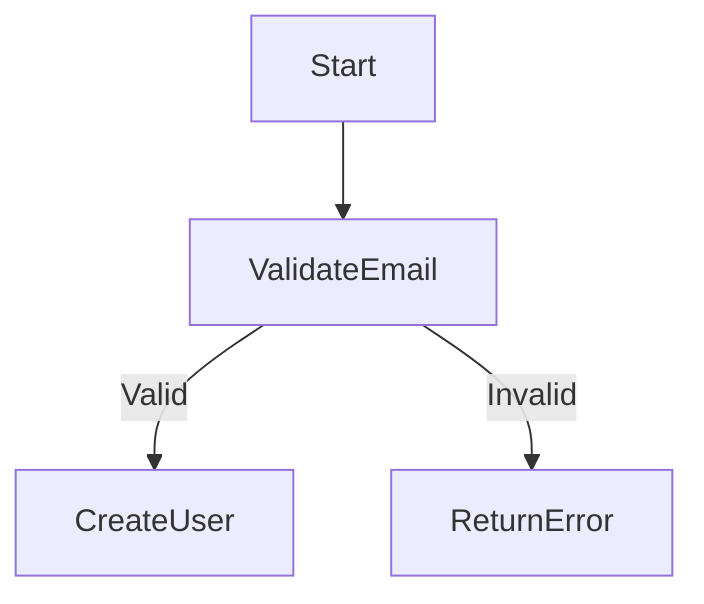

# CLAUDE.md

This file provides guidance to Claude Code (claude.ai/code) when working with code in this repository.

## Project Overview

This is an MDA (Model Driven Architecture) implementation project that features a **PIM Execution Engine** - a revolutionary approach that interprets and executes Platform Independent Models (PIM) directly at runtime, enabling true no-code development for business users.

### Architecture Evolution
- **Phase 1**: Traditional MDA with code generation (PIM → PSM → Code)
- **Phase 2**: PIM Execution Engine (PIM → Runtime Execution) ✅ Current
- **Hybrid Mode**: Supports both runtime execution AND code generation via Gemini API

### Current Status (2025-07-21)
- **Engine**: Core implementation completed, runs as standalone Python application
- **Deployment**: No Docker required, uses SQLite by default
- **Models**: 3 example models (user management, order management, library system)
- **Features**: 
  - Hot reload (5-second detection)
  - Dynamic API generation
  - Flow execution with debugging
  - Code generation via Gemini API
  - Web-based debug UI
- **State**: Ready to start with `./start_master.sh`

## Project Structure

```
/home/guci/aiProjects/mda/
├── 基于大语言模型的mda.md                # Original MDA concepts
├── 基于LLM的MDA实现方案.md                # Updated implementation plan v2.0
├── PIM执行引擎架构设计.md                # Engine architecture design
├── PIM执行引擎实施路线图.md              # Implementation roadmap
├── CLAUDE.md                            # This file
├── models/                              # PIM models directory
│   ├── domain/                          # Domain models
│   │   ├── 用户管理_pim.md              # User management PIM (pure business)
│   │   └── 用户管理_psm.md              # User management PSM (FastAPI specific)
│   └── examples/                        # Example models
│       └── 客户管理系统.md               # Customer management example
├── pim-engine/                          # PIM Execution Engine
│   ├── src/                             # Engine source code
│   │   ├── core/                        # Core engine components
│   │   │   ├── engine.py                # Main engine class
│   │   │   ├── models.py                # Core data models
│   │   │   └── config.py                # Configuration
│   │   ├── loaders/                     # Model loaders
│   │   │   ├── yaml_loader.py           # YAML format loader
│   │   │   └── markdown_loader.py       # Markdown format loader
│   │   ├── engines/                     # Execution engines
│   │   │   ├── data_engine.py           # Database operations
│   │   │   ├── flow_engine.py           # Flow execution
│   │   │   └── rule_engine.py           # Rule evaluation
│   │   ├── api/                         # API generator
│   │   │   ├── api_generator.py         # Dynamic API creation
│   │   │   ├── dynamic_router.py        # Route management
│   │   │   └── openapi_manager.py       # OpenAPI spec
│   │   └── debug/                       # Debug components
│   │       ├── flow_debugger.py         # Flow debugging
│   │       └── debug_routes.py          # Debug API endpoints
│   ├── models/                          # Example PIM models
│   │   ├── user_management.yaml         # User management system
│   │   ├── order_management.yaml        # E-commerce orders
│   │   └── 图书管理系统.md               # Library system (Chinese)
│   ├── static/                          # Static files (debug UI)
│   │   ├── debug.html                   # Debug interface
│   │   └── models.html                  # Models management UI
│   ├── requirements.txt                 # Python dependencies
│   ├── start_master.sh                  # Start script
│   ├── stop.sh                          # Stop script
│   └── tests/                           # Test suite
└── services/                            # Generated services (legacy)
```

## PIM Execution Engine

### Core Components
1. **Model Loader**: Supports YAML and Markdown formats with hot reload
2. **Data Engine**: Dynamic database schema creation and CRUD operations
3. **API Generator**: Automatic REST endpoint generation with OpenAPI docs
4. **Flow Engine**: Executes Mermaid-defined business flows
5. **Rule Engine**: Evaluates natural language business rules
6. **Debug Engine**: Real-time flow visualization and debugging

### Key Features
- **Zero Code Generation for Runtime**: Models execute directly without intermediate code
- **Optional Code Generation**: Use Gemini API to generate traditional code when needed
- **Hot Reload**: Changes detected within 5 seconds
- **Database Agnostic**: SQLite default, PostgreSQL optional
- **No External Dependencies**: Runs without Docker, Redis optional

### Access Points
- **API**: http://localhost:8000
- **API Docs**: http://localhost:8000/docs (Swagger UI)
- **Debug UI**: http://localhost:8000/debug/ui
- **Model Management**: http://localhost:8000/models

### Quick Start
```bash
# Install and start
cd pim-engine
./start_master.sh

# The script will:
# - Check Python 3.11+ 
# - Create virtual environment
# - Install dependencies
# - Start the engine

# Stop the engine
./stop.sh

# Monitor logs
tail -f pim-engine.log

# Models in pim-engine/models/ are auto-loaded
# APIs are generated immediately upon model loading
```

## Code Generation (Optional)

While the PIM Engine executes models directly, you can optionally generate traditional code using the integrated Gemini API:

### API Endpoints

#### 1. Check LLM Providers
```bash
curl http://localhost:8000/api/v1/codegen/llm/providers
```

#### 2. Generate Complete Code
```bash
curl -X POST http://localhost:8000/api/v1/codegen/generate \
  -H "Content-Type: application/json" \
  -d '{
    "pim_content": "$(cat models/user_management.yaml)",
    "target_platform": "fastapi",
    "output_path": "./generated/user-service"
  }'
```

#### 3. Convert PIM to PSM
```bash
curl -X POST http://localhost:8000/api/v1/codegen/pim-to-psm \
  -H "Content-Type: application/json" \
  -d '{
    "pim_content": "$(cat models/user_management.yaml)",
    "platform": "fastapi"
  }'
```

### Configuration

Add to `.env` file:
```bash
# Gemini API (for code generation)
GOOGLE_AI_STUDIO_KEY=your-api-key
LLM_PROVIDER=gemini
USE_LLM_FOR_ALL=true

# Proxy (if needed)
PROXY_HOST=localhost
PROXY_PORT=7890
```

### When to Use Code Generation

- **Production Deployment**: When you need standalone services
- **Custom Logic**: When business rules exceed engine capabilities
- **Integration**: When integrating with existing codebases
- **Performance**: When extreme optimization is required

Most use cases can be handled by the PIM Engine directly without code generation.

## PIM Model Format

### YAML Format (Preferred for Engine)
```yaml
domain: user-management
version: 1.0.0
description: User management system

entities:
  - name: User
    attributes:
      email:
        type: string
        unique: true
        required: true

services:
  - name: UserService
    methods:
      - name: registerUser
        parameters:
          userData: User
        flow: UserService.registerUser
        rules:
          - validate_email_format

flows:
  UserService.registerUser:
    diagram: |
      flowchart TD
        Start --> ValidateEmail
        ValidateEmail -->|Valid| CreateUser
        ValidateEmail -->|Invalid| ReturnError
    steps:
      - id: ValidateEmail
        type: decision
        next: [CreateUser, ReturnError]

rules:
  validate_email_format: Email must contain @ symbol
```

### Markdown Format (Human-Friendly)
```markdown
# User Management Domain

## Entities
### User
- email: string (unique, required)
- name: string (required)
- status: enum [active, inactive]

## Services
### UserService
Methods:
- registerUser(userData: User)
  - Flow: User registration flow
  - Rules: validate_email_format

## Flows

```

## Development Workflow

### No-Code Development (Primary Approach)
1. **Design PIM Model**: Create YAML/Markdown in `pim-engine/models/`
2. **Start Engine**: Run `./start_master.sh` - models auto-load
3. **Test via API**: Generated endpoints available immediately
4. **Debug Flows**: Use web UI at http://localhost:8000/debug/ui
5. **Iterate**: Modify model, hot reload applies changes in 5 seconds

### Code Generation (When Needed)
1. **Design PIM Model**: Same as above
2. **Generate Code**: Call `/api/v1/codegen/generate` endpoint
3. **Deploy Generated Code**: Use for production/custom needs
4. **Maintain Separately**: Generated code is independent

## Best Practices

### PIM Model Design
- Use pure business language (no technical terms)
- Define explicit constraints and validation rules
- Include Mermaid flow diagrams for all processes
- Use YAML for structure, Markdown for documentation
- Version control all models

### Engine Development
- Keep models in `pim-engine/models/` for auto-loading
- Monitor `pim-engine.log` for errors
- Use debug UI to trace flow execution
- Test with curl/Postman before UI integration
- Let hot reload handle updates (don't restart)

### Production Deployment
- Use `.env` for environment-specific config
- Switch to PostgreSQL for production
- Enable Redis for caching if needed
- Set `HOT_RELOAD=false` in production
- Use systemd or supervisor for process management

## Technical Stack

- **Engine Runtime**: Python 3.11 + FastAPI
- **Database**: SQLite (default) / PostgreSQL (optional)
- **ORM**: SQLAlchemy
- **Cache**: Redis (optional)
- **Real-time**: WebSocket
- **UI**: HTML + Mermaid.js
- **Default Port**: 8000

## Future Roadmap

### Short Term
- [ ] Enhanced type system
- [ ] GraphQL support
- [ ] Better error messages
- [ ] Performance optimization

### Long Term
- [ ] Distributed deployment
- [ ] Event-driven architecture
- [ ] AI-assisted model design
- [ ] Cloud-native deployment

## Important Notes

### Model Philosophy
- PIM models must be purely business-focused (zero technical terms)
- Business experts should understand every line
- Technical implementation is handled by the engine

### Engine Capabilities
- Eliminates code generation for 90% of use cases
- Supports both runtime execution and code generation
- Hot reload enables real-time model updates
- Database schema created/updated automatically
- All CRUD operations generated from entity definitions

### Current Limitations
- Complex calculations may need custom code
- External API integrations limited
- Performance overhead vs native code (~10-20%)
- Flow debugging still in beta

## Claude's Working Methods

### Handling Long-Running Tasks

When dealing with tasks that take a long time to complete (e.g., running tests, compilation, code generation), use this proven workflow:

#### 1. Background Execution Pattern
```bash
# Start long-running task in background with nohup
nohup python long_task.py > output.log 2>&1 &

# Or for test suites
nohup python -m pytest tests/ > test_results.log 2>&1 &

# Capture the process ID for monitoring
echo $! > process.pid
```

#### 2. Progress Monitoring Pattern
```bash
# Check if process is still running
ps -p $(cat process.pid) > /dev/null && echo "Still running" || echo "Completed"

# Monitor log file growth
tail -f output.log

# Check log file periodically
tail -20 output.log  # Last 20 lines
grep -i error output.log  # Check for errors
grep -i "test.*passed" output.log  # Check test progress
```

#### 3. Decision Making Based on Logs
- **If tests are passing**: Continue monitoring until completion
- **If errors occur**: Analyze error patterns and decide on fixes
- **If process hangs**: Check for common issues (infinite loops, waiting for input)
- **If partial success**: Determine if it's safe to proceed with partial results

#### 4. Example Workflow from Real Usage
```bash
# 1. Start compilation in background
nohup python pim-compiler/tests/test_compiler.py > compiler.log 2>&1 &

# 2. Initial check after a few seconds
sleep 5
tail -20 compiler.log

# 3. Periodic monitoring
tail -50 compiler.log | grep -E "(ERROR|SUCCESS|Generated|Fixed)"

# 4. Check specific milestones
grep "PSM generated successfully" compiler.log
grep "Code generation completed" compiler.log
grep "All tests passed" compiler.log

# 5. Final verification
tail -100 compiler.log
```

#### 5. Best Practices
- Always redirect both stdout and stderr (`2>&1`)
- Use descriptive log file names
- Check logs at reasonable intervals (not too frequent)
- Look for specific success/failure markers
- Keep process PIDs for cleanup if needed
- Use `grep` to filter relevant information from large logs

This approach allows Claude to:
- Start time-consuming tasks without blocking
- Continue with other work while monitoring progress
- Make informed decisions based on intermediate results
- Handle failures gracefully without losing all progress

### PIM Compiler Optimization Results (2025-07-24)

The PIM Compiler has been optimized with incremental fixing and error pattern caching:

#### Performance Improvements
- **Total compilation time**: Reduced from >20 minutes to **9m54s** (50%+ improvement)
- **Test fixing**: Eliminated timeout issues completely
- **Code quality**: Generated code now passes tests on first attempt

#### Key Optimizations Implemented
1. **Incremental Test Fixing** (`incremental_fixer.py`)
   - Fixes errors file by file instead of all at once
   - Prioritizes files based on dependencies
   - Single file fix timeout: 2 minutes (vs 5 minutes for full fix)

2. **Error Pattern Caching** (`error_pattern_cache.py`)
   - Built-in patterns for common errors (Pydantic v2, async drivers, CRUD methods)
   - Caches successful fixes for reuse
   - Pattern matching enables instant fixes for known issues

3. **Fix Strategy Configuration** (`fix_strategies.py`)
   - Configurable strategies: traditional, incremental, aggressive
   - Default: incremental with caching enabled
   - Customizable timeouts and retry limits

#### Usage
```python
# The compiler now uses optimizations by default
compiler = PureGeminiCompiler(config)

# Optional: disable optimizations
compiler.use_incremental_fix = False

# Optional: use aggressive strategy
from compiler.core.fix_strategies import FixStrategyConfig
config.fix_strategy = FixStrategyConfig.aggressive()
```

For complex models like the library borrowing system (4 entities, multiple services), these optimizations are especially effective.

### Required Use Cases for Background Execution

**IMPORTANT**: Always use the Background Execution Pattern for these operations:

#### 1. PIM Compiler Execution
```bash
# Always run pim-compiler in background
nohup /home/guci/aiProjects/mda/pim-compiler/pim-compiler model.md -o ./output > compiler.log 2>&1 &
echo $! > compiler.pid

# Monitor compilation progress
tail -f compiler.log | grep -E "(PSM generated|Code generation|Test|Fixed)"

# Check specific stages
grep "Step 1: Generating PSM" compiler.log
grep "Step 2: Generating code" compiler.log
grep "Compilation completed successfully" compiler.log
```

#### 2. PIM Engine Model Loading
```bash
# When loading models that trigger compilation
curl -X POST http://localhost:8000/models/upload \
  -F "file=@model.md" > upload.log 2>&1 &

# Or when using direct load
curl -X POST http://localhost:8000/models/load \
  -d '{"model_name": "my_model"}' > load.log 2>&1 &

# Monitor model loading and compilation
tail -f /home/guci/aiProjects/mda/pim-engine/master.log | grep -E "(Loading model|Compiling|generated successfully)"
```

#### 3. Running Tests on Generated Code
```bash
# Test generated services
cd generated/my_service
nohup python -m pytest tests/ -v > test_results.log 2>&1 &

# Monitor test execution
tail -f test_results.log | grep -E "(PASSED|FAILED|ERROR)"
```

**Why This Is Required**:
- PIM compilation typically takes 1-3 minutes
- Model loading with compilation can take 2-5 minutes
- These operations cannot be interrupted or they'll fail
- Background execution prevents timeout issues

## Troubleshooting

### Engine Won't Start
```bash
# Check if port is in use
lsof -i:8000

# Check Python version
python3 --version  # Should be 3.11+

# Check logs
tail -f pim-engine.log

# Common issues:
# - Port 8000 already in use
# - Python version too old
# - Missing dependencies
```

### Model Not Loading
```bash
# Check model syntax
# YAML models must have valid YAML syntax
# Markdown models must follow the specified format

# View engine logs for errors
grep ERROR pim-engine.log
```

### API Not Generated
```bash
# Verify model loaded
curl http://localhost:8000/engine/models

# Check OpenAPI spec
curl http://localhost:8000/openapi.json
```

### Installation Issues
```bash
# If pip install fails
python3 -m pip install --upgrade pip
python3 -m pip install -r requirements.txt

# If virtual environment issues
rm -rf venv
python3 -m venv venv
source venv/bin/activate
pip install -r requirements.txt
```

---

For detailed documentation, see:
- [基于LLM的MDA实现方案.md](./基于LLM的MDA实现方案.md)
- [PIM执行引擎架构设计.md](./PIM执行引擎架构设计.md)
- [PIM执行引擎实施路线图.md](./PIM执行引擎实施路线图.md)