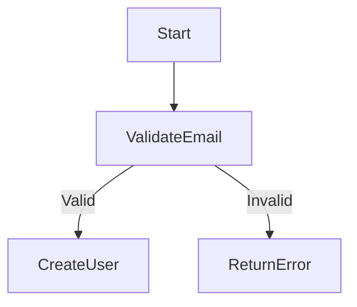

# CLAUDE.md

This file provides guidance to Claude Code (claude.ai/code) when working with code in this repository.

## Project Overview

This is an MDA (Model Driven Architecture) implementation project that has evolved from code generation to a **PIM Execution Engine**. The project now interprets and executes PIM models directly at runtime without generating code, enabling true no-code development for business users.

### Architecture Evolution
- **Phase 1**: Traditional MDA with code generation (PIM → PSM → Code)
- **Phase 2**: PIM Execution Engine (PIM → Runtime Execution) ✅ Current

## Project Structure

```
/home/guci/aiProjects/mda/
├── 基于大语言模型的mda.md                # Original MDA concepts
├── 基于LLM的MDA实现方案.md                # Updated implementation plan v2.0
├── PIM执行引擎架构设计.md                # Engine architecture design
├── PIM执行引擎实施路线图.md              # Implementation roadmap
├── CLAUDE.md                            # This file
├── models/                              # PIM models directory
│   ├── domain/                          # Domain models
│   │   ├── 用户管理_pim.md              # User management PIM (pure business)
│   │   └── 用户管理_psm.md              # User management PSM (FastAPI specific)
│   ├── user_management.yaml             # User management YAML model
│   └── order_management.yaml            # Order management YAML model
├── pim-engine/                          # PIM Execution Engine
│   ├── src/                             # Engine source code
│   │   ├── core/                        # Core engine components
│   │   ├── loaders/                     # Model loaders
│   │   ├── engines/                     # Execution engines
│   │   ├── api/                         # API generator
│   │   └── debug/                       # Debug components
│   ├── static/                          # Static files (debug UI)
│   ├── docker-compose.yml               # Docker setup
│   └── requirements.txt                 # Python dependencies
├── services/                            # Generated services (legacy)
└── .mda/                               # MDA configuration
    └── commands/                        # Slash command definitions
```

## PIM Execution Engine

### Core Features
- **Model Interpretation**: YAML/Markdown models are loaded and executed at runtime
- **Dynamic API Generation**: REST APIs automatically created from models
- **Data Persistence**: Automatic database schema from entity definitions
- **Flow Execution**: Business flows executed step-by-step
- **Rule Engine**: Natural language rules evaluated
- **Hot Reload**: Model changes detected and applied automatically
- **Debug Interface**: Web UI for flow visualization and debugging

### Access Points
- **API**: http://localhost:8001
- **Debug UI**: http://localhost:8001/debug/ui
- **API Docs**: http://localhost:8001/docs
- **Database UI**: http://localhost:8080 (Adminer)

### Quick Start
```bash
# Start the engine
cd pim-engine
docker compose up -d

# Engine automatically loads models from models/ directory
# APIs are generated and available immediately
```

## MDA Slash Commands

### Code Generation (Traditional Approach)
```bash
# Generate FastAPI service from PIM
/mda-generate-fastapi domain=用户管理 service=user-service

# Update existing code
/mda-update model=models/domain/用户管理_pim.md target=services/user-service

# Reverse engineer from code
/mda-reverse source=services/user-service model=models/domain/用户管理_pim.md

# Troubleshooting
/mda-troubleshooting issue="description"
```

### PIM Model Conversion
```bash
# Convert between PIM and PSM
/pim2FastapiPsm pim=models/domain/用户管理_pim.md psm=models/domain/用户管理_psm.md
```

## PIM Model Format

### YAML Format (Preferred for Engine)
```yaml
domain: user-management
version: 1.0.0
description: User management system

entities:
  - name: User
    attributes:
      email:
        type: string
        unique: true
        required: true

services:
  - name: UserService
    methods:
      - name: registerUser
        parameters:
          userData: User
        flow: UserService.registerUser
        rules:
          - validate_email_format

flows:
  UserService.registerUser:
    diagram: |
      flowchart TD
        Start --> ValidateEmail
        ValidateEmail -->|Valid| CreateUser
        ValidateEmail -->|Invalid| ReturnError
    steps:
      - id: ValidateEmail
        type: decision
        next: [CreateUser, ReturnError]

rules:
  validate_email_format: Email must contain @ symbol
```

### Markdown Format (Human-Friendly)
```markdown
# User Management Domain

## Entities
### User
- email: string (unique, required)
- name: string (required)
- status: enum [active, inactive]

## Services
### UserService
Methods:
- registerUser(userData: User)
  - Flow: User registration flow
  - Rules: validate_email_format

## Flows

```

## Development Workflow

### No-Code Development (Recommended)
1. **Design PIM Model**: Create YAML/Markdown in `models/`
2. **Load in Engine**: Model auto-loaded or manually via API
3. **Test via API**: Use generated endpoints immediately
4. **Debug Flows**: Use debug UI to visualize execution
5. **Iterate**: Modify model, changes apply via hot reload

### Traditional Code Generation
1. **Create PIM Model**: Define business model
2. **Generate Code**: Use slash commands
3. **Customize**: Add specific logic
4. **Sync**: Keep model and code aligned

## Best Practices

### PIM Model Design
- Use business language, avoid technical terms
- Define clear constraints and rules
- Include flow diagrams for complex logic
- Version your models with Git

### Engine Usage
- Monitor logs for hot reload activity
- Use debug UI for flow verification
- Test APIs via curl or Postman
- Check database via Adminer

### Production Deployment
- Use environment variables for configuration
- Separate model directories per environment
- Enable monitoring and logging
- Regular backup of models and data

## Technical Stack

- **Engine Runtime**: Python 3.11 + FastAPI
- **Database**: PostgreSQL + SQLAlchemy
- **Cache**: Redis
- **Real-time**: WebSocket
- **Container**: Docker + Docker Compose
- **UI**: HTML + Mermaid.js

## Future Roadmap

### Short Term
- [ ] Enhanced type system
- [ ] GraphQL support
- [ ] Better error messages
- [ ] Performance optimization

### Long Term
- [ ] Distributed deployment
- [ ] Event-driven architecture
- [ ] AI-assisted model design
- [ ] Cloud-native deployment

## Important Notes

- PIM models should be purely business-focused (no technical terms)
- The engine eliminates the need for code generation in most cases
- Hot reload enables rapid iteration without restarts
- Debug UI helps business users understand flow execution

---

For detailed documentation, see:
- [基于Claude Code的MDA实现方案.md](./基于Claude Code的MDA实现方案.md)
- [PIM执行引擎架构设计.md](./PIM执行引擎架构设计.md)