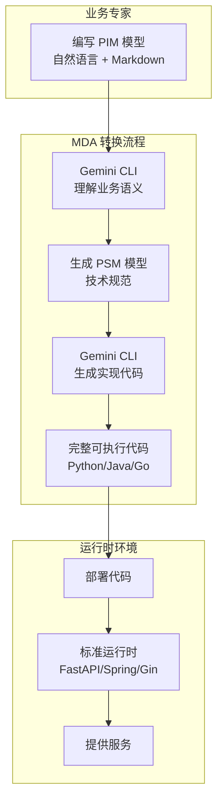

# MDA 标准流程架构 v3.0

## 核心理念

使用 Gemini CLI 作为智能转换引擎，实现真正的模型驱动架构：
- **PIM（业务模型）** → Gemini CLI → **PSM（技术模型）** → Gemini CLI → **Code（可执行代码）**
- 执行引擎只负责加载和运行生成的代码，不做任何解释工作

## 架构流程



## 实现方案

### 1. PIM → PSM 转换器

```python
# pim_to_psm_converter.py
import subprocess
import json
from pathlib import Path

class PIMtoPSMConverter:
    def __init__(self, gemini_cli_path="/home/guci/.gemini/gemini"):
        self.gemini_cli = gemini_cli_path
    
    async def convert(self, pim_file: Path, platform: str) -> str:
        """使用 Gemini CLI 将 PIM 转换为 PSM"""
        
        # 读取 PIM 内容
        pim_content = pim_file.read_text(encoding='utf-8')
        
        # 构建 Gemini CLI 提示
        prompt = f"""你是一个 MDA（模型驱动架构）专家。请将以下 PIM（平台无关模型）转换为 {platform} 平台的 PSM（平台特定模型）。

PIM 模型内容：
{pim_content}

要求：
1. 理解中文业务描述，推断合适的技术实现
2. 为 {platform} 平台生成详细的技术规范
3. 包括：
   - 数据模型定义（字段类型、约束、索引）
   - API 接口定义（路径、方法、参数、响应）
   - 业务逻辑规范（验证规则、业务流程）
   - 技术约束（性能要求、安全要求）
4. 输出格式为结构化的 YAML

示例输出格式：
```yaml
platform: {platform}
version: 1.0.0
entities:
  - name: EntityName
    table: entity_name
    attributes:
      - name: id
        type: integer
        primary_key: true
        auto_increment: true
      - name: field_name
        type: string(255)
        required: true
        unique: true
apis:
  - path: /api/entities
    method: POST
    description: 创建实体
    request_body:
      type: EntityCreateRequest
    response:
      type: EntityResponse
services:
  - name: EntityService
    methods:
      - name: create
        parameters:
          - name: data
            type: EntityCreateRequest
        returns: Entity
        logic: |
          1. 验证数据
          2. 检查唯一性
          3. 创建实体
          4. 返回结果
```
"""
        
        # 调用 Gemini CLI
        result = subprocess.run(
            [self.gemini_cli, "chat", prompt],
            capture_output=True,
            text=True,
            env={**os.environ, "HTTP_PROXY": "http://127.0.0.1:7890"}
        )
        
        if result.returncode != 0:
            raise Exception(f"Gemini CLI 错误: {result.stderr}")
        
        # 提取 YAML 内容
        output = result.stdout
        yaml_start = output.find('```yaml')
        yaml_end = output.rfind('```')
        
        if yaml_start >= 0 and yaml_end > yaml_start:
            psm_content = output[yaml_start+7:yaml_end].strip()
        else:
            psm_content = output
        
        # 保存 PSM 文件
        psm_file = pim_file.parent / f"{pim_file.stem}_psm_{platform}.yaml"
        psm_file.write_text(psm_content, encoding='utf-8')
        
        return psm_content
```

### 2. PSM → Code 生成器

```python
# psm_to_code_generator.py
import subprocess
import os
from pathlib import Path

class PSMtoCodeGenerator:
    def __init__(self, gemini_cli_path="/home/guci/.gemini/gemini"):
        self.gemini_cli = gemini_cli_path
    
    async def generate(self, psm_file: Path, output_dir: Path) -> Dict[str, str]:
        """使用 Gemini CLI 将 PSM 转换为可执行代码"""
        
        psm_content = psm_file.read_text(encoding='utf-8')
        platform = self._extract_platform(psm_content)
        
        # 根据平台选择代码生成提示
        if platform == "fastapi":
            return await self._generate_fastapi_code(psm_content, output_dir)
        elif platform == "spring":
            return await self._generate_spring_code(psm_content, output_dir)
        else:
            raise ValueError(f"不支持的平台: {platform}")
    
    async def _generate_fastapi_code(self, psm_content: str, output_dir: Path):
        """生成 FastAPI 代码"""
        
        # 生成各个组件
        components = {
            "models": self._generate_models,
            "schemas": self._generate_schemas,
            "services": self._generate_services,
            "api": self._generate_api,
            "main": self._generate_main
        }
        
        generated_files = {}
        
        for component, generator in components.items():
            prompt = generator(psm_content)
            
            # 调用 Gemini CLI
            result = subprocess.run(
                [self.gemini_cli, "chat", prompt],
                capture_output=True,
                text=True,
                env={**os.environ, "HTTP_PROXY": "http://127.0.0.1:7890"}
            )
            
            if result.returncode != 0:
                raise Exception(f"生成 {component} 失败: {result.stderr}")
            
            # 提取代码
            code = self._extract_code(result.stdout)
            
            # 保存文件
            file_path = output_dir / f"{component}.py"
            file_path.write_text(code, encoding='utf-8')
            generated_files[component] = code
        
        return generated_files
    
    def _generate_models(self, psm_content: str) -> str:
        return f"""根据以下 PSM 生成 SQLAlchemy 数据模型代码：

{psm_content}

要求：
1. 使用 SQLAlchemy 2.0 声明式风格
2. 包含所有字段定义、类型、约束
3. 添加必要的索引和关系
4. 包含 created_at 和 updated_at 字段
5. 只输出 Python 代码，不要解释

示例：
```python
from sqlalchemy import Column, Integer, String, DateTime, Boolean, ForeignKey
from sqlalchemy.ext.declarative import declarative_base
from sqlalchemy.orm import relationship
from datetime import datetime

Base = declarative_base()

class Book(Base):
    __tablename__ = 'books'
    
    id = Column(Integer, primary_key=True, autoincrement=True)
    title = Column(String(255), nullable=False)
    isbn = Column(String(20), unique=True, nullable=False)
    created_at = Column(DateTime, default=datetime.utcnow)
    updated_at = Column(DateTime, default=datetime.utcnow, onupdate=datetime.utcnow)
```
"""
```

### 3. 代码部署器

```python
# code_deployer.py
import shutil
import subprocess
from pathlib import Path

class CodeDeployer:
    def __init__(self, deployment_dir="/opt/mda/services"):
        self.deployment_dir = Path(deployment_dir)
    
    async def deploy(self, model_name: str, generated_code_dir: Path):
        """部署生成的代码"""
        
        # 创建服务目录
        service_dir = self.deployment_dir / model_name
        service_dir.mkdir(parents=True, exist_ok=True)
        
        # 复制生成的代码
        shutil.copytree(generated_code_dir, service_dir, dirs_exist_ok=True)
        
        # 创建虚拟环境
        subprocess.run([
            "python", "-m", "venv", str(service_dir / "venv")
        ], check=True)
        
        # 安装依赖
        pip_path = service_dir / "venv" / "bin" / "pip"
        subprocess.run([
            str(pip_path), "install", "-r", str(service_dir / "requirements.txt")
        ], check=True)
        
        # 创建 systemd 服务文件
        service_file = f"""[Unit]
Description={model_name} MDA Service
After=network.target

[Service]
Type=simple
User=mda
WorkingDirectory={service_dir}
Environment="PATH={service_dir}/venv/bin"
ExecStart={service_dir}/venv/bin/python main.py
Restart=on-failure

[Install]
WantedBy=multi-user.target
"""
        
        service_path = Path(f"/etc/systemd/system/mda-{model_name}.service")
        service_path.write_text(service_file)
        
        # 启动服务
        subprocess.run(["systemctl", "daemon-reload"], check=True)
        subprocess.run(["systemctl", "enable", f"mda-{model_name}"], check=True)
        subprocess.run(["systemctl", "start", f"mda-{model_name}"], check=True)
```

### 4. MDA 工作流编排器

```python
# mda_orchestrator.py
from pathlib import Path

class MDAOrchestrator:
    def __init__(self):
        self.pim_to_psm = PIMtoPSMConverter()
        self.psm_to_code = PSMtoCodeGenerator()
        self.deployer = CodeDeployer()
    
    async def process_model(self, pim_file: Path, platform: str = "fastapi"):
        """完整的 MDA 处理流程"""
        
        print(f"[1/4] 读取 PIM 模型: {pim_file}")
        
        print(f"[2/4] 使用 Gemini CLI 转换 PIM → PSM ({platform})")
        psm_content = await self.pim_to_psm.convert(pim_file, platform)
        psm_file = pim_file.parent / f"{pim_file.stem}_psm_{platform}.yaml"
        
        print(f"[3/4] 使用 Gemini CLI 生成代码 PSM → Code")
        output_dir = pim_file.parent / f"{pim_file.stem}_{platform}_code"
        output_dir.mkdir(exist_ok=True)
        generated_files = await self.psm_to_code.generate(psm_file, output_dir)
        
        print(f"[4/4] 部署生成的代码")
        await self.deployer.deploy(pim_file.stem, output_dir)
        
        print(f"✅ 模型 {pim_file.stem} 已成功部署！")
        print(f"   服务地址: http://localhost:8000")
        print(f"   API 文档: http://localhost:8000/docs")
```

## 关键改进

1. **使用 Gemini CLI** - 通过 subprocess 调用本地 Gemini CLI
2. **完整的代码生成** - 生成真正可执行的代码，而不是解释执行
3. **标准部署流程** - 生成的代码按照标准方式部署运行
4. **无需执行引擎** - 生成的是标准的 FastAPI/Spring 应用

## 执行示例

```bash
# 处理图书管理系统
python mda_process.py models/图书管理系统.md --platform fastapi

# 输出：
# [1/4] 读取 PIM 模型: models/图书管理系统.md
# [2/4] 使用 Gemini CLI 转换 PIM → PSM (fastapi)
# [3/4] 使用 Gemini CLI 生成代码 PSM → Code
# [4/4] 部署生成的代码
# ✅ 模型 图书管理系统 已成功部署！
#    服务地址: http://localhost:8000
#    API 文档: http://localhost:8000/docs
```

## 优势

1. **真正的 MDA** - 模型驱动，不是模型解释
2. **利用 LLM 能力** - Gemini CLI 理解业务语义
3. **生成标准代码** - 可维护、可调试、可扩展
4. **技术栈灵活** - 可以生成任何平台的代码