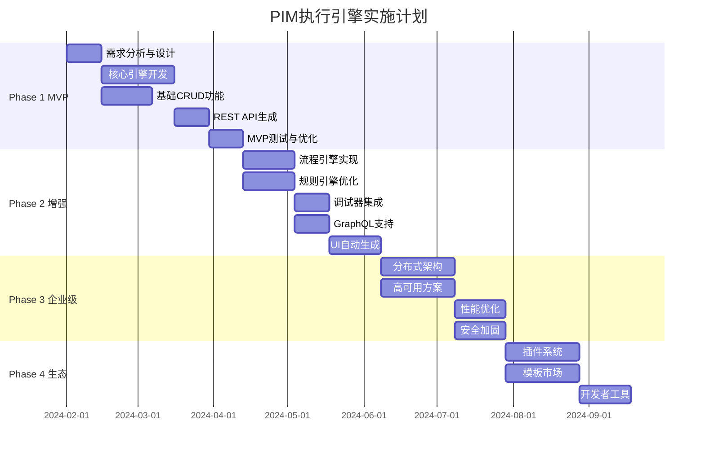
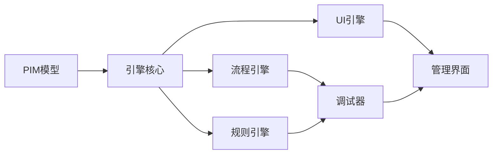

# PIM执行引擎实施路线图

## 总体目标

将MDA从"编译时代码生成"演进为"运行时模型执行"，实现真正的业务驱动开发。

## 实施阶段概览



## Phase 1: MVP基础引擎（6-8周）

### 目标
构建可运行基础PIM模型的最小可行引擎

### 核心功能
1. **模型加载器**
   - 解析Markdown格式的PIM
   - 提取实体、属性、约束
   - 构建运行时元模型

2. **数据引擎**
   - 动态表结构生成
   - 基础CRUD操作
   - 简单数据验证

3. **API生成器**
   - REST端点自动生成
   - 基础认证支持
   - Swagger文档生成

### 技术选型
```yaml
语言: Python 3.11
框架: FastAPI
数据库: PostgreSQL + SQLAlchemy
缓存: Redis
容器: Docker
```

### 交付物
- [ ] PIM引擎Docker镜像
- [ ] 基础部署文档
- [ ] 3个示例PIM模型
- [ ] 性能基准测试报告

### 验收标准
- 能够加载并运行简单的CRUD应用
- API响应时间 < 100ms
- 支持热加载模型
- 通过基础安全扫描

## Phase 2: 功能增强（8-10周）

### 目标
增加高级功能，支持复杂业务场景

### 新增功能

#### 2.1 流程引擎
```python
class FlowEngine:
    - 支持Mermaid流程图执行
    - 条件分支和循环
    - 异步步骤执行
    - 事务回滚机制
```

#### 2.2 智能规则引擎
```python
class LLMRuleEngine:
    - 自然语言规则解析
    - 规则缓存和优化
    - 动态规则组合
    - 规则冲突检测
```

#### 2.3 可视化调试器
```yaml
功能:
  - 流程单步执行
  - 断点设置
  - 变量监视
  - 执行历史回放
  - WebSocket实时推送
```

#### 2.4 GraphQL支持
```graphql
自动生成:
  - Type定义
  - Query解析
  - Mutation处理
  - Subscription支持
```

#### 2.5 UI生成器
```yaml
支持组件:
  - 数据表格
  - 表单
  - 图表
  - 工作流设计器
  - 仪表板
```

### 集成计划


### 交付物
- [ ] 增强版引擎镜像
- [ ] 流程调试器界面
- [ ] 规则编写指南
- [ ] UI组件库
- [ ] 10+复杂业务场景示例

## Phase 3: 企业级特性（10-12周）

### 目标
达到生产级别的稳定性、性能和安全性

### 3.1 分布式架构

```yaml
架构设计:
  引擎集群:
    - 负载均衡: Nginx/HAProxy
    - 服务发现: Consul/Etcd
    - 配置中心: Apollo/Nacos
    
  数据层:
    - 读写分离
    - 分库分表
    - 缓存策略
    
  消息队列:
    - 事件总线: Kafka/RabbitMQ
    - 异步处理
    - 流量削峰
```

### 3.2 高可用方案

```yaml
容灾设计:
  主备切换:
    - 数据库: Master-Slave
    - 缓存: Redis Sentinel
    - 引擎: Active-Active
    
  故障恢复:
    - 自动故障检测
    - 快速故障转移
    - 数据一致性保证
    
  备份策略:
    - 模型版本管理
    - 数据定期备份
    - 配置备份
```

### 3.3 性能优化

```yaml
优化策略:
  查询优化:
    - 动态索引生成
    - 查询计划缓存
    - 并行查询执行
    
  缓存优化:
    - 多级缓存
    - 智能预热
    - 缓存更新策略
    
  资源优化:
    - 连接池管理
    - 内存优化
    - CPU亲和性
```

### 3.4 安全加固

```yaml
安全措施:
  认证授权:
    - OAuth2/OIDC
    - RBAC/ABAC
    - API密钥管理
    
  数据安全:
    - 字段级加密
    - 传输加密
    - 审计日志
    
  防护机制:
    - DDoS防护
    - SQL注入防护
    - XSS/CSRF防护
```

### 监控体系

```yaml
监控指标:
  业务指标:
    - API调用量
    - 业务规则执行次数
    - 流程完成率
    
  技术指标:
    - 响应时间
    - 错误率
    - 资源使用率
    
  告警规则:
    - 阈值告警
    - 趋势告警
    - 智能告警
```

### 交付物
- [ ] 生产级部署方案
- [ ] 性能调优指南
- [ ] 安全最佳实践
- [ ] 运维手册
- [ ] 压力测试报告

## Phase 4: 生态建设（8-10周）

### 目标
构建完整的PIM开发生态系统

### 4.1 插件系统

```yaml
插件架构:
  类型:
    - 数据连接器（MySQL、Oracle、MongoDB）
    - 集成适配器（微信、钉钉、邮件）
    - 自定义组件（特殊UI、算法）
    
  机制:
    - 插件注册
    - 生命周期管理
    - 依赖管理
    - 版本控制
```

### 4.2 模板市场

```yaml
模板分类:
  行业模板:
    - 电商系统
    - 教育管理
    - 医疗系统
    - 制造业ERP
    
  功能模板:
    - 用户认证
    - 工作流
    - 报表系统
    - 数据分析
    
  UI模板:
    - 管理后台
    - 移动端
    - 数据大屏
```

### 4.3 开发者工具

```yaml
工具集:
  PIM编辑器:
    - 语法高亮
    - 自动完成
    - 错误提示
    - 预览功能
    
  调试工具:
    - 本地引擎
    - 模拟器
    - 性能分析
    
  CLI工具:
    - 模型验证
    - 部署管理
    - 日志查看
```

### 4.4 培训体系

```yaml
培训内容:
  业务人员:
    - PIM建模基础
    - 业务规则编写
    - 调试技巧
    
  开发人员:
    - 插件开发
    - 性能优化
    - 故障排查
    
  运维人员:
    - 部署管理
    - 监控配置
    - 容量规划
```

## 实施保障

### 团队组成

```yaml
核心团队:
  产品经理: 1名
  架构师: 2名
  后端开发: 4名
  前端开发: 2名
  测试工程师: 2名
  DevOps: 1名
  
支持团队:
  UI设计师: 1名
  技术文档: 1名
  培训讲师: 1名
```

### 技术栈统一

```yaml
开发环境:
  IDE: VSCode + 插件
  版本控制: Git + GitLab
  CI/CD: GitLab CI
  
技术规范:
  代码规范: PEP8 + 自定义
  API规范: OpenAPI 3.0
  文档规范: Markdown + Mermaid
  
质量保证:
  单元测试: pytest
  集成测试: Postman/Newman
  性能测试: Locust
  安全扫描: OWASP ZAP
```

### 里程碑验收

| 阶段 | 时间 | 关键成果 | 验收标准 |
|------|------|----------|----------|
| MVP | 8周 | 基础引擎可用 | 运行3个示例应用 |
| 增强 | 18周 | 完整功能集 | 支持复杂业务场景 |
| 企业级 | 30周 | 生产就绪 | 通过压力测试 |
| 生态 | 40周 | 完整平台 | 10+企业用户 |

### 风险管理

```yaml
技术风险:
  - LLM性能瓶颈 → 本地缓存 + 优化
  - 复杂规则执行 → 规则预编译
  - 数据一致性 → 分布式事务
  
业务风险:
  - 用户接受度 → 渐进式推广
  - 学习成本 → 完善培训体系
  - 迁移成本 → 提供迁移工具
```

## 成功标准

### 技术指标
- API响应时间 P99 < 200ms
- 系统可用性 > 99.9%
- 支持并发用户 > 10000
- 模型加载时间 < 1s

### 业务指标
- 开发效率提升 > 5x
- 需求到上线时间 < 1天
- 业务人员满意度 > 90%
- 减少技术债务 > 80%

### 生态指标
- 活跃开发者 > 1000
- 模板数量 > 100
- 插件数量 > 50
- 企业用户 > 20

## 下一步行动

1. **组建团队**（1周）
   - 招募核心开发人员
   - 明确职责分工
   - 建立协作机制

2. **技术预研**（2周）
   - LLM集成方案验证
   - 性能基准测试
   - 技术选型确认

3. **MVP开发**（6周）
   - 搭建基础架构
   - 实现核心功能
   - 创建示例应用

4. **试点推广**（持续）
   - 选择试点部门
   - 收集反馈
   - 持续优化

这个路线图将指导我们逐步实现"业务模型即应用"的愿景，让业务人员真正掌控系统开发！