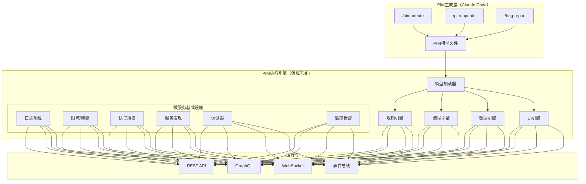

# PIM执行引擎架构设计

## 核心理念

将MDA从"编译时代码生成"转变为"运行时模型解释"，创建一个通用的PIM执行引擎。

```
传统MDA: PIM → PSM → Code → Deploy → Run
新架构:  PIM → Deploy to Engine → Run
```

## 架构设计



## PIM执行引擎设计

### 1. 核心组件

#### 1.1 模型加载器
```python
class PIMLoader:
    """加载和解析PIM模型"""
    def load_model(self, model_path: str) -> PIMModel:
        # 解析Markdown格式的PIM
        # 提取实体、服务、规则、流程
        # 构建运行时模型
        pass
    
    def hot_reload(self, model_path: str):
        """热重载支持，无需重启服务"""
        pass
```

#### 1.2 规则引擎
```python
class RuleEngine:
    """执行业务规则"""
    def __init__(self, llm_service):
        self.llm = llm_service
        self.rule_cache = {}
    
    async def execute_rule(self, rule_text: str, context: dict):
        """使用LLM理解并执行自然语言规则"""
        if rule_text in self.rule_cache:
            executor = self.rule_cache[rule_text]
        else:
            # LLM将规则转换为可执行逻辑
            executor = await self.llm.compile_rule(rule_text)
            self.rule_cache[rule_text] = executor
        
        return await executor.run(context)
```

#### 1.3 流程引擎
```python
class FlowEngine:
    """执行业务流程"""
    def __init__(self):
        self.flows = {}
        self.debugger = FlowDebugger()
    
    async def execute_flow(self, flow_name: str, input_data: dict):
        """执行mermaid定义的流程"""
        flow = self.flows[flow_name]
        session = self.debugger.create_session(flow)
        
        async for step in flow.steps:
            # 执行每个步骤
            result = await self.execute_step(step, context)
            # 更新调试器状态
            await session.update_step(step, result)
            # 根据结果决定下一步
            next_step = flow.decide_next(step, result)
```

#### 1.4 数据引擎
```python
class DataEngine:
    """处理数据操作"""
    def __init__(self, db_config):
        self.db = Database(db_config)
        self.validator = DataValidator()
    
    async def execute_operation(self, entity: str, operation: str, data: dict):
        """执行CRUD操作"""
        # 验证数据
        await self.validator.validate(entity, data)
        # 应用业务规则
        data = await self.apply_rules(entity, operation, data)
        # 执行数据库操作
        return await self.db.execute(entity, operation, data)
```

### 2. 微服务基础设施

#### 2.1 统一日志系统
```python
class PIMLogger:
    """领域感知的日志系统"""
    def log_business_event(self, event_type: str, entity: str, operation: str, context: dict):
        # 记录业务事件
        # 自动关联到PIM模型
        # 支持业务审计
        pass
```

#### 2.2 智能限流
```python
class PIMRateLimiter:
    """基于业务规则的限流"""
    async def check_limit(self, user: str, operation: str, entity: str):
        # 根据PIM中定义的规则限流
        # 如：VIP用户有更高限额
        rule = f"获取{user}对{entity}.{operation}的限流规则"
        limit = await self.rule_engine.execute(rule, {"user": user})
        return await self.limiter.check(user, operation, limit)
```

#### 2.3 安全框架
```python
class PIMSecurity:
    """基于PIM的安全控制"""
    async def authorize(self, user: str, resource: str, action: str):
        # 从PIM模型中提取权限规则
        # 动态执行授权检查
        auth_rule = self.pim_model.get_auth_rule(resource, action)
        return await self.rule_engine.execute(auth_rule, {
            "user": user,
            "resource": resource,
            "action": action
        })
```

#### 2.4 调试器引擎
```python
class UniversalDebugger:
    """通用的流程调试器"""
    def __init__(self):
        self.sessions = {}
        self.breakpoints = {}
    
    async def debug_flow(self, flow_name: str, input_data: dict):
        # 创建调试会话
        # 支持断点、单步执行
        # 实时查看数据变化
        # WebSocket推送状态
        pass
```

### 3. PIM模型格式增强

#### 3.1 执行时配置
```yaml
# 在PIM中直接定义运行时行为
execution:
  api_style: rest  # 或 graphql
  rate_limit:
    default: 100/minute
    vip: 1000/minute
  cache:
    user_data: 5m
    product_list: 10m
  security:
    auth_type: jwt
    permissions:
      - role: admin
        allow: ["*"]
      - role: user
        allow: ["read:own", "write:own"]
```

#### 3.2 事件定义
```yaml
events:
  order_created:
    trigger: "订单.创建成功"
    handlers:
      - notify_user
      - update_inventory
      - send_to_warehouse
    
  payment_received:
    trigger: "支付.状态 = 已支付"
    handlers:
      - update_order_status
      - generate_invoice
```

### 4. 动态API生成

引擎自动根据PIM生成API：

```python
class APIGenerator:
    """动态生成REST/GraphQL API"""
    def generate_routes(self, pim_model: PIMModel):
        for entity in pim_model.entities:
            # 生成CRUD路由
            self.add_route(f"/{entity.name}", "GET", self.list_handler(entity))
            self.add_route(f"/{entity.name}", "POST", self.create_handler(entity))
            self.add_route(f"/{entity.name}/{{id}}", "GET", self.get_handler(entity))
            self.add_route(f"/{entity.name}/{{id}}", "PUT", self.update_handler(entity))
            self.add_route(f"/{entity.name}/{{id}}", "DELETE", self.delete_handler(entity))
            
        for service in pim_model.services:
            # 生成服务方法路由
            for method in service.methods:
                self.add_route(f"/{service.name}/{method.name}", "POST", 
                              self.service_handler(service, method))
```

### 5. 高级调试API设计

引擎提供完整的调试能力，支持断点、单步执行、变量监控等功能：

#### 5.1 调试会话管理API

```python
# 创建调试会话（已实现）
POST /debug/session/create?flow_name={flow_name}
Response: {"session_id": "uuid"}

# 获取会话状态（已实现）
GET /debug/session/{session_id}
Response: {
    "session_id": "uuid",
    "flow_name": "UserService.registerUser",
    "status": "paused|running|completed|error",
    "current_step": "validate_email",
    "breakpoints": ["step1", "step3"],
    "call_stack": [...],
    "variables": {...}
}

# 列出所有会话（已实现）
GET /debug/sessions
```

#### 5.2 流程控制API（待实现）

```python
# 暂停执行
POST /debug/session/{session_id}/pause
Response: {"status": "paused", "paused_at": "step_id"}

# 停止执行
POST /debug/session/{session_id}/stop
Response: {"status": "stopped"}

# 继续执行（从暂停恢复）
POST /debug/session/{session_id}/continue
Response: {"status": "running"}
```

#### 5.3 单步调试API（待实现）

```python
# 单步执行（Step Over）
POST /debug/session/{session_id}/step
Body: {"type": "over"}
Response: {
    "executed_step": "step_id",
    "next_step": "next_step_id",
    "variables": {...}
}

# 步入（Step Into）- 进入子流程
POST /debug/session/{session_id}/step
Body: {"type": "into"}

# 步出（Step Out）- 执行完当前子流程
POST /debug/session/{session_id}/step
Body: {"type": "out"}
```

#### 5.4 断点管理API（待实现）

```python
# 设置/取消断点
POST /debug/session/{session_id}/breakpoint
Body: {
    "step_id": "validate_email",
    "enabled": true
}

# 获取所有断点
GET /debug/session/{session_id}/breakpoints
Response: [
    {"step_id": "validate_email", "enabled": true},
    {"step_id": "create_user", "enabled": false}
]

# 清除所有断点
DELETE /debug/session/{session_id}/breakpoints
```

#### 5.5 变量操作API（待实现）

```python
# 获取当前变量值
GET /debug/session/{session_id}/variables
Response: {
    "input": {...},
    "local": {...},
    "global": {...}
}

# 修改变量值（仅在暂停时允许）
PUT /debug/session/{session_id}/variable
Body: {
    "name": "user.email",
    "value": "new@example.com"
}

# 监视表达式
POST /debug/session/{session_id}/watch
Body: {"expression": "user.age > 18"}
Response: {"result": true}
```

#### 5.6 WebSocket实时通信（已部分实现）

```python
# WebSocket连接
WS /debug/session/{session_id}/ws

# 消息类型
{
    "type": "session_state",      # 会话状态更新
    "type": "flow_started",       # 流程开始
    "type": "step_executed",      # 步骤执行完成
    "type": "flow_paused",        # 流程暂停（断点或手动）
    "type": "flow_completed",     # 流程完成
    "type": "flow_error",         # 流程错误
    "type": "variable_changed",   # 变量值改变
    "type": "breakpoint_hit"      # 断点命中
}
```

#### 5.7 调试器实现架构

```python
class DebugEngine:
    """调试引擎核心组件"""
    
    def __init__(self):
        self.sessions = {}  # 活跃的调试会话
        self.breakpoints = {}  # 断点管理
        
    async def execute_step(self, session_id: str, step: FlowStep):
        """执行单个步骤，支持调试"""
        session = self.sessions[session_id]
        
        # 检查断点
        if self.should_break(session, step):
            await self.pause_execution(session, step)
            await self.wait_for_resume(session)
        
        # 执行步骤
        result = await step.execute(session.context)
        
        # 更新调试信息
        await self.update_debug_info(session, step, result)
        
        # 通知前端
        await self.notify_clients(session, "step_executed", {
            "step": step.id,
            "result": result,
            "variables": session.context.variables
        })
        
        return result
    
    def set_breakpoint(self, session_id: str, step_id: str, enabled: bool):
        """设置断点"""
        if session_id not in self.breakpoints:
            self.breakpoints[session_id] = set()
        
        if enabled:
            self.breakpoints[session_id].add(step_id)
        else:
            self.breakpoints[session_id].discard(step_id)
```

#### 5.8 调试UI集成

前端调试界面（/debug/ui）已实现以下功能：
- 流程图可视化（基于Mermaid）
- 断点设置（点击步骤设置）
- 单步执行控制
- 变量实时监控
- 执行历史追踪

待后端API实现后，这些功能将完全可用。

## 部署架构

### 1. 引擎部署（一次性）
```bash
# 部署PIM执行引擎
docker run -d \
  --name pim-engine \
  -p 8000:8000 \
  -v ./models:/app/models \
  pim-engine:latest
```

### 2. 模型部署（热加载）
```bash
# 部署新的PIM模型
/deploy-pim domain=订单管理 engine=http://localhost:8000

# 引擎自动加载并运行新模型
# 无需重启，无需编译
```

## Claude Code集成

### 新的Slash Commands

#### /pim-create
```bash
/pim-create domain=库存管理 description="管理商品库存，包括入库、出库、盘点"
```
生成适合引擎执行的PIM模型

#### /pim-deploy
```bash
/pim-deploy model=库存管理_pim engine=production
```
将模型部署到指定引擎

#### /pim-test
```bash
/pim-test model=库存管理_pim scenario=入库流程
```
在引擎上测试模型

#### /engine-status
```bash
/engine-status engine=production
```
查看引擎状态和已加载的模型

## 优势分析

### 1. 开发效率
- **零编译时间**：修改PIM立即生效
- **热加载**：无需重启服务
- **统一运行时**：一个引擎运行所有业务

### 2. 运维简化
- **单一部署**：只需部署引擎
- **统一监控**：所有业务共享基础设施
- **标准化运维**：所有服务行为一致

### 3. 质量保证
- **引擎级优化**：性能优化惠及所有业务
- **统一安全**：安全策略集中管理
- **一致性保证**：所有业务遵循相同模式

### 4. 业务敏捷
- **实时修改**：业务人员改完即生效
- **无技术债**：没有生成的代码
- **完全可控**：业务逻辑完全由PIM定义

## 实施路线图

### Phase 1: 基础引擎（2-3月）
- [ ] 模型加载器
- [ ] 基础CRUD执行
- [ ] 简单规则引擎
- [ ] REST API生成

### Phase 2: 高级特性（3-4月）
- [ ] 流程引擎
- [ ] 复杂规则支持
- [ ] 调试器集成（含高级调试API）
- [ ] GraphQL支持

### Phase 3: 企业特性（4-6月）
- [ ] 分布式部署
- [ ] 多租户支持
- [ ] 性能优化
- [ ] 高可用保证

## 与传统MDA对比

| 特性 | 传统MDA | PIM执行引擎 |
|------|---------|-------------|
| 部署方式 | 生成代码→编译→部署 | 加载模型→直接运行 |
| 修改流程 | 改模型→重新生成→重新部署 | 改模型→自动生效 |
| 技术债务 | 生成的代码需要维护 | 无代码，无债务 |
| 性能优化 | 每个服务单独优化 | 引擎级统一优化 |
| 基础设施 | 每个服务独立实现 | 共享引擎基础设施 |

## 示例：完整使用流程

```bash
# 1. 业务人员创建模型
/pim-create domain=请假管理 description="员工请假申请和审批流程"

# 2. 部署到引擎
/pim-deploy model=请假管理_pim engine=production

# 3. 立即可用
curl http://engine.company.com/api/v1/leave-requests

# 4. 发现问题
/bug-report issue="年假天数计算错误" engine=production

# 5. 自动修复并生效
# 引擎自动重新加载修复后的模型

# 6. 监控运行
/engine-status engine=production model=请假管理
```

## 结论

PIM执行引擎架构是MDA的自然演进：
- 从"生成时"到"运行时"
- 从"代码驱动"到"模型驱动"
- 从"技术中心"到"业务中心"

这个架构真正实现了"**业务模型即应用**"的愿景。