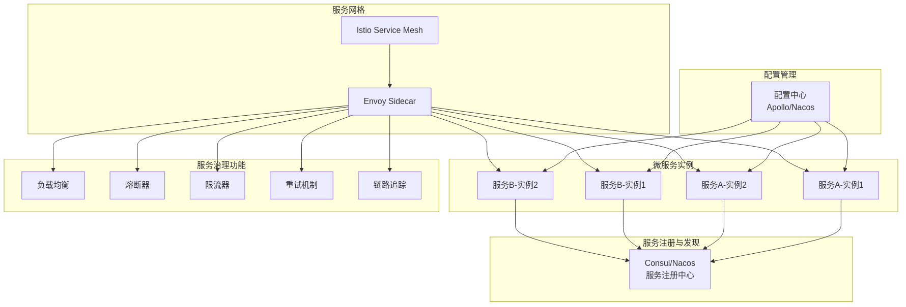
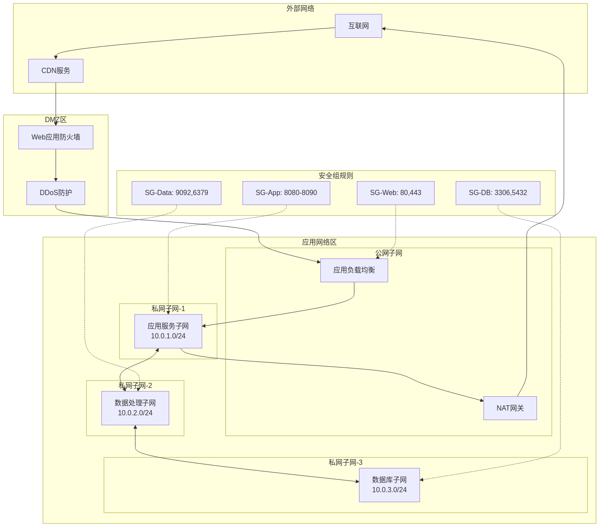

# 企业级混合架构设计方案

## 1. 架构概述

本架构采用Lambda架构模式，结合流处理和批处理能力，同时支持实时数据处理和传统请求响应式服务。

### 1.1 核心组件
- **流处理层**：Apache Flink实时数据处理
- **微服务层**：Spring Boot/Spring Cloud微服务架构
- **数据存储层**：多模式数据存储（OLTP/OLAP/NoSQL）
- **消息中间件**：Apache Kafka事件流平台
- **API网关**：统一入口和路由管理

## 2. 整体架构图

## 3. 流处理架构详细设计

### 3.1 Flink流处理拓扑

### 3.2 流处理场景

| 场景 | 输入源 | 处理逻辑 | 输出目标 | 延迟要求 |
|------|--------|----------|----------|----------|
| 实时监控 | 应用日志 | 异常检测、聚合统计 | Elasticsearch | < 1秒 |
| 用户行为分析 | 点击流 | 会话窗口、漏斗分析 | ClickHouse | < 5秒 |
| 交易风控 | 交易事件 | CEP规则匹配 | Redis/告警系统 | < 100ms |
| 实时推荐 | 用户行为 | 特征计算、模型预测 | Redis/Kafka | < 500ms |
| 数据同步 | 数据库CDC | 数据转换、清洗 | 数据湖 | < 10秒 |

## 4. 微服务架构详细设计

### 4.1 微服务交互模式

### 4.2 服务治理架构

## 5. 数据流转架构

### 5.1 实时数据管道

## 6. 部署架构

### 6.1 Kubernetes部署拓扑

### 6.2 网络架构

## 7. 监控与运维架构

### 7.1 可观测性架构

## 8. 技术栈总结

### 8.1 核心技术选型

| 层次 | 技术组件 | 用途 | 备选方案 |
|------|----------|------|----------|
| **流处理** | Apache Flink | 实时数据处理 | Spark Streaming, Storm |
| **消息队列** | Apache Kafka | 事件流平台 | RabbitMQ, Pulsar |
| **微服务框架** | Spring Boot/Cloud | 服务开发 | Dubbo, gRPC |
| **API网关** | Spring Cloud Gateway | 路由管理 | Kong, Zuul |
| **服务注册** | Consul/Nacos | 服务发现 | Eureka, Zookeeper |
| **配置中心** | Apollo/Nacos | 配置管理 | Spring Cloud Config |
| **容器编排** | Kubernetes | 容器管理 | Docker Swarm, Mesos |
| **服务网格** | Istio | 流量管理 | Linkerd, Consul Connect |
| **监控** | Prometheus + Grafana | 指标监控 | Datadog, New Relic |
| **日志** | ELK Stack | 日志分析 | Splunk, Loki |
| **链路追踪** | Jaeger | 分布式追踪 | Zipkin, SkyWalking |
| **关系数据库** | MySQL/PostgreSQL | 事务数据 | Oracle, SQL Server |
| **NoSQL** | MongoDB, Redis | 非结构化数据 | Cassandra, DynamoDB |
| **OLAP** | ClickHouse | 实时分析 | Druid, Presto |
| **数据湖** | HDFS/S3 | 海量存储 | MinIO, Ceph |

### 8.2 性能指标要求

| 指标 | 目标值 | 测量方法 |
|------|--------|----------|
| API响应时间 | P99 < 200ms | Prometheus + Grafana |
| 流处理延迟 | < 1秒 | Flink Metrics |
| 系统可用性 | > 99.95% | 监控告警系统 |
| 数据丢失率 | < 0.01% | Kafka监控 |
| 并发用户数 | > 100,000 | 压力测试 |
| 日处理数据量 | > 1TB | 数据统计 |

## 9. 容灾与高可用设计

### 9.1 容灾架构

### 9.2 高可用保障措施

| 组件 | 高可用方案 | RPO | RTO |
|------|------------|-----|-----|
| 数据库 | 主从复制 + 自动故障转移 | < 1分钟 | < 5分钟 |
| Kafka | 多副本 + ISR机制 | 0 | < 1分钟 |
| Flink | Checkpoint + Savepoint | < 30秒 | < 2分钟 |
| 微服务 | 多实例 + 自动扩缩容 | 0 | < 30秒 |
| Redis | 哨兵模式 + 持久化 | < 1分钟 | < 1分钟 |

## 10. 安全架构

### 10.1 安全防护体系

## 11. 成本优化策略

### 11.1 资源优化
- **弹性伸缩**：基于负载自动调整资源
- **预留实例**：长期运行服务使用预留实例
- **竞价实例**：非关键批处理任务使用竞价实例
- **冷热分离**：历史数据迁移到低成本存储

### 11.2 架构优化
- **缓存策略**：多级缓存减少数据库压力
- **异步处理**：非实时任务异步化处理
- **数据压缩**：传输和存储数据压缩
- **服务合并**：低负载服务合并部署

## 12. 实施路线图

### 12.1 阶段规划

## 13. 总结

本架构方案综合了流处理和传统微服务的优势，通过以下特点保证系统的高性能和高可用：

1. **双模处理**：同时支持流式处理和批处理，满足不同场景需求
2. **解耦设计**：通过Kafka实现服务间异步解耦
3. **弹性伸缩**：基于Kubernetes实现自动扩缩容
4. **多层存储**：针对不同数据特点选择合适的存储方案
5. **全面监控**：构建完整的可观测性体系
6. **高可用保障**：多层次的容灾和故障恢复机制

该架构能够支撑日均亿级请求量，PB级数据处理，满足企业级应用的各项要求。