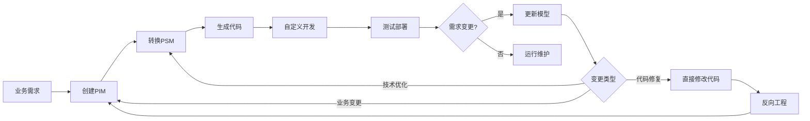
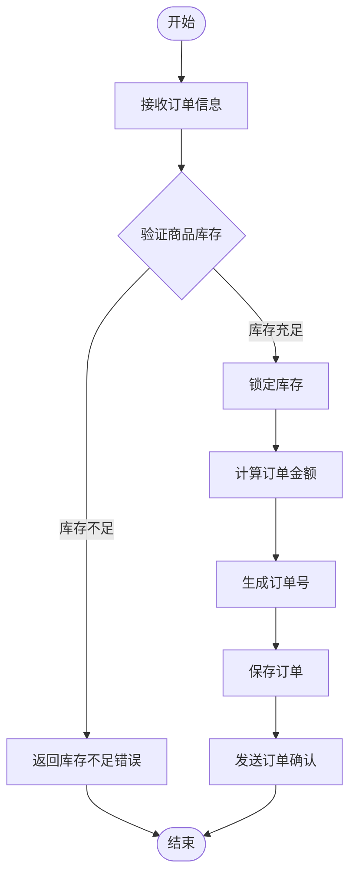
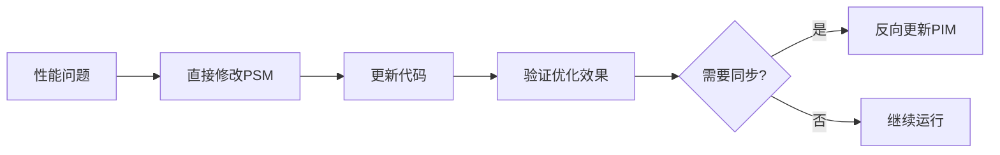
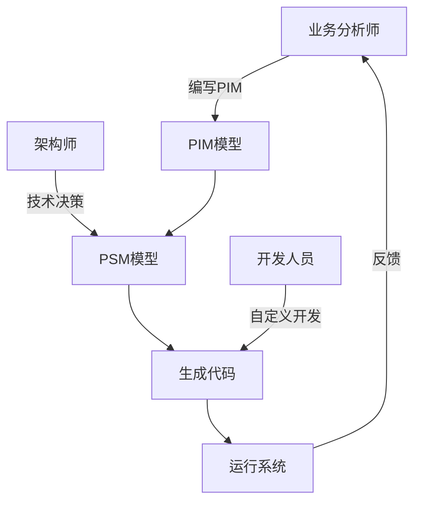

# MDA开发流程

基于大语言模型的模型驱动架构(MDA)开发流程指南，涵盖从业务建模到迭代开发的完整生命周期。

## 目录

1. [概述](#概述)
2. [开发流程总览](#开发流程总览)
3. [初始开发流程](#初始开发流程)
4. [迭代开发流程](#迭代开发流程)
5. [最佳实践](#最佳实践)
6. [常见场景](#常见场景)

## 概述

### MDA开发的核心理念

- **业务驱动**：从业务模型(PIM)开始，而非技术实现
- **智能生成**：利用LLM理解业务语义，生成高质量代码
- **双向同步**：支持模型到代码、代码到模型的双向转换
- **持续迭代**：通过标记系统保护自定义代码，支持增量开发

### 模型层次

```
PIM (Platform Independent Model)
├── 纯业务描述
├── 领域对象和关系
├── 业务流程（无技术细节）
└── 业务规则和约束

    ↓ /pim2FastapiPsm

PSM (Platform Specific Model)  
├── 技术架构决策
├── FastAPI/PostgreSQL等具体技术
├── 性能和安全设计
└── 可调试性配置（自动检测）

    ↓ /mda-generate-fastapi

Code (Implementation)
├── FastAPI微服务代码
├── 数据库模型
├── API接口
└── 流程调试器（如果有流程图）
```

## 开发流程总览



## 初始开发流程

### 1. 业务建模（创建PIM）

创建平台无关的业务模型：

```bash
# 创建PIM文件
vim models/domain/订单管理_pim.md
```

PIM内容示例：
```markdown
# 订单管理领域模型 (PIM)

## 业务概述
订单管理系统处理客户的购买请求，包括订单创建、支付、发货和售后服务。

## 领域对象

### 订单 (Order)
**定义**：客户的购买请求记录。

**属性**：
- 订单号：唯一标识订单
- 客户信息：下单客户
- 商品列表：购买的商品项
- 总金额：订单总价
- 状态：订单当前状态
- 创建时间：下单时间

## 业务流程

### OrderService.创建订单 流程


```

### 2. 技术映射（PIM→PSM）

将业务模型转换为技术模型：

```bash
/pim2FastapiPsm pim=订单管理_pim psm=订单管理_psm features=jwt,redis,rabbitmq
```

转换过程：
- 自动检测流程图，标记可调试方法
- 选择合适的技术栈（认证、缓存、消息队列）
- 添加技术细节（数据类型、索引、API设计）

### 3. 代码生成（PSM→Code）

从技术模型生成FastAPI服务：

```bash
/mda-generate-fastapi domain=订单管理_psm service=order-service
```

生成内容：
- 完整的FastAPI项目结构
- 数据库模型和迁移
- RESTful API接口
- 流程调试器（因为创建订单有流程图）
- Docker部署配置

### 4. 自定义开发

在生成的代码基础上添加业务逻辑：

```python
# MDA-CUSTOM-START: business-logic
async def calculate_discount(order: Order, user: User) -> float:
    """计算用户折扣 - 自定义业务逻辑"""
    if user.vip_level == "GOLD":
        return 0.9  # 金牌会员9折
    elif user.vip_level == "SILVER":
        return 0.95  # 银牌会员95折
    return 1.0  # 普通会员无折扣
# MDA-CUSTOM-END: business-logic
```

### 5. 测试和部署

```bash
# 本地测试
cd services/order-service
pytest tests/

# Docker部署
docker compose up -d

# 验证服务
curl http://localhost:8000/health
curl http://localhost:8000/docs
curl http://localhost:8000/debug/ui  # 调试器界面
```

## 迭代开发流程

### 场景1：业务需求变更

当业务规则发生变化时：


**步骤**：
1. 更新PIM模型
   ```bash
   vim models/domain/订单管理_pim.md
   # 添加新的业务规则或流程
   ```

2. 重新生成PSM
   ```bash
   /pim2FastapiPsm pim=订单管理_pim psm=订单管理_psm
   ```

3. 更新现有代码
   ```bash
   /mda-update model=models/domain/订单管理_psm.md target=services/order-service
   ```

### 场景2：技术优化

当需要技术层面的优化时：



**步骤**：
1. 直接编辑PSM添加技术优化
   ```bash
   vim models/domain/订单管理_psm.md
   # 添加缓存策略、索引优化等
   ```

2. 更新代码实现
   ```bash
   /mda-update model=models/domain/订单管理_psm.md target=services/order-service
   ```

### 场景3：代码先行开发

当直接在代码层面开发新功能时：


**步骤**：
1. 在代码中添加新功能
   ```python
   # MDA-CUSTOM-START: new-feature
   @router.post("/orders/{order_id}/cancel")
   async def cancel_order(order_id: str):
       # 新增的取消订单功能
       pass
   # MDA-CUSTOM-END: new-feature
   ```

2. 反向更新模型
   ```bash
   /mda-reverse source=services/order-service model=models/domain/订单管理_psm.md
   ```

3. 验证模型和代码一致性
   ```bash
   /mda-validate scope=order-service
   ```

### 场景4：添加新的调试流程

为现有方法添加流程调试支持：

1. 在PIM中添加流程图
   ```markdown
   ### OrderService.取消订单 流程
   
   ```mermaid
   flowchart TD
       Start([开始]) --> A[验证订单状态]
       A --> B{可以取消?}
       B -->|是| C[退还库存]
       B -->|否| D[返回错误]
       C --> E[处理退款]
       E --> End([结束])
       D --> End
   ```
   ```

2. 重新生成PSM（自动检测并标记为可调试）
   ```bash
   /pim2FastapiPsm pim=订单管理_pim psm=订单管理_psm
   ```

3. 更新代码（生成调试器支持）
   ```bash
   /mda-update model=models/domain/订单管理_psm.md target=services/order-service
   ```

## 最佳实践

### 1. 模型管理

- **版本控制**：将所有模型文件纳入Git管理
- **命名规范**：
  - PIM文件：`{领域名}_pim.md`
  - PSM文件：`{领域名}_psm.md`
- **模型同步**：定期运行 `/mda-validate` 确保一致性

### 2. 代码标记

始终使用MDA标记区分生成代码和自定义代码：

```python
# MDA-GENERATED-START: crud-operations
# 这部分代码由MDA生成，会被更新
@router.get("/orders/{order_id}")
async def get_order(order_id: str):
    ...
# MDA-GENERATED-END: crud-operations

# MDA-CUSTOM-START: business-validation
# 这部分是自定义代码，更新时会保留
def validate_business_rules(order):
    # 复杂的业务验证逻辑
    pass
# MDA-CUSTOM-END: business-validation
```

### 3. 迭代策略

- **小步快跑**：频繁进行小的迭代，而非大规模变更
- **测试驱动**：每次迭代后运行测试确保功能正常
- **文档同步**：更新模型时同步更新业务文档

### 4. 团队协作



## 常见场景

### 快速原型开发

```bash
# 1. 快速创建PIM
/quick-pim domain=用户认证 entities=User,Token operations=login,logout,refresh

# 2. 一键生成服务
/pim2FastapiPsm pim=用户认证_pim psm=用户认证_psm && \
/mda-generate-fastapi domain=用户认证_psm service=auth-service

# 3. 启动服务
cd services/auth-service && docker compose up -d
```

### 微服务拆分

当单体服务需要拆分时：

```bash
# 1. 分析现有代码
/mda-reverse source=services/monolith-service model=models/domain/单体服务_psm.md

# 2. 拆分PIM模型
# 手动将单体PIM拆分为多个领域PIM

# 3. 生成新的微服务
/pim2FastapiPsm pim=订单管理_pim psm=订单管理_psm
/mda-generate-fastapi domain=订单管理_psm service=order-service

/pim2FastapiPsm pim=库存管理_pim psm=库存管理_psm
/mda-generate-fastapi domain=库存管理_psm service=inventory-service
```

### 技术栈迁移

从其他框架迁移到FastAPI：

```bash
# 1. 从现有代码提取业务模型
/extract-pim source=legacy-code language=java output=models/domain/legacy_pim.md

# 2. 生成FastAPI实现
/pim2FastapiPsm pim=legacy_pim psm=legacy_psm features=jwt,redis
/mda-generate-fastapi domain=legacy_psm service=new-service

# 3. 迁移自定义逻辑
# 手动将原有业务逻辑迁移到MDA-CUSTOM区域
```

## 故障排查

遇到问题时，使用故障排查指南：

```bash
/mda-troubleshooting
```

常见问题：
- 模型不同步：运行 `/mda-validate` 检查
- 生成代码覆盖自定义：检查是否正确使用MDA-CUSTOM标记
- 调试器无法工作：确认PIM中有流程图且PSM正确标记

## 总结

MDA开发流程的核心优势：

1. **业务驱动**：从业务出发，技术服务于业务
2. **智能生成**：LLM理解业务语义，生成高质量代码
3. **灵活迭代**：支持多种迭代场景，保护自定义代码
4. **可视化调试**：自动为复杂流程生成调试器

通过遵循这个流程，可以实现：
- 快速原型开发
- 持续迭代优化
- 业务和技术的良好分离
- 代码质量的一致性保证