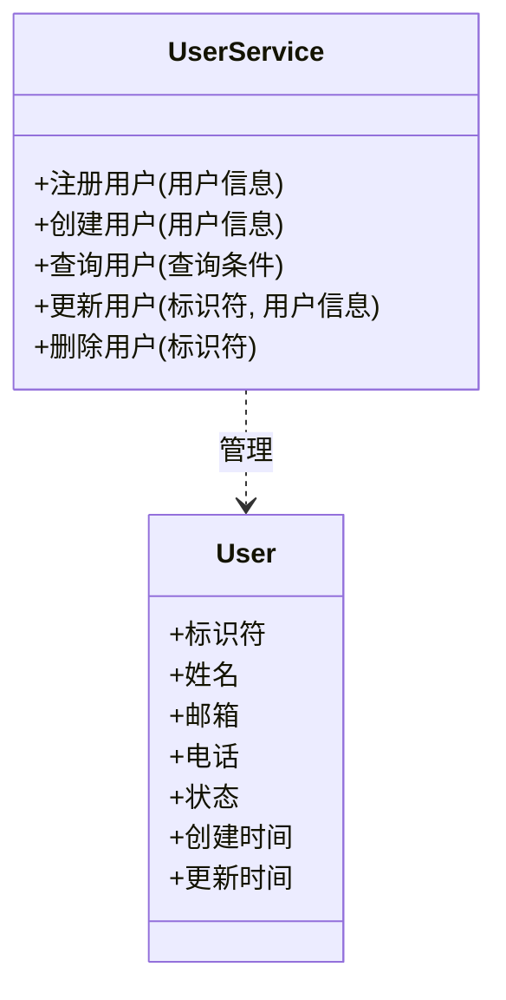
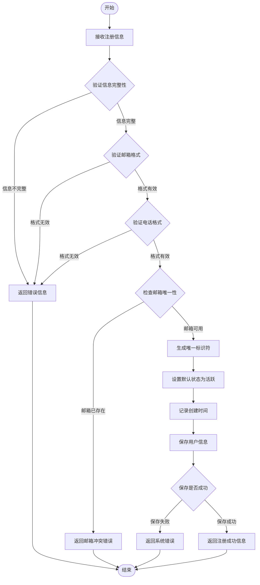

# 用户管理领域模型 (PIM)

## 业务概述

用户管理负责维护系统中的用户信息，提供用户的创建、查询、更新和删除功能。

## 领域对象

### 用户 (User)
**定义**：系统中需要管理的个体。

**属性**：
- 标识符：唯一识别用户
- 姓名：用户的名称  
- 邮箱：用户的电子邮件地址
- 电话：用户的联系电话
- 状态：用户当前状态（活跃/停用）
- 创建时间：用户创建的时间
- 更新时间：用户信息最后更新的时间

## 领域服务

### 用户服务 (UserService)
**定义**：负责管理用户的业务服务。

**方法**：
- `注册用户(用户信息)` - 处理新用户注册流程
- `创建用户(用户信息)` - 创建新用户记录
- `查询用户(查询条件)` - 根据条件查找用户
- `更新用户(标识符, 用户信息)` - 修改用户信息
- `删除用户(标识符)` - 从系统中移除用户

## 业务模型

## 业务规则

1. **唯一性规则**：
   - 用户邮箱必须唯一
   - 用户标识符必须唯一

2. **数据完整性规则**：
   - 姓名不能为空
   - 邮箱格式必须有效
   - 电话格式必须有效

3. **状态规则**：
   - 新创建的用户默认为活跃状态
   - 删除用户实际上是将状态改为停用

## 业务流程

### UserService.注册用户 流程

此流程定义了 `UserService` 服务中 `注册用户` 方法的详细执行步骤。该方法支持流程调试功能。

**方法签名**：`UserService.注册用户(用户信息: {姓名, 邮箱, 电话}) -> {成功: 布尔, 消息: 文本, 用户: User}`

**流程说明**：
1. **接收注册信息**
   - 输入：用户姓名、邮箱、电话
   - 输出：待验证的用户信息

2. **验证信息完整性**
   - 检查所有必填字段是否提供
   - 决策点：信息完整 → 继续；信息不完整 → 返回错误

3. **验证邮箱格式**
   - 检查邮箱是否符合标准格式
   - 决策点：格式有效 → 继续；格式无效 → 返回错误

4. **验证电话格式**
   - 检查电话号码是否符合格式要求
   - 决策点：格式有效 → 继续；格式无效 → 返回错误

5. **检查邮箱唯一性**
   - 查询系统中是否已存在相同邮箱
   - 决策点：邮箱可用 → 继续；邮箱已存在 → 返回冲突错误

6. **生成唯一标识符**
   - 为新用户生成全局唯一的标识符
   - 输出：用户标识符

7. **设置默认状态**
   - 将用户状态设置为"活跃"
   - 输出：用户状态

8. **记录创建时间**
   - 记录当前时间作为用户创建时间
   - 输出：创建时间戳

9. **保存用户信息**
   - 将完整的用户信息持久化保存
   - 决策点：保存成功 → 返回成功；保存失败 → 返回系统错误

### 创建用户流程（简化版）
1. 接收用户信息
2. 验证信息完整性
3. 检查邮箱唯一性
4. 生成唯一标识符
5. 记录创建时间
6. 保存用户信息

### 查询用户流程
1. 接收查询条件
2. 根据条件查找匹配的用户
3. 返回用户列表或详情

### 更新用户流程
1. 根据标识符查找用户
2. 验证新信息的有效性
3. 检查邮箱唯一性（如果修改）
4. 更新用户信息
5. 记录更新时间

### 删除用户流程
1. 根据标识符查找用户
2. 验证用户存在
3. 将用户状态改为停用
4. 记录更新时间

## 非功能需求

1. **性能要求**：
   - 查询响应时间应小于1秒
   - 支持批量操作

2. **可靠性要求**：
   - 数据必须持久化保存
   - 操作必须有事务保证

3. **可用性要求**：
   - 提供清晰的错误信息
   - 支持分页查询

## 术语表

- **用户（User）**：系统中被管理的个体
- **标识符（Identifier）**：唯一识别用户的编号
- **状态（Status）**：用户的当前状态，可以是活跃或停用