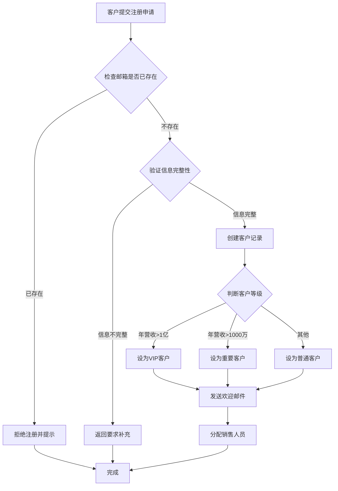
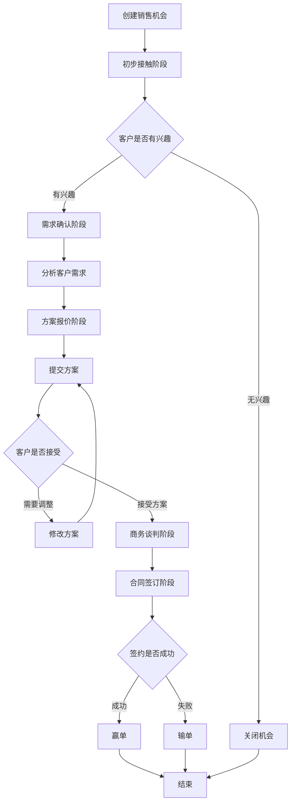

# 客户管理系统

## 系统概述

我们需要一个客户管理系统来管理公司的客户信息、跟踪销售机会，并维护客户关系。

## 业务实体

### 客户
我们的客户包含以下信息：
- **公司名称**（必填）
- **联系人姓名**（必填）
- **联系电话**
- **电子邮箱**（必填，且必须唯一）
- **公司地址**
- **所属行业**（制造业、零售业、服务业、金融业、其他）
- **客户等级**（VIP客户、重要客户、普通客户）
- **客户状态**（潜在客户、正式客户、流失客户）

### 销售机会
每个销售机会记录：
- **机会名称**（必填）
- **所属客户**（关联到客户）
- **预计金额**
- **成功概率**（百分比）
- **当前阶段**（初步接触、需求确认、方案报价、商务谈判、合同签订）
- **预计成交日期**
- **负责销售员**
- **机会描述**

### 跟进记录
销售人员的每次客户跟进：
- **所属客户**（关联到客户）
- **跟进时间**（自动记录）
- **跟进方式**（电话、邮件、上门拜访、线上会议）
- **跟进内容**
- **下次跟进时间**
- **跟进人**

## 业务流程

### 新客户注册流程

### 销售机会跟进流程

## 业务规则

### 客户管理规则
1. **邮箱唯一性**：每个客户的邮箱地址必须是唯一的，不能重复
2. **必填信息**：公司名称、联系人姓名和电子邮箱是必须填写的
3. **客户分级**：
   - 年营收超过1亿的客户自动设为VIP客户
   - 年营收1000万到1亿的设为重要客户
   - 其他为普通客户
4. **客户状态变更**：超过6个月没有任何跟进记录的正式客户自动变为流失客户

### 销售机会规则
1. **阶段推进**：销售机会只能按顺序推进阶段，不能跳跃
2. **概率调整**：
   - 初步接触阶段：成功概率不超过20%
   - 需求确认阶段：成功概率20%-40%
   - 方案报价阶段：成功概率40%-60%
   - 商务谈判阶段：成功概率60%-80%
   - 合同签订阶段：成功概率80%-100%
3. **机会关闭**：处于"合同签订"阶段超过3个月未更新的机会自动关闭

### 跟进规则
1. **跟进频率**：
   - VIP客户：至少每周跟进一次
   - 重要客户：至少每两周跟进一次
   - 普通客户：至少每月跟进一次
2. **提醒机制**：超过规定时间未跟进的客户，系统自动提醒负责销售员

## 系统功能

### 客户管理功能
- 添加新客户
- 修改客户信息
- 查询客户（按名称、行业、等级等筛选）
- 导出客户列表
- 查看客户360度视图（基本信息+销售机会+跟进历史）

### 销售机会管理
- 创建销售机会
- 更新机会阶段和信息
- 查看机会列表和看板
- 销售漏斗分析
- 预测销售额统计

### 跟进管理
- 记录跟进信息
- 设置下次跟进提醒
- 查看跟进历史
- 跟进统计报表

## 报表需求

### 销售报表
1. **销售漏斗图**：显示各阶段的机会数量和金额
2. **销售预测表**：按月度显示预计成交金额
3. **销售人员业绩表**：统计每个销售的客户数、机会数、成交额

### 客户分析报表
1. **客户分布图**：按行业、等级、地区分布
2. **客户流失分析**：统计流失客户数量和原因
3. **客户价值分析**：分析不同等级客户的贡献度

## 权限设置

### 销售人员
- 查看和管理自己负责的客户
- 创建和更新销售机会
- 记录跟进信息
- 查看个人业绩报表

### 销售经理
- 查看所有客户和机会
- 分配客户给销售人员
- 查看团队业绩报表
- 审批重要客户的折扣申请

### 系统管理员
- 所有权限
- 系统配置
- 用户管理
- 数据备份和恢复