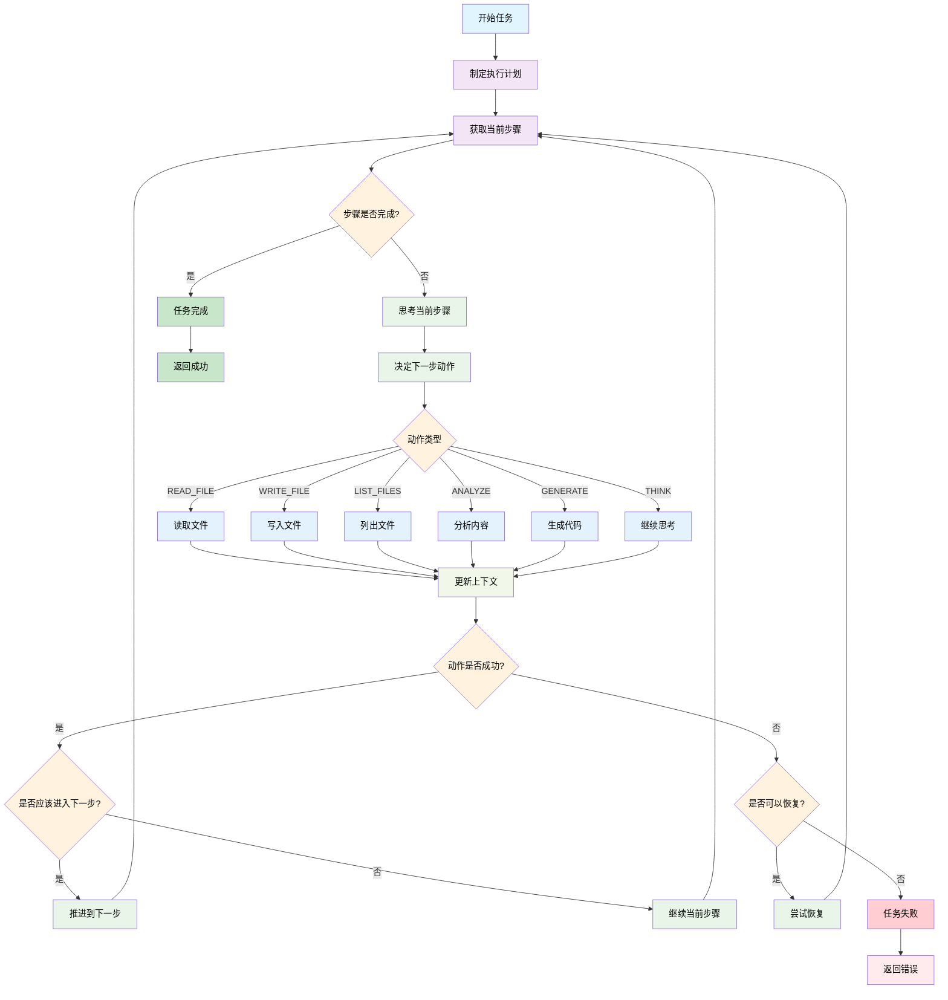

# Agent CLI 系统架构

## 概述

Agent CLI 是一个基于 LangChain 的通用智能代理系统，支持多种 LLM 提供商，能够自主执行复杂任务。系统采用思考-规划-执行的循环模式，通过工具链实现文件操作、代码生成、内容分析等功能。

## 核心组件

### 1. 配置管理 (LLMConfig)

支持多种 LLM 提供商：
- OpenAI
- DeepSeek  
- Qwen
- GLM
- Moonshot

```python
@dataclass
class LLMConfig:
    api_key: str
    base_url: str
    model: str
    provider: str
    temperature: float = 0.3
    max_tokens: Optional[int] = None
```

### 2. 动作系统 (Action System)

定义了六种核心动作类型：

- **THINK**: 思考分析
- **PLAN**: 制定计划
- **READ_FILE**: 读取文件
- **WRITE_FILE**: 写入文件
- **LIST_FILES**: 列出文件
- **ANALYZE**: 分析内容
- **GENERATE**: 生成代码
- **VALIDATE**: 验证结果
- **COMPLETE**: 完成任务

### 3. 工具链 (Tool Chain)

实现了三个核心工具：

- **FileReader**: 文件读取工具
- **FileWriter**: 文件写入工具  
- **FileLister**: 文件列表工具

### 4. 执行计划 (ExecutionPlan)

管理任务执行的步骤序列：

```python
@dataclass
class ExecutionPlan:
    goal: str
    steps: List[str]
    current_step: int = 0
```

## 执行流程



## 流程详解

### 1. 任务启动阶段
- 接收任务描述
- 制定执行计划
- 初始化执行上下文

### 2. 执行循环阶段
- **思考**: 分析当前状态和任务要求
- **决策**: 决定下一步动作类型
- **执行**: 调用相应的工具执行动作
- **更新**: 将结果更新到执行上下文
- **推进**: 判断是否完成当前步骤

### 3. 错误处理机制
- 动作失败时尝试恢复
- 支持跳过无法恢复的错误
- 记录详细的执行日志

### 4. 完成检查
- 验证所有步骤是否完成
- 生成执行摘要报告
- 返回执行结果

## 核心方法

### AgentCLI 类主要方法

1. **execute_task(task: str)** - 任务执行主入口
2. **plan(task: str)** - 制定执行计划
3. **think(context: str, task: str)** - 思考当前任务
4. **analyze_content(content: str, instruction: str)** - 分析内容
5. **generate_code(prompt: str, context: Dict)** - 生成代码
6. **get_execution_summary()** - 获取执行摘要

## 使用示例

```python
# 初始化 Agent CLI
agent = AgentCLI(working_dir="./project")

# 执行任务
success, result = agent.execute_task("将 PIM 文件转换为 PSM 文件")

# 获取执行摘要
summary = agent.get_execution_summary()
print(f"执行了 {summary['total_actions']} 个动作")
```

## 扩展性

系统设计支持以下扩展：

1. **新增工具**: 继承 Tool 基类实现新工具
2. **新增动作类型**: 在 ActionType 枚举中添加新类型
3. **新增 LLM 提供商**: 在 LLMConfig 中添加新提供商配置
4. **自定义执行策略**: 重写决策和执行逻辑

## 技术特点

- **多 LLM 支持**: 统一接口支持多种大语言模型
- **自主决策**: 基于 LLM 的智能决策机制
- **错误恢复**: 内置错误处理和恢复机制
- **可扩展性**: 模块化设计便于功能扩展
- **详细日志**: 完整的执行过程记录 