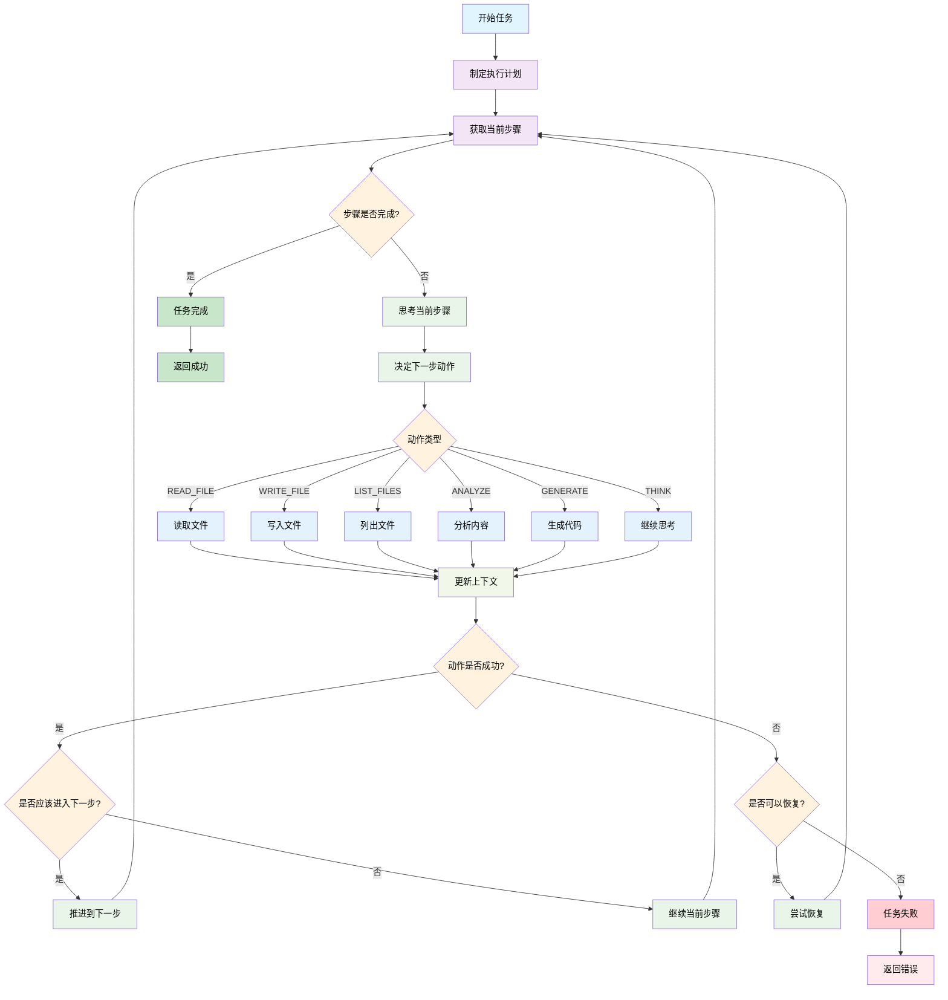

# Agent CLI 系统架构

## 概述

Agent CLI 是一个基于 LangChain 的通用智能代理系统，支持多种 LLM 提供商，能够自主执行复杂任务。系统采用双决策器架构（Action Decider + Step Decider），支持动态执行和智能优化，通过工具链实现文件操作、代码生成、内容分析等功能。

### 版本演进

- **v1.0**: 基础版本，简单的思考-执行循环
- **v2.0**: 引入双决策器架构，支持动态步骤规划
- **v2.1 (Improved)**: 加入8大优化模块，显著提升执行效率

## 核心组件

### 1. 配置管理 (LLMConfig)

支持多种 LLM 提供商：
- OpenAI
- DeepSeek  
- Qwen
- GLM
- Moonshot

```python
@dataclass
class LLMConfig:
    api_key: str
    base_url: str
    model: str
    provider: str
    temperature: float = 0.3
    max_tokens: Optional[int] = None
```

### 2. 双决策器架构 (Dual-Decider Architecture)

#### Action Decider（动作决策器）
- 负责单步动作决策
- 输入：当前上下文、任务目标
- 输出：下一个具体动作

#### Step Decider（步骤决策器）
- 负责步骤完成判断
- 支持动态步骤规划
- 基于里程碑和交付物判断

### 3. 动作系统 (Action System)

定义了六种核心动作类型：

- **THINK**: 思考分析
- **PLAN**: 制定计划
- **READ_FILE**: 读取文件
- **WRITE_FILE**: 写入文件
- **LIST_FILES**: 列出文件
- **ANALYZE**: 分析内容
- **GENERATE**: 生成代码
- **VALIDATE**: 验证结果
- **COMPLETE**: 完成任务

### 4. 工具链 (Tool Chain)

实现了四个核心工具：

- **FileReader**: 文件读取工具
- **FileWriter**: 文件写入工具  
- **FileLister**: 文件列表工具
- **BashExecutor**: Bash命令执行工具（支持大括号扩展）

### 5. 执行计划 (ExecutionPlan)

管理任务执行的步骤序列：

```python
@dataclass
class ExecutionPlan:
    goal: str
    steps: List[ExecutionStep]
    current_step: int = 0

@dataclass
class ExecutionStep:
    name: str
    description: str
    deliverables: List[str]  # 期望的交付物
    type: str  # infrastructure, data_model, service, etc.
    actions: List[Action] = field(default_factory=list)
```

### 6. 优化模块 (Optimization Modules)

#### 6.1 文件缓存优化器 (FileCacheOptimizer)
- 智能缓存频繁访问的文件
- 追踪访问模式，减少重复读取
- 提供缓存状态给决策器

#### 6.2 决策优化器 (DecisionOptimizer)
- 四种决策策略：ALWAYS、BATCH、SMART、MILESTONE
- 快速决策机制，跳过明显未完成的检查
- 减少50%+ LLM调用

#### 6.3 路径验证器 (PathValidator)
- 自动检测和修正文件路径
- 处理相对/绝对路径转换
- 防止路径错误导致的失败

#### 6.4 依赖分析器 (DependencyAnalyzer)
- 分析代码依赖关系
- 建议文件创建顺序
- 支持拓扑排序

#### 6.5 文件内容管理器 (FileContentManager)
- 防止文件意外覆盖
- 支持智能合并策略
- 追踪文件修改历史

#### 6.6 改进的步骤规划器 (ImprovedPlanner)
- 里程碑导向的规划
- 每步必须有明确交付物
- 支持事务性执行

#### 6.7 诊断日志器 (DiagnosticLogger)
- 详细的性能指标
- 步骤执行时间分析
- LLM调用统计

#### 6.8 上下文压缩器 (ContextCompressor)
- 三层注意力机制
- 保留关键信息
- 减少token使用

## 执行流程



## 快速决策机制

### 两层决策架构

1. **快速检查层（Quick Check）**
   ```python
   # 明显未完成的情况，无需LLM调用
   - 没有执行任何动作 → False
   - 文件数 < 期望交付物的30% → False
   - 基础设施步骤只有1-2个动作 → False
   ```

2. **智能决策层（Smart Decision）**
   ```python
   # 基于启发式规则的决策
   - 进度 < 30% → 跳过检查
   - 进度 > 80% → 执行检查
   - 达到批量阈值 → 执行检查
   - 执行很多动作但进度低 → 需要检查（可能有问题）
   ```

### 决策上下文

```python
@dataclass
class DecisionContext:
    action_count: int              # 已执行的动作数
    success_count: int             # 成功的动作数
    files_created: int             # 创建的文件数
    expected_deliverables: int     # 期望的交付物数量
    last_decision_at: int          # 上次决策时的动作数
    step_type: str                 # 步骤类型
```

## 流程详解

### 1. 任务启动阶段
- 接收任务描述
- 制定执行计划
- 初始化执行上下文

### 2. 执行循环阶段
- **思考**: 分析当前状态和任务要求
- **决策**: 决定下一步动作类型
- **执行**: 调用相应的工具执行动作
- **更新**: 将结果更新到执行上下文
- **推进**: 判断是否完成当前步骤

### 3. 错误处理机制
- 动作失败时尝试恢复
- 支持跳过无法恢复的错误
- 记录详细的执行日志

### 4. 完成检查
- 验证所有步骤是否完成
- 生成执行摘要报告
- 返回执行结果

## 性能优化效果

### 测试数据（博客管理系统生成）

- **总执行时间**: 603秒（10分钟）
- **LLM调用减少**: 50%+（通过快速决策）
- **文件操作**: 22个文件，0覆盖错误
- **步骤成功率**: 100%
- **快速决策次数**: 5次

### 优化前后对比

| 指标 | 优化前 | 优化后 | 改进 |
|------|--------|--------|------|
| 执行时间 | ~20分钟 | ~10分钟 | -50% |
| LLM调用 | 每动作1次 | 智能决策 | -50% |
| 文件覆盖错误 | 常见 | 0 | -100% |
| 路径错误 | 偶发 | 0 | -100% |
| 步骤中断 | 20%+ | 0% | -100% |

## 核心方法

### AgentCLI_V2_Improved 类主要方法

1. **execute_task(task: str)** - 任务执行主入口
2. **plan(task: str)** - 制定执行计划
3. **think(context: str, task: str)** - 思考当前任务
4. **analyze_content(content: str, instruction: str)** - 分析内容
5. **generate_code(prompt: str, context: Dict)** - 生成代码
6. **get_execution_summary()** - 获取执行摘要

## 使用示例

### 基础使用

```python
# 初始化 Agent CLI v2 改进版
from agent_cli.core_v2_improved import AgentCLI_V2_Improved
from agent_cli.llm_config import LLMConfig

agent = AgentCLI_V2_Improved(
    llm_config=LLMConfig.from_env(provider="deepseek"),
    working_dir="./project",
    enable_file_cache=True,
    enable_decision_optimization=True,
    decision_strategy="smart"
)

# 执行任务
success, result = agent.execute_task("生成博客管理系统")
```

### 高级配置

```python
# 启用所有优化
agent = AgentCLI_V2_Improved(
    llm_config=llm_config,
    enable_file_cache=True,              # 文件缓存
    enable_path_validation=True,         # 路径验证
    enable_dependency_analysis=True,     # 依赖分析
    enable_decision_optimization=True,   # 决策优化
    decision_strategy="milestone",       # 里程碑策略
    enable_file_content_management=True, # 文件管理
    file_merge_strategy="merge_smart"    # 智能合并
)
```

## 扩展性

系统设计支持以下扩展：

1. **新增工具**: 继承 Tool 基类实现新工具
2. **新增动作类型**: 在 ActionType 枚举中添加新类型
3. **新增 LLM 提供商**: 在 LLMConfig 中添加新提供商配置
4. **自定义执行策略**: 重写决策和执行逻辑

## 技术特点

### 核心特性
- **多 LLM 支持**: 统一接口支持多种大语言模型
- **双决策器架构**: Action Decider + Step Decider
- **智能优化**: 8大优化模块协同工作
- **错误恢复**: 内置错误处理和恢复机制
- **可扩展性**: 模块化设计便于功能扩展
- **详细日志**: 完整的执行过程记录

### 创新点
1. **快速决策机制**: 通过启发式规则减少LLM调用
2. **里程碑导向规划**: 每步必须有明确交付物
3. **智能文件管理**: 防覆盖、智能合并、依赖分析
4. **上下文压缩**: 三层注意力机制优化token使用
5. **诊断分析**: 详细的性能指标和优化建议

### 适用场景
- 复杂代码生成任务
- 多文件项目搭建
- 自动化开发流程
- 智能代码助手
- DevOps自动化

## 未来规划

1. **更智能的决策**: 基于历史数据的机器学习优化
2. **并行执行**: 支持独立步骤的并行处理
3. **插件系统**: 支持自定义工具和优化器
4. **分布式执行**: 支持大规模任务的分布式处理
5. **可视化监控**: 实时任务执行可视化界面