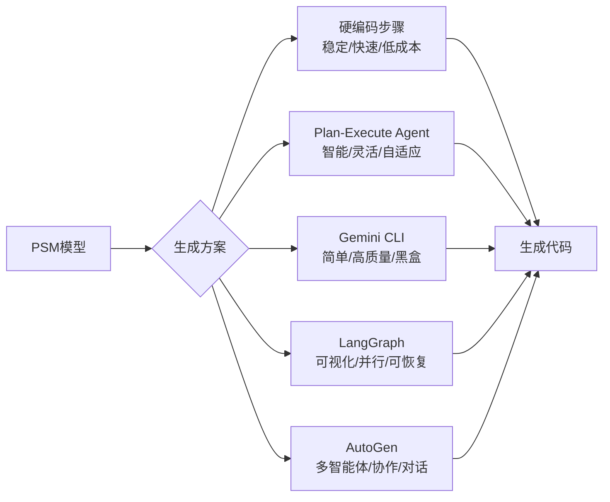
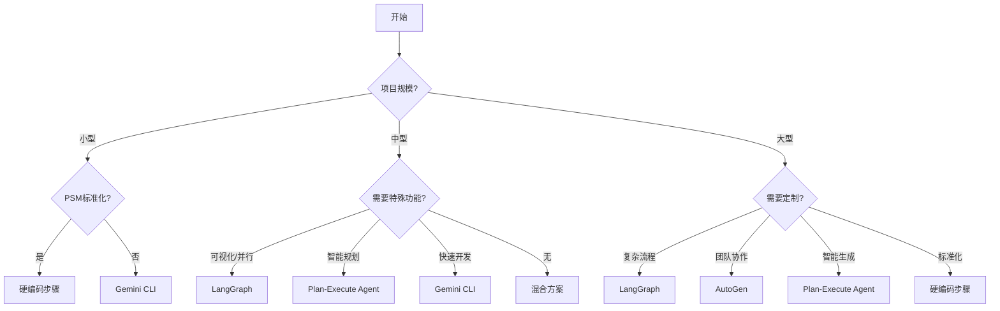

# PSM 代码生成方案对比分析

## 概述

从 PSM（Platform Specific Model）生成代码是 MDA（Model Driven Architecture）的核心环节。本文档对比五种主要实现方案的优缺点，并给出选择建议。

## 方案速览



## 方案对比

### 方案1：硬编码步骤

#### 实现方式
```python
# 固定的生成步骤
steps = [
    "1. 初始化项目结构",
    "2. 生成依赖配置", 
    "3. 生成数据模型",
    "4. 生成服务层",
    "5. 生成API路由",
    "6. 生成测试代码",
    "7. 验证生成代码"
]
```

#### 优点
- ✅ **可控性高**：每个步骤的行为完全可预测
- ✅ **性能最优**：无需 LLM 推理，直接执行
- ✅ **成本最低**：不消耗 API 调用
- ✅ **易于调试**：问题定位简单直接
- ✅ **稳定可靠**：不受 LLM 波动影响

#### 缺点
- ❌ **灵活性差**：难以适应新的 PSM 格式
- ❌ **扩展困难**：添加新平台需要修改代码
- ❌ **维护成本高**：每种场景都需要编码
- ❌ **创新受限**：无法利用 LLM 的创造性

#### 适用场景
- PSM 格式高度标准化
- 目标平台固定（如只支持 FastAPI）
- 对稳定性要求极高的生产环境
- 成本敏感的大规模生成

### 方案2：Plan-and-Execute Agent

#### 实现方式
```python
# 动态生成计划
planner = LLMPlanner()
plan = planner.create_plan(psm_content)

# Agent 执行计划
executor = AgentExecutor()
for step in plan:
    executor.execute(step)
```

#### 优点
- ✅ **智能规划**：根据 PSM 内容动态制定计划
- ✅ **灵活适配**：可处理各种 PSM 格式
- ✅ **自主决策**：Agent 可选择合适的工具
- ✅ **错误恢复**：能够智能处理异常情况
- ✅ **持续优化**：通过提示词改进生成质量

#### 缺点
- ❌ **成本较高**：每次生成都需要多次 LLM 调用
- ❌ **速度较慢**：规划和执行都需要推理时间
- ❌ **可能偏离**：Agent 可能做出意外决策
- ❌ **调试复杂**：需要分析 Agent 的思考过程
- ❌ **依赖 LLM**：受模型能力和稳定性影响

#### 适用场景
- PSM 格式多样化
- 需要处理复杂业务逻辑
- 探索性的代码生成
- 小规模、高价值的项目

### 方案3：Gemini CLI

#### 实现方式
```bash
# 直接调用 Gemini CLI
gemini "根据以下PSM生成FastAPI代码：{psm_content}"
```

#### 优点
- ✅ **实现最简单**：一次调用完成所有工作
- ✅ **利用最新能力**：直接使用最强大的模型
- ✅ **代码质量高**：Gemini 擅长代码生成
- ✅ **快速迭代**：修改提示词即可改进
- ✅ **上下文完整**：单次调用保持完整上下文

#### 缺点
- ❌ **黑盒操作**：无法控制中间过程
- ❌ **Token 限制**：复杂项目可能超出限制
- ❌ **成本最高**：大模型调用费用高
- ❌ **错误难定位**：生成失败时难以调试
- ❌ **缺乏结构**：输出格式可能不一致

#### 适用场景
- 快速原型开发
- 简单到中等复杂度的项目
- 一次性生成任务
- 对生成过程控制要求不高

### 方案4：LangGraph

#### 实现方式
```python
from langgraph.graph import StateGraph, END

# 定义状态图
workflow = StateGraph(CodeGenState)

# 添加节点
workflow.add_node("analyze_psm", analyze_psm_node)
workflow.add_node("generate_models", generate_models_node)
workflow.add_node("generate_services", generate_services_node)
workflow.add_node("generate_api", generate_api_node)
workflow.add_node("validate", validate_node)

# 定义边（包括条件边）
workflow.add_edge("analyze_psm", "generate_models")
workflow.add_conditional_edges(
    "generate_models",
    should_generate_services,
    {True: "generate_services", False: "generate_api"}
)
workflow.add_edge("generate_services", "generate_api")
workflow.add_edge("generate_api", "validate")
workflow.add_conditional_edges(
    "validate",
    is_valid,
    {True: END, False: "generate_models"}  # 失败则重试
)
```

#### 优点
- ✅ **可视化流程**：状态图清晰展示生成流程
- ✅ **状态管理**：内置状态持久化和恢复
- ✅ **条件分支**：支持基于状态的动态路由
- ✅ **并行执行**：可以并行运行独立节点
- ✅ **可中断恢复**：支持长时间运行的工作流
- ✅ **调试友好**：可以查看每个节点的输入输出
- ✅ **组合灵活**：易于添加、删除或重组节点

#### 缺点
- ❌ **学习曲线**：需要理解图概念和 LangGraph API
- ❌ **过度设计**：简单任务可能显得复杂
- ❌ **调试复杂**：图结构调试比线性流程困难
- ❌ **依赖较重**：需要 LangGraph 及其依赖
- ❌ **性能开销**：状态管理带来额外开销

#### 适用场景
- 复杂的多步骤生成流程
- 需要条件分支和循环的场景
- 需要可视化和监控的项目
- 长时间运行需要断点恢复的任务
- 需要并行处理的大型项目

### 方案5：AutoGen

#### 实现方式
```python
import autogen

# 创建多个专门的智能体
psm_analyzer = autogen.AssistantAgent(
    name="PSM分析师",
    system_message="你是PSM模型分析专家，负责解析PSM并提取关键信息"
)

architect = autogen.AssistantAgent(
    name="架构师",
    system_message="你是软件架构师，负责设计代码结构和模块划分"
)

backend_developer = autogen.AssistantAgent(
    name="后端开发者",
    system_message="你是后端开发专家，负责生成FastAPI代码"
)

test_engineer = autogen.AssistantAgent(
    name="测试工程师",
    system_message="你是测试专家，负责生成测试代码和验证功能"
)

code_reviewer = autogen.AssistantAgent(
    name="代码审查员",
    system_message="你是代码审查专家，负责检查代码质量和提出改进建议"
)

# 创建群聊
groupchat = autogen.GroupChat(
    agents=[psm_analyzer, architect, backend_developer, test_engineer, code_reviewer],
    messages=[],
    max_round=20
)

# 管理群聊
manager = autogen.GroupChatManager(groupchat=groupchat)

# 启动代码生成流程
user_proxy = autogen.UserProxyAgent(
    name="用户",
    human_input_mode="NEVER",
    code_execution_config={"work_dir": "generated_code"}
)

user_proxy.initiate_chat(
    manager,
    message=f"请根据以下PSM生成完整的FastAPI应用：{psm_content}"
)
```

#### 优点
- ✅ **多智能体协作**：不同角色分工明确，模拟真实开发团队
- ✅ **自然对话**：智能体之间通过对话协调，易于理解
- ✅ **角色专业化**：每个智能体专注特定领域，提高质量
- ✅ **灵活扩展**：容易添加新角色（如前端开发、DBA等）
- ✅ **自主协商**：智能体可以讨论和解决分歧
- ✅ **代码执行**：支持实时执行和验证生成的代码
- ✅ **人机协作**：可以引入人类参与关键决策

#### 缺点
- ❌ **成本很高**：多个智能体意味着多倍的 API 调用
- ❌ **协调复杂**：智能体间可能产生冲突或循环讨论
- ❌ **不可预测**：对话流程难以完全控制
- ❌ **调试困难**：需要分析多个智能体的对话历史
- ❌ **效率问题**：协商过程可能很长
- ❌ **一致性挑战**：不同智能体可能有不同的代码风格

#### 适用场景
- 需要多视角审视的复杂项目
- 强调代码质量和最佳实践
- 有充足预算的高价值项目
- 需要模拟真实开发流程
- 教学和演示目的
- 需要创新解决方案的探索性项目

## 详细对比表

| 维度 | 硬编码步骤 | Plan-Execute Agent | Gemini CLI | LangGraph | AutoGen |
|------|-----------|-------------------|------------|-----------|---------|
| **实现复杂度** | 高 | 中 | 低 | 中高 | 中 |
| **运行成本** | 极低 | 中 | 高 | 中 | 极高 |
| **执行速度** | 快 | 慢 | 中 | 中 | 很慢 |
| **灵活性** | 低 | 高 | 中 | 极高 | 高 |
| **可控性** | 极高 | 中 | 低 | 高 | 低 |
| **代码质量** | 稳定 | 良好 | 优秀 | 良好 | 优秀 |
| **错误处理** | 程序化 | 智能化 | 依赖模型 | 结构化 | 协商式 |
| **可维护性** | 中 | 高 | 低 | 高 | 中 |
| **扩展性** | 差 | 好 | 中 | 极好 | 好 |
| **调试难度** | 低 | 中 | 高 | 中 | 极高 |
| **状态管理** | 手动 | 简单 | 无 | 内置 | 对话历史 |
| **可视化** | 无 | 基础 | 无 | 优秀 | 对话流 |
| **并行能力** | 手动 | 无 | 无 | 内置 | 多智能体 |
| **协作能力** | 无 | 无 | 无 | 无 | 核心特性 |

## 混合方案：最佳实践

### 推荐的混合架构

```python
class HybridCodeGenerator:
    def generate(self, psm_content, project_requirements):
        # 分析项目需求
        complexity = self.analyze_complexity(psm_content)
        need_visualization = project_requirements.get("visualization", False)
        need_parallelism = project_requirements.get("parallel", False)
        need_recovery = project_requirements.get("recovery", False)
        
        if complexity == "simple" and not need_visualization:
            # 简单项目：使用硬编码步骤
            return self.hardcoded_generation(psm_content)
        
        elif complexity == "medium" and not need_recovery:
            # 中等项目：硬编码框架 + Gemini 填充
            structure = self.create_structure()  # 硬编码
            for component in structure:
                # Gemini 生成具体代码
                code = self.gemini_generate_component(component)
                
        elif need_visualization or need_parallelism or need_recovery:
            # 需要高级特性：使用 LangGraph
            return self.langgraph_generation(psm_content)
            
        elif project_requirements.get("team_simulation", False):
            # 需要团队协作模拟：使用 AutoGen
            return self.autogen_generation(psm_content)
            
        else:  # complex without special needs
            # 复杂项目：Plan-Execute Agent
            return self.plan_execute_generation(psm_content)
```

### 优势
1. **成本优化**：根据复杂度选择最经济的方案
2. **质量保证**：关键部分硬编码，细节 AI 生成
3. **灵活可控**：平衡自动化和控制力
4. **渐进式改进**：可逐步从硬编码迁移到 AI

## 选择决策树



## 具体建议

### 1. 初创项目/POC
**推荐：Gemini CLI**
- 快速验证想法
- 不需要完美的代码结构
- 重点在功能实现

### 2. 生产环境标准化项目
**推荐：硬编码步骤**
- 需要稳定可靠的输出
- PSM 格式已经标准化
- 成本和性能是关键考虑

### 3. 研发平台/工具
**推荐：Plan-Execute Agent**
- 需要处理多样化的输入
- 用户期望智能化体验
- 有预算支持 AI 成本

### 4. 企业级 MDA 平台
**推荐：混合方案（以 LangGraph 为核心）**
- 使用 LangGraph 作为主框架
- 节点内部可以是硬编码、Gemini 或 Agent
- 提供可视化的生成流程
- 支持断点恢复和并行处理

### 5. 需要流程可视化的项目
**推荐：LangGraph**
- 自动生成流程图
- 实时监控执行状态
- 便于向非技术人员展示
- 支持流程优化和调整

### 6. 强调代码质量的项目
**推荐：AutoGen**
- 多角度代码审查
- 模拟真实开发团队
- 自动发现和修复问题
- 生成高质量、经过"讨论"的代码

## 实施路线图

### 第一阶段：MVP
1. 实现硬编码步骤版本
2. 支持基础的 PSM 格式
3. 确保核心功能可用

### 第二阶段：智能化
1. 集成 Gemini CLI
2. 实现混合生成模式
3. 优化提示词工程

### 第三阶段：平台化
1. 实现 Plan-Execute Agent
2. 集成 LangGraph 框架
3. 提供可视化配置界面
4. 支持流程编排和监控

### 第四阶段：智能化
1. 集成 AutoGen 多智能体
2. 实现智能方案选择
3. 支持混合执行模式
4. 提供质量保证机制

## 成本估算

假设每月生成 1000 个项目：

| 方案 | API 调用次数 | 预估月成本 | 平均耗时 | 额外收益 |
|------|-------------|-----------|----------|----------|
| 硬编码 | 0 | $0 | 30秒 | - |
| Plan-Execute | 10-20/项目 | $500-1000 | 5分钟 | 智能化 |
| Gemini CLI | 1-3/项目 | $100-300 | 1分钟 | 高质量 |
| LangGraph | 5-15/项目 | $250-750 | 3分钟 | 可视化+并行 |
| AutoGen | 30-50/项目 | $1500-2500 | 10-15分钟 | 团队智慧 |
| 混合方案 | 2-5/项目 | $100-250 | 2分钟 | 平衡性 |

## 结论

没有一种方案适合所有场景。建议：

1. **开始时**：使用硬编码步骤建立基准
2. **优化时**：引入 Gemini CLI 提升代码质量
3. **扩展时**：实现 Plan-Execute 提供智能体验
4. **成熟时**：集成 LangGraph 实现企业级特性
5. **探索时**：尝试 AutoGen 获得创新解决方案
6. **最终**：采用混合方案，根据场景自动选择

### 核心推荐

#### 常规项目（90%场景）
推荐 **LangGraph + Gemini** 的组合：
- LangGraph 提供流程框架和高级特性
- Gemini 在各节点中生成高质量代码
- 成本可控，效果良好

#### 高端项目（10%场景）
推荐 **AutoGen + LangGraph** 的组合：
- AutoGen 进行初始设计和代码生成
- LangGraph 管理执行流程和状态
- 获得最高质量的代码，但成本较高

### 决策矩阵

| 如果你... | 选择... | 原因 |
|----------|---------|------|
| 预算有限 | 硬编码 + Gemini | 最佳性价比 |
| 追求质量 | AutoGen | 多智能体审查 |
| 需要可视化 | LangGraph | 内置流程图 |
| 快速原型 | Gemini CLI | 最简单直接 |
| 企业平台 | 混合方案 | 灵活应对各种需求 |

关键是要根据项目的具体需求、预算限制和质量要求做出合适的选择。