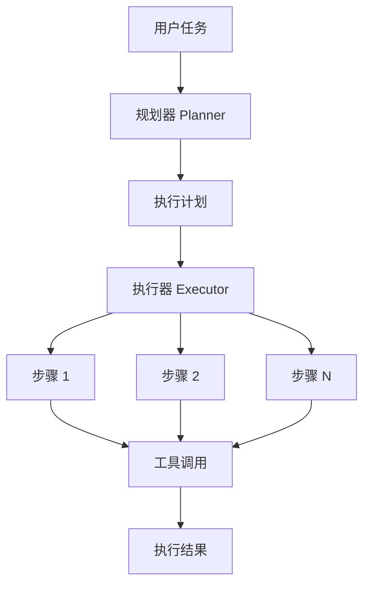

# LangChain Agent 演示集合

本目录包含多个 LangChain Agent 演示程序，展示不同类型的 Agent 架构和使用场景。

## 演示程序概览

### 1. ReAct Agent 系列

#### langchain_react_demo.py
标准 ReAct (Reasoning and Acting) Agent 实现：
- **核心特性**: 思考-行动-观察循环
- **适用场景**: 探索性任务、调试、动态决策
- **工具集成**: 文件操作、Python执行、搜索等

#### project_analyzer_demo.py
专门用于项目分析的 ReAct Agent：
- **专业化提示**: 针对代码项目分析优化
- **工具优化**: 文件列表、读取、搜索等
- **输出格式**: 结构化的项目分析报告

### 2. Plan-and-Execute Agent 系列

#### langchain_plan_execute_demo.py
基础版本的 Plan-and-Execute Agent（自定义实现）：
- **Planning Phase**: 使用 LLM 分析任务并创建详细的执行计划
- **Execution Phase**: 按步骤执行计划，使用 LangChain 工具
- **结果追踪**: 记录每个步骤的执行状态和结果

#### langchain_visual_planner.py
增强版本，添加了丰富的可视化功能：
- **实时进度显示**: 使用 Rich 库显示执行进度
- **Mermaid 流程图**: 自动生成执行计划的流程图
- **美化输出**: 表格、树形结构、彩色输出
- **Markdown 报告**: 生成详细的执行报告

#### langchain_official_plan_execute.py
使用 LangChain 官方 experimental 包的实现：
- **标准实现**: 使用 langchain-experimental 的 PlanAndExecute
- **组件分离**: 独立的 Planner 和 Executor
- **工具包装**: Agent CLI 工具的 LangChain 适配

#### psm_code_generator_demo.py
PSM 到代码生成器（自定义计划执行）：
- **领域特定**: 专门用于 PSM 模型到代码的转换
- **固定流程**: 7步标准化代码生成流程
- **验证集成**: 包含完整的代码验证步骤
- **报告生成**: JSON 和 Markdown 格式的验证报告

#### psm_plan_execute_agent.py ⭐
真正的 Plan-and-Execute Agent 实现：
- **动态规划**: LLM 根据任务动态生成计划
- **Agent 执行**: 每个步骤由 ReAct Agent 自主执行
- **工具选择**: Agent 根据需要选择合适的工具
- **上下文传递**: 步骤间智能传递执行上下文

### 3. 对比和选择指南

#### agent_comparison_demo.py
Agent 类型对比演示：
- **任务分类**: 展示哪些任务适合哪种 Agent
- **性能对比**: 同一任务的不同执行方式
- **选择标准**: 帮助选择合适的 Agent 类型

#### simple_plan_execute_demo.py
简化的 Plan-and-Execute 演示：
- **最小实现**: 展示核心概念
- **易于理解**: 适合学习 Plan-Execute 模式
- **清晰流程**: 明确的规划和执行分离

#### interactive_plan_execute.py
交互式 Plan-and-Execute：
- **用户参与**: 可以审查和修改执行计划
- **灵活执行**: 支持跳过或重试步骤
- **实时反馈**: 每步执行后的用户确认

## Plan-and-Execute 架构



### 核心组件

1. **Planner (规划器)**
   - 分析任务需求
   - 分解为可执行步骤
   - 确定所需工具
   - 设定预期结果

2. **Executor (执行器)**
   - 按顺序执行步骤
   - 调用适当的工具
   - 处理执行错误
   - 收集执行结果

3. **Tools (工具集)**
   - 文件操作工具（读写文件）
   - 代码执行工具（Python REPL）
   - 搜索工具（文件搜索、内容搜索）
   - 系统工具（bash 命令等）

## 使用方法

### 基础版本
```bash
python langchain_plan_execute_demo.py
```

程序会提供几个预设的演示任务，也可以输入自定义任务。

### 可视化版本
```bash
python langchain_visual_planner.py
```

需要安装额外依赖：
```bash
pip install rich
```

## 示例任务

1. **代码分析任务**
   ```
   分析 agent_cli/core.py 文件，理解其主要功能和架构
   ```

2. **文件创建任务**
   ```
   创建一个简单的 TODO 应用，包含添加、删除和列出任务的功能
   ```

3. **项目理解任务**
   ```
   理解 pim-compiler 项目的整体架构和主要组件
   ```

## 输出文件

### 基础版本输出
- `plan_execute_result_*.json`: 完整的执行结果（JSON 格式）

### 可视化版本输出
- `plan_flow_*.mmd`: Mermaid 流程图文件
- `execution_report_*.md`: Markdown 格式的执行报告
- `visual_execution_*.json`: 完整的执行结果

## 架构对比

### ReAct vs Plan-and-Execute

| 特性 | ReAct Agent | Plan-and-Execute Agent |
|------|-------------|------------------------|
| 执行模式 | 思考→行动→观察循环 | 规划→逐步执行 |
| 灵活性 | 高（动态调整） | 中（按计划执行） |
| 可预测性 | 低 | 高 |
| 适用场景 | 探索、调试、研究 | 构建、生成、批处理 |
| 错误处理 | 即时调整 | 计划内处理 |
| 性能 | 可能冗余 | 通常高效 |

### 选择指南

#### 使用 ReAct Agent 当：
- 🔍 需要探索未知环境或代码库
- 🐛 调试问题，需要根据发现调整方向
- 💡 任务目标不够明确，需要边做边确定
- 🔄 需要根据中间结果动态调整策略
- ❓ 处理异常情况和边缘案例

#### 使用 Plan-and-Execute Agent 当：
- 📋 任务有明确的步骤和流程
- 🏗️ 生成代码或构建项目
- 📊 需要可预测和可重复的结果
- ⚡ 希望优化执行效率
- 📝 需要审查执行计划

### 实际案例对比

| 任务类型 | 推荐 Agent | 原因 |
|----------|------------|------|
| 分析未知项目结构 | ReAct | 需要探索和动态调整 |
| 生成 CRUD API | Plan-Execute | 步骤标准且明确 |
| 查找并修复 bug | ReAct | 需要根据线索调整 |
| 批量重构代码 | Plan-Execute | 操作规则明确 |
| 理解复杂业务逻辑 | ReAct | 需要多角度探索 |
| 创建项目脚手架 | Plan-Execute | 流程固定标准 |

## 进阶用法

### 自定义工具
可以通过修改 `get_all_tools()` 添加自定义工具：

```python
from langchain.tools import Tool

custom_tool = Tool(
    name="custom_tool",
    description="自定义工具描述",
    func=lambda x: "工具执行结果"
)
```

### 自定义规划策略
可以通过修改 planner prompt 来调整规划策略：

```python
planner_prompt = ChatPromptTemplate.from_messages([
    ("system", "你的自定义规划提示..."),
    ("human", "{task}")
])
```

## 快速开始

### 安装依赖
```bash
# 基础依赖（已包含在 pim-compiler 中）
pip install langchain langchain-openai python-dotenv

# 可选依赖
pip install langchain-experimental  # 官方 Plan-Execute
pip install rich  # 可视化输出
```

### 配置环境
在 `pim-compiler/.env` 中配置：
```env
LLM_PROVIDER=deepseek
DEEPSEEK_API_KEY=your-api-key
DEEPSEEK_BASE_URL=https://api.deepseek.com
```

### 运行示例

1. **探索项目结构（ReAct）**：
   ```bash
   python project_analyzer_demo.py
   ```

2. **生成代码（Plan-Execute）**：
   ```bash
   python psm_plan_execute_agent.py
   ```

3. **对比不同 Agent**：
   ```bash
   python agent_comparison_demo.py
   ```

## 最佳实践

### 1. 任务描述
- **明确具体**: "创建用户管理 API" 比 "创建 API" 更好
- **包含约束**: "使用 FastAPI 和 SQLAlchemy" 
- **指定输出**: "生成到 ./output 目录"

### 2. 工具使用
- **工具命名**: 使用描述性的工具名称
- **参数格式**: 明确工具的输入格式
- **错误处理**: 工具应返回有意义的错误信息

### 3. 性能优化
- **限制迭代**: 设置合理的 max_iterations
- **缓存结果**: 避免重复的 LLM 调用
- **并行执行**: Plan-Execute 中独立步骤可并行

## 注意事项

1. **LLM 配置**: 确保在 `.env` 文件中配置了正确的 LLM API key
2. **工具权限**: 某些工具操作需要相应的文件系统权限
3. **执行安全**: 代码执行工具会实际运行代码，请谨慎使用
4. **成本控制**: 复杂任务可能消耗较多 API 调用

## 常见问题

### Q: ReAct Agent 陷入循环怎么办？
A: 设置 `max_iterations` 限制，优化提示词，或切换到 Plan-Execute

### Q: Plan-Execute 计划不合理怎么办？
A: 使用交互式版本审查计划，或优化 planner 提示词

### Q: 如何调试 Agent 执行？
A: 设置 `verbose=True`，查看详细的执行日志

### Q: 如何添加自定义工具？
A: 参考 "进阶用法" 部分的自定义工具示例

## 相关资源

- [LangChain 官方文档](https://python.langchain.com/)
- [ReAct Paper](https://arxiv.org/abs/2210.03629)
- [Agent CLI 文档](../README.md)
- [PIM Compiler 文档](../../README.md)