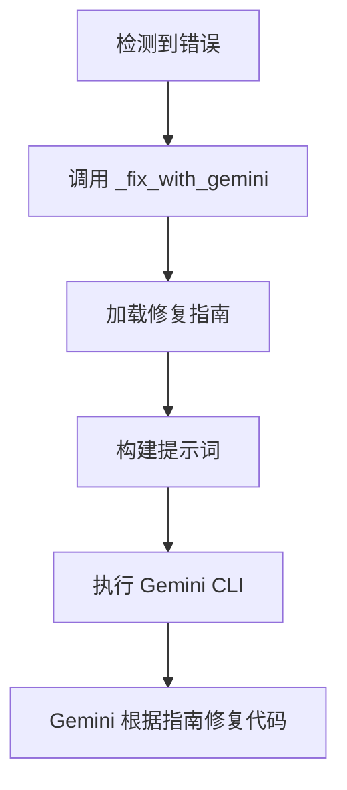

# 修复指南集成说明

本文档解释了修复经验文档如何传递给 Gemini CLI。

## 更新：使用 GEMINI.md 文件

Gemini CLI 会自动读取项目根目录的 `GEMINI.md` 文件（类似于 Claude 读取 `CLAUDE.md`），因此我们采用了更简洁的方案。

## 1. 集成方式

修复指南通过 GEMINI.md 文件自动传递给 Gemini CLI：

### 1.1 两层 GEMINI.md

1. **PIM Compiler 项目的 GEMINI.md**
   - 位置：`/home/guci/aiProjects/mda/pim-compiler/GEMINI.md`
   - 作用：指导 Gemini CLI 如何修复编译器本身的问题
   - 内容：通用的 Python/FastAPI 修复经验

2. **生成项目的 GEMINI.md**
   - 位置：`generated/{project_name}/GEMINI.md`
   - 作用：指导 Gemini CLI 如何修复生成代码的问题
   - 内容：针对生成代码的特定修复指南
   - 创建时机：在代码生成时自动创建

### 1.2 自动读取机制

Gemini CLI 在执行时会自动：
1. 检查当前工作目录是否有 `GEMINI.md`
2. 如果存在，自动读取并理解其中的指导
3. 在修复代码时应用这些知识

### 1.3 内容结构

GEMINI.md 文件包含：
- 常见问题和解决方案
- 代码结构说明
- 修复优先级
- 测试指南
- 项目特定的注意事项

## 2. 传递流程



## 3. 提示词结构

最终传递给 Gemini CLI 的提示词包含：

1. **错误信息** - 具体的错误详情
2. **修复要求** - 针对错误类型的特定要求
3. **修复指南** - 从文档中提取的相关经验

示例：
```
在当前目录中有 Python 代码需要修复 lint 错误。

错误信息：
ImportError: cannot import name 'Doctor' from partially initialized module

请修复所有问题，确保代码符合规范。

参考以下修复指南：

## 2. 代码结构问题

### 2.1 循环导入
使用 TYPE_CHECKING 和字符串注解...
```

## 4. 优化策略

### 4.1 上下文相关性

系统根据错误类型选择加载相关部分：
- **lint 错误** → 加载代码结构问题部分
- **pytest 错误** → 加载数据库和 API 问题部分
- **运行时错误** → 加载依赖和环境问题部分

### 4.2 缓存机制

修复指南在编译器初始化时加载一次，避免重复读取文件。

### 4.3 降级处理

如果无法加载完整文档，系统会使用简化版本：
```python
return """
参考修复指南：
1. 循环导入：使用 TYPE_CHECKING 和字符串注解
2. 模块导出：在 __init__.py 中导出所有类
3. 日期类型：使用 date 而非 str
4. Pydantic v2：使用 ConfigDict(from_attributes=True)
5. curl 测试：添加 --noproxy localhost
"""
```

## 5. 扩展方式

### 5.1 添加新的经验

1. 编辑 `gemini-cli-fix-guide.md`
2. 在相应章节添加新问题和解决方案
3. 保持格式一致，便于自动提取

### 5.2 自定义加载逻辑

修改 `_load_fix_guide` 方法来：
- 根据平台（FastAPI/Django/Flask）加载不同指南
- 根据错误类型动态选择章节
- 集成外部知识库

### 5.3 动态学习

未来可以实现：
```python
# 从成功的修复中学习
if fix_success:
    self.error_pattern_cache.add_successful_fix(error_type, fix_prompt)
```

## 6. 实际效果

通过集成修复指南，Gemini CLI 能够：

1. **更快识别问题** - 基于已知模式快速定位
2. **更准确修复** - 避免引入新问题
3. **保持一致性** - 使用统一的修复方案
4. **减少重试** - 第一次就修复正确

## 7. 注意事项

1. **提示词长度** - 避免超过 Gemini 的上下文限制
2. **版本兼容** - 指南应该涵盖不同版本的框架
3. **更新频率** - 定期更新指南以包含新发现的问题
4. **隐私安全** - 不在指南中包含敏感信息

这种集成方式确保了 Gemini CLI 在修复代码时能够利用累积的经验，提高修复的成功率和效率。