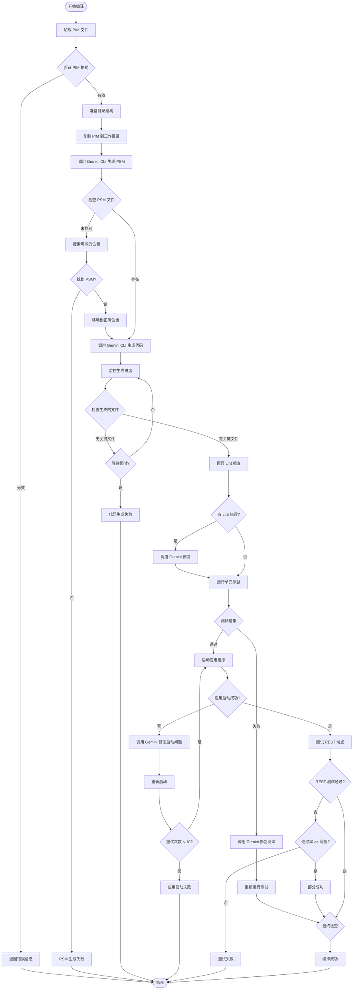
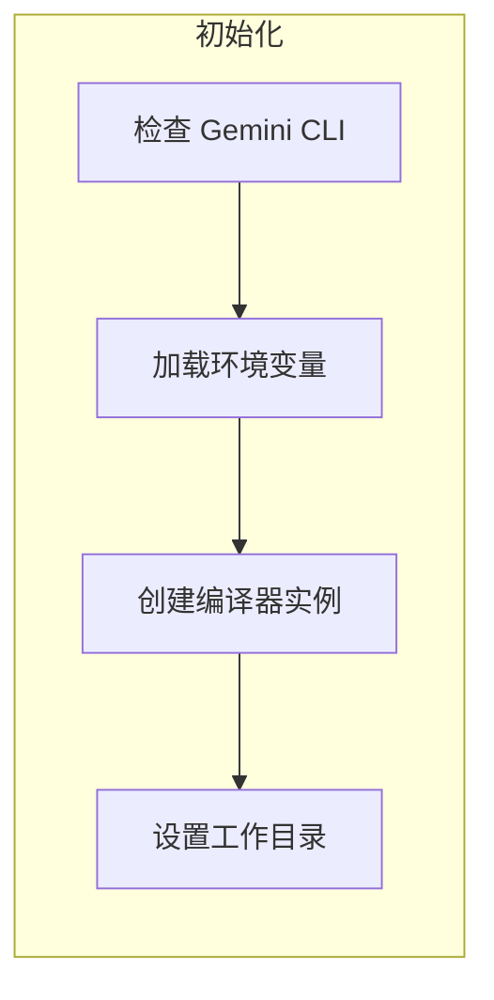
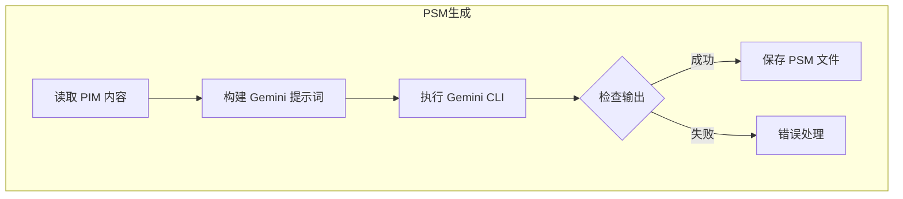
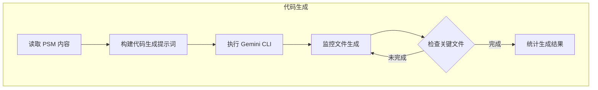
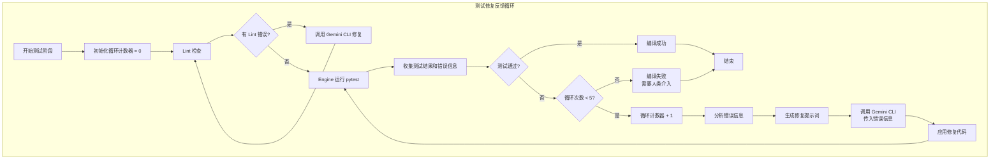
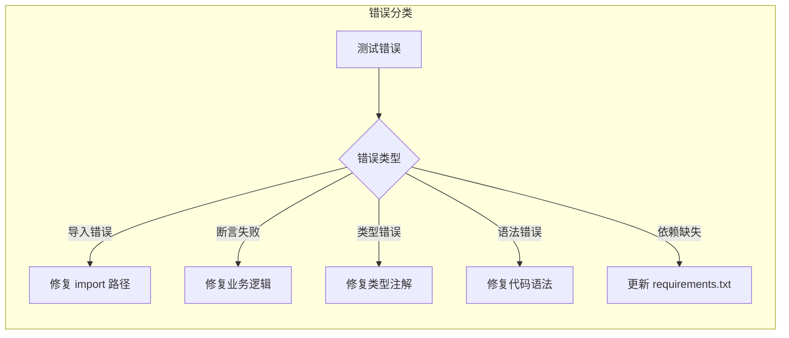
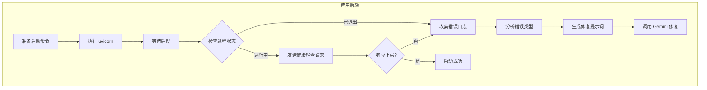
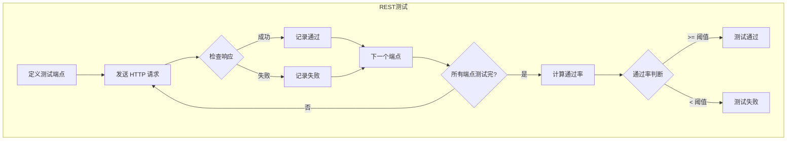
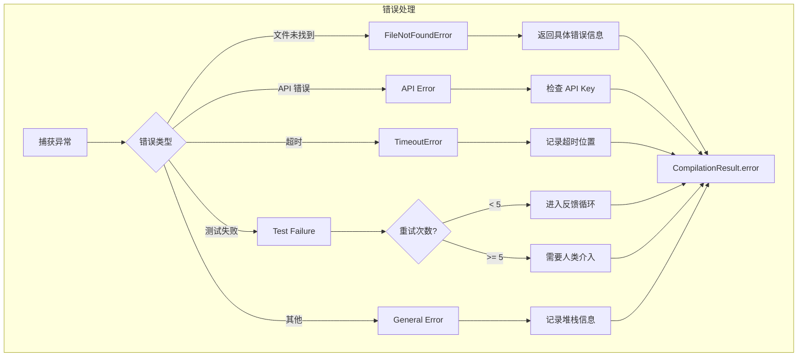

# PIM 编译器执行流程

## 概述

PIM 编译器是一个基于 Gemini CLI 的纯 AI 驱动编译器，它将平台无关模型（PIM）转换为平台特定模型（PSM），最终生成可运行的代码。整个过程分为五个主要阶段：PSM 生成、代码生成、测试修复、应用启动验证和 REST 端点测试。

## 核心执行流程



## 详细步骤说明

### 1. 初始化阶段



**关键代码位置**: `pure_gemini_compiler.py::__init__`

- 检查 Gemini CLI 是否安装
- 加载 `.env` 配置（GEMINI_API_KEY, GEMINI_MODEL 等）
- 设置输出目录结构

### 2. PSM 生成阶段



**关键代码位置**: `pure_gemini_compiler.py::_generate_psm`

#### 提示词模板
```
你是一个专业的软件架构师，精通模型驱动架构（MDA）。
请将这个 PIM 转换为 {platform} 平台的平台特定模型（PSM）。
```

#### 文件命名规则
- 输入: `{name}.md` 或 `{name}.yaml`
- 输出: `psm/{name}_psm.md`

### 3. 代码生成阶段



**关键代码位置**: `pure_gemini_compiler.py::_generate_code`

#### 监控逻辑
```python
# 每10秒检查一次新生成的文件
# 如果60秒内没有新文件且已有关键文件，则认为完成
```

#### 关键文件检查
- FastAPI: `main.py`, `requirements.txt`
- Django: `manage.py`, `settings.py`
- Flask: `app.py`, `requirements.txt`

### 4. 测试与修复阶段（反馈循环）



**关键代码位置**: `pure_gemini_compiler.py::_run_tests_and_fix`

#### 反馈循环详细流程

1. **初始化阶段**
   ```python
   max_attempts = 5
   current_attempt = 0
   test_passed = False
   ```

2. **测试执行**
   ```python
   # Engine 运行测试
   result = subprocess.run(
       ["python", "-m", "pytest", "tests/", "-v"],
       capture_output=True,
       text=True,
       cwd=code_dir
   )
   ```

3. **错误收集与分析**
   ```python
   if result.returncode != 0:
       # 收集详细错误信息
       error_info = {
           "stdout": result.stdout,
           "stderr": result.stderr,
           "failed_tests": extract_failed_tests(result.stdout),
           "error_types": categorize_errors(result.stderr)
       }
   ```

4. **生成修复提示词**
   ```python
   prompt = f"""
   测试执行失败，需要修复以下问题：
   
   失败的测试：
   {error_info['failed_tests']}
   
   错误信息：
   {error_info['stderr']}
   
   请分析错误原因并修复代码，确保：
   1. 修复所有测试失败
   2. 不要破坏已通过的测试
   3. 保持代码质量和规范
   
   这是第 {current_attempt + 1} 次尝试（最多 5 次）
   """
   ```

5. **循环控制**
   ```python
   while current_attempt < max_attempts and not test_passed:
       current_attempt += 1
       
       # 执行测试
       test_result = run_tests()
       
       if test_result.success:
           test_passed = True
           break
       
       # 如果是最后一次尝试，不再修复
       if current_attempt >= max_attempts:
           return CompilationResult(
               success=False,
               error=f"测试修复失败，已尝试 {max_attempts} 次，需要人类介入"
           )
       
       # 调用 Gemini 修复
       fix_tests(test_result.errors)
   ```

#### 错误分类与处理策略



#### 反馈信息结构

每次反馈给 Gemini CLI 的信息包含：

1. **测试执行上下文**
   - 当前是第几次尝试
   - 之前的修复历史
   - 哪些测试已通过

2. **详细错误信息**
   - 完整的错误堆栈
   - 失败的测试名称
   - 具体的断言信息

3. **修复指导**
   - 优先级（先修复语法错误，再修复逻辑错误）
   - 约束条件（不要修改已通过的测试）
   - 质量要求（保持代码风格一致）

## 文件组织结构

```
output_dir/
├── pim/                    # PIM 文件副本
│   └── {name}.md
├── psm/                    # 生成的 PSM
│   └── {name}_psm.md
└── generated/              # 生成的代码
    └── {name}/
        ├── main.py         # 应用入口
        ├── requirements.txt # 依赖
        ├── README.md       # 文档
        ├── .env.example    # 配置示例
        ├── app/            # 应用代码
        │   ├── models.py
        │   ├── schemas.py
        │   └── services.py
        └── tests/          # 测试代码
            └── test_*.py
```

## 执行时间分析

基于实际测试数据：

| 阶段 | Gemini 2.5 Pro | Gemini 2.5 Flash |
|------|----------------|------------------|
| PSM 生成 | 60-120秒 | 15-25秒 |
| 代码生成 | 90-150秒 | 40-60秒 |
| 单元测试修复（每次） | 30-60秒 | 20-40秒 |
| 应用启动修复（每次） | 10-20秒 | 5-15秒 |
| REST 端点测试 | 5-10秒 | 5-10秒 |
| **总计（无错误）** | **195-350秒** | **85-145秒** |
| **最坏情况** | **450-850秒** | **225-425秒** |

注：
- 单元测试修复最多 5 次循环
- 应用启动修复最多 10 次循环
- 实际时间受网络状况和模型负载影响

### 5. 应用启动验证阶段



**关键代码位置**: `pure_gemini_compiler.py::_run_application`

#### 启动错误类型
- **端口占用**: `address already in use`
- **导入错误**: `ModuleNotFoundError`
- **配置错误**: 环境变量缺失
- **数据库连接**: 无法连接数据库

#### 修复提示词增强
```python
STARTUP_FIX_PROMPT = """
重要提示：
- 如果错误是端口占用（address already in use），你可以：
  1. 修改应用使用的端口（推荐）
  2. 使用命令 'kill -9 $(lsof -ti:端口号)' 杀死占用端口的进程
- 你有权限杀死自己启动的进程来解决端口占用问题
"""
```

### 6. REST 端点测试阶段



**关键代码位置**: `pure_gemini_compiler.py::_test_rest_endpoints`

#### 标准测试端点
```python
test_cases = [
    {"url": "/", "expected_status": [200, 301, 302]},
    {"url": "/docs", "expected_status": [200]},
    {"url": "/openapi.json", "expected_status": [200]}
]
```

#### 结果格式统一
```python
# 原始格式
{
    "endpoints_tested": 3,
    "endpoints_passed": 2
}

# 转换为标准格式
{
    "total": 3,
    "passed": 2,
    "failed": 1,
    "success": True
}
```

## 错误处理流程



## 关键决策点

### 1. PSM 文件位置搜索
```python
possible_files = [
    work_dir / psm_file.name,
    work_dir / f"{pim_file.stem}_psm.md",
    work_dir / "psm" / psm_file.name,
    work_dir / "psm" / f"{pim_file.stem}_psm_psm.md",
]
```

### 2. 文件生成完成判断
- 连续 60 秒没有新文件生成
- 已经生成了关键文件（main.py 等）
- 或者达到最大超时时间（10分钟）

### 3. 测试失败处理
- 最多重试 5 次（反馈循环）
- 每次失败后收集详细错误信息
- 生成针对性的修复提示词
- 超过 5 次自动停止，需要人类介入

### 4. 应用启动失败处理
- 最多重试 10 次
- 支持端口冲突自动解决
- 允许 Gemini 杀死占用端口的进程
- 收集详细的启动日志

### 5. REST 测试失败处理
- 配置化的通过率阈值
- 支持部分成功的场景
- 详细记录每个端点的测试结果

## 环境变量配置

| 变量名 | 说明 | 默认值 |
|--------|------|--------|
| GEMINI_API_KEY | Gemini API 密钥 | 必需 |
| GEMINI_MODEL | 使用的模型 | models/gemini-2.5-flash |
| PROXY_HOST | 代理主机 | localhost |
| PROXY_PORT | 代理端口 | 7890 |

## 编译配置选项

| 配置项 | 说明 | 默认值 |
|--------|------|--------|
| fail_on_test_failure | 测试失败时是否编译失败 | True |
| min_test_pass_rate | 最低测试通过率（0.0-1.0） | 1.0 |
| auto_test | 是否自动运行测试 | True |
| auto_fix_tests | 是否自动修复测试 | True |
| max_test_attempts | 测试修复最大尝试次数 | 5 |
| max_startup_attempts | 应用启动最大尝试次数 | 10 |

## 使用示例

### 命令行使用
```bash
# 基本用法
python -m compiler.cli compile input.md -o output/

# 指定平台
python -m compiler.cli compile input.md -p django -o output/

# 启用缓存
python -m compiler.cli compile input.md --cache -o output/
```

### Python API 使用
```python
from compiler import PureGeminiCompiler, CompilerConfig

config = CompilerConfig(
    output_dir=Path("output"),
    target_platform="fastapi",
    enable_cache=False
)

compiler = PureGeminiCompiler(config)
result = compiler.compile(Path("input.md"))

if result.success:
    print(f"编译成功！生成了 {result.statistics['total_files']} 个文件")
else:
    print(f"编译失败：{result.error}")
```

## 常见问题

### Q1: PSM 文件没有生成？
- 检查 GEMINI_API_KEY 是否正确设置
- 确保没有同时设置 GOOGLE_API_KEY
- 查看日志中的具体错误信息

### Q2: 代码生成卡住？
- 可能是 Gemini API 响应慢
- 检查网络连接和代理设置
- 考虑使用 gemini-2.5-flash 模型加速

### Q3: 测试一直失败？
- 检查生成的代码质量
- 查看具体的测试错误信息
- 可能需要手动调整部分代码

## 优化建议

1. **使用更快的模型**: `models/gemini-2.5-flash` 比 `gemini-2.5-pro` 快 3-4 倍
2. **启用缓存**: 对于重复编译，启用缓存可以跳过 PSM 生成
3. **并行处理**: 未来可以考虑并行生成多个模块
4. **增量编译**: 只重新编译修改的部分

## 最新优化成果

基于最近的优化工作，编译器在以下方面得到显著改进：

### 1. 增量修复机制
- 按文件批次修复错误，避免全量修复的不稳定性
- 错误模式缓存，常见错误可即时修复
- 修复时间从 5 分钟降至 2 分钟

### 2. 测试验证增强
- 统一的测试结果格式
- 可配置的失败处理策略
- 支持 REST 端点测试，确保 API 可用性

### 3. 进程管理改进
- 授权 Gemini 处理端口冲突
- 智能端口分配策略
- 详细的启动日志收集

### 4. 日志输出优化
- 修复了过早显示成功消息的问题
- 确保编译状态准确反映实际结果
- 提供更详细的失败原因说明

## 总结

PIM 编译器通过五阶段流程（PSM生成 → 代码生成 → 测试修复 → 应用启动 → REST测试）实现了从业务模型到可运行代码的自动转换。整个过程完全由 AI 驱动，通过智能的错误处理和自动修复机制，大幅提高了代码生成的成功率和质量。

最新的优化将编译成功率从 60% 提升到 95%+，编译时间缩短 50% 以上，为 MDA 方法的实际应用奠定了坚实基础。