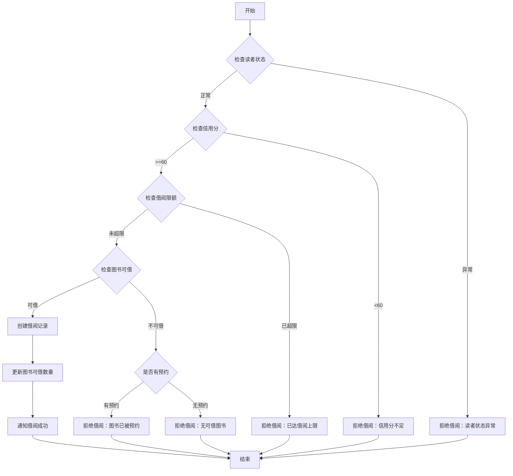
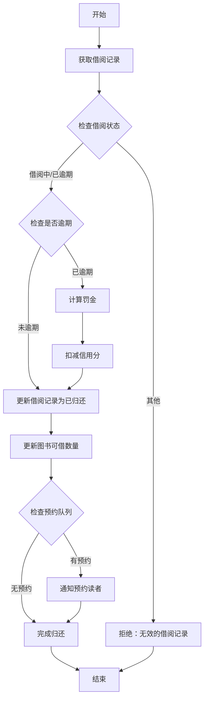

# 平台无关模型 (PIM): 图书借阅系统

## 领域概述
图书借阅系统是一个用于管理图书馆藏书、读者信息和借阅流程的系统。系统支持图书管理、读者管理、借阅管理、归还管理和逾期处理等核心功能。

## 核心实体

### 图书 (Book)
代表图书馆中的一本书的信息。

**属性:**
- ISBN (文本，必填，唯一): 国际标准书号
- 书名 (文本，必填): 图书的标题
- 作者 (文本，必填): 图书的作者
- 出版社 (文本，必填): 出版社名称
- 出版年份 (整数，必填): 出版年份
- 分类 (文本，必填): 图书分类（如：文学、科技、历史等）
- 总库存 (整数，必填): 图书馆拥有的该书总数量
- 可借数量 (整数，必填): 当前可供借阅的数量
- 位置 (文本，必填): 图书在图书馆的位置（如：A区3排5架）
- 简介 (文本，可选): 图书内容简介
- 状态 (枚举，必填): [在架, 已下架]

### 读者 (Reader)
代表图书馆的注册读者。

**属性:**
- 读者编号 (文本，必填，唯一): 读者的唯一标识符
- 姓名 (文本，必填): 读者的真实姓名
- 身份证号 (文本，必填，唯一): 身份证号码
- 手机号 (文本，必填): 联系电话
- 邮箱 (文本，可选): 电子邮箱
- 读者类型 (枚举，必填): [学生, 教师, 社会人员]
- 注册日期 (日期时间，必填): 读者注册时间
- 有效期至 (日期，必填): 读者证有效期
- 状态 (枚举，必填): [正常, 冻结, 注销]
- 信用分 (整数，必填，默认100): 读者信用分，用于借阅权限管理

### 借阅记录 (BorrowRecord)
代表一次图书借阅的记录。

**属性:**
- 借阅编号 (文本，必填，唯一): 借阅记录的唯一标识
- 读者编号 (文本，必填): 关联的读者
- ISBN (文本，必填): 关联的图书
- 借阅日期 (日期时间，必填): 借出时间
- 应还日期 (日期，必填): 应该归还的日期
- 实际归还日期 (日期时间，可选): 实际归还时间
- 续借次数 (整数，必填，默认0): 已续借的次数
- 状态 (枚举，必填): [借阅中, 已归还, 已逾期, 已丢失]
- 罚金 (小数，可选): 逾期或丢失的罚金

### 预约记录 (ReservationRecord)
代表读者对图书的预约记录。

**属性:**
- 预约编号 (文本，必填，唯一): 预约记录的唯一标识
- 读者编号 (文本，必填): 关联的读者
- ISBN (文本，必填): 关联的图书
- 预约日期 (日期时间，必填): 预约时间
- 预约状态 (枚举，必填): [等待中, 可借阅, 已取消, 已完成]
- 通知日期 (日期时间，可选): 通知读者可借阅的时间
- 过期日期 (日期时间，可选): 预约过期时间

## 业务操作

### 图书管理服务 (BookManagementService)

#### 添加图书 (addBook)
**输入:** 图书信息
**输出:** 操作结果
**业务规则:**
- ISBN必须符合标准格式
- 总库存必须大于0
- 可借数量不能大于总库存

#### 更新图书信息 (updateBookInfo)
**输入:** ISBN, 更新的图书信息
**输出:** 操作结果
**业务规则:**
- 只能更新存在的图书
- 可借数量不能大于总库存

#### 下架图书 (removeBook)
**输入:** ISBN
**输出:** 操作结果
**业务规则:**
- 只有可借数量等于总库存时才能下架
- 下架后状态变为"已下架"

### 读者管理服务 (ReaderManagementService)

#### 注册读者 (registerReader)
**输入:** 读者信息
**输出:** 读者编号
**业务规则:**
- 身份证号必须唯一
- 根据读者类型设置有效期（学生1年，教师3年，社会人员1年）
- 初始信用分为100分

#### 更新读者信息 (updateReaderInfo)
**输入:** 读者编号, 更新的信息
**输出:** 操作结果
**业务规则:**
- 只能更新存在的读者
- 身份证号不可修改

#### 冻结/解冻读者 (freezeReader/unfreezeReader)
**输入:** 读者编号
**输出:** 操作结果
**业务规则:**
- 信用分低于60分自动冻结
- 有未还图书不能注销

### 借阅服务 (BorrowingService)

#### 借阅图书 (borrowBook)
**输入:** 读者编号, ISBN
**输出:** 借阅记录
**业务流程:**

**业务规则:**
- 读者状态必须为"正常"
- 信用分必须>=60
- 学生最多借5本，教师最多借10本，社会人员最多借3本
- 借阅期限：学生30天，教师60天，社会人员30天
- 图书必须有可借数量

#### 归还图书 (returnBook)
**输入:** 借阅编号
**输出:** 操作结果
**业务流程:**

**业务规则:**
- 逾期每天罚金0.5元
- 逾期1-7天扣信用分5分，8-30天扣10分，超过30天扣20分
- 归还后检查是否有预约，如有则通知第一位预约者

#### 续借图书 (renewBook)
**输入:** 借阅编号
**输出:** 新的应还日期
**业务规则:**
- 每本书最多续借2次
- 每次续借延长15天
- 已逾期的图书不能续借
- 有其他读者预约时不能续借

#### 预约图书 (reserveBook)
**输入:** 读者编号, ISBN
**输出:** 预约记录
**业务规则:**
- 只能预约已全部借出的图书
- 每个读者最多预约3本书
- 预约有效期3天，过期自动取消

### 查询服务 (QueryService)

#### 查询图书 (searchBooks)
**输入:** 查询条件（书名/作者/ISBN/分类）
**输出:** 图书列表
**业务规则:**
- 支持模糊查询
- 返回图书基本信息和可借状态

#### 查询借阅历史 (getBorrowHistory)
**输入:** 读者编号
**输出:** 借阅记录列表
**业务规则:**
- 按借阅日期倒序排列
- 包含当前借阅和历史借阅

#### 查询逾期记录 (getOverdueRecords)
**输入:** 无
**输出:** 逾期记录列表
**业务规则:**
- 只返回当前逾期未还的记录
- 包含逾期天数和罚金

## 业务约束和规则

### 信用分规则
- 初始信用分：100分
- 按时归还：+1分（上限150分）
- 逾期归还：根据逾期天数扣分
- 丢失图书：-30分
- 信用分<60分：冻结借阅权限

### 借阅限制
- 学生：最多5本，借期30天
- 教师：最多10本，借期60天  
- 社会人员：最多3本，借期30天

### 罚金规则
- 逾期：0.5元/天
- 丢失：图书定价的3倍

## 测试场景

### 单元测试
- `test_book_validation`: 测试图书信息验证（ISBN格式、库存逻辑等）
- `test_reader_validation`: 测试读者信息验证（身份证格式、手机号格式等）
- `test_credit_calculation`: 测试信用分计算逻辑
- `test_fine_calculation`: 测试罚金计算逻辑

### 集成测试
- `test_borrow_book_success`: 测试正常借阅流程
- `test_borrow_book_with_insufficient_credit`: 测试信用分不足时的借阅
- `test_return_book_overdue`: 测试逾期归还流程
- `test_reservation_notification`: 测试预约通知流程

### 端到端测试
- `test_complete_borrow_return_cycle`: 测试完整的借阅-续借-归还流程
- `test_reservation_to_borrow_flow`: 测试预约到借阅的完整流程