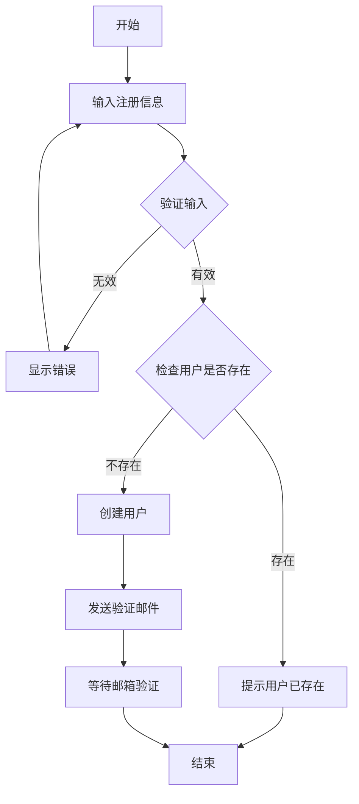
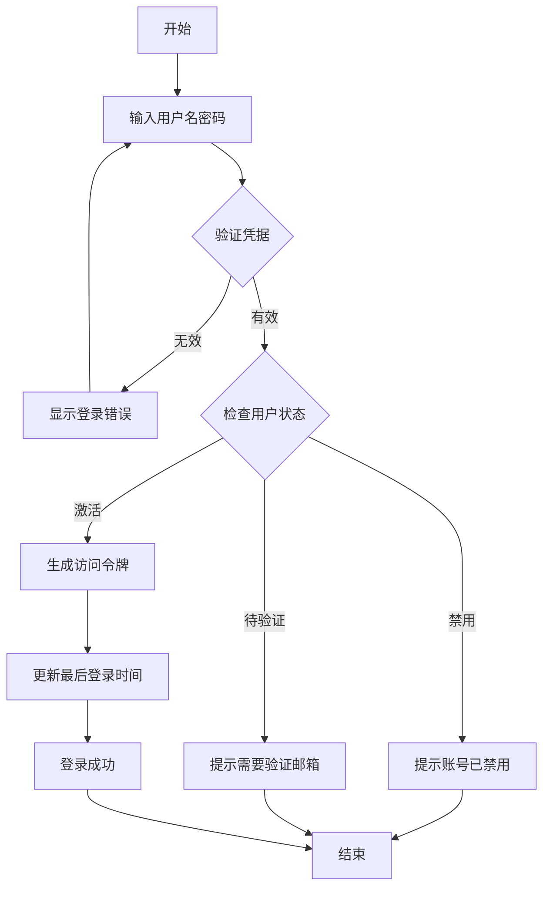

# 用户管理系统

## 系统描述
一个完整的用户管理系统，支持用户注册、登录、权限管理等功能。

## 业务实体

### 用户
系统的核心实体，代表使用系统的人员。
- 用户名（必填，唯一）- 用于登录的唯一标识
- 邮箱（必填，唯一）- 用户的电子邮件地址
- 密码（必填）- 加密存储的登录密码
- 姓名（必填）- 用户的真实姓名
- 手机号 - 用户的手机号码
- 状态（必填）- 用户状态：激活、禁用、待验证
- 注册时间（必填）- 用户注册的时间

### 角色
定义用户在系统中的角色。
- 角色名（必填，唯一）- 角色的名称，如"管理员"、"普通用户"
- 角色代码（必填，唯一）- 角色的唯一标识代码
- 描述 - 角色的详细描述
- 权限列表 - 角色拥有的权限集合

### 权限
系统中的具体权限定义。
- 权限名（必填）- 权限的名称
- 权限代码（必填，唯一）- 权限的唯一标识
- 资源类型（必填）- 权限作用的资源类型
- 操作类型（必填）- 允许的操作：读取、创建、更新、删除

### 用户角色关系
用户和角色的多对多关系。
- 用户（关联到用户）
- 角色（关联到角色）
- 分配时间（必填）

## 业务服务

### 用户服务
处理用户相关的业务操作。

#### 操作列表
- 注册用户 - 创建新用户账号
- 用户登录 - 验证用户身份并生成令牌
- 修改密码 - 更新用户密码
- 更新用户信息 - 修改用户基本信息
- 查询用户 - 根据条件查询用户
- 禁用/启用用户 - 管理用户状态

### 角色服务
管理系统角色。

#### 操作列表
- 创建角色 - 添加新角色
- 更新角色 - 修改角色信息
- 删除角色 - 移除角色
- 分配权限 - 为角色分配权限
- 查询角色 - 获取角色列表

### 权限服务
管理系统权限。

#### 操作列表
- 创建权限 - 定义新权限
- 查询权限 - 获取权限列表
- 检查权限 - 验证用户是否有特定权限

## 业务规则

1. 密码规则
   - 密码长度至少8位
   - 必须包含大小写字母和数字
   - 密码必须加密存储

2. 用户名规则
   - 用户名长度3-20个字符
   - 只能包含字母、数字和下划线
   - 必须以字母开头

3. 邮箱规则
   - 必须是有效的邮箱格式
   - 注册时需要邮箱验证

4. 角色规则
   - 系统必须有至少一个管理员角色
   - 用户必须至少有一个角色
   - 不能删除有用户关联的角色

## 业务流程

### 用户注册流程

### 用户登录流程
