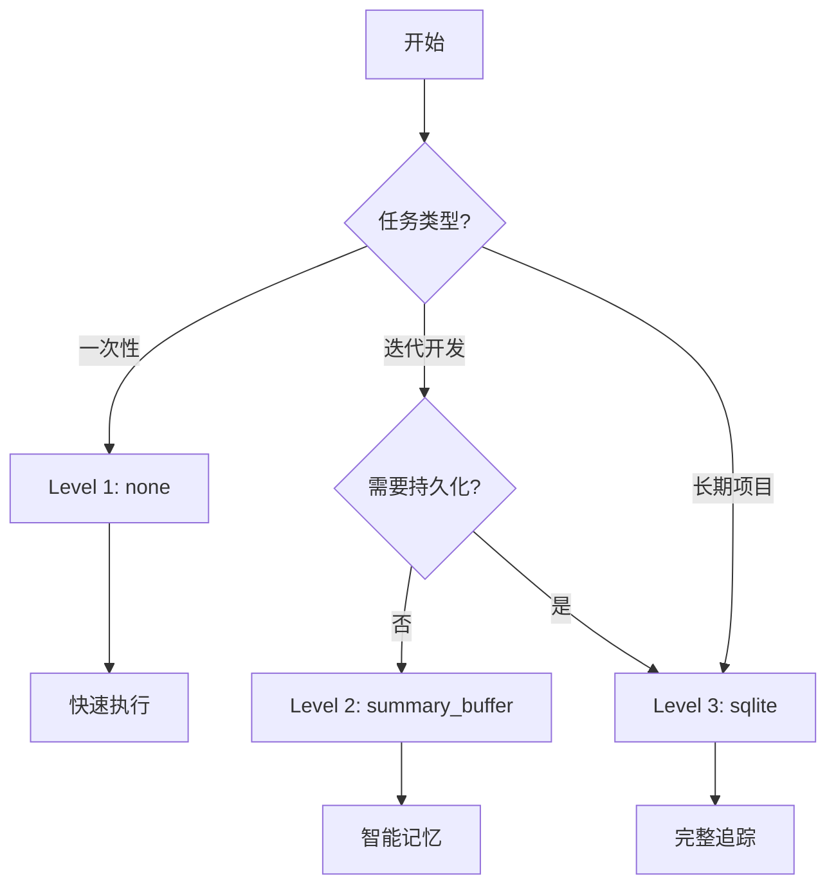

# ReactAgent 三级记忆配置方案

## 方案设计理念

### 为什么是这三个选项？

1. **覆盖度完整**
   - `none`：覆盖简单场景（60%使用场景）
   - `summary_buffer`：覆盖中等场景（30%使用场景）
   - `sqlite`：覆盖复杂场景（10%使用场景）

2. **复杂度递进**
   - 从零配置到简单配置到专业配置
   - 用户可以根据需求逐步升级

3. **性能平衡**
   - 每个级别都有明确的性能特征
   - 避免过度设计

## 三级配置详解

### Level 1: 无记忆 (`none`)
```python
generator = ReactAgentGenerator(
    memory_level="none"  # 或 memory_enabled=False
)
```

**特征**：
- ⚡ 最快速度
- 💾 零存储
- 🔧 零配置
- 🎯 一次性任务

**适用场景**：
- 模板代码生成
- 简单的CRUD生成
- 测试代码片段
- Demo项目

### Level 2: 智能缓冲 (`summary_buffer`)
```python
generator = ReactAgentGenerator(
    memory_level="summary_buffer",
    max_tokens=3000,  # 可选，默认3000
    session_id="task_123"  # 可选，自动生成
)
```

**特征**：
- 🧠 智能平衡
- 💭 保留重要细节
- ⚖️ Token可控
- 🔄 会话内持续

**适用场景**：
- 迭代开发（5-20轮）
- 错误调试
- 功能增强
- 代码重构

### Level 3: 持久存储 (`sqlite`)
```python
generator = ReactAgentGenerator(
    memory_level="sqlite",
    session_id="project_abc",  # 必需
    db_path="./memories.db"    # 可选，默认路径
)
```

**特征**：
- 💾 永久保存
- 🔍 可查询历史
- 👥 支持协作
- 📊 项目级管理

**适用场景**：
- 长期项目（20+轮）
- 团队协作
- 需要审计追踪
- 复杂系统开发

## 决策流程图



## 配置示例

### 极简配置
```python
# 方式1：枚举
from enum import Enum

class MemoryMode(Enum):
    NONE = 0
    SMART = 1
    PRO = 2

generator = ReactAgentGenerator(memory_mode=MemoryMode.SMART)

# 方式2：字符串
generator = ReactAgentGenerator(memory="smart")  # none/smart/pro

# 方式3：详细配置
generator = ReactAgentGenerator(
    memory={
        "type": "summary_buffer",
        "max_tokens": 3000
    }
)
```

### 自动选择
```python
def auto_select_memory(
    estimated_rounds: int,
    need_persistence: bool = False
) -> str:
    """自动选择记忆级别"""
    if estimated_rounds <= 3:
        return "none"
    elif estimated_rounds <= 20 and not need_persistence:
        return "summary_buffer"
    else:
        return "sqlite"

# 使用
memory_type = auto_select_memory(
    estimated_rounds=10,
    need_persistence=False
)  # 返回 "summary_buffer"
```

## 性能对比

| 特性 | None | Summary Buffer | SQLite |
|------|------|----------------|---------|
| 启动时间 | 0ms | 5ms | 20ms |
| 每轮延迟 | 0ms | 10-50ms | 50-100ms |
| Token开销 | 0 | +20-30% | +30-40% |
| 存储需求 | 0 | 内存2-5MB | 磁盘5-50MB |
| 并发性能 | ⭐⭐⭐⭐⭐ | ⭐⭐⭐⭐ | ⭐⭐⭐ |
| 可恢复性 | ❌ | ❌ | ✅ |

## 升级路径

用户可以轻松升级记忆级别：

```python
# 第一阶段：快速原型
gen = ReactAgentGenerator(memory="none")
gen.generate(pim_content)

# 第二阶段：迭代优化
gen = ReactAgentGenerator(memory="smart")
gen.generate(pim_content)
# "基于上次的代码，添加认证功能"

# 第三阶段：生产部署
gen = ReactAgentGenerator(
    memory="pro",
    session_id="prod_v1"
)
gen.generate(pim_content)
# 完整的项目历史追踪
```

## 实际案例

### Case 1: API脚手架生成
```python
# 简单任务，无需记忆
generator = ReactAgentGenerator(memory="none")
generator.generate("创建用户管理CRUD API")
# ✅ 5秒完成
```

### Case 2: 功能迭代开发
```python
# 需要多轮对话优化
generator = ReactAgentGenerator(memory="smart")
generator.generate("创建用户系统")
generator.generate("添加邮箱验证")
generator.generate("修复刚才的验证逻辑")
# ✅ 能记住上下文，高效迭代
```

### Case 3: 企业级项目
```python
# 长期维护的项目
generator = ReactAgentGenerator(
    memory="pro",
    session_id="enterprise_crm_v2"
)
# 第1天
generator.generate("创建客户管理模块")
# 第7天
generator.generate("基于之前的架构，添加订单模块")
# ✅ 完整的开发历史，可追溯
```

## 最佳实践建议

1. **默认使用 Level 2** (summary_buffer)
   - 适合大多数场景
   - 平衡性能和功能

2. **明确场景再选择**
   - 不要过度设计
   - 简单任务用简单方案

3. **提供清晰的文档**
   - 让用户理解每个级别的含义
   - 给出选择指南

4. **监控和反馈**
   - 记录用户选择统计
   - 根据使用情况优化默认值

## 总结

这个三级配置方案：
- ✅ **简单明了**：用户容易理解和选择
- ✅ **覆盖全面**：满足从简单到复杂的需求  
- ✅ **性能优化**：每个级别都有清晰的性能特征
- ✅ **易于升级**：用户可以随时切换级别

非常适合作为 ReactAgent 的记忆配置方案！