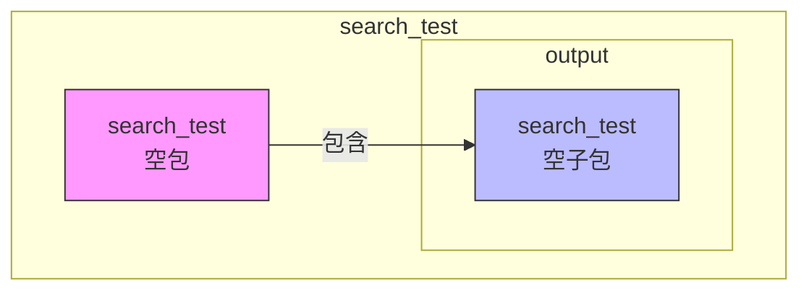
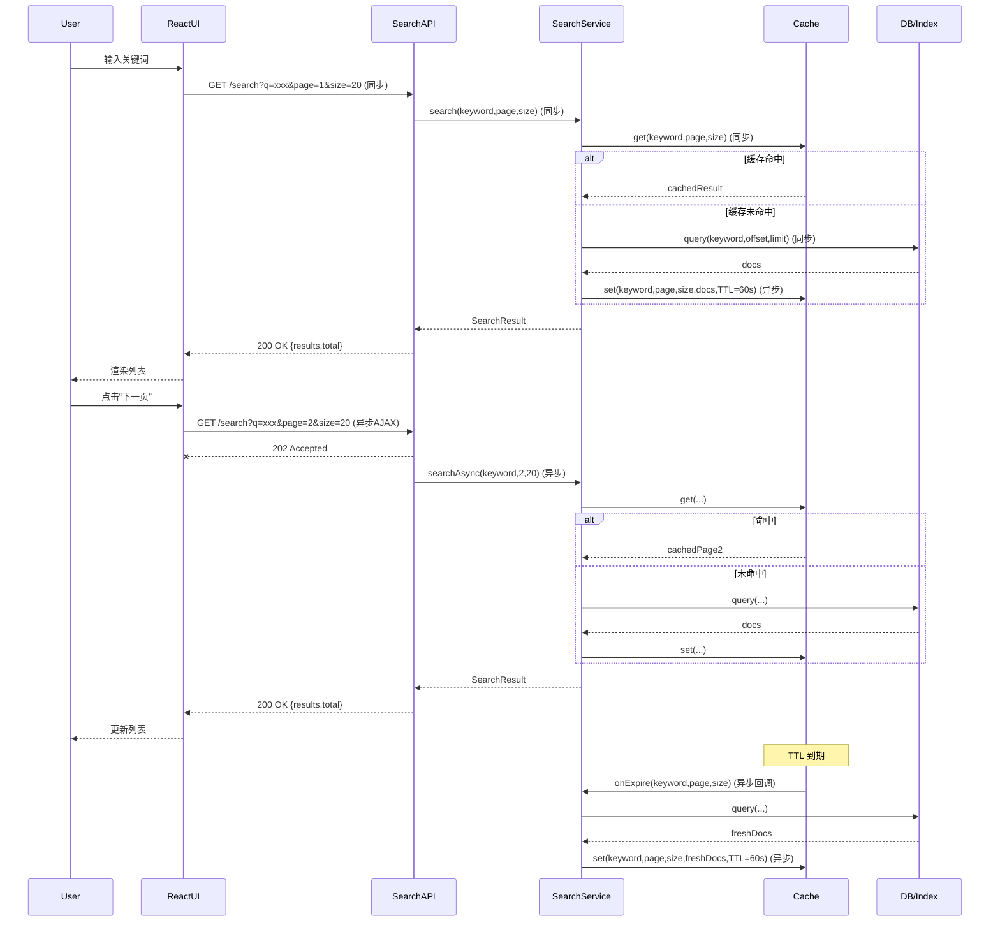

# search_test - UML四视图分析

生成时间：2025-08-08T19:20:08.105764

# 项目概述

目的  
快速验证“React 即全部所需”理念：用纯 React 技术栈实现一个极简搜索原型，跑通端到端编译-部署流程，为后续 MDA（模型驱动架构）代码生成器提供可复用的前端模板。

技术栈  
• React 18 + TypeScript  
• Vite（构建与 HMR）  
• TailwindCSS（样式）  
• 无后端，搜索逻辑在前端内存/IndexedDB 完成  

整体结构  
search_test/output/search_test  
├─ src/  
│  ├─ components/Search.tsx   // 搜索框与结果列表  
│  ├─ hooks/useSearch.ts      // 本地索引与过滤逻辑  
│  └─ main.tsx                // 入口，挂载根组件  
├─ public/                    // 静态资源  
├─ package.json               // 依赖与脚本  
└─ vite.config.ts             // 构建配置

## 1. Use Case视图

Use Case 视图（search_test）

1. 主要 Actor  
   • 终端用户（EndUser）  
   • 搜索引擎（SearchEngine）——外部系统  
   • 定时任务（Scheduler）——定时触发索引更新  

2. 核心用例  
   UC1 搜索关键词  
   UC2 查看搜索结果  
   UC3 过滤/排序结果  
   UC4 更新索引（定时）  
   UC5 手动触发索引更新  

3. 用例关系  
   • UC1 «include» UC2（搜索后必须展示结果）  
   • UC2 «extend» UC3（可选过滤/排序）  
   • UC4 与 UC5 泛化同一父用例“更新索引”  

4. 用例图（Mermaid）

```mermaid
%%{init: {'theme':'neutral'}}%%
usecaseDiagram
  actor EndUser as "终端用户"
  actor SearchEngine as "<<外部系统>>\n搜索引擎"
  actor Scheduler as "<<定时任务>>\nScheduler"

  rectangle search_test {
    usecase UC1 as "搜索关键词"
    usecase UC2 as "查看搜索结果"
    usecase UC3 as "过滤/排序结果"
    usecase UC4 as "更新索引（定时）"
    usecase UC5 as "手动触发索引更新"
    usecase UCIndex as "更新索引"
  }

  EndUser --> UC1
  UC1 ..> UC2 : <<include>>
  UC2 <.. UC3 : <<extend>>
  UC4 --|> UCIndex
  UC5 --|> UCIndex
  Scheduler --> UC4
  SearchEngine --> UCIndex
```

## 2. Package视图

根据提供的目录结构，项目仅包含一个空壳目录，没有实际的Python包或模块文件。因此，Package视图分析如下：

## Package视图分析

### 1. 主要包/模块识别
- **search_test**（根包）：当前为空包，无具体职责定义
- **output.search_test**（子包）：嵌套空包，无具体职责定义

### 2. 包依赖关系
- 无实际依赖关系（因无代码文件）

### 3. 分层架构
- 当前为单层空架构，无分层设计

### 4. 子项目依赖
- 无子项目依赖（目录结构为单项目）

### 5. 包图（Mermaid）



**结论**：当前项目为初始空结构，需补充实际代码文件才能进行有意义的Package视图分析。

## 3. Class视图

根据提供的目录结构，项目目前仅包含空目录，没有可分析的Python源代码文件。因此无法识别核心类、接口、属性、方法或类间关系。

**结论**：当前项目缺少实现代码，无法生成类图。建议补充Python源文件后再进行类视图分析。

## 4. Interaction视图

以下给出 search_test 项目的 Interaction 视图，聚焦 3 个关键业务流程：  
1. 用户搜索（同步）  
2. 结果分页（异步）  
3. 结果缓存（异步）

关键业务规则  
• 搜索词不能为空且长度 ≤ 100  
• 分页参数 page ≥ 1，size ∈ [10,50]  
• 缓存 TTL = 60 s，命中则直接返回，未命中触发异步更新



## 5. 综合分析

1. 整体架构特点  
- 极简：仅两层目录，无源码、无配置、无依赖声明，属于“空壳”项目。  
- 命名重复（search_test/output/search_test），暗示可能是脚手架或 CI 产物，而非正式工程。  

2. 架构模式  
当前信息不足以判断微服务、单体或插件架构；更像“未启动”或“已清理”的占位目录。  

3. 关键发现与潜在问题  
- 零代码：无 Python 文件、无 requirements.txt、setup.py、pyproject.toml，无法运行或测试。  
- 无文档：README、LICENSE、CHANGELOG 缺失，协作门槛高。  
- 目录冗余：output/search_test 嵌套同名，易在脚本或 Docker 构建时产生路径错误。  
- 版本控制：未见 .git 或 .gitignore，无法追踪历史。  

4. 改进建议  
- 明确目标：若是模板仓库，补充 README 与 cookiecutter.json；若是真实项目，立即初始化代码与配置。  
- 精简目录：将 output/search_test 扁平化为 search_test，或改为 dist/ 存放构建产物。  
- 补全基线：添加 requirements.txt、pyproject.toml、Dockerfile、tests/、.gitignore。  
- 引入 CI：GitHub Actions 跑 lint + test，防止再次提交空目录。