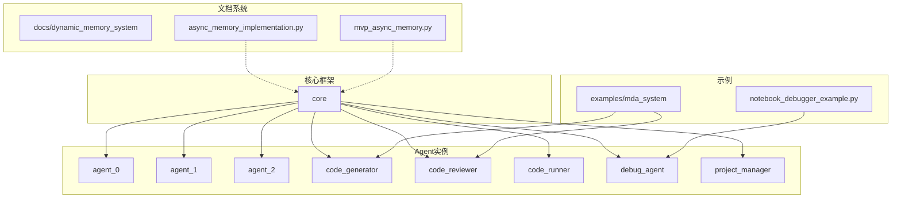
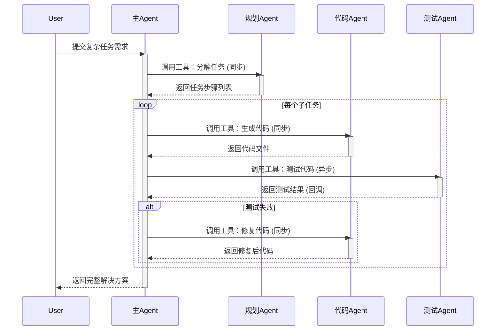
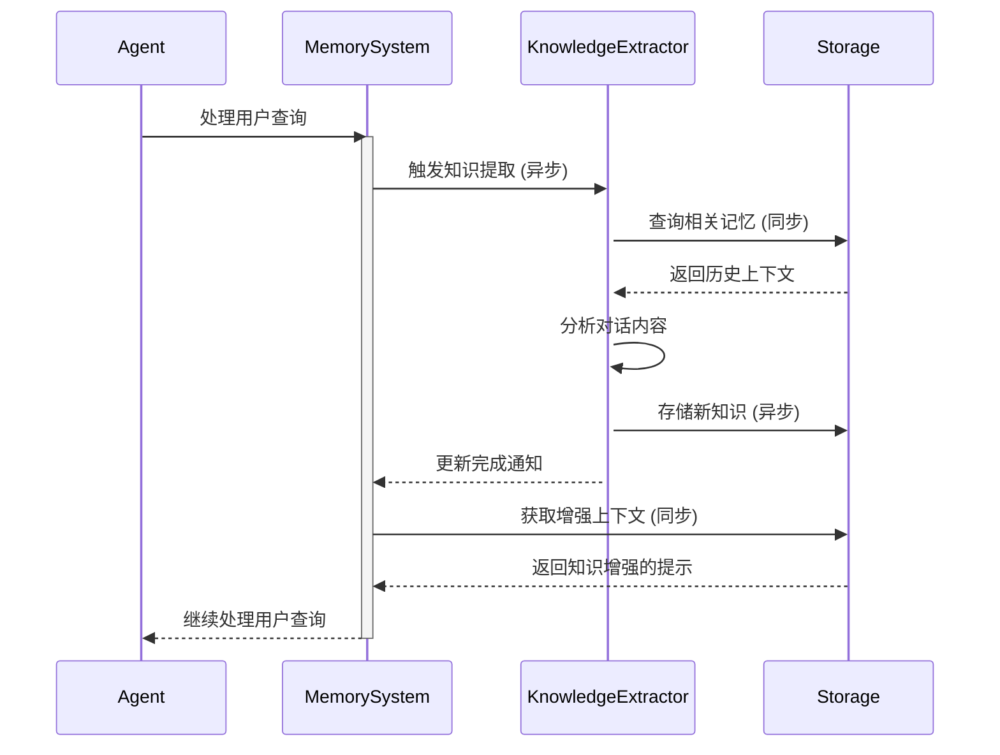
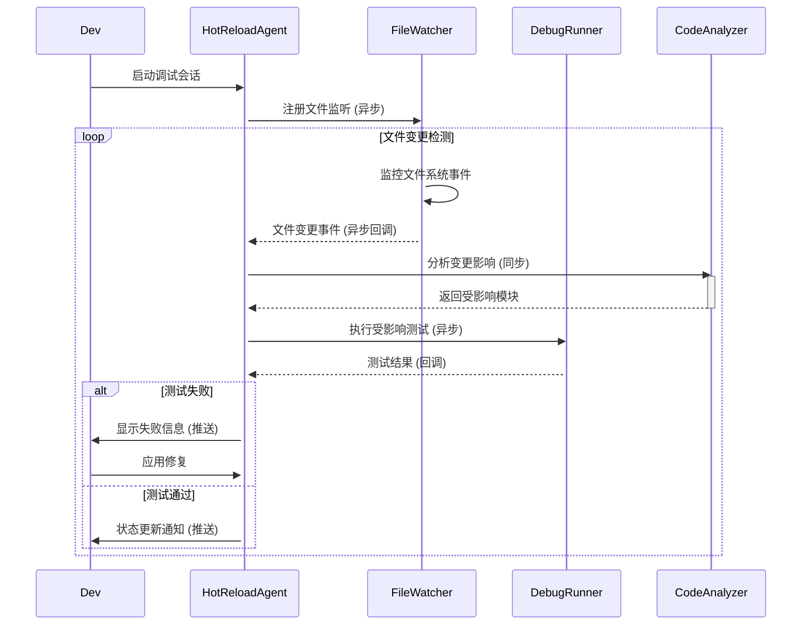

# react_is_all_you_need - UML四视图分析

生成时间：2025-08-05T20:01:06.590617

# 项目概述

目的：构建基于 LangGraph 的下一代 React Agent 框架，实现“自然语言即代码”的 AI 编程与协作平台，支持多 Agent 协同、知识注入、调试与记忆持久化。

技术栈：Python + LangGraph + LangChain + SQLite + Jupyter + 多 LLM（DeepSeek、Kimi 等）。

整体结构：  
- `.agents/`：多 Agent 记忆与知识仓库（长期/短期数据）。  
- `core/`：框架核心。  
- `docs/`：动态记忆、调试、迁移等设计文档与示例代码。  
- `examples/`：MDA 系统与 Notebook 调试示例。  
- 根目录：大量演示脚本（调试、协调、记忆、知识优化等）与工具输出。

## 1. Use Case视图

## Use Case 视图

### 1. 主要 Actor
- **开发者**（Developer）：使用 Agent 完成编码、调试、测试等任务  
- **Agent 本身**（GenericReactAgent）：作为工具被其他 Agent 调用  
- **外部系统**（External System）：文件系统、命令行、Web 搜索、SQLite 缓存  
- **定时任务**（Scheduler）：热重载、记忆持久化、缓存清理  

### 2. 核心用例
| 用例名称 | 简要描述 |
|---|---|
| UC-01 创建 Agent | 开发者配置并实例化一个 GenericReactAgent |
| UC-02 加载知识 | Agent 启动时读取并注入知识文件 |
| UC-03 执行任务 | 开发者提交自然语言任务，Agent 调用工具链完成 |
| UC-04 调试任务 | 开发者使用 NotebookDebugger 单步跟踪 Agent 执行 |
| UC-05 多 Agent 协作 | 一个 Agent 作为工具被另一个 Agent 调用 |
| UC-06 热重载 | 定时任务检测文件变更并重启 Agent |
| UC-07 记忆持久化 | 定时任务将 SMART/PRO 记忆写入 SQLite |
| UC-08 缓存管理 | 定时任务清理或重建 SQLite 缓存 |
| UC-09 代码生成 | Agent 根据需求生成代码并写入文件 |
| UC-10 代码审查 | Agent 读取代码并给出改进建议 |

### 3. 用例关系
- **UC-03 执行任务**  
  - `<<include>>` UC-02 加载知识  
  - `<<extend>>` UC-09 代码生成（当任务为“生成代码”时触发）  
  - `<<extend>>` UC-10 代码审查（当任务为“审查代码”时触发）  
- **UC-05 多 Agent 协作**  
  - `<<include>>` UC-03 执行任务（被调用 Agent 内部执行）  
- **UC-06 热重载**  
  - `<<extend>>` UC-01 创建 Agent（文件变更后重新创建实例）  

### 4. 用例图

```mermaid
%%{init: {'theme':'neutral'}}%%
usecaseDiagram
  actor Developer as "开发者"
  actor Agent as "GenericReactAgent"
  actor System as "外部系统"
  actor Scheduler as "定时任务"

  rectangle "React Is All You Need" {
    usecase UC01 as "创建 Agent"
    usecase UC02 as "加载知识"
    usecase UC03 as "执行任务"
    usecase UC04 as "调试任务"
    usecase UC05 as "多 Agent 协作"
    usecase UC06 as "热重载"
    usecase UC07 as "记忆持久化"
    usecase UC08 as "缓存管理"
    usecase UC09 as "代码生成"
    usecase UC10 as "代码审查"
  }

  Developer --> UC01
  Developer --> UC03
  Developer --> UC04
  Agent --> UC05
  Scheduler --> UC06
  Scheduler --> UC07
  Scheduler --> UC08
  System --> UC02
  System --> UC07
  System --> UC08

  UC03 ..> UC02 : <<include>>
  UC03 ..> UC09 : <<extend>>
  UC03 ..> UC10 : <<extend>>
  UC05 ..> UC03 : <<include>>
  UC06 ..> UC01 : <<extend>>
```

## 2. Package视图

## Package视图分析

### 1. 主要包/模块及其职责

| 包/模块 | 职责 |
|---------|------|
| **core** | 核心运行时框架，包含GenericReactAgent实现 |
| **.agents** | 多Agent运行时容器，每个子目录代表一个独立Agent实例 |
| **docs** | 架构文档与ADR记录，包含动态记忆系统实现 |
| **examples** | 使用示例，包含MDA系统和调试器示例 |

### 2. 包依赖关系

- **core** → 所有Agent的基础依赖
- **.agents/*** → 依赖core提供的Agent运行时
- **examples** → 依赖core和特定Agent实例
- **docs** → 包含独立的Python实现文件（如async_memory_implementation.py）

### 3. 分层架构

```
┌─────────────────────────────────────────┐
│           应用层 (examples)              │
├─────────────────────────────────────────┤
│           代理层 (.agents)               │
│  ┌─────────────┬───────────┬─────────┐ │
│  │ 业务Agent   │ 调试Agent │ 测试Agent│ │
│  └─────────────┴───────────┴─────────┘ │
├─────────────────────────────────────────┤
│           核心层 (core)                  │
│  ┌─────────────┬───────────┬─────────┐ │
│  │ Agent运行时 │ 记忆系统  │ 工具集  │ │
│  └─────────────┴───────────┴─────────┘ │
└─────────────────────────────────────────┘
```

### 4. 子项目依赖关系



### 5. 包图

```mermaid
packageDiagram
    package "core" {
        class GenericReactAgent
        class MemorySystem
        class ToolRegistry
    }
    
    package ".agents" {
        package "agent_0" {
            class data
            class knowledge
        }
        package "code_generator" {
            class data
            class knowledge
        }
        package "debug_agent" {
            class data
            class knowledge
        }
    }
    
    package "docs" {
        package "dynamic_memory_system" {
            class async_memory_implementation
            class mvp_async_memory
        }
    }
    
    package "examples" {
        class mda_system
        class notebook_debugger_example
    }
    
    core ..> .agents : 被所有Agent依赖
    examples ..> .agents : 使用特定Agent
    docs ..> core : 提供参考实现
```

## 3. Class视图

## Class视图分析

### 核心类与接口
1. **GenericReactAgent** - 主Agent实现
2. **AgentMemory** - 记忆系统接口
3. **KnowledgeManager** - 知识管理
4. **ToolRegistry** - 工具注册中心
5. **AgentTool** - Agent作为工具封装

### 重要属性与方法

#### GenericReactAgent
- **属性**:
  - `name: str` - Agent名称
  - `memory_type: MemoryType` - 记忆类型(NONE/SMART/PRO)
  - `knowledge_files: List[str]` - 知识文件列表
  - `tools: List[BaseTool]` - 工具集合
  - `llm: BaseChatModel` - 语言模型实例

- **方法**:
  - `invoke(input: str) -> Dict` - 执行Agent
  - `add_knowledge(file_path: str)` - 添加知识
  - `set_tools(tools: List[BaseTool])` - 设置工具

#### AgentMemory
- **属性**:
  - `memory_key: str` - 记忆键
  - `max_token_limit: int` - 最大token限制

- **方法**:
  - `save_context(inputs, outputs)` - 保存上下文
  - `load_memory_variables({})` - 加载记忆变量

#### KnowledgeManager
- **方法**:
  - `load_file(file_path: str) -> str` - 加载知识文件
  - `parse_includes(content: str) -> str` - 解析@include语法

#### ToolRegistry
- **方法**:
  - `register_tool(tool: BaseTool)` - 注册工具
  - `get_tools() -> List[BaseTool]` - 获取所有工具

### 类关系分析

```mermaid
classDiagram
    class GenericReactAgent {
        +String name
        +MemoryType memory_type
        +List~String~ knowledge_files
        +List~BaseTool~ tools
        +BaseChatModel llm
        +invoke(input: str) Dict
        +add_knowledge(file_path: str)
        +set_tools(tools: List[BaseTool])
    }

    class AgentMemory {
        +String memory_key
        +int max_token_limit
        +save_context(inputs, outputs)
        +load_memory_variables({})
    }

    class KnowledgeManager {
        +load_file(file_path: str) str
        +parse_includes(content: str) str
    }

    class ToolRegistry {
        +register_tool(tool: BaseTool)
        +get_tools() List~BaseTool~
    }

    class AgentTool {
        +String name
        +String description
        +agent: GenericReactAgent
        +_run(query: str) str
    }

    class BaseTool {
        <<interface>>
        +String name
        +String description
        +_run(*args, **kwargs)
    }

    class MemoryType {
        <<enumeration>>
        NONE
        SMART
        PRO
    }

    GenericReactAgent --> AgentMemory : uses
    GenericReactAgent --> KnowledgeManager : uses
    GenericReactAgent --> ToolRegistry : uses
    GenericReactAgent --> MemoryType : has
    AgentTool --> GenericReactAgent : wraps
    AgentTool ..|> BaseTool : implements
    ToolRegistry --> BaseTool : manages
```

## 4. Interaction视图

## Interaction视图分析

### 关键业务流程1：多Agent协作任务执行



**业务规则**：
- 主Agent负责任务协调，不直接处理具体业务
- 规划Agent必须同步返回结构化任务分解
- 代码Agent同步生成代码，确保原子性
- 测试Agent异步执行，支持并发测试多个模块
- 失败时触发自动修复循环，最多重试3次

### 关键业务流程2：动态知识提取与记忆更新



**业务规则**：
- 知识提取必须异步执行，避免阻塞主流程
- 新知识按主题聚类存储，支持快速检索
- 记忆更新采用最终一致性模型
- 上下文增强在查询时实时进行，确保最新知识被使用

### 关键业务流程3：热重载调试循环



**业务规则**：
- 文件监听采用事件驱动，避免轮询开销
- 变更影响分析必须同步完成，确保测试准确性
- 测试执行异步进行，支持并发运行
- 结果通过推送机制实时反馈给开发者
- 支持增量测试，只运行受影响的测试用例

## 5. 综合分析

1. 整体架构特点  
- 以 LangGraph 的 create_react_agent 为核心，构建“Agent 即工具”的 React 范式。  
- 三级记忆（NONE/SMART/PRO）+ 动态知识注入（@include 多文件）形成可插拔认知层。  
- 工具链覆盖文件、代码、命令、搜索，可被单 Agent 或多 Agent 复用。  
- 调试体系完整：NotebookDebugger、ReactAgentDebugger、可视化追踪、热重载测试。  
- 文档驱动：docs 目录集中存放 ADR、设计、迁移指南，形成活文档。

2. 多子项目架构模式  
微内核 + 插件式多 Agent：  
core 提供通用 ReactAgent 内核；.agents 下每个子目录即一个独立 Agent（含 data/knowledge），通过 GenericAgentTool 被动态装载，实现“微服务级”协作。

3. 关键发现与潜在问题  
- 命名冲突：test-agent / test_agent / test_agent2 并存，易误导。  
- 数据散落：long_term_data、short_term_data 与 knowledge 分散，迁移成本高。  
- 热重载与缓存：多 Agent 并行时 SQLite 缓存路径未隔离，可能竞争。  
- 文档与代码同步风险：docs 中 *.md 描述的功能与 core 实现版本存在滞后。  
- 日志膨胀：exploration_log.json 无自动轮转，长期运行体积不可控。

4. 改进建议  
- 统一 Agent 命名规范（agent-{role}-{version}），并加 README 索引。  
- 将 data/knowledge 上收至 core/.store/{agent}，提供 migrate_agents_structure.py 一键迁移。  
- 缓存路径按 Agent 名空间隔离，默认 “/tmp/react_cache/{agent}”。  
- 在 CI 中加入 docs ↔ core 的 diff 校验，防止文档漂移。  
- exploration_log.json 按日切割，保留最近 7 天，减少 I/O 压力。