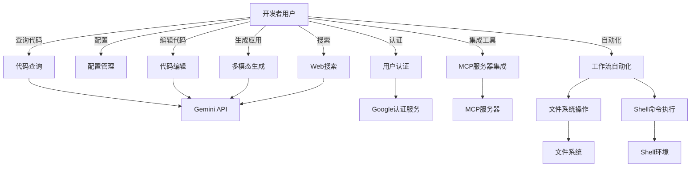
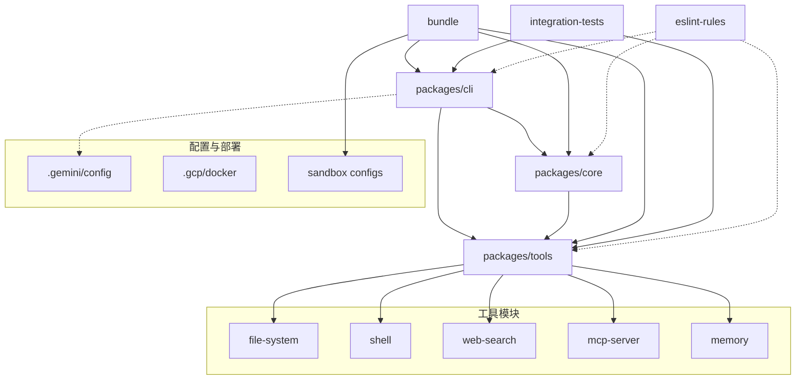
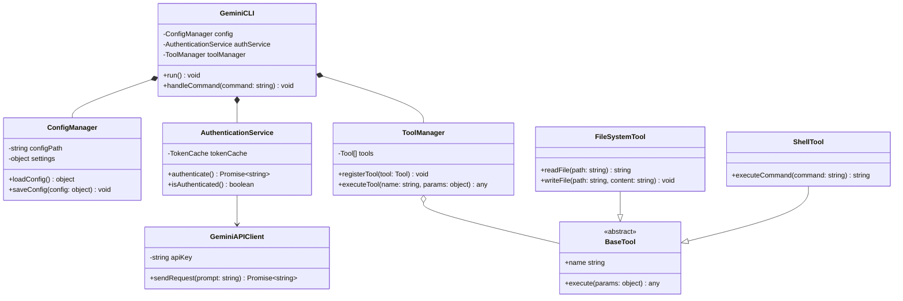
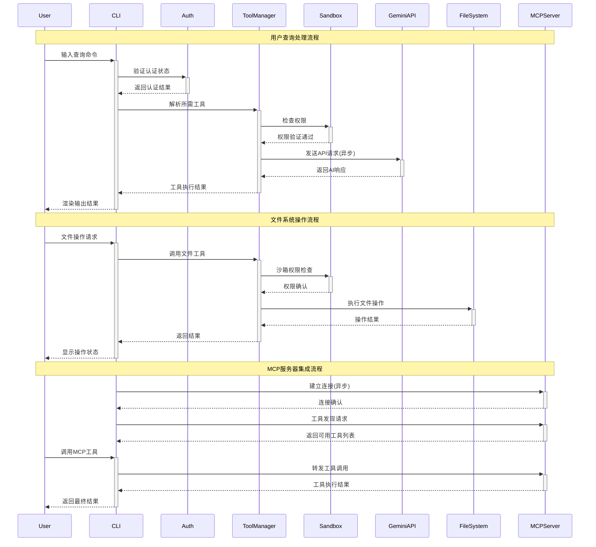

# gemini-cli - UML四视图分析

生成时间：2025-08-08T22:05:13.277587

# 项目概述

## Gemini CLI 项目简介

**项目目的：**
Gemini CLI是一个命令行AI工作流工具，连接Google Gemini AI模型，用于代码查询编辑、多模态应用生成、自动化运维任务等。支持大型代码库处理（1M+ token上下文）、PDF/草图生成应用、PR查询、复杂rebase操作等。

**技术栈：**
- **核心：** Node.js (v20+)、JavaScript
- **AI集成：** Google Gemini API、Google AI Studio
- **工具生态：** MCP服务器、Google搜索工具
- **部署：** Docker、GitHub Actions CI/CD
- **开发：** ESLint、集成测试、沙箱安全机制

**整体结构：**
- `packages/cli/` - 核心CLI实现
- `bundle/` - 打包文件和macOS沙箱配置
- `docs/` - 完整文档（CLI命令、配置、工具API等）
- `integration-tests/` - 端到端测试套件
- `.github/` - CI/CD流水线和社区管理
- `.gemini/` - 项目配置

项目采用模块化架构，支持npm全局安装或npx直接运行，提供丰富的主题和认证选项。

## 1. Use Case视图

# Use Case视图分析

## 主要Actor识别

1. **开发者用户** - 使用CLI进行代码查询、编辑和工作流自动化的主要用户
2. **Gemini API** - 提供AI模型服务的外部系统
3. **Google认证服务** - 处理用户身份验证的外部系统
4. **文件系统** - 本地文件和代码库访问
5. **Shell环境** - 执行命令和脚本的系统环境
6. **MCP服务器** - 提供扩展功能的外部工具服务
7. **CI/CD系统** - 自动化构建、测试和部署的外部系统

## 核心用例列表

### 基础功能用例
- **用户认证**: 通过Google账户或API密钥进行身份验证
- **配置管理**: 设置和管理CLI配置选项
- **主题选择**: 选择和应用CLI界面主题

### 核心AI交互用例
- **代码查询**: 在大型代码库中进行智能查询和分析
- **代码编辑**: 使用AI辅助进行代码修改和生成
- **多模态生成**: 从PDF或草图生成新应用程序
- **工作流自动化**: 自动化操作任务如PR查询、复杂rebase等

### 工具集成用例
- **文件系统操作**: 读取、写入和管理文件
- **Shell命令执行**: 运行系统命令和脚本
- **Web搜索**: 使用Google搜索进行信息检索
- **MCP服务器集成**: 连接外部工具和服务
- **内存管理**: 保存和检索对话上下文

## 用例关系分析

- **扩展关系**: "多模态生成"扩展"代码生成"
- **包含关系**: "工作流自动化"包含"Shell命令执行"和"文件系统操作"
- **泛化关系**: 各种工具操作继承自基础"工具调用"用例

## 用例图

## 2. Package视图

# Package视图分析

## 主要包/模块及其职责

基于目录结构分析，该项目采用monorepo架构，主要包含以下核心包：

1. **packages/cli** - CLI命令行界面包，负责用户交互和命令处理
2. **packages/core** - 核心功能包，提供AI工具API和内存管理
3. **packages/tools** - 工具集包，包含文件系统、Shell、Web搜索等工具
4. **bundle** - 打包输出，包含编译后的gemini.js和沙箱配置
5. **integration-tests** - 集成测试包，验证各工具功能
6. **eslint-rules** - 代码规范包，自定义ESLint规则

## 分层架构

项目采用典型的三层架构：

- **表示层**: CLI包处理用户命令和界面展示
- **业务层**: Core包提供核心AI功能和工具API
- **工具层**: Tools包提供具体的工具实现（文件系统、Shell、MCP服务器等）

## 包依赖关系

## 关键特征

- **模块化设计**: 清晰的包边界，每个包职责单一
- **工具扩展性**: Tools包支持多种工具类型，易于扩展
- **沙箱安全**: Bundle包含多种macOS沙箱配置
- **测试覆盖**: 独立的集成测试包验证端到端功能
- **代码质量**: 自定义ESLint规则防止跨包相对导入

该架构支持Gemini CLI作为AI工作流工具的核心功能：代码理解、多模态生成、工具集成和MCP服务器连接。

## 3. Class视图

# Class视图分析

## 核心类和接口识别

基于项目结构分析，这是一个Node.js CLI工具项目，主要核心类包括：

### 1. CLI相关类
- **GeminiCLI**: 主CLI应用类
- **CommandHandler**: 命令处理器
- **ConfigManager**: 配置管理器
- **ThemeManager**: 主题管理器

### 2. 认证和API类
- **AuthenticationService**: 认证服务
- **GeminiAPIClient**: Gemini API客户端
- **TokenCache**: 令牌缓存管理

### 3. 工具集成类
- **ToolManager**: 工具管理器
- **FileSystemTool**: 文件系统工具
- **ShellTool**: Shell命令工具
- **WebSearchTool**: 网络搜索工具
- **MCPServerTool**: MCP服务器工具

## 重要属性和方法

### GeminiCLI
- `config: ConfigManager`
- `authService: AuthenticationService`
- `toolManager: ToolManager`
- `run(): void`
- `handleCommand(command: string): void`

### ConfigManager
- `configPath: string`
- `settings: object`
- `loadConfig(): object`
- `saveConfig(config: object): void`

### ToolManager
- `tools: Tool[]`
- `registerTool(tool: Tool): void`
- `executeTool(name: string, params: object): any`

## 类关系分析

### 继承关系
- `FileSystemTool extends BaseTool`
- `ShellTool extends BaseTool`
- `WebSearchTool extends BaseTool`

### 实现关系
- `GeminiAPIClient implements APIClient`
- `TokenCache implements CacheInterface`

### 组合关系
- `GeminiCLI` 包含 `ConfigManager`
- `GeminiCLI` 包含 `AuthenticationService`
- `GeminiCLI` 包含 `ToolManager`

### 聚合关系
- `ToolManager` 聚合多个 `Tool` 实例

## 类图

这个类图展现了Gemini CLI的核心架构，主要体现了CLI工具的模块化设计，通过组合模式集成各种功能组件，使用继承实现工具的扩展性。

## 4. Interaction视图

# Interaction视图分析

## 关键业务流程

### 1. 用户查询处理流程
用户输入查询 → CLI解析 → 认证验证 → 工具调用 → Gemini API → 响应渲染

### 2. 文件系统操作流程
文件读取请求 → 权限检查 → 沙箱验证 → 文件操作 → 结果返回

### 3. MCP服务器集成流程
MCP连接请求 → 服务器发现 → 工具注册 → 消息传递 → 响应处理

## 序列图

## 关键业务规则

1. **认证规则**: 所有API调用必须通过OAuth2或API密钥认证
2. **沙箱规则**: 文件操作受macOS沙箱限制，分为restrictive/permissive模式
3. **速率限制**: 免费用户60请求/分钟，1000请求/天
4. **工具权限**: 每个工具调用需要明确的权限验证
5. **异步处理**: Gemini API调用和MCP通信采用异步模式
6. **错误处理**: 所有外部调用都有超时和重试机制

## 同步/异步调用标注

- **同步调用**: 认证验证、权限检查、文件系统操作
- **异步调用**: Gemini API请求、MCP服务器通信、网络搜索
- **事件驱动**: 用户输入处理、实时响应渲染

## 5. 综合分析

# 项目综合分析

## 1. 整体架构特点

**Gemini CLI** 是一个基于 Node.js 的命令行 AI 工具，采用**单体应用架构**，具有以下特点：

- **模块化设计**：通过 `packages/` 目录实现功能模块分离
- **工具集成架构**：支持 MCP 服务器、文件系统、Shell、Web 搜索等多种工具
- **沙箱安全机制**：提供 macOS 沙箱配置文件，确保安全执行
- **多平台支持**：通过 Docker 和 npm 包管理实现跨平台部署

## 2. 架构模式

**单体应用 + 插件化工具系统**：
- 核心 CLI 为单体应用
- 通过工具 API 实现插件化扩展
- 支持 MCP (Model Context Protocol) 服务器集成
- 采用 bundle 打包方式分发

## 3. 关键发现

**优势**：
- 完善的 CI/CD 流程（7个 GitHub Actions 工作流）
- 丰富的文档体系和示例
- 强大的工具生态（文件系统、Shell、Web 搜索、内存管理）
- 安全沙箱机制
- 支持多种主题和配置选项

**潜在问题**：
- 单体架构可能限制大规模扩展
- 依赖 Google 服务，存在厂商锁定风险
- 集成测试覆盖面需要验证

## 4. 改进建议

1. **架构优化**：考虑将核心功能模块化，便于独立维护和测试
2. **多模型支持**：增加对其他 AI 模型的支持，减少厂商依赖
3. **性能监控**：添加性能指标收集和监控机制
4. **插件市场**：建立标准化的插件开发和分发机制
5. **安全增强**：扩展沙箱机制到其他操作系统

总体而言，这是一个设计良好的 AI CLI 工具，具有清晰的架构和完善的工程实践。