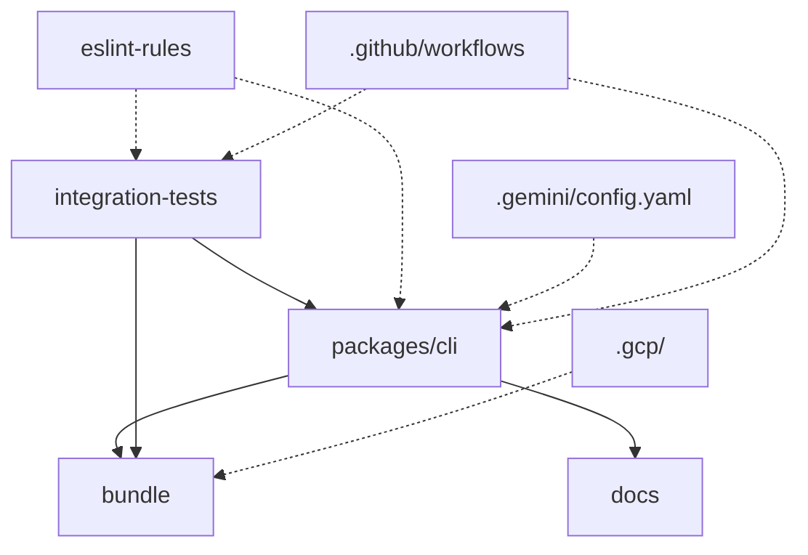
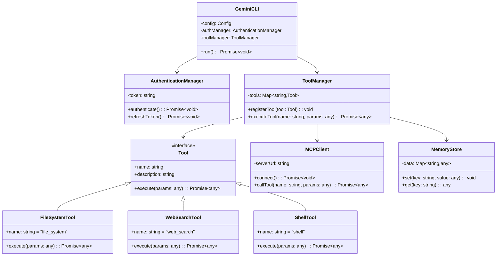
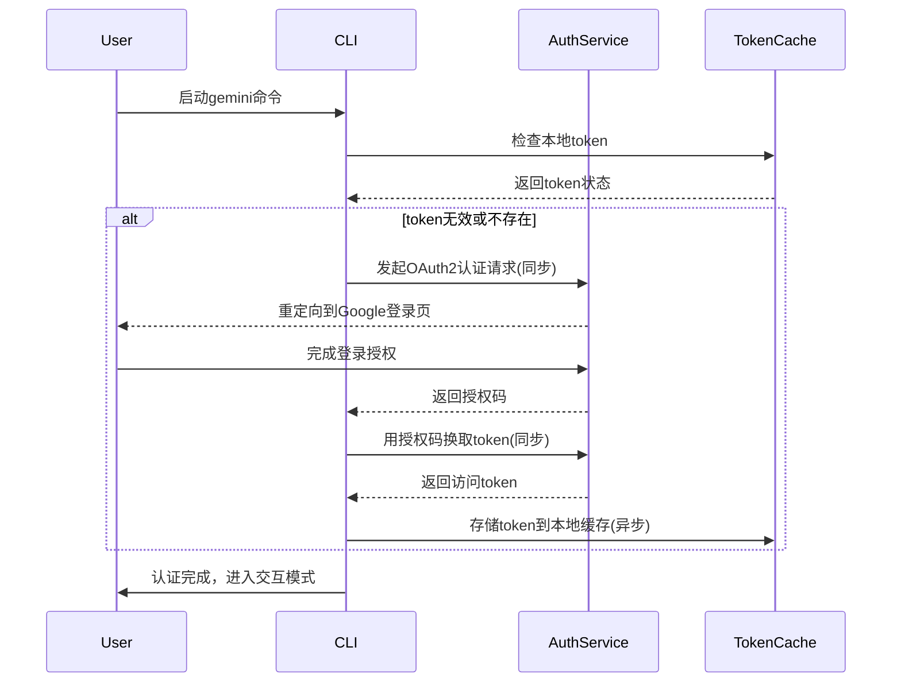
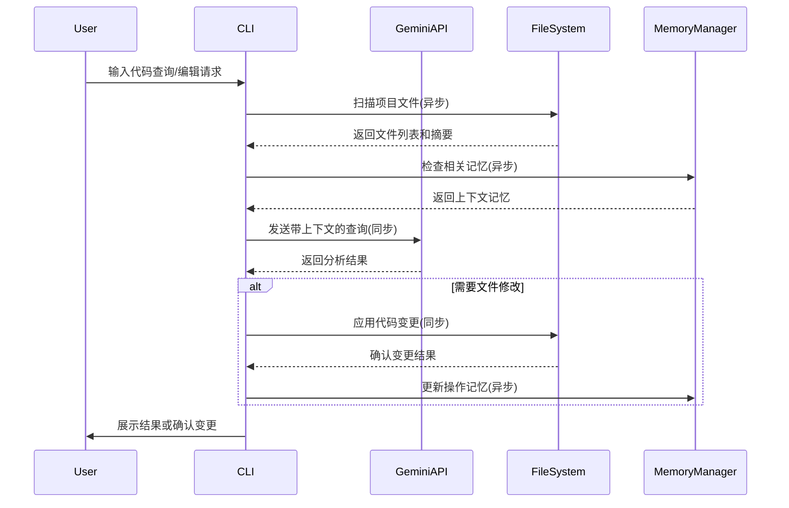
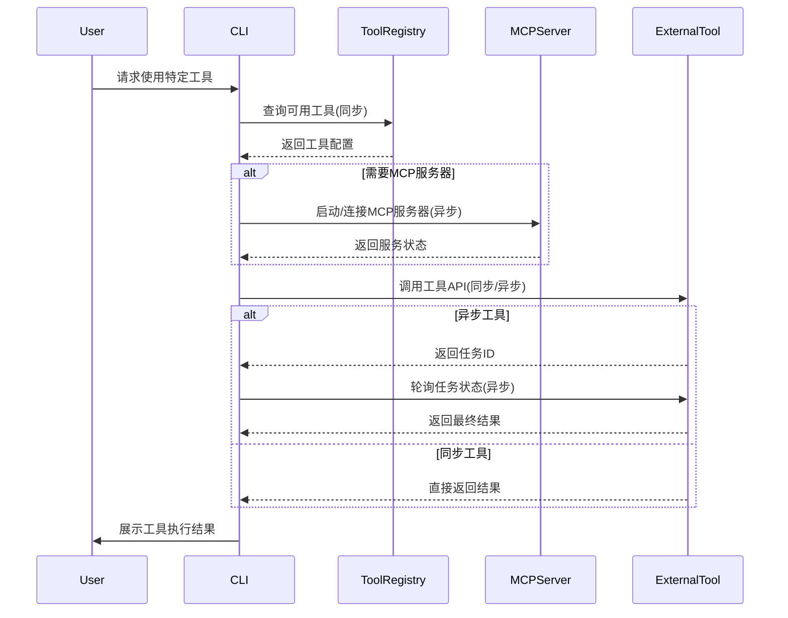

# gemini-cli - UML四视图分析

生成时间：2025-08-08T02:07:13.945904

# 项目概述

目的：Gemini CLI 是 Google 官方推出的命令行 AI 工作流工具，通过自然语言即可查询/修改超大代码库、从 PDF/草图生成应用、自动处理 PR 与运维任务，并支持接入 MCP 服务器扩展能力（如 Imagen、Veo、Lyria 媒体生成、Google Search 等）。

技术栈：Node.js ≥20（主语言），TypeScript/JavaScript；内置 Google Gemini API/SDK；通过 MCP 协议与外部工具交互；Docker 容器化部署；GitHub Actions 持续集成；集成 Google Cloud 服务（Dockerfile.gemini-code-builder、release-docker.yaml）。

整体结构：  
- packages/cli：核心 CLI 源码  
- docs：完整使用、配置、扩展文档  
- integration-tests：端到端测试用例  
- bundle：运行时沙箱策略与打包产物  
- .github/workflows：CI、E2E、Issue/PR 自动分类、发布流程  
- .gcp/.gemini：云构建与 CLI 配置

## 1. Use Case视图

## Use Case 视图

### 1. 主要 Actor
- **终端用户**（Developer / Power User）
- **Google Gemini API**（外部系统）
- **Google Search API**（外部系统）
- **MCP Server**（外部系统）
- **GitHub Actions**（定时任务）
- **本地文件系统**（外部系统）
- **Shell 环境**（外部系统）

### 2. 核心用例
| 用例名称 | 简要描述 |
|---|---|
| UC-01 启动 CLI | 用户通过 npx 或全局命令启动 Gemini CLI |
| UC-02 身份认证 | 使用 Google OAuth 或 API Key 完成身份认证 |
| UC-03 配置主题 | 选择并应用终端颜色主题 |
| UC-04 查询代码库 | 基于自然语言查询并理解大型代码库 |
| UC-05 编辑代码 | 批量修改、重构或生成代码 |
| UC-06 生成应用 | 从 PDF/草图等多模态输入生成完整应用 |
| UC-07 运行 Shell 命令 | 在沙箱内执行 shell 命令并获取结果 |
| UC-08 文件系统操作 | 读写、搜索、批量处理本地文件 |
| UC-09 使用 Google Search | 将搜索结果作为上下文进行问答 |
| UC-10 连接 MCP 工具 | 动态加载外部 MCP Server 扩展能力 |
| UC-11 自动化 Issue 分类 | GitHub Actions 定时对新 Issue 进行自动分类 |
| UC-12 自动化 PR 审查 | GitHub Actions 定时对新 PR 进行自动审查 |
| UC-13 缓存 Token | 本地缓存认证 token 减少重复登录 |

### 3. 用例关系
- **UC-01 启动 CLI** → 包含 → **UC-02 身份认证**
- **UC-04 查询代码库** → 扩展 → **UC-09 使用 Google Search**
- **UC-05 编辑代码** → 扩展 → **UC-08 文件系统操作**
- **UC-06 生成应用** → 扩展 → **UC-08 文件系统操作**
- **UC-07 运行 Shell 命令** → 扩展 → **UC-08 文件系统操作**
- **UC-10 连接 MCP 工具** → 泛化 → 具体工具用例（如媒体生成、数据库查询等）
- **UC-11 自动化 Issue 分类** → 扩展 → **UC-04 查询代码库**
- **UC-12 自动化 PR 审查** → 扩展 → **UC-04 查询代码库**

### 4. 用例图

```mermaid
%%{init: {'theme':'neutral'}}%%
usecaseDiagram
  actor 用户 as U
  actor "GitHub Actions" as GA
  actor "Gemini API" as GAPI
  actor "Google Search" as GS
  actor "MCP Server" as MCP
  actor "文件系统" as FS
  actor "Shell" as SH

  usecase "启动 CLI" as UC01
  usecase "身份认证" as UC02
  usecase "配置主题" as UC03
  usecase "查询代码库" as UC04
  usecase "编辑代码" as UC05
  usecase "生成应用" as UC06
  usecase "运行 Shell 命令" as UC07
  usecase "文件系统操作" as UC08
  usecase "使用 Google Search" as UC09
  usecase "连接 MCP 工具" as UC10
  usecase "自动化 Issue 分类" as UC11
  usecase "自动化 PR 审查" as UC12
  usecase "缓存 Token" as UC13

  U --> UC01
  U --> UC03
  UC01 ..> UC02 : <<include>>
  U --> UC04
  U --> UC05
  U --> UC06
  U --> UC07
  U --> UC08
  U --> UC09
  U --> UC10
  U --> UC13

  UC04 ..> UC09 : <<extend>>
  UC05 ..> UC08 : <<extend>>
  UC06 ..> UC08 : <<extend>>
  UC07 ..> UC08 : <<extend>>

  GA --> UC11
  GA --> UC12
  UC11 ..> UC04 : <<extend>>
  UC12 ..> UC04 : <<extend>>

  UC02 --> GAPI
  UC04 --> GAPI
  UC05 --> GAPI
  UC06 --> GAPI
  UC09 --> GS
  UC10 --> MCP
  UC07 --> SH
  UC08 --> FS
```

## 2. Package视图

## Package视图分析

### 主要包/模块及其职责

1. **cli** (`packages/cli/`)
   - 核心CLI应用包，负责命令行界面和用户交互
   - 包含主程序入口和CLI命令处理逻辑

2. **bundle** (`bundle/`)
   - 运行时资源包，包含：
   - `gemini.js`: 核心JavaScript运行时
   - 多个macOS沙箱配置文件（sandbox-*.sb）

3. **docs** (`docs/`)
   - 文档包，分层组织：
   - `cli/`: CLI使用文档
   - `core/`: 核心架构文档
   - `tools/`: 工具集成文档
   - `examples/`: 使用示例

4. **integration-tests** (`integration-tests/`)
   - 集成测试包，包含：
   - 文件系统测试
   - Web搜索测试
   - MCP服务器测试
   - 测试辅助工具

5. **eslint-rules** (`eslint-rules/`)
   - 代码规范规则包，定义跨包导入限制

### 包依赖关系



### 分层架构

项目采用**三层架构**：

1. **表现层** (Presentation Layer)
   - `packages/cli/`: 用户界面和CLI交互

2. **运行时层** (Runtime Layer)
   - `bundle/`: 核心运行时和沙箱配置

3. **支撑层** (Support Layer)
   - `docs/`: 文档和教程
   - `integration-tests/`: 质量保证
   - `eslint-rules/`: 代码规范
   - `.github/`: CI/CD流程
   - `.gcp/`: 云部署配置

### 子项目关系

项目作为单一CLI工具，没有明显的子项目划分，但存在功能模块的垂直划分：

- **核心模块**: `packages/cli/` + `bundle/`
- **文档模块**: `docs/` 
- **测试模块**: `integration-tests/`
- **配置模块**: `.gemini/` + `.gcp/` + `.github/`

## 3. Class视图

## Class视图分析

### 核心类和接口
1. **GeminiCLI** - 主应用类
2. **AuthenticationManager** - 认证管理
3. **CommandRegistry** - 命令注册器
4. **ToolManager** - 工具管理器
5. **MCPClient** - MCP协议客户端
6. **MemoryStore** - 内存存储
7. **FileSystemTool** - 文件系统工具
8. **WebSearchTool** - 网络搜索工具
9. **ShellTool** - Shell命令工具

### 重要属性和方法
- **GeminiCLI**
  - `config: Config`
  - `authManager: AuthenticationManager`
  - `toolManager: ToolManager`
  - `run(): Promise<void>`

- **AuthenticationManager**
  - `token: string`
  - `authenticate(): Promise<void>`
  - `refreshToken(): Promise<void>`

- **ToolManager**
  - `tools: Map<string, Tool>`
  - `registerTool(tool: Tool): void`
  - `executeTool(name: string, params: any): Promise<any>`

- **Tool** (接口)
  - `name: string`
  - `description: string`
  - `execute(params: any): Promise<any>`

### 类关系分析
- **继承关系**: FileSystemTool/WebSearchTool/ShellTool 实现 Tool 接口
- **组合关系**: GeminiCLI 包含 AuthenticationManager 和 ToolManager
- **依赖关系**: ToolManager 依赖 Tool 接口
- **聚合关系**: ToolManager 聚合多个 Tool 实例

### 类图



## 4. Interaction视图

## Interaction视图分析

### 关键业务流程

#### 1. 用户认证流程


**业务规则**:
- 优先使用本地缓存的token，避免重复认证
- token过期后自动触发刷新流程
- 缓存token采用加密存储，遵循最小权限原则

#### 2. 代码查询与编辑流程


**业务规则**:
- 文件扫描采用异步模式，避免阻塞用户输入
- 记忆更新为异步操作，不影响主流程响应
- 代码修改前必须获得用户确认
- 大文件采用分块处理，突破1M token限制

#### 3. 工具集成调用流程


**业务规则**:
- 工具调用前需验证用户权限和配额
- MCP服务器支持热插拔，无需重启CLI
- 异步工具提供进度反馈，支持取消操作
- 工具结果自动纳入上下文记忆

## 5. 综合分析

1. 整体架构特点  
- 单仓库多包（monorepo）结构：核心 CLI 位于 packages/cli，其余能力（工具、沙箱、文档、集成测试）并列目录，共享根级配置。  
- 插件化工具链：通过 MCP 协议把文件系统、Shell、Web 搜索、记忆等能力做成可插拔工具；bundle 目录提供 macOS 沙箱策略文件，实现运行时隔离。  
- 云原生交付：.gcp 提供 Dockerfile 与 Cloud Deploy 配置；GitHub Actions 覆盖 CI、E2E、Issue/PR 自动分类、社区报告与发布。  
- 文档驱动：docs 目录详尽到命令、配置、主题、扩展、故障排查，降低上手门槛。  

2. 架构模式  
“单体 CLI + 插件/工具扩展” 的混合模式：  
- 运行时是一个 Node 进程（单体），但通过 MCP Server 机制动态加载外部工具，兼具微服务的可扩展性与单体的易部署性。  

3. 关键发现与潜在问题  
- 沙箱策略文件版本多（6 个 macOS .sb），维护成本高，易与系统更新脱节。  
- 根目录 node_modules 出现 Python 文件（flatted.py、print.py），可能是依赖残留，增加语言栈混乱风险。  
- 集成测试与源码分家（integration-tests vs packages/cli），可能导致测试与实现不同步。  
- 自动化 triage 工作流多达 4 个，提示 issue/PR 数量大，但规则透明度和误报率未知。  

4. 改进建议  
- 统一沙箱策略：将 6 个 .sb 合并为 1 个模板 + 条件变量，减少重复。  
- 清理 node_modules 中的 Python 文件，或在 README 明确混合语言场景。  
- 把集成测试移入 packages/cli/tests，使用 vitest 的 workspace 功能保持同版本。  
- 为 triage 工作流增加 dry-run 开关与结果指标面板，定期复盘误报。