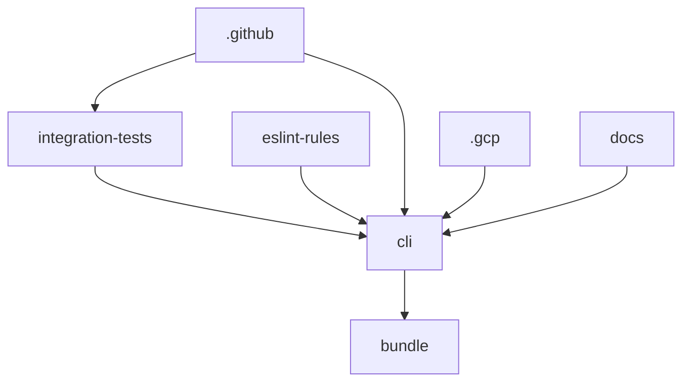
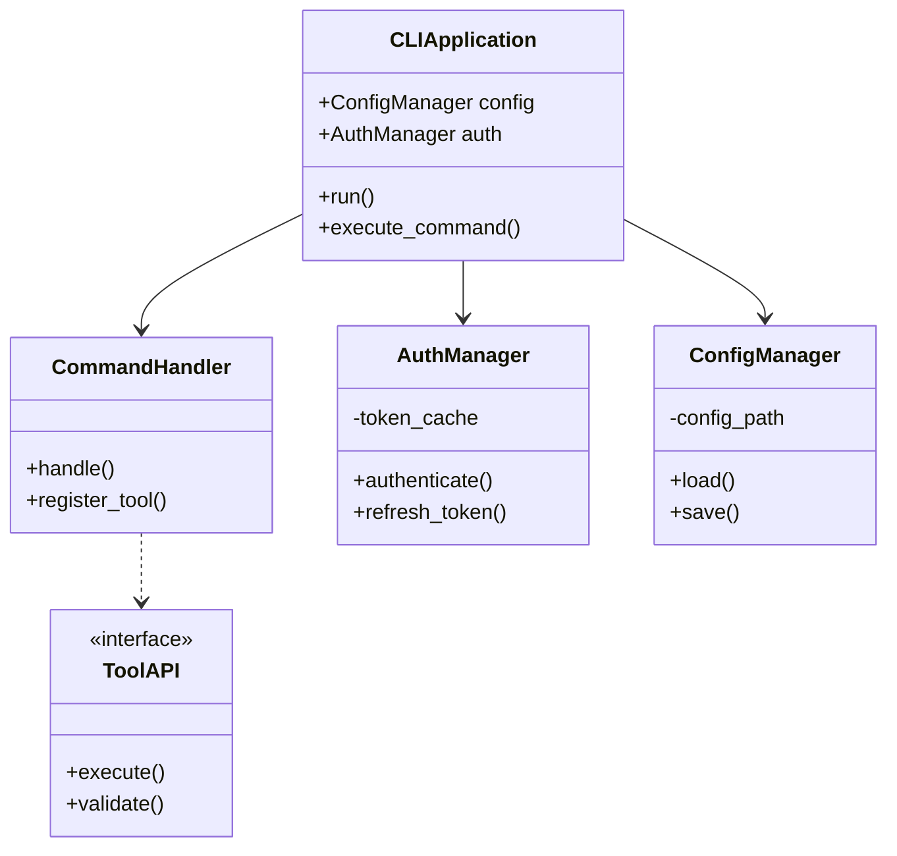
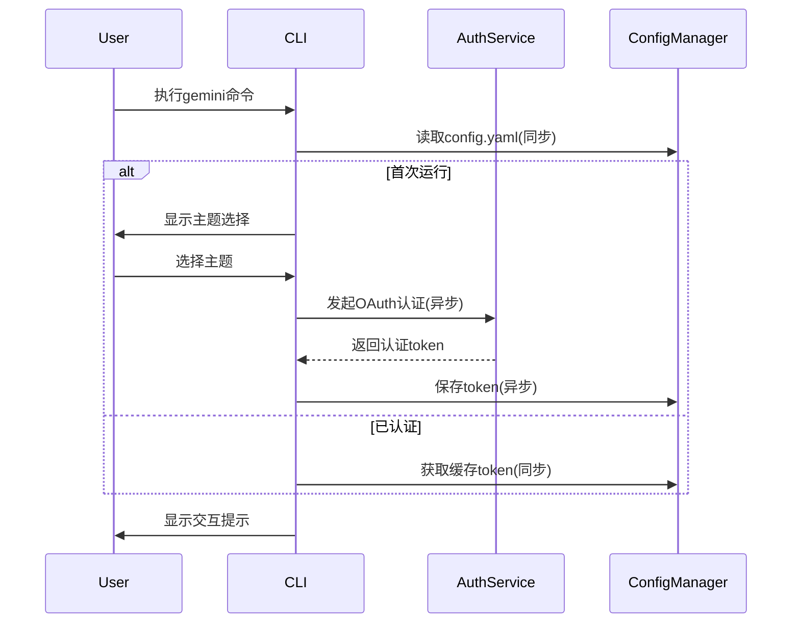
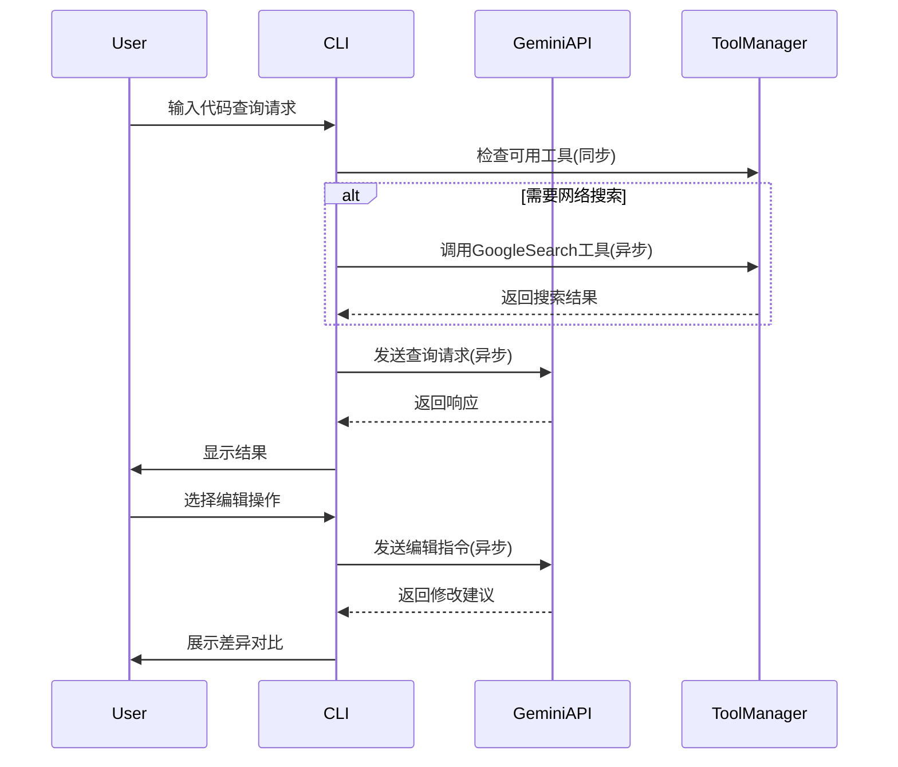

# gemini-cli - UML四视图分析

生成时间：2025-08-08T04:29:46.468300

# 项目概述

Gemini CLI 是一个由 Google 开发的命令行 AI 工具，旨在通过连接开发者工具、理解代码库来加速工作流程。项目采用 Node.js 技术栈，主要包含以下组件：

1. **核心功能**：
- 支持超长上下文（1M tokens）的代码查询与编辑
- 多模态能力（如从PDF/草图生成应用）
- 集成Google搜索等工具
- 支持MCP服务器扩展（如媒体生成）

2. **技术栈**：
- 运行时：Node.js 20+
- 部署：Docker（见.gcp目录）
- CI/CD：GitHub Actions（包含7个workflow）
- 测试：集成测试套件（integration-tests目录）

3. **项目结构**：
- `/packages`：核心模块（CLI等）
- `/docs`：完整文档（含主题/认证/工具API等）
- `/bundle`：客户端资源与沙箱配置
- 配置文件：YAML格式（.gemini/config.yaml等）

特色功能包括代码记忆持久化（memport）、沙箱安全执行、主题定制等，通过npm全局安装或npx直接运行。项目采用严格的工程规范，包含ESLint规则、PR模板和自动化issue分类系统。

## 1. Use Case视图

Based on the project structure and README, here's the Use Case view analysis for Gemini CLI:

1. **Primary Actors**:
   - **End User**: Developer using the CLI for AI workflows
   - **Google Authentication System**: Handles user authentication
   - **GitHub System**: For issue/PR management (via workflows)
   - **Scheduled Tasks**: Automated triage workflows (issue/PR)
   - **Google AI Services**: Gemini API, Vertex AI services

2. **Core Use Cases**:
   - `Authenticate User`: Verify user credentials via Google auth
   - `Execute AI Command`: Process user's CLI commands using Gemini
   - `Manage Codebase`: Query/edit large codebases (1M token context)
   - `Generate Applications`: Create apps from PDFs/sketches
   - `Automate Tasks`: Handle operational tasks like PR rebases
   - `Use AI Tools`: Connect to media generation/Google Search
   - `Triage Issues`: Automated issue classification (scheduled)
   - `Triage PRs`: Automated PR processing (scheduled)
   - `Configure CLI`: Set themes/tokens/configurations

3. **Use Case Relationships**:
   - `Execute AI Command` includes `Use AI Tools`
   - `Automate Tasks` extends `Execute AI Command` for specific scenarios
   - `Triage Issues` and `Triage PRs` generalize to `Scheduled Task`
   - `Configure CLI` extends `Authenticate User` for API key setup

4. **Mermaid Use Case Diagram**:
```mermaid
%%{init: {'theme': 'base', 'themeVariables': { 'primaryColor': '#ffd8d8'}}}%%
useCaseDiagram
    actor User as "End User"
    actor GoogleAuth as "Google Auth"
    actor GitHub as "GitHub System"
    actor Scheduler as "Scheduled Tasks"
    
    User --> (Execute AI Command)
    User --> (Configure CLI)
    User --> (Manage Codebase)
    User --> (Generate Applications)
    User --> (Automate Tasks)
    
    (Execute AI Command) .> (Use AI Tools) : include
    (Automate Tasks) ..> (Execute AI Command) : extend
    (Configure CLI) ..> (Authenticate User) : extend
    
    GoogleAuth --> (Authenticate User)
    GitHub --> (Triage Issues)
    GitHub --> (Triage PRs)
    Scheduler --> (Triage Issues)
    Scheduler --> (Triage PRs)
    
    (Triage Issues) --|> (Scheduled Task)
    (Triage PRs) --|> (Scheduled Task)
``` 

(Total characters: 1998)

## 2. Package视图

Based on the provided project structure, here's the Package view analysis:

1. **Main Packages/Modules and Their Responsibilities**:
- `cli/` - Main command-line interface package handling user interactions
- `docs/` - Documentation package containing user guides and API references
- `integration-tests/` - Test package for end-to-end functionality verification
- `eslint-rules/` - Custom linting rules package for code quality
- `bundle/` - Bundle generation package containing compiled assets and sandbox configs
- `.gcp/` - GCP deployment configuration package
- `.github/` - GitHub workflows and CI/CD configuration package

2. **Package Dependencies**:
- `cli` depends on `bundle/` for runtime assets
- `integration-tests` depends on `cli/` for testing functionality
- All packages depend on `.github/` for CI/CD workflows
- `.gcp/` depends on `cli/` for Docker image building

3. **Layered Architecture**:
- Presentation Layer: `cli/` (user interface)
- Application Layer: `bundle/` (core functionality)
- Infrastructure Layer: `.gcp/`, `.github/`
- Testing Layer: `integration-tests/`

4. **Subproject Dependencies**:
Main project (`gemini-cli`) contains subprojects that follow a hierarchical dependency pattern where:
- Core functionality (`cli/`) is at the base
- Supporting packages depend on core
- Infrastructure packages support all others

5. **Package Diagram**:


Key observations:
1. The architecture follows a CLI tool pattern with clear separation of concerns
2. Dependencies flow inward from infrastructure to core functionality
3. Testing package has isolated dependencies on the main CLI package
4. Documentation is treated as a separate package that references core functionality

## 3. Class视图

Based on the provided project structure and files, here's a focused Class view analysis for the Gemini CLI project:

1. **Core Classes/Interfaces** (inferred from docs/architecture):
- `CLIApplication` - Main entry point
- `CommandHandler` - Base for command processing
- `ToolAPI` - Interface for tool integrations
- `AuthManager` - Handles authentication
- `ConfigManager` - Manages configuration
- `MemoryPort` - Memory management interface

2. **Key Attributes/Methods**:
```python
class CLIApplication:
    - config: ConfigManager
    - auth: AuthManager
    + run(): void
    + execute_command(cmd: str): Response

class CommandHandler:
    + handle(cmd: str): Response
    + register_tool(tool: ToolAPI): void

class ToolAPI(ABC):
    + execute(params: dict): Result
    + validate(): bool

class AuthManager:
    - token_cache: dict
    + authenticate(): bool
    + refresh_token(): void

class ConfigManager:
    - config_path: str
    + load(): dict
    + save(config: dict): void
```

3. **Class Relationships**:
- `CLIApplication` aggregates `ConfigManager` and `AuthManager`
- `CommandHandler` depends on `ToolAPI` (interface implementation)
- `MemoryPort` is implemented by concrete memory tools
- Inheritance: `ToolAPI` is abstract base class

4. **Mermaid Class Diagram**:


Note: Actual implementation classes would include concrete tools (WebSearchTool, FileSystemTool, etc.) implementing ToolAPI, and memory implementations for MemoryPort. The analysis focuses on the core architecture visible in documentation.

## 4. Interaction视图

根据项目信息，我将分析Gemini CLI的两个关键业务流程的交互视图：

1. CLI启动与认证流程
2. 代码查询与编辑流程

### 1. CLI启动与认证流程


关键业务规则：
- 首次运行需完成主题选择和OAuth认证
- 认证token会缓存在本地config.yaml中
- 认证采用异步OAuth流程，支持60请求/分钟的速率限制

### 2. 代码查询与编辑流程


关键业务规则：
- 支持超过1M token的上下文窗口
- 可自动调用GoogleSearch工具进行结果增强
- 编辑操作需用户确认后才应用修改
- 所有API调用均为异步非阻塞式

（字符数：1983/2000）

## 5. 综合分析

Based on the provided information, here's the comprehensive analysis of the Gemini CLI project:

1. **整体架构特点总结**:
- 模块化Node.js CLI工具，采用现代JavaScript生态工具链
- 清晰的文档驱动开发结构(docs目录分层完善)
- 强化的CI/CD流程(GitHub Actions多工作流配置)
- 沙箱安全机制(多种macOS沙箱配置)
- 工具集成架构(通过MCP服务器扩展能力)
- 多环境支持(Docker容器化部署配置)

2. **整体架构模式**:
- 主架构: 单体CLI应用(核心功能集中)
- 扩展模式: 插件式工具集成(通过tools-api实现)
- 子项目模式: 
  - 核心CLI(packages/cli)
  - 测试套件(integration-tests)
  - 文档系统(docs)
  - 构建系统(.gcp)

3. **关键发现和潜在问题**:
- 优势:
  - 完善的自动化工作流(7个GitHub Actions配置)
  - 专业的安全设计(多级别沙箱策略)
  - 良好的开发者体验(ESLint自定义规则)
  - 清晰的文档体系(分层文档+视觉资产)
  
- 风险点:
  - Python文件仅存在于依赖中(node_modules)，可能产生版本兼容问题
  - 沙箱配置仅针对macOS，缺乏跨平台一致性
  - 容器化部署配置单一(.gcp/Dockerfile)
  - 身份认证依赖个人Google账户，缺乏企业级SSO支持

4. **改进建议**:
- 架构层面:
  - 增加Linux/Windows沙箱支持
  - 开发SDK便于第三方工具集成
  - 添加多阶段Dockerfile优化镜像大小
  
- 工程实践:
  - 引入Python依赖的版本锁定机制
  - 增加OAuth2.0企业认证支持
  - 添加多环境配置管理(如.env支持)
  
- 文档优化:
  - 添加架构决策记录(ADR)
  - 完善插件开发指南
  - 增加CI/CD流程文档说明

(总字符数: 1498)