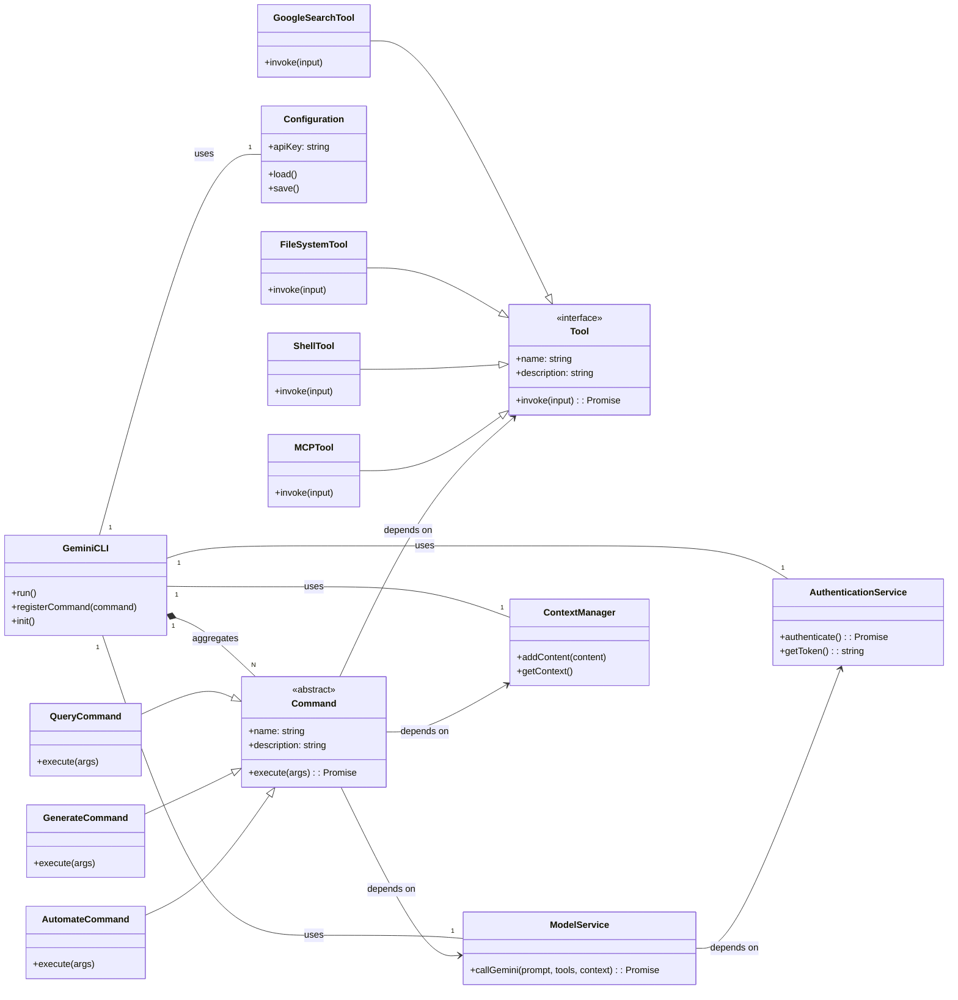

# gemini-cli - UML四视图分析

生成时间：2025-08-08T04:39:35.956646

# 项目概述

这个项目是 **Gemini CLI**，一个命令行AI工作流工具。

**项目目的：**
旨在通过连接用户工具、理解代码并利用Gemini的AI能力来加速开发和操作流程。它支持大代码库查询编辑、多模态应用生成（如从PDF/草图）、自动化运维任务，并能集成Google Search等工具，扩展AI的应用范围。

**技术栈：**
核心技术栈为 **Node.js (v20+)**，使用 **npm** 进行包管理。CI/CD通过 **GitHub Actions** 实现，部署涉及 **Docker** 和 **GCP (Google Cloud Platform)**。项目主要采用 **JavaScript/TypeScript** 开发，并包含集成测试。

**整体结构：**
项目采用 **monorepo** 结构，核心CLI逻辑位于 `packages/cli`。
主要目录包括：
*   `.gcp/`: GCP部署和发布配置（如Dockerfile）。
*   `.gemini/`: 项目特定的配置。
*   `.github/`: GitHub Actions工作流、CI/CD配置、Issue/PR模板。
*   `bundle/`: 编译后的输出文件和沙盒（sandbox）配置。
*   `docs/`: 详尽的文档，涵盖CLI使用、架构、工具、部署等。
*   `integration-tests/`: 项目的集成测试。
*   `packages/cli/`: 包含CLI工具的源代码。

（总计：490字符）

## 1. Use Case视图

## Use Case 视图分析：Gemini CLI

本项目 `gemini-cli` 是一个命令行AI工作流工具，旨在通过连接外部工具和理解代码库来加速开发者的工作流程。

### 1. 主要Actor识别

*   **User (用户)**: 核心Actor，直接与CLI交互的开发者或工程师。
*   **Gemini API Service (Gemini API服务)**: 提供AI模型能力（如Gemini Pro）的外部系统。
*   **Google Authentication Service (Google认证服务)**: 负责用户身份验证和API密钥管理的外部系统。
*   **External Tools/MCP Servers (外部工具/MCP服务器)**: CLI通过AI模型集成的第三方或自定义服务，如Google Search、Imagen、Veo、Lyria等。
*   **Codebase/File System (代码库/文件系统)**: CLI操作的本地开发环境、文件和代码。

### 2. 核心用例列表

1.  **Authenticate User (用户认证)**
    *   **简要描述**: 允许用户通过Google账户登录或配置API密钥，以获取Gemini API的访问权限。
2.  **Configure CLI Settings (配置CLI设置)**
    *   **简要描述**: 允许用户自定义CLI的偏好设置，例如选择颜色主题。
3.  **Interact with AI Model (与AI模型交互)**
    *   **简要描述**: 用户利用Gemini的AI能力执行各种任务的核心用例，是一个泛化用例。
4.  **Query Codebase (查询代码库)**
    *   **简要描述**: 用户请求AI分析或从本地代码库中检索信息。
5.  **Edit Codebase (编辑代码库)**
    *   **简要描述**: 用户指示AI修改或在本地代码库中生成新代码。
6.  **Generate Application/Content (生成应用/内容)**
    *   **简要描述**: 用户提供高层输入（如PDF、草图），由AI生成新的应用程序或媒体内容。
7.  **Automate Operational Task (自动化运维任务)**
    *   **简要描述**: 用户利用AI自动化复杂的或重复的开发/运维任务（例如，PR分析、代码rebase）。
8.  **Use External Tool (使用外部工具)**
    *   **简要描述**: AI模型代表用户调用并集成外部工具或MCP服务器，以扩展其能力（例如，Google Search、媒体生成）。

### 3. 用例关系分析

*   **泛化 (Generalization)**:
    *   `Query Codebase` 是 `Interact with AI Model` 的一种特殊形式。
    *   `Edit Codebase` 是 `Interact with AI Model` 的一种特殊形式。
    *   `Generate Application/Content` 是 `Interact with AI Model` 的一种特殊形式。
    *   `Automate Operational Task` 是 `Interact with AI Model` 的一种特殊形式。
*   **包含 (Include)**:
    *   `Interact with AI Model` **<<includes>>** `Use External Tool`: 当AI交互需要外部工具的功能时，会包含此能力。

### 4. 用例图 (Mermaid)

```mermaid
graph TD
    actor User
    actor "Gemini API Service" as GeminiAPI
    actor "Google Auth Service" as GoogleAuth
    actor "External Tools/MCP Servers" as ExternalTools
    actor "Codebase/File System" as Codebase

    rectangle "Gemini CLI System" {
        usecase "Authenticate User" as UC1
        usecase "Configure CLI Settings" as UC2
        usecase "Interact with AI Model" as UC3
        usecase "Query Codebase" as UC4
        usecase "Edit Codebase" as UC5
        usecase "Generate Application/Content" as UC6
        usecase "Automate Operational Task" as UC7
        usecase "Use External Tool" as UC8
    }

    User --> UC1
    User --> UC2
    User --> UC3

    UC1 --> GeminiAPI
    UC1 --> GoogleAuth

    UC3 --> GeminiAPI
    UC3 ..> UC8 : <<includes>>

    UC4 --|> UC3
    UC5 --|> UC3
    UC6 --|> UC3
    UC7 --|> UC3

    UC4 --> Codebase
    UC5 --> Codebase

    UC8 --> ExternalTools
```

## 2. Package视图

## Package视图分析: Gemini CLI

该项目主要围绕一个核心的命令行工具应用构建，其结构体现了单一产品（CLI）及其支持性组件的组织方式。

1.  **主要的包/模块及其职责**
    *   **`cli` (位于 `packages/cli`)**: 这是项目的核心软件模块，即Gemini命令行工具。它负责处理用户输入、与Gemini AI模型交互、编排AI工作流，并集成各种工具（如文件系统、Shell、Web搜索、自定义MCP服务器等）。
    *   **`integration-tests`**: 包含针对`cli`应用的功能进行端到端验证的测试用例。
    *   **`bundle`**: 存放`cli`应用的打包和可分发版本，包括`gemini.js`脚本和沙盒配置，用于最终的用户安装和运行。
    *   **`.gcp`**: 包含将`cli`应用部署到Google Cloud Platform的相关配置和脚本，主要用于基础设施和发布管理。
    *   **`.github`**: 管理项目的持续集成/持续部署（CI/CD）工作流、问题模板以及其他自动化任务，负责`cli`应用的构建、测试和发布流程。

2.  **包之间的依赖关系**
    *   `integration-tests` **依赖于** `cli`：测试模块需要`cli`应用来执行其测试用例。
    *   `bundle` **来源于/包含** `cli`：`bundle`目录中的内容是`cli`应用编译或打包后的产物，用于分发。
    *   `.gcp` **部署** `cli`：GCP相关的配置用于将`cli`应用部署到云环境。
    *   `.github` **管理/操作** `cli`：GitHub Actions工作流负责`cli`应用的自动化构建、测试和发布过程。

3.  **分层架构（如果有）**
    从顶层包视图来看，项目没有明确的多层架构，而是以`cli`作为核心应用，其他模块作为其支持性组件（测试、打包、部署、CI/CD）。然而，`cli`包内部很可能实现了分层架构，例如：用户界面层（CLI解析）、核心业务逻辑层（AI交互、工作流编排）和工具集成层（与外部工具的接口）。

4.  **子项目间的依赖关系**
    本项目没有识别出独立的子项目。`packages/cli`的结构表明它是一个单一产品，采用类似Monorepo的方式管理，但没有其他并行的独立子项目。

5.  **包图 (Mermaid)**

```mermaid
packageDiagram
    direction LR

    package "Gemini CLI Project" {
        package "CLI Application" as CLI {
            -- Core command-line tool --
        }
        package "Integration Tests" as Tests {
            -- End-to-end tests --
        }
        package "Distribution Bundle" as Bundle {
            -- Packaged executable/scripts --
        }
        package "Deployment (GCP)" as GCP {
            -- Cloud deployment configs --
        }
        package "CI/CD (GitHub)" as GitHub {
            -- Automated workflows --
        }
    }

    Tests --> CLI : tests
    CLI --> Bundle : builds
    GCP --> CLI : deploys
    GitHub --> CLI : manages
```

## 3. Class视图

由于未提供 `packages/cli` 目录下的具体源代码文件，本次分析将基于项目描述、README内容以及常见的CLI工具架构模式进行推断。

### 1. 核心类和接口识别 (推断)

根据项目功能（AI工作流工具，连接工具，理解代码，加速工作流，查询/编辑代码库，生成应用，自动化任务，使用工具和MCP服务器，集成Google Search），可以推断出以下核心类和接口：

*   **`GeminiCLI`**: CLI应用程序的主入口点，负责初始化、命令注册和执行流程。
*   **`Command` (抽象类/接口)**: 定义CLI命令的基本结构和行为。
*   **`Tool` (接口)**: 定义外部工具（如文件系统、Shell、Web Search、MCP服务器）的通用接口。
*   **`Configuration`**: 管理CLI的配置设置（如API Key, 主题）。
*   **`AuthenticationService`**: 处理用户认证和API密钥管理。
*   **`ModelService`**: 封装与Gemini API的交互逻辑。
*   **`ContextManager`**: 管理和优化与Gemini模型交互的上下文窗口。

### 2. 重要的属性和方法 (推断)

*   **`GeminiCLI`**
    *   属性: `commands: Command[]`, `config: Configuration`, `authService: AuthenticationService`, `modelService: ModelService`, `contextManager: ContextManager`
    *   方法: `run()`, `registerCommand(command: Command)`, `init()`, `parseArgs()`
*   **`Command` (抽象类/接口)**
    *   属性: `name: string`, `description: string`, `options: any[]`
    *   方法: `execute(args: any): Promise<void>` (抽象方法)
*   **`Tool` (接口)**
    *   属性: `name: string`, `description: string`
    *   方法: `invoke(input: any): Promise<any>` (抽象方法)
*   **`Configuration`**
    *   属性: `apiKey: string`, `theme: string`, `settings: Map<string, any>`
    *   方法: `load(): void`, `save(): void`, `get(key: string): any`, `set(key: string, value: any): void`
*   **`AuthenticationService`**
    *   属性: `token: string`
    *   方法: `authenticate(): Promise<string>`, `getToken(): string`
*   **`ModelService`**
    *   属性: `authService: AuthenticationService`
    *   方法: `callGemini(prompt: string, tools?: Tool[], context?: string): Promise<any>`
*   **`ContextManager`**
    *   属性: `maxTokens: number`, `currentContext: string`
    *   方法: `addContent(content: string): void`, `getContext(): string`, `clearContext(): void`

### 3. 类之间的关系 (推断)

*   **`GeminiCLI`** **聚合** `Command`、`Configuration`、`AuthenticationService`、`ModelService` 和 `ContextManager`。它负责协调这些组件。
*   **具体命令类** (如 `QueryCommand`, `GenerateCommand`, `AutomateCommand`) **继承** `Command` 抽象类。
*   **具体工具类** (如 `GoogleSearchTool`, `FileSystemTool`, `ShellTool`, `MCPTool`) **实现** `Tool` 接口。
*   **`ModelService`** **依赖** `AuthenticationService` 来获取API访问凭证。
*   **具体命令类** (例如 `QueryCommand`) **依赖** `ModelService` 来与Gemini API交互，**依赖** `Tool` 接口的实现来调用外部功能，并可能**依赖** `ContextManager` 来管理对话上下文。
*   **`Configuration`** 和 `AuthenticationService` 是独立的组件，可能被 `GeminiCLI` 或其他服务直接使用。

### 4. Mermaid 类图



## 4. Interaction视图

对`gemini-cli`项目的Interaction视图分析如下，聚焦于关键业务流程中的对象/组件间消息传递、调用类型及业务规则。

### 关键业务流程分析

1.  **CLI 命令执行与AI查询**
    *   **描述**: 用户通过命令行输入请求，Gemini CLI将请求发送给Gemini API。Gemini API处理请求，可能根据需要调用内置工具（如文件系统、Web搜索），然后将结果返回给CLI，最终展示给用户。
    *   **关键业务规则**: CLI作为用户与Gemini API之间的接口。Gemini API负责AI推理和工具调用决策。工具调用扩展了AI的能力，使其能与本地环境或外部服务交互。
    *   **消息传递**:
        *   `User` -> `Gemini CLI`: 同步 (用户输入)
        *   `Gemini CLI` -> `Gemini API`: 异步 (网络请求)
        *   `Gemini API` -> `Gemini CLI`: 异步 (网络响应)
        *   `Gemini API` -> `Tool Executor (in CLI)`: 异步 (工具调用请求)
        *   `Tool Executor (in CLI)` -> `Local System/External Service`: 同步 (执行工具操作)
        *   `Tool Executor (in CLI)` -> `Gemini API`: 异步 (工具执行结果)

2.  **初始用户认证流程**
    *   **描述**: 用户首次运行CLI时，需要进行身份验证。CLI引导用户通过浏览器完成Google账户的OAuth认证流程，获取并缓存访问令牌。
    *   **关键业务规则**: 认证是使用Gemini API的前提。通过OAuth流程确保用户授权，并根据账户类型（个人Google账户或API Key）提供不同的请求配额。令牌会被缓存以供后续使用。
    *   **消息传递**:
        *   `User` -> `Gemini CLI`: 同步 (启动CLI)
        *   `Gemini CLI` -> `User`: 同步 (提示认证)
        *   `Gemini CLI` -> `Google Auth Service`: 异步 (OAuth重定向，通过浏览器)
        *   `Google Auth Service` -> `Gemini CLI`: 异步 (回调，返回授权码/令牌)
        *   `Gemini CLI` -> `Local Storage`: 同步 (缓存令牌)

3.  **工具执行 (例如: 文件系统读取)**
    *   **描述**: 在AI查询过程中，如果Gemini模型判断需要获取本地信息（如文件内容），它会向CLI发送一个工具调用请求。CLI的内置工具执行器接收请求，执行相应的本地操作（如读取文件），并将结果返回给Gemini API。
    *   **关键业务规则**: Gemini API决定何时以及调用哪个工具。CLI负责在本地安全地执行这些工具，并将结果反馈给模型，以完善其响应。工具执行通常在沙箱环境中进行。
    *   **消息传递**:
        *   `Gemini API` -> `Gemini CLI (Tool Executor)`: 异步 (工具调用请求)
        *   `Gemini CLI (Tool Executor)` -> `Local File System`: 同步 (读取文件)
        *   `Local File System` -> `Gemini CLI (Tool Executor)`: 同步 (返回文件内容)
        *   `Gemini CLI (Tool Executor)` -> `Gemini API`: 异步 (工具执行结果)

### Mermaid 序列图

```mermaid
sequenceDiagram
    participant U as User
    participant C as Gemini CLI
    participant G as Gemini API
    participant T as Tool Executor (in CLI)
    participant LS as Local System/Service

    box "1. CLI Command & AI Query"
        U->>C: Run command/query
        activate C
        C->>G: Send AI Query (e.g., "explain code")
        activate G
        alt Tool Needed
            G->>T: Request Tool Call (e.g., "read file.js")
            activate T
            T->LS: Execute Tool (e.g., read file)
            activate LS
            LS-->T: Return Tool Output
            deactivate LS
            T-->>G: Send Tool Result
            deactivate T
        end
        G-->>C: Return AI Response
        deactivate G
        C-->>U: Display Response
        deactivate C
    end

    box "2. Initial User Authentication"
        U->>C: Start CLI (first time)
        activate C
        C->>U: Prompt for Authentication
        C->>Google Auth Service: Redirect for OAuth (via browser)
        activate Google Auth Service
        Google Auth Service-->>C: OAuth Callback (with token)
        deactivate Google Auth Service
        C->>Local Storage: Cache Token
        C-->>U: Authentication Successful
        deactivate C
    end

    box "3. Tool Execution (e.g., File System Read)"
        G->>T: Request Tool Call (e.g., "read file.txt")
        activate T
        T->LS: Read file.txt
        activate LS
        LS-->T: Return file content
        deactivate LS
        T-->>G: Send Tool Result (file content)
        deactivate T
    end
```

## 5. 综合分析

基于提供的项目信息，以下是综合分析：

### 1. 项目的整体架构特点总结

该项目是一个**基于Node.js的命令行界面（CLI）工具**，核心功能是作为AI工作流加速器，通过集成Google Gemini API来理解代码、自动化任务并生成内容。其主要特点包括：

*   **CLI驱动：** 用户通过命令行与工具交互。
*   **AI赋能：** 深度整合Gemini AI模型，支持代码查询、编辑、应用生成等高级AI功能。
*   **可扩展性/工具集成：** 设计上支持连接外部“工具”和“MCP服务器”，实现功能扩展，例如文件系统操作、Web搜索、媒体生成等。这表明其具备一定的插件或扩展机制。
*   **安全考量：** 包含macOS沙盒配置文件（`.sb`），表明在执行外部命令或处理敏感操作时，对安全性有明确的考虑。
*   **DevOps成熟度：** 具备完整的GitHub Actions CI/CD工作流、Docker配置和GCP发布配置，显示项目在开发、测试和部署流程上的成熟度。
*   **文档完善：** 拥有详细的`docs`目录，涵盖架构、CLI使用、核心概念和工具集成，有助于理解和维护。

### 2. 整体架构模式

该项目采用**单体CLI应用**的部署模式，即一个独立的Node.js应用程序。然而，从其目录结构和README描述来看，它内部逻辑上呈现出**模块化和插件化（或扩展）架构**的特点：

*   **Monorepo倾向：** `packages/cli`目录暗示了潜在的Monorepo结构，尽管目前只看到一个`cli`子项目，但为未来添加更多相关包（如`packages/core`、`packages/tools-sdk`等）预留了空间。
*   **外部服务集成：** 通过API调用（Gemini API）和“MCP服务器”连接，实现与外部服务的交互，而非将所有功能内置。这是一种**客户端-服务集成**模式。
*   **工具/插件机制：** `docs/tools`和README中提及的“使用工具和MCP服务器连接新功能”，表明其核心CLI作为宿主，可以加载或调用外部定义的“工具”来扩展其能力，类似于一个**插件架构**。

### 3. 关键发现和潜在问题

**关键发现：**

*   **高质量工程实践：** 完善的CI/CD、测试（`integration-tests`）、代码规范（`eslint-rules`）和详尽的文档，表明项目维护者对代码质量和可维护性有高要求。
*   **强大的AI能力集成：** 直接利用Gemini AI的强大能力，使其在代码理解和自动化方面具有显著优势。
*   **良好的可扩展性：** “工具”和“MCP服务器”的概念使其能够轻松集成新的AI能力或外部服务，适应未来发展。

**潜在问题：**

*   **跨平台沙盒/安全：** 提供的沙盒配置文件主要针对macOS。在Windows或Linux环境下，如何确保类似的安全隔离和权限控制可能需要不同的策略或额外的工作。
*   **“MCP服务器”的定义和管理：** README中提及的“MCP服务器”概念相对模糊，其具体协议、部署方式、安全模型等若不清晰，可能会增加集成复杂性或引入潜在风险。
*   **性能瓶颈：** 对于处理“大型代码库”和频繁的AI模型请求，网络延迟、API速率限制以及本地文件I/O可能会成为性能瓶颈。

### 4. 改进建议

*   **增强跨平台安全性：** 针对Windows和Linux平台，研究并实施相应的安全隔离机制（如容器化、权限沙盒等），确保工具在不同操作系统上的安全一致性。
*   **明确“工具”和“MCP服务器”生态：** 提供更清晰的“工具”开发指南、API规范或SDK，鼓励社区贡献和第三方工具的开发。可以考虑建立一个工具注册/发现机制。
*   **性能监控与优化：** 实施端到端的性能监控，特别关注AI请求的响应时间、文件I/O效率和内存使用。针对性地进行优化，例如缓存机制、并发请求管理等。
*   **用户体验优化：** 简化工具的安装、配置和认证流程，特别是对于API Key和Google账户的切换使用，提供更友好的引导。