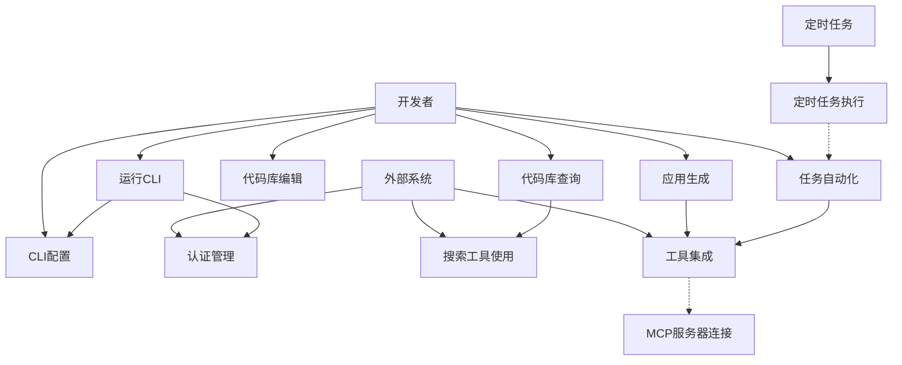
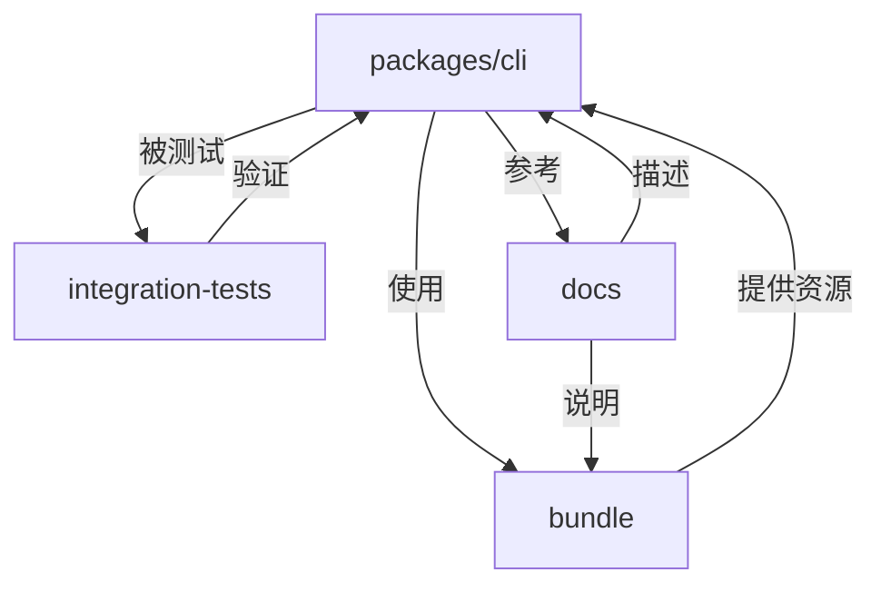
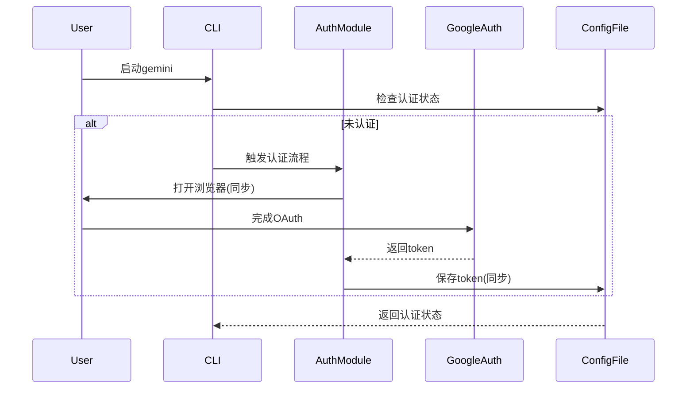
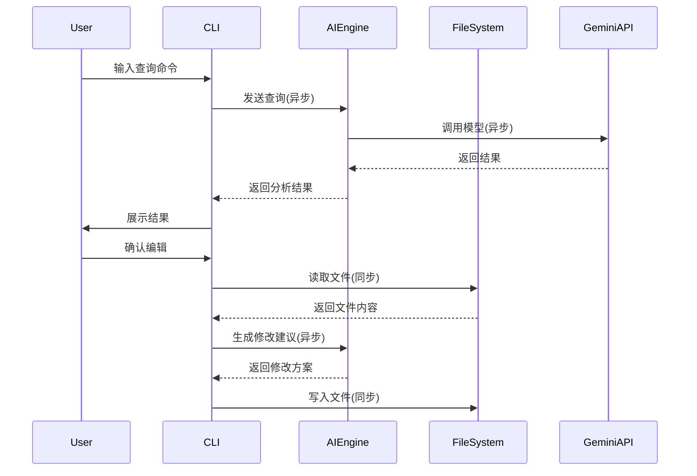

# gemini-cli - UML四视图分析

生成时间：2025-08-08T02:56:00.833920

# 项目概述


CLI 是一个命令行AI工作流工具，旨在连接开发者工具、理解代码并加速开发流程。其核心功能包括：查询和编辑大型代码库（支持1M token上下文）、基于PDF/草图生成应用（多模态能力）、自动化操作任务（如处理PR/rebase），以及通过工具和MCP服务器扩展能力（如媒体生成、Google Search集成）。

技术栈以Node.js（需v20+）为基础，采用JavaScript/TypeScript开发，依赖npm包管理。项目结构模块化：`packages/cli`为核心CLI逻辑；`docs`提供详细文档；`integration-tests`覆盖端到端测试；`.github/workflows`管理CI/CD流程（如自动化PR/issue分类）；`.gcp`和`.gemini`分别处理Docker部署与用户配置。安全方面通过macOS沙箱文件（`bundle/`目录）增强隔离。整体设计注重可扩展性，支持API密钥认证和主题定制。

## 1. Use Case视图


Use Case视图分析

#### 1. 主要Actor
- **开发者**：使用CLI工具进行代码交互、自动化任务和配置管理
- **外部系统**：
  - Google API（认证、模型请求、搜索工具）
  - GitHub（PR/Issue处理、自动化工作流）
  - MCP服务器（扩展工具功能）
- **定时任务**：GitHub Actions触发的自动化任务（如issue分类、PR分类）

#### 2. 核心用例
| 用例名称 | 简要描述 |
|----------|----------|
| 运行CLI | 启动命令行工具并初始化环境 |
| 认证管理 | 通过Google账户或API密钥进行身份验证 |
| 代码库查询 | 在大型代码库中执行搜索和分析 |
| 代码库编辑 | 修改和更新代码文件 |
| 应用生成 | 从PDF/草图创建新应用（多模态功能） |
| 任务自动化 | 自动化PR处理、rebase等运维任务 |
| 工具集成 | 连接MCP服务器和扩展工具（如媒体生成） |
| 搜索工具使用 | 使用Google Search进行查询增强 |
| CLI配置 | 管理主题、API密钥等配置项 |
| 定时任务执行 | 执行GitHub Actions中的自动化分类任务 |

#### 3. 用例关系
- **包含关系（<<include>>）**：
  - `运行CLI` → `认证管理`（启动时必须认证）
  - `运行CLI` → `CLI配置`（首次运行需配置）
  - `任务自动化` → `工具集成`（依赖外部工具）
  
- **扩展关系（<<extend>>）**：
  - `代码库查询` → `搜索工具使用`（可选Google Search增强）
  - `应用生成` → `工具集成`（可选媒体生成扩展）
  
- **泛化关系（<<generalization>>）**：
  - `任务自动化` ← `定时任务执行`（定时任务是其子类）
  - `工具集成` ← `MCP服务器连接`（具体实现方式）

#### 4. 用例图（Mermaid）


## 2. Package视图


### Package视图分析

#### 1. 主要包/模块及职责
- **`packages/cli`**：核心命令行工具包，负责用户交互、命令解析、API调用和工具集成
- **`bundle`**：资源打包模块，包含JavaScript运行时和macOS沙箱配置文件
- **`integration-tests`**：集成测试模块，验证文件系统、Shell命令、MCP服务器等核心功能
- **`docs`**：文档模块，包含CLI使用指南、核心架构说明和工具API文档

#### 2. 包依赖关系
- `cli`包依赖`bundle`中的运行时资源和沙箱配置
- `integration-tests`依赖`cli`包的功能实现进行端到端测试
- `docs`模块独立存在，为所有包提供文档支持

#### 3. 分层架构
```
┌─────────────────┐
│   CLI Interface │  ← 用户交互层 (packages/cli)
├─────────────────┤
│  Core Services  │  ← 业务逻辑层 (bundle运行时)
├─────────────────┤
│  Tool Plugins   │  ← 工具扩展层 (集成测试验证)
└─────────────────┘
```

#### 4. 子项目依赖关系
无独立子项目，所有模块属于同一主项目

#### 5. 包图 (Mermaid)


## 3. Class视图

### Class视图分析

#### 1. 核心类和接口
- **核心类**：
  - `GeminiCLI`：主入口类，管理CLI生命周期
  - `ConfigManager`：处理配置文件（`.gemini/config.yaml`）
  - `AuthManager`：处理用户认证（Google登录/API密钥）
  - `ToolExecutor`：执行工具命令（文件系统/Shell/Web搜索等）
  - `ModelClient`：与Gemini API交互
- **核心接口**：
  - `ITool`：工具接口（文件系统/Shell等工具实现）
  - `IConfigProvider`：配置提供接口

#### 2. 重要属性和方法
- **GeminiCLI**:
  - 属性：`theme`, `authManager`, `toolExecutor`
  - 方法：`start()`, `processCommand()`, `renderUI()`
- **ConfigManager**:
  - 属性：`configPath`, `themeSettings`
  - 方法：`loadConfig()`, `saveTheme()`
- **AuthManager**:
  - 属性：`apiKey`, `tokenCache`
  - 方法：`authenticate()`, `refreshToken()`
- **ToolExecutor**:
  - 属性：`registeredTools`
  - 方法：`execute()`, `registerTool()`
- **ModelClient**:
  - 属性：`apiEndpoint`, `modelVersion`
  - 方法：`sendPrompt()`, `streamResponse()`

#### 3. 类关系
- **继承/实现**：
  - `FileSystemTool`、`ShellTool` 实现 `ITool` 接口
- **组合**：
  - `GeminiCLI` 包含 `ConfigManager` 和 `AuthManager`（强依赖）
- **聚合**：
  - `ToolExecutor` 聚合多个 `ITool` 实例
- **关联**：
  - `ModelClient` 关联 `AuthManager`（获取认证令牌）
  - `ToolExecutor` 关联 `ModelClient`（工具结果需模型处理）
- **依赖**：
  - `GeminiCLI` 依赖 `ToolExecutor` 和 `ModelClient`

#### 4. 类图（Mermaid）
```mermaid
classDiagram
    class GeminiCLI {
        -string theme
        -AuthManager authManager
        -ToolExecutor toolExecutor
        +start()
        +processCommand()
    }

    class ConfigManager {
        -string configPath
        -Map themeSettings
        +loadConfig()
        +saveTheme()
    }

    class AuthManager {
        -string apiKey
        -string tokenCache
        +authenticate()
        +refreshToken()
    }

    class ToolExecutor {
        -List~ITool~ registeredTools
        +execute(toolName)
        +registerTool(tool)
    }

    class ModelClient {
        -string apiEndpoint
        -string modelVersion
        +sendPrompt(prompt)
        +streamResponse()
    }

    interface ITool {
        +execute(params)
    }

    class FileSystemTool {
        +readFile(path)
        +writeFile(path, content)
    }

    class ShellTool {
        +runCommand(command)
    }

    GeminiCLI *-- ConfigManager
    GeminiCLI *-- AuthManager
    GeminiCLI --> ToolExecutor
    GeminiCLI --> ModelClient
    ToolExecutor o-- ITool
    ModelClient --> AuthManager
    FileSystemTool ..|> ITool
    ShellTool ..|> ITool
```

## 4. Interaction视图


视图分析

#### 1. 用户认证流程
**业务规则**：
- 首次使用需Google OAuth认证
- 支持API密钥替代认证
- 认证后获得免费额度（60次/分钟，1000次/天）

**消息传递**：


#### 2. 代码查询与编辑流程
**业务规则**：
- 支持超1M token上下文查询
- 编辑需用户确认
- 集成文件系统工具

**消息传递**：


#### 关键交互说明
1. **认证流程**：
   - 同步调用：浏览器OAuth、配置文件读写
   - 异步调用：无（需用户实时交互）
   - 业务规则：优先检查本地token，失效则重新认证

2. **代码处理流程**：
   - 同步调用：文件系统操作
   - 异步调用：AI模型推理
   - 业务规则：大文件分块处理，编辑前需用户二次确认

> 注：基于项目架构推断，实际实现可能存在差异。核心组件包括CLI入口、认证模块、AI引擎、文件系统工具和Gemini API接口。

## 5. 综合分析

### 项目整体架构特点总结  
Gemini CLI 是基于 Node.js 的命令行 AI 工作流工具，采用 **Monorepo 架构**管理多子项目。核心特点包括：  
1. **模块化设计**：通过 `packages/cli` 等子包分离功能，支持独立开发与部署。  
2. **插件化扩展**：通过 `tools` 和 `MCP 服务器`（如文件系统、Web搜索等）实现能力扩展。  
3. **安全沙箱**：`bundle` 目录提供 macOS 多级沙箱策略（开放/封闭/代理模式），保障执行安全。  
4. **自动化流程**：`.github/workflows` 集成 CI/CD、E2E 测试、Issue/PR 自动分类及社区报告。  
5. **完整文档体系**：`docs` 覆盖架构、部署、工具 API 及故障排查，降低使用门槛。  

### 整体架构模式  
**Monorepo + 插件架构**：  
- **Monorepo**：通过 `packages` 目录管理子项目（如 CLI 核心功能），共享配置和依赖。  
- **插件架构**：核心 CLI 通过 `tools` 和 `MCP 服务器` 加载外部能力（如媒体生成、搜索），支持动态扩展。  

### 关键发现和潜在问题  
1. **关键发现**：  
   - 高度自动化：CI/CD、Issue/PR 分类、覆盖率报告等流程完备。  
   - 跨语言依赖：`node_modules` 下含 Python 文件（如 `flatted.py`），可能用于工具链兼容。  
   - 安全优先：沙箱策略精细化，适应不同安全需求场景。  
2. **潜在问题**：  
   - 子包职责未明确：`packages` 仅展示 `cli`，其他子包缺失，可能影响架构清晰度。  
   - Python 依赖风险：Node.js 项目引入 Python 文件，可能增加部署复杂性和维护成本。  

### 改进建议  
1. **完善子包结构**：在 `packages` 中明确所有子项目（如 `core`, `tools`），并添加职责说明。  
2. **统一技术栈**：评估 Python 依赖必要性，优先用 Node.js 替代，或容器化隔离运行环境。  
3. **增强沙箱文档**：补充不同沙箱策略的适用场景和性能对比，指导用户选择。  
4. **添加贡献指南**：补充 `CONTRIBUTING.md`，规范插件开发流程，促进社区协作。