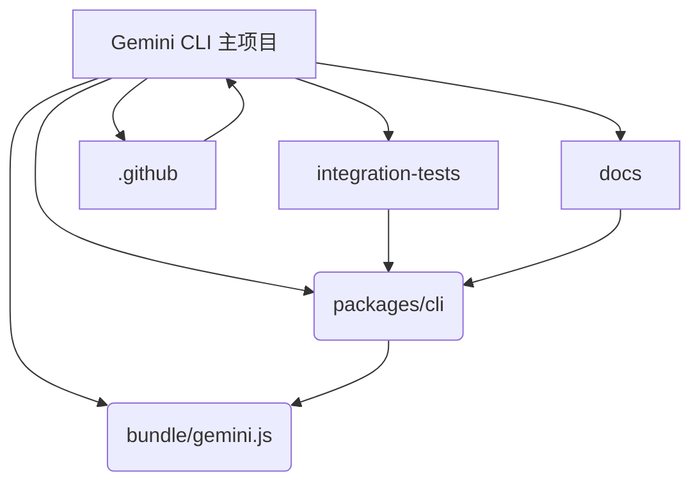
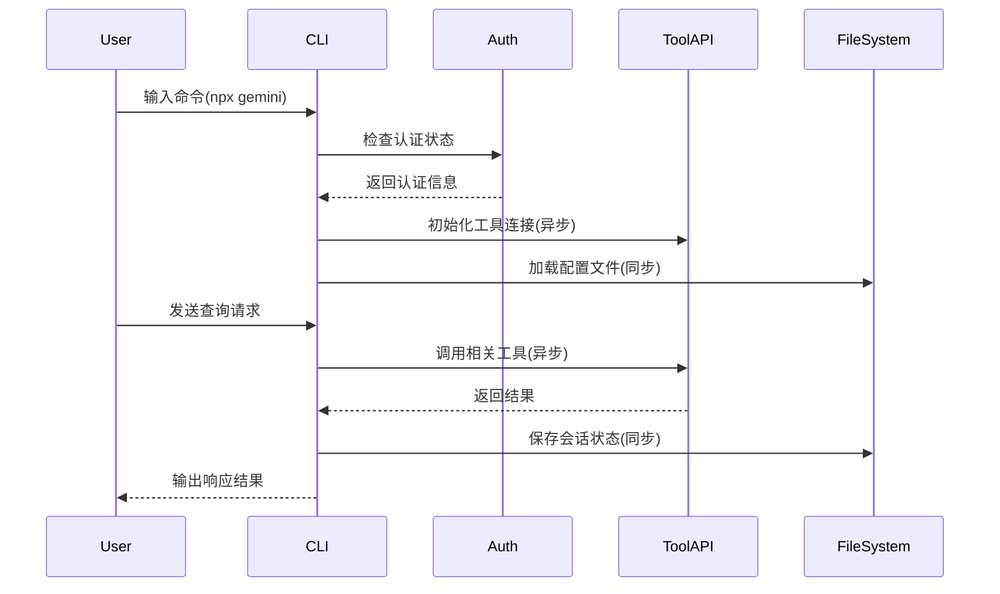

# gemini-cli - UML四视图分析

生成时间：2025-08-08T02:49:14.351749

# 项目概述

**项目简介（1000字符以内）：**

Gemini CLI 是一个命令行 AI 工具，基于 Node.js 构建，旨在通过与 Gemini 模型交互，实现代码理解、多模态生成、工具集成和自动化任务处理。用户可通过 CLI 查询/编辑代码、生成应用、执行 Shell 命令、访问文件系统及 Web 资源等。

**技术栈：**
- 运行环境：Node.js 20+
- 包管理：npm
- 核心语言：JavaScript
- 部署支持：Docker（配置文件位于 `.gcp`）
- 文档：Markdown（含使用指南、主题、配置说明等）
- 测试：集成测试脚本（integration-tests 目录）

**整体结构：**
- `packages/cli`：核心 CLI 实现
- `docs`：完整文档体系
- `.github`：CI/CD、Issue 模板与自动化工作流
- `bundle`：运行时依赖资源
- `integration-tests`：端到端功能测试

支持 Google 登录鉴权或 API Key 使用，具备沙箱安全机制与可扩展工具接口（MCP）。


## 1. Use Case视图

### Use Case视图分析

#### 1. 主要Actor
- **开发者用户**：使用CLI进行代码查询、编辑和任务自动化
- **GitHub Actions**：执行CI/CD和自动分诊工作流
- **Gemini API服务**：提供AI模型能力
- **外部工具系统**：如Google Search、MCP服务器等

#### 2. 核心用例
- **代码查询与编辑**：在大型代码库中查询和修改代码
- **应用生成**：从PDF或草图生成新应用
- **任务自动化**：处理PR查询、复杂rebase等操作
- **工具连接**：集成外部工具和MCP服务器
- **身份验证**：Google账户登录和API密钥管理

#### 3. 用例关系
- **包含关系**：代码操作包含文件读写、目录查询
- **扩展关系**：基础查询可扩展为多模态查询
- **泛化关系**：任务自动化泛化为具体操作如PR处理

#### 4. 用例图
```mermaid
usecaseDiagram
    actor "开发者用户" as user
    actor "GitHub Actions" as github
    actor "Gemini API" as api
    actor "外部工具" as tools

    user --> (代码查询与编辑)
    user --> (应用生成)
    user --> (任务自动化)
    user --> (工具连接)
    user --> (身份验证)

    github --> (CI/CD执行)
    github --> (自动分诊)

    (代码查询与编辑) ..> (文件系统操作) : include
    (应用生成) ..> (多模态处理) : extend
    (任务自动化) <|-- (PR处理) : generalize
    (任务自动化) <|-- (Rebase操作) : generalize

    api --> (AI模型调用)
    tools --> (Google搜索)
    tools --> (MCP服务集成)
```

## 2. Package视图

## Package视图分析

### 1. 主要包/模块及职责

- **packages/cli**: CLI核心实现，提供命令行交互界面和主流程控制
- **bundle**: 包含gemini.js可执行文件及macOS沙箱配置文件
- **docs**: 文档资源，包括使用指南、架构说明和工具文档
- **integration-tests**: 端到端测试套件，验证CLI各项功能
- **.github**: CI/CD配置和项目管理模板
- **eslint-rules**: 自定义ESLint规则，用于代码规范检查

### 2. 包间依赖关系

- `packages/cli` 是核心入口，依赖所有其他功能模块
- `bundle/gemini.js` 打包了CLI的完整功能
- `integration-tests` 依赖CLI包进行端到端测试
- `.github/workflows` 依赖项目源码和测试套件

### 3. 分层架构

```
┌─────────────────────────────────────────────┐
│              Gemini CLI 架构                │
├─────────────────────────────────────────────┤
│           CLI Interface (packages/cli)      │
├─────────────────────────────────────────────┤
│           Core Runtime (bundle/gemini.js)    │
├─────────────────────────────────────────────┤
│         Tools & Extensions (docs/tools)     │
├─────────────────────────────────────────────┤
│        Testing (integration-tests)         │
└─────────────────────────────────────────────┘
```

### 4. 子项目依赖关系

- 主项目 → CLI包 → 核心运行时
- 测试套件 → CLI包
- 文档系统 ↔ CLI功能模块

### 5. 包图



该结构显示了一个典型的CLI应用架构，以核心CLI包为中心，向外扩展测试、文档和部署配置。


## 3. Class视图

由于项目主要基于JavaScript/Node.js，且未提供完整的类定义源码，仅从目录结构和文档难以准确提取详细的类视图信息。但根据项目描述和常见CLI架构，可推测如下核心组件：

**核心模块（类/接口）：**
1. `GeminiCLI` - 主命令行接口类
2. `ConfigManager` - 配置管理
3. `Authenticator` - 认证模块
4. `ToolExecutor` - 工具执行器
5. `FileSystemTool`, `ShellTool`, `WebSearchTool` 等具体工具实现

**关系推测：**
- `GeminiCLI` 依赖 `ConfigManager` 和 `Authenticator`
- `ToolExecutor` 聚合各类具体工具
- 多数工具通过接口与核心引擎关联

因缺乏明确的UML或源代码定义，无法生成精确的mermaid类图。建议查看`packages/cli`下源文件以获取详细类结构。

## 4. Interaction视图

## Interaction视图分析

### 1. 关键业务流程
- **CLI启动与认证流程**
- **工具调用与响应处理**
- **文件系统操作与内存管理**

### 2. 消息传递与调用方式
- 同步调用：CLI命令解析、配置加载
- 异步调用：网络请求（如Google Search）、工具API交互

### 3. 核心业务规则
- 支持Google账户认证和API Key两种模式
- 提供沙箱环境执行安全代码操作
- 内置文件系统、Shell等核心工具接口

### 4. 序列图




## 5. 综合分析

1. **整体架构特点**：项目采用模块化单体架构，以 CLI 为核心，集成多种工具（如文件系统、Web 搜索、Shell 等），支持扩展 MCP 服务器。通过沙箱机制增强安全性，具备多平台支持能力。

2. **架构模式**：单体应用 + 插件架构。核心 CLI 提供基础功能，通过插件化方式接入各类工具和 MCP 服务，便于扩展和维护。

3. **关键发现与问题**：
   - 文档完善但部分配置示例缺失（如 API Key 使用细节）。
   - 集成测试覆盖全面，但未见单元测试结构。
   - 多个沙箱配置文件存在，但缺乏清晰的使用说明。
   - GitHub Actions 流程丰富，但可能存在冗余或维护成本高问题。

4. **改进建议**：
   - 补充沙箱配置使用文档，明确不同场景下的推荐配置。
   - 引入单元测试目录结构并制定测试策略，提升代码质量保障。
   - 精简或合并部分 CI/CD 工作流，降低维护复杂度。
   - 增加对插件加载机制的说明文档，方便开发者扩展。