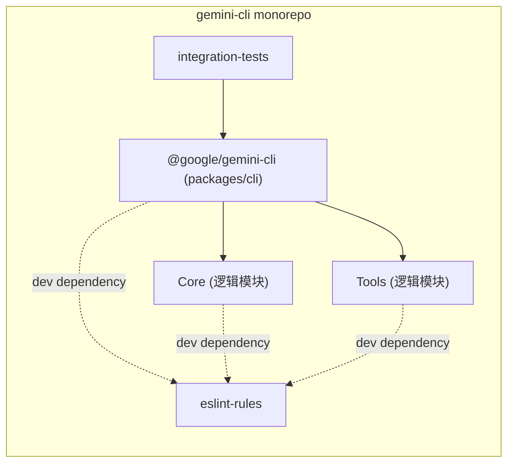
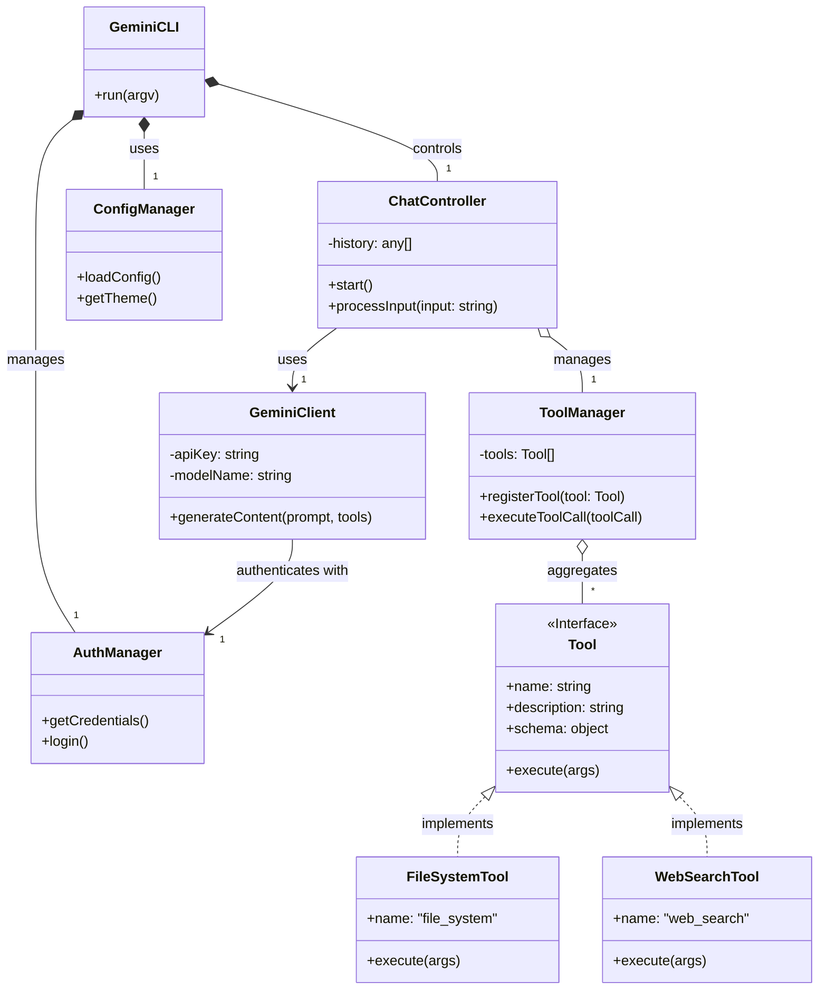
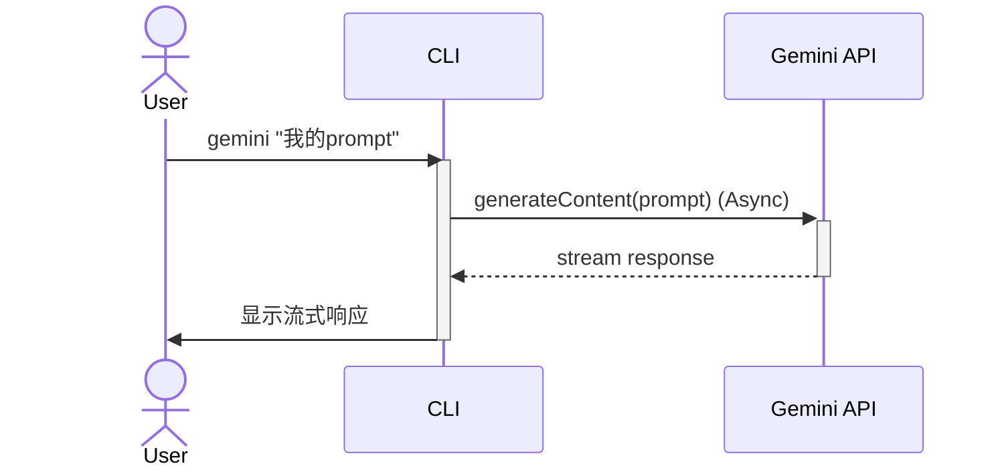
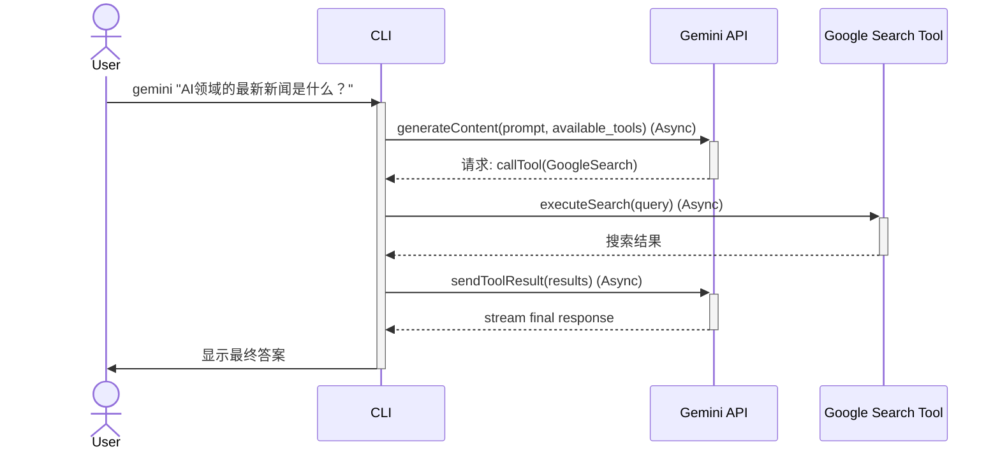

# gemini-cli - UML四视图分析

生成时间：2025-08-08T22:01:51.855891

# 项目概述

好的，这是对 `gemini-cli` 项目的简要介绍：

### 项目目的
这是一个名为 Gemini CLI 的命令行 AI 工作流工具。它旨在通过连接 Google 的 Gemini 模型，帮助开发者加速日常工作。核心功能包括：查询和编辑大型代码库（可超越模型的上下文窗口限制）、利用多模态能力从 PDF 或草图生成新应用、自动化复杂的操作任务（如处理 Git rebase），以及通过集成 Google 搜索等工具来增强 AI 的能力。

### 技术栈
*   **核心语言/环境**: Node.js (v20+)，项目主要使用 JavaScript/TypeScript 编写。
*   **包管理**: 使用 npm 进行依赖管理和分发。
*   **CI/CD 与自动化**: 大量使用 GitHub Actions (`.github/workflows`) 进行持续集成、端到端测试、发布流程和社区问题/PR的自动化管理。
*   **部署与构建**: 使用 Docker 和 Google Cloud Platform (`.gcp` 目录) 进行构建和发布。

### 整体结构
该项目采用标准的 Monorepo 结构，将不同的功能模块划分到独立的目录中：
*   `packages/cli`: 存放 CLI 工具的核心源代码。
*   `docs`: 包含非常详尽的用户文档、API 参考和架构说明。
*   `integration-tests`: 存放用于验证端到端功能的集成测试脚本。
*   `.github`: 管理所有 CI/CD 工作流、Issue/PR 模板和自动化脚本。
*   `bundle`: 包含最终打包用于分发的 JavaScript 文件和 macOS 沙箱配置文件。
*   `.gemini`: 存放用户的本地配置文件。

## 1. Use Case视图

### 1. 主要Actor

*   **CLI User**: 项目的主要使用者，通过命令行与`gemini-cli`工具进行交互，以完成AI辅助任务。
*   **Google Gemini API**: 外部AI模型系统。CLI的核心功能依赖于调用此API来处理用户的请求。
*   **Google Search**: 外部搜索服务。作为一个内置工具，为AI模型的回答提供实时网络信息作为依据（Grounding）。
*   **GitHub Actions Scheduler**: 定时任务触发器。用于自动执行项目仓库的维护任务，如问题和拉取请求的分类。

### 2. 核心用例

*   **UC1: 执行AI任务 (Perform AI Task)**
    *   描述：用户通过命令行向Gemini模型提交请求，如查询代码库、根据描述生成应用、自动化操作任务等。这是系统的核心价值所在。
*   **UC2: 认证 (Authenticate)**
    *   描述：用户通过Google账户登录，以获取调用Gemini API的授权。这是执行大多数AI任务的前提。
*   **UC3: 使用工具 (Use Tools)**
    *   描述：在执行AI任务时，用户可以选择调用外部工具（如文件系统、Shell、Web搜索）来增强模型的能力，使其能够与本地环境或外部服务交互。
*   **UC4: 配置CLI (Configure CLI)**
    *   描述：用户自定义CLI的行为，例如设置API密钥、选择颜色主题等。
*   **UC5: 管理仓库 (Manage Repository)**
    *   描述：由定时任务自动执行，对GitHub仓库中的Issues和Pull Requests进行分类和管理，属于项目自身的运维。

### 3. 用例关系分析

*   **包含 (Include)**
    *   `执行AI任务` **<<includes>>** `认证`：用户在首次执行需要调用API的任务时，必须先完成认证。
*   **扩展 (Extend)**
    *   `使用工具` **<<extends>>** `执行AI任务`：`使用工具`是`执行AI任务`的一个可选扩展功能。用户在提问时可以选择是否激活工具，并非每次交互都必须使用。
*   **泛化 (Generalization)**
    *   （此项目用例关系主要通过包含和扩展体现，无明显泛化关系）

### 4. 用例图 (Mermaid)

```mermaid
---
title: Gemini CLI 用例图
---
left to right direction
actor "CLI User" as user
actor "GitHub Actions Scheduler" as scheduler

rectangle "Gemini CLI System" {
  usecase "执行AI任务" as uc1
  usecase "认证" as uc2
  usecase "使用工具" as uc3
  usecase "配置CLI" as uc4
  usecase "管理仓库" as uc5
}

actor "Google Gemini API" as gemini_api
actor "Google Search" as search_api

user -- uc1
user -- uc4
scheduler -- uc5

uc1 .> uc2 : <<include>>
uc3 .> uc1 : <<extend>>

uc1 -- gemini_api
uc3 -- search_api
```

## 2. Package视图

好的，这是对 `gemini-cli` 项目的 Package 视图分析。

### 1. 主要包/模块及其职责

这是一个基于 Node.js 的 monorepo 项目。从目录结构和文档可以识别出以下主要逻辑包/模块：

*   **`packages/cli` (`@google/gemini-cli`)**: 项目的核心，是面向用户的命令行工具。它负责解析用户输入、与 Gemini API 交互、管理会话和执行各种工作流。
*   **`core` (逻辑模块)**: 虽然未在 `packages` 中明确列出，但 `docs/core` 的存在强烈暗示了一个核心逻辑模块。它可能封装了与 Gemini API 的通信、状态管理（如会话、内存）和工具API的实现。
*   **`tools` (逻辑模块)**: `docs/tools` 目录表明存在一组可插拔的工具模块，如文件系统操作 (`file-system`)、Web 搜索 (`web-search`) 和 Shell 命令执行 (`shell`)。这些工具为 Gemini 提供了扩展能力。
*   **`integration-tests`**: 包含端到端测试，用于验证 CLI 的各项功能是否按预期工作，确保核心功能和工具集成的正确性。
*   **`eslint-rules`**: 一个开发工具包，提供自定义的 ESLint 规则（如 `no-relative-cross-package-imports`），用于在整个 monorepo 中强制执行代码规范和架构约束。
*   **`bundle`**: 存放分发产物，包括打包后的 JavaScript 文件和用于安全沙箱（Sandbox）的配置文件。

### 2. 包之间的依赖关系

*   `cli` 包是顶层应用，它依赖于 `core` 模块来处理核心逻辑，并依赖 `tools` 模块来提供扩展功能。
*   `integration-tests` 包依赖于 `cli` 包，以便在测试中执行和验证其功能。
*   所有源码包（`cli`, `core`, `tools`）都（在开发时）依赖于 `eslint-rules` 来进行代码质量检查。

### 3. 分层架构

项目展现了清晰的分层架构：

1.  **表现层 (Presentation Layer)**: `cli` 包，负责与用户交互。
2.  **核心层 (Core Layer)**: `core` 逻辑模块，封装了业务逻辑和与后端服务的通信。
3.  **工具/扩展层 (Tooling/Extension Layer)**: `tools` 逻辑模块，提供可插拔的功能，与核心层解耦。
4.  **测试层 (Testing Layer)**: `integration-tests` 独立于应用逻辑，用于验证整个系统的行为。

### 4. 子项目间的依赖关系

该项目是一个 monorepo，其内部的包可以看作是子项目。

*   `integration-tests` --> `cli`
*   `cli` --> `core` (逻辑依赖)
*   `cli` --> `tools` (逻辑依赖)
*   `cli`, `core`, `tools` -- (dev) --> `eslint-rules`

### 5. 包图 (Mermaid)



## 3. Class视图

好的，这是对 `gemini-cli` 项目的Class视图分析。由于无法直接读取 TypeScript/JavaScript 源代码，此分析基于项目描述、目录结构和通用CLI应用架构模式进行推断。

### 1. 核心类和接口

-   **`GeminiCLI`**: 应用程序的主入口和控制器。负责解析命令行参数、初始化应用、管理会话和协调其他组件。
-   **`ChatController` / `SessionManager`**: 管理交互式聊天会话的核心逻辑，包括处理用户输入、调用AI模型、执行工具以及格式化输出。
-   **`GeminiClient`**: 封装与 Google Gemini API 的所有通信。负责发送请求（包括提示、历史记录和可用工具）、处理响应和错误。
-   **`AuthManager`**: 处理用户认证，包括 OAuth 2.0 流程和 API 密钥管理。为 `GeminiClient` 提供认证凭据。
-   **`ConfigManager`**: 负责加载、解析和保存用户的配置文件（如 `~/.gemini/config.yaml`），包括主题、API密钥、模型偏好等。
-   **`Tool` (接口)**: 定义了所有工具必须实现的通用契约。这是实现插件化和可扩展工具系统的关键。
-   **`ToolManager`**: 负责注册、发现和执行 `Tool` 接口的实现。当模型请求执行工具时，由该管理器调度。
-   **具体工具类 (如 `FileSystemTool`, `WebSearchTool`, `ShellTool`)**: `Tool` 接口的具体实现，封装了与文件系统交互、执行网络搜索或运行shell命令的逻辑。

### 2. 重要的属性和方法

-   **`GeminiCLI`**
    -   `run(argv)`: 启动应用，解析参数并执行相应命令。

-   **`ChatController`**
    -   `history`: 存储对话历史。
    -   `toolManager`: 对 `ToolManager` 的引用。
    -   `start()`: 开始一个新的交互式会话。
    -   `processInput(input: string)`: 处理用户输入，调用 `GeminiClient`。

-   **`GeminiClient`**
    -   `apiKey`: Gemini API 密钥。
    -   `modelName`: 使用的模型名称 (e.g., 'gemini-1.5-pro')。
    -   `generateContent(prompt, tools)`: 向Gemini API发送请求并返回模型生成的内容或工具调用请求。

-   **`AuthManager`**
    -   `getCredentials()`: 获取有效的认证令牌。
    -   `login()`: 启动用户登录流程。

-   **`Tool` (接口)**
    -   `name`: 工具的唯一名称。
    -   `description`: 工具功能的描述，供模型理解。
    -   `schema`: 工具输入参数的定义。
    -   `execute(args)`: 执行工具的具体逻辑。

-   **`ToolManager`**
    -   `tools`: 注册的工具列表。
    -   `registerTool(tool: Tool)`: 添加一个新工具。
    -   `executeToolCall(toolCall)`: 根据模型返回的 `toolCall` 查找并执行相应的工具。

### 3. 类之间的关系

-   **继承/实现**:
    -   `FileSystemTool`, `WebSearchTool`, `ShellTool` 等具体工具类 **实现 (Implements)** `Tool` 接口。
-   **组合/聚合**:
    -   `GeminiCLI` **组合 (Composition)** 了 `ChatController`, `AuthManager`, 和 `ConfigManager` 的实例，它们是CLI应用的核心部分。
    -   `ChatController` **聚合 (Aggregation)** 了一个 `ToolManager` 实例，用于在会话中管理工具。
    -   `ToolManager` **聚合 (Aggregation)** 了一个 `Tool` 对象的集合。
-   **关联**:
    -   `ChatController` **关联 (Association)** 到 `GeminiClient`，通过它与AI模型通信。
    -   `GeminiClient` **关联 (Association)** 到 `AuthManager`，以获取API请求所需的认证凭据。
-   **依赖**:
    -   `ChatController` **依赖 (Dependency)** 于 `Tool` 接口，因为它通过 `ToolManager` 与具体的工具实现进行交互。
    -   `GeminiCLI` 在其 `run` 方法中 **依赖 (Dependency)** 于命令行参数来决定执行哪个操作。

### 4. Mermaid 类图



## 4. Interaction视图

好的，我们来分析`gemini-cli`项目的交互视图。

### 1. 关键业务流程：用户查询与工具调用

#### 流程一：基本用户查询

这是最核心的交互，用户输入一个提示（prompt），CLI将其发送给Gemini模型并显示结果。

**消息传递与业务规则：**
- **用户 (User)** 通过命令行启动`CLI`并提供一个prompt。
- `CLI`将用户的prompt和认证信息（API Key或OAuth Token）打包。
- `CLI`向`Gemini API`发起一个**异步**网络请求。
- **业务规则**：所有对`Gemini API`的调用都必须经过身份验证。
- `Gemini API`处理请求后，将生成的文本以数据流（stream）的形式返回给`CLI`。
- `CLI`接收数据流并实时显示给用户，提供即时反馈。

**序列图 (Mermaid):**


---

#### 流程二：带工具的用户查询 (以Google搜索为例)

此流程展示了Gemini的函数调用（Function Calling）能力。当模型认为需要外部信息来回答问题时，它会请求CLI执行一个工具。

**消息传递与业务规则：**
- **用户 (User)** 发出一个需要实时信息的查询。
- `CLI`将prompt连同其可用的工具列表（如Google Search）发送给`Gemini API`。这是一个**异步**调用。
- **业务规则**：CLI必须在初始请求中声明其支持的工具，模型才能决定是否使用它们。
- `Gemini API`分析后，不直接回答，而是返回一个“工具调用”指令给`CLI`。
- `CLI`解析该指令，执行本地或远程的`Google Search Tool`。这是一个独立的**异步**调用。
- `Google Search Tool`返回结果给`CLI`。
- `CLI`将工具的执行结果再次发送给`Gemini API`，让模型基于新信息生成最终答案。
- `Gemini API`返回最终的、结合了搜索结果的答案。

**序列图 (Mermaid):**


## 5. 综合分析

好的，基于您提供的项目信息，综合分析如下：

### 1. 项目的整体架构特点总结

该项目（Gemini CLI）是一个基于 **Node.js** 技术栈构建的现代化命令行工具。其架构具备以下显著特点：

*   **模块化与可扩展性**：项目采用 Monorepo 结构（体现于 `packages` 目录），将核心、CLI界面、各类工具等功能拆分为独立的内部包。这种设计便于代码复用和独立维护。同时，项目提供了明确的工具API（`docs/core/tools-api.md`），支持通过插件或“工具”的形式扩展新功能，如文件操作、Web搜索等，具备高度的可扩展性。
*   **注重安全性**：项目特别为 macOS 提供了多种沙箱（Sandbox）配置文件（`.sb` 文件），用于在不同模式下限制CLI的系统访问权限，这表明其在设计上非常注重安全，防止潜在的恶意操作。
*   **高度工程化**：拥有极其完善的CI/CD流程（`.github/workflows`），涵盖了单元测试、端到端测试（E2E）、自动发布、社区问题自动分类等，体现了非常成熟和规范的软件工程实践。
*   **云原生集成**：包含GCP配置文件（`.gcp` 目录），用于构建和发布Docker镜像，表明项目已为云环境部署和分发做好了准备。

### 2. 整体架构模式

该项目是典型的 **Monorepo（单体仓库）** 架构模式。

在这种模式下，项目虽然由多个逻辑上独立的子项目（包）组成，但所有代码都存放在同一个代码仓库中进行管理。其内部实现进一步遵循了 **“核心 + 插件（Core + Plugin/Tool）”** 的设计思想：一个轻量的核心引擎负责框架和交互，而具体的功能则通过标准API以“工具”的形式插入，这使得它既不是一个庞大笨重的单体应用，也非需要网络通信的微服务。

### 3. 关键发现和潜在问题

*   **关键发现**：
    1.  **成熟度极高**：项目文档详尽、自动化流程完备、社区管理规范，是一个高质量、维护良好的开源项目。
    2.  **设计优秀**：插件化的扩展能力和内置的安全沙箱机制，使其在功能强大与安全可控之间取得了出色的平衡。

*   **潜在问题**：
    1.  **环境依赖**：强依赖特定版本的 Node.js，对于非 JavaScript 生态的用户可能存在一定的安装和配置门槛。
    2.  **跨平台一致性**：针对 macOS 的特定安全实现，可能意味着在 Windows 和 Linux 上的安全保障和行为存在差异，维持跨平台体验的一致性是一个挑战。

### 4. 改进建议

1.  **优化分发方式**：建议考虑使用 `pkg` 或 `nexe` 等工具将应用打包成免依赖的、跨平台的独立二进制可执行文件。这将消除用户安装 Node.js 的前置步骤，极大降低使用门槛。
2.  **增强开发者引导**：在现有文档基础上，可以增加一篇专门的“开发者贡献指南”，详细介绍 Monorepo 的工作流程、本地调试方法以及如何开发一个新的“工具”插件，从而降低社区贡献者的参与难度。