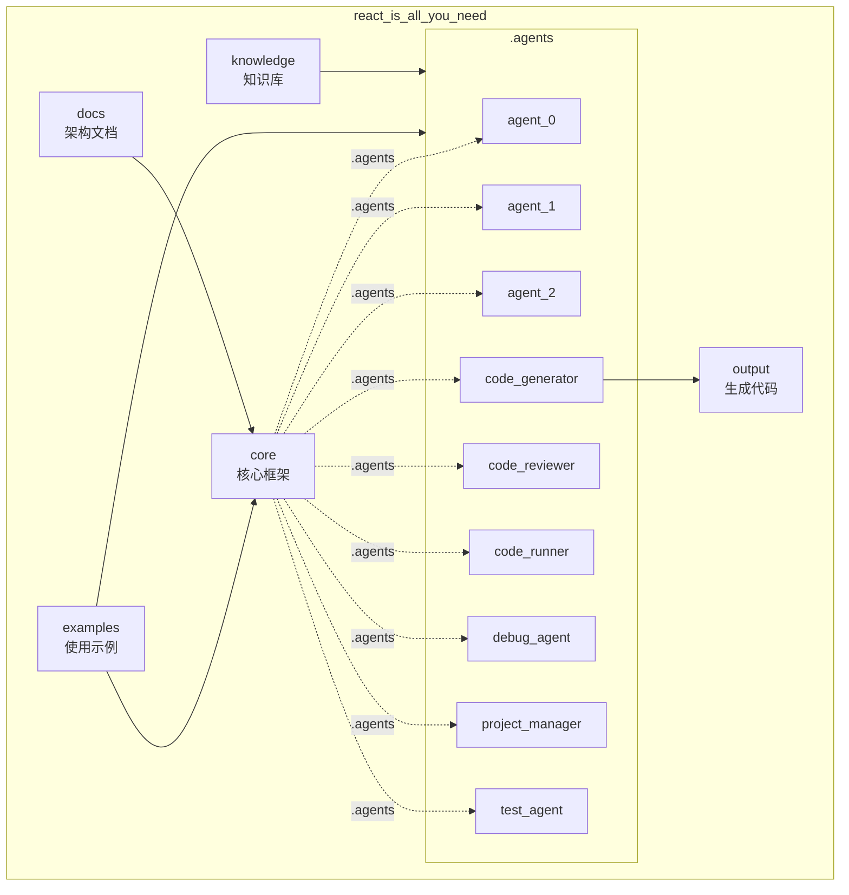
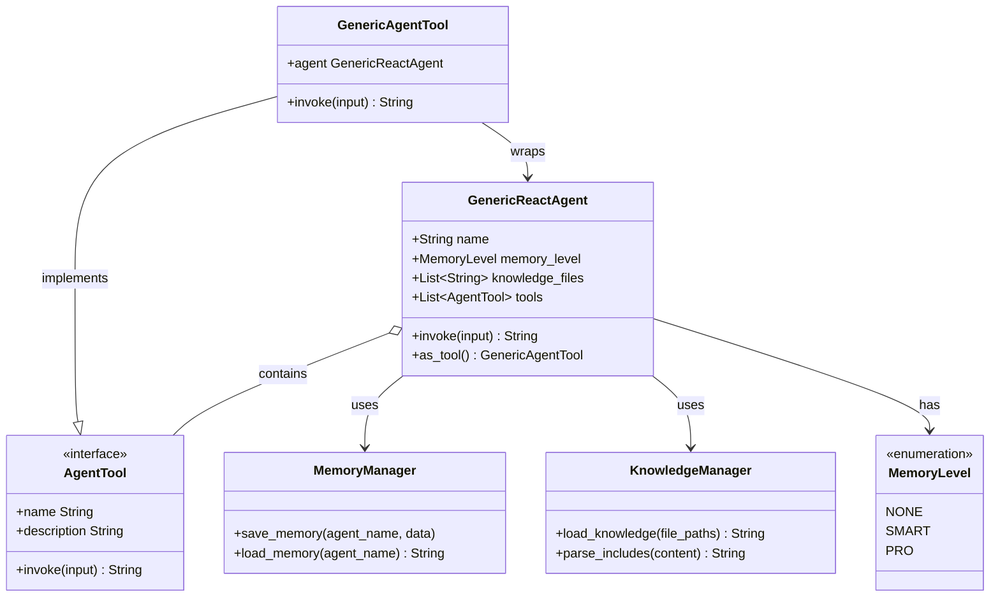
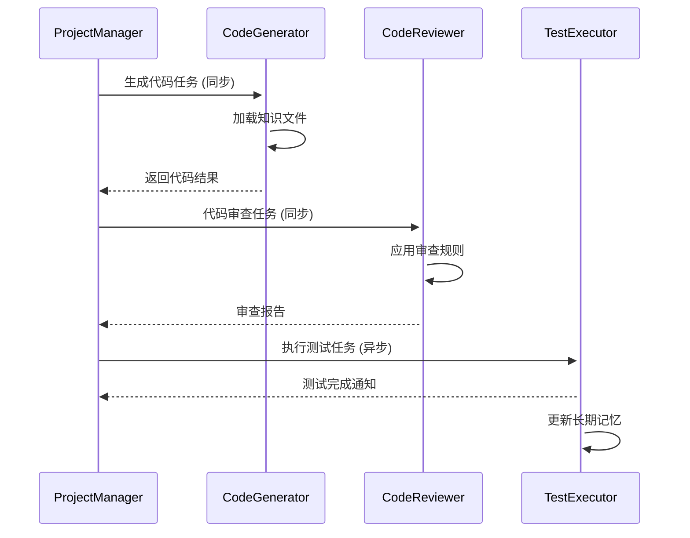
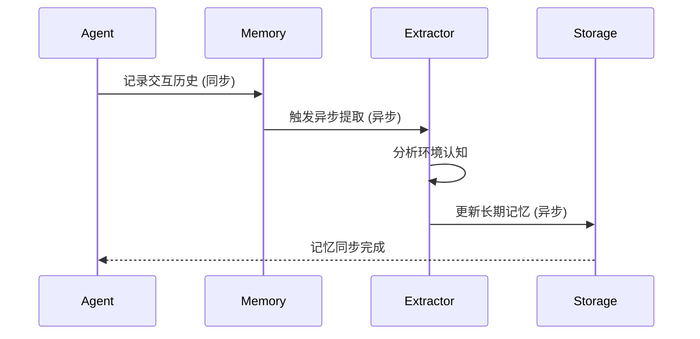
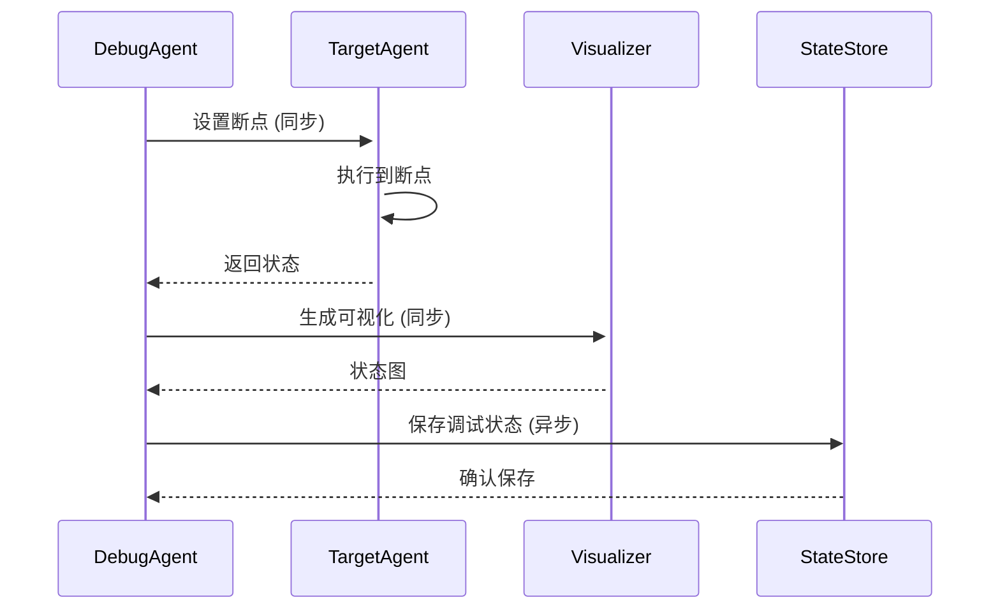

# react_is_all_you_need - UML四视图分析

生成时间：2025-08-05T17:42:14.300024

# 项目概述

目的：构建基于 LangGraph 的下一代 React Agent 框架，实现“先验知识注入 + 三级记忆 + 工具化集成”的通用智能体平台，支持单 Agent 调试与多 Agent 协作。

技术栈：Python 3、LangGraph（create_react_agent）、LangChain、SQLite（持久化记忆）、Jupyter Notebook、VS Code Debug Adapter、可选 Web 搜索与命令行接口。

整体结构：  
- `.agents/`：各智能体（deepseek、kimi、code_*、project_manager 等）的长期/短期记忆与知识库。  
- `core/`：框架核心实现（未展开）。  
- `docs/`：动态记忆系统、调试器、多 Agent 协作、提示词体系等设计文档与示例代码。  
- `examples/`：Notebook 调试器示例、MDA 系统示例。  
- `knowledge/`：最佳实践、协作规范等共享知识。  
- 根目录：大量演示脚本（debug、demo、迁移、计数器、可视化等）与配置文件。

## 1. Use Case视图

## Use Case 视图

### 1. 主要 Actor
- **开发者**（Developer）：使用框架构建、调试、运行 Agent
- **终端用户**（End User）：通过 CLI / API 与 Agent 交互
- **其他 Agent**（Agent as Tool）：被当前 Agent 调用的子 Agent
- **定时任务**（Scheduler）：周期性触发记忆清理、知识更新
- **外部系统**（File System / Web / Shell）：被工具调用

### 2. 核心用例
| 用例名称 | 简要描述 |
|---|---|
| UC-01 创建 Agent | 开发者配置名称、知识、工具，实例化 GenericReactAgent |
| UC-02 单轮对话 | 终端用户输入自然语言，Agent 返回结果 |
| UC-03 多轮会话 | 启用 SMART/PRO 记忆，保持上下文连续对话 |
| UC-04 工具调用 | Agent 根据需求调用文件、代码、搜索、命令等工具 |
| UC-05 调试 Agent | 开发者使用 Debugger 查看思维链、断点、状态 |
| UC-06 多 Agent 协作 | 开发者把 Agent 作为工具，编排任务流 |
| UC-07 知识热加载 | 运行中动态更新知识文件，无需重启 |
| UC-08 记忆迁移 | 将旧记忆格式迁移到 SQLite 持久化 |
| UC-09 性能分析 | 统计 token 消耗、执行耗时，优化提示词 |
| UC-10 缓存管理 | 配置或禁用 SQLite 缓存，清理过期数据 |

### 3. 用例关系
- **UC-02 包含** UC-04（任何对话都可能触发工具）
- **UC-03 扩展** UC-02（在单轮基础上增加记忆）
- **UC-06 包含** UC-01（先创建子 Agent 才能协作）
- **UC-05 泛化** UC-02/UC-03（调试可针对任何对话）
- **UC-09 扩展** UC-02/UC-03（可选性能统计）
- **UC-10 扩展** UC-03（仅 PRO 记忆需要缓存管理）

### 4. 用例图

```mermaid
%%{init: {'theme':'neutral'}}%%
usecaseDiagram
  actor Developer
  actor "End User"
  actor "Other Agent"
  actor Scheduler
  actor "External System"

  rectangle "React Is All You Need" {
    usecase "UC-01\nCreate Agent" as UC01
    usecase "UC-02\nSingle Turn" as UC02
    usecase "UC-03\nMulti Turn" as UC03
    usecase "UC-04\nTool Call" as UC04
    usecase "UC-05\nDebug Agent" as UC05
    usecase "UC-06\nMulti Agent\nCoordination" as UC06
    usecase "UC-07\nHot Reload\nKnowledge" as UC07
    usecase "UC-08\nMigrate Memory" as UC08
    usecase "UC-09\nPerformance\nAnalysis" as UC09
    usecase "UC-10\nCache Mgmt" as UC10
  }

  Developer --> UC01
  Developer --> UC05
  Developer --> UC06
  Developer --> UC07
  Developer --> UC08
  Developer --> UC09
  Developer --> UC10

  "End User" --> UC02
  "End User" --> UC03

  UC03 ..> UC02 : <<extend>>
  UC02 ..> UC04 : <<include>>
  UC06 ..> UC01 : <<include>>
  UC05 --|> UC02 : generalize
  UC05 --|> UC03 : generalize
  UC09 ..> UC02 : <<extend>>
  UC09 ..> UC03 : <<extend>>
  UC10 ..> UC03 : <<extend>>

  UC04 --> "External System"
  UC06 --> "Other Agent"
  Scheduler --> UC10
```

## 2. Package视图

## Package视图分析

### 1. 主要包/模块及其职责

| 包/模块 | 职责 |
|---------|------|
| **core** | 核心运行时框架，包含GenericReactAgent实现 |
| **.agents** | 多Agent实例仓库，每个子目录代表一个独立Agent |
| **docs** | 架构文档与ADR记录，包含动态记忆系统实现 |
| **examples** | 使用示例，展示多Agent协作模式 |
| **knowledge** | 知识库，包含最佳实践和协作规范 |
| **output** | 代码生成输出目录 |

### 2. 包间依赖关系

```
core ← .agents (所有Agent实例依赖核心框架)
core ← examples (示例依赖核心实现)
docs ← core (文档描述核心架构)
knowledge ← .agents (Agent加载知识文件)
```

### 3. 分层架构

```
┌─────────────────────────────────┐
│         应用层 (examples)        │
├─────────────────────────────────┤
│         Agent层 (.agents)        │
├─────────────────────────────────┤
│        核心层 (core)            │
├─────────────────────────────────┤
│       知识层 (knowledge)        │
└─────────────────────────────────┘
```

### 4. 子项目依赖

- **Agent实例** → **core**: 所有Agent实现都依赖核心框架
- **examples/mda_system** → **.agents**: 演示多Agent协作
- **docs/dynamic_memory_system** → **core**: 记忆系统实现依赖核心Agent

### 5. 包图



## 3. Class视图

## Class视图分析

### 1. 核心类和接口
- **GenericReactAgent**：主Agent类，基于LangGraph的ReAct实现
- **MemoryLevel**：枚举类，定义三级记忆系统（NONE/SMART/PRO）
- **AgentTool**：工具接口，所有工具需实现
- **GenericAgentTool**：Agent作为工具的包装器
- **KnowledgeManager**：知识文件管理器
- **MemoryManager**：记忆系统管理器

### 2. 重要属性和方法
```python
class GenericReactAgent:
    - name: str  # Agent名称
    - memory_level: MemoryLevel
    - knowledge_files: List[str]
    - tools: List[AgentTool]
    - llm: BaseChatModel
    + __init__(name, memory_level, knowledge_files, tools)
    + invoke(input: str) -> str
    + as_tool() -> GenericAgentTool

class MemoryManager:
    - storage: SQLiteStorage  # PRO模式
    - buffer: ConversationSummaryBufferMemory  # SMART模式
    + save_memory(agent_name, data)
    + load_memory(agent_name) -> str

class KnowledgeManager:
    - base_path: Path
    + load_knowledge(file_paths) -> str
    + parse_includes(content) -> str
```

### 3. 类关系分析
- **继承**：GenericAgentTool继承AgentTool接口
- **实现**：MemoryManager实现记忆策略模式
- **关联**：GenericReactAgent关联MemoryManager和KnowledgeManager
- **组合**：AgentTool组合在GenericReactAgent中
- **依赖**：GenericAgentTool依赖GenericReactAgent

### 4. 类图



## 4. Interaction视图

## Interaction视图分析

### 关键业务流程

#### 1. 多Agent协作任务执行
**业务规则**：任务按依赖顺序执行，Agent可调用其他Agent作为工具，自动处理中文工具名兼容。



#### 2. 动态记忆系统更新
**业务规则**：异步提取环境认知，触发记忆更新，支持三级记忆模式切换。



#### 3. 调试Agent问题诊断
**业务规则**：调试代理可调用其他Agent工具，支持条件断点和状态可视化。



## 5. 综合分析

1. 整体架构特点  
- 以 LangGraph 的 create_react_agent 为核心，构建“Agent 即工具”的 React 范式框架。  
- 三级记忆（NONE/SMART/PRO）+ 动态知识系统（@include 多文件、SQLite 持久化）形成可插拔认知层。  
- 工具链完备：文件、代码、命令、搜索、Web 等，可被单 Agent 或多 Agent 复用。  
- 调试体系完整：NotebookDebugger、ReactAgentDebugger、可视化追踪、条件断点。  
- 配置与运行分离：.agents 目录保存各 Agent 的 data/knowledge，docs 记录 ADR 与迁移指南，examples 提供即用脚本。

2. 多子项目架构模式  
“微 Agent + 插件”混合：  
- 每个子目录（agent_x、code_generator、debug_agent…）是一个独立微 Agent，自带数据与知识。  
- 通过 GenericAgentTool 把任意 Agent 包装成 LangChain Tool，实现“Agent 即插件”，可被其他 Agent 动态调用。  
- 共享 core 与 knowledge/best_practices，保证行为一致又易于横向扩展。

3. 关键发现与潜在问题  
- 记忆与知识目录散落在 .agents/*/long_term_data、short_term_data、knowledge，缺乏统一版本管理，易导致冲突。  
- 大量 demo/debug 脚本与核心逻辑耦合，main 入口不清晰，增加维护成本。  
- 中文工具名虽已兼容，但跨平台路径（空格、大小写）仍可能踩坑。  
- 文档丰富但分散，新手难以快速定位“最小可运行示例”。  
- 未显式定义 Agent 生命周期（启动、回收、缓存清理），长时间运行可能堆积 SQLite 文件。

4. 改进建议  
- 统一数据层：把 long/short_term_data 合并到 core/memory，提供版本化快照与自动迁移脚本。  
- 提炼最小 SDK：将 demo_* 中通用逻辑下沉到 core，对外只暴露 react_agent.run(task, tools, config)。  
- 引入 Agent Registry：启动时扫描 .agents，自动生成清单与依赖图，避免硬编码。  
- 文档重构：docs/quickstart.md 用 5 行代码演示“创建 Agent → 加载知识 → 运行任务”，其余深入链接。  
- 增加缓存 TTL 与定期清理 CLI，防止 SQLite 无限膨胀。