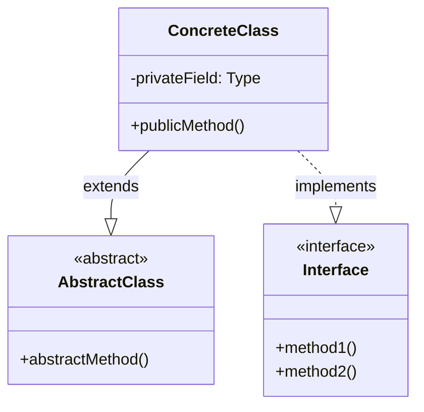
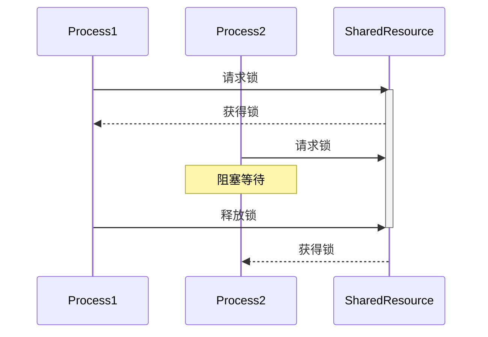
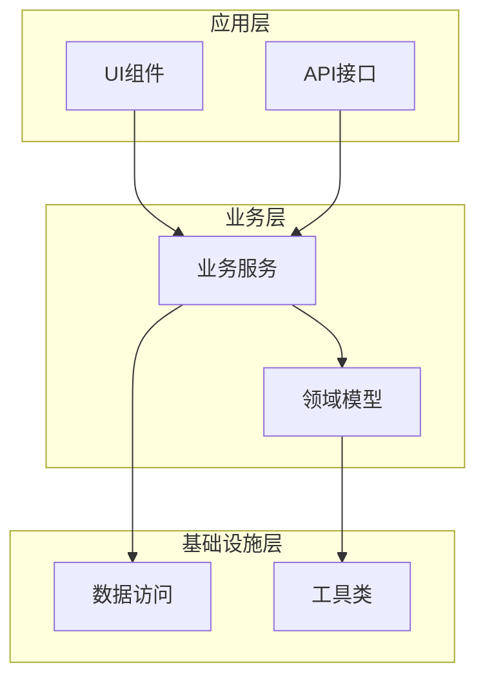
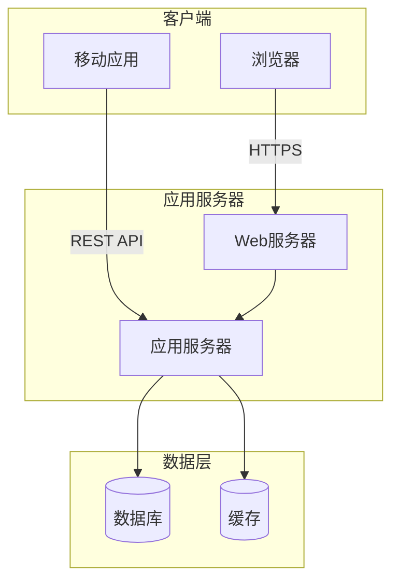
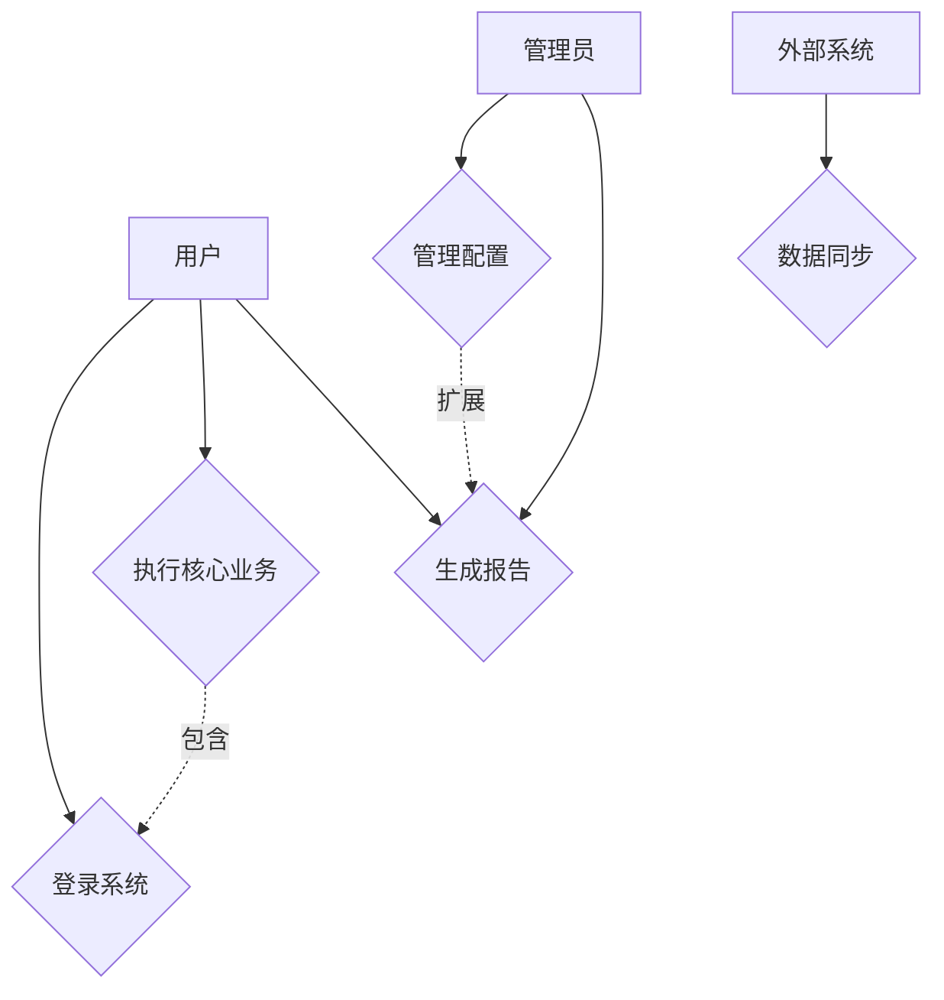

# 项目探索 - Kruchten 4+1 架构视图模型

请使用Philippe Kruchten的4+1架构视图模型来深入理解和分析这个项目。该模型通过5个相互关联的视图来描述软件密集型系统的架构。

## 重要说明：子项目处理

如果项目中包含子项目（通过以下特征识别）：
- 子目录中有独立的 README.md
- 子目录中有独立的配置文件（如 package.json, pom.xml, setup.py 等）
- 子目录中有独立的源代码结构
- 子目录名称表明是独立模块（如 frontend/, backend/, core/, plugins/ 等）

则需要：
1. **分别分析每个子项目**，为每个子项目生成独立的4+1视图
2. **分析子项目间的关系**，包括依赖、调用、数据流等
3. **生成整体项目视图**，展示所有子项目的集成关系

## 1. 逻辑视图（Logical View）

**目标受众**：最终用户、系统分析师
**关注点**：系统提供的功能和服务

### 要求：
- 识别主要的抽象和关键机制
- 分析主要的类、接口及其职责
- 展示重要的设计模式和架构模式
- 分析类之间的关系（继承、实现、关联、依赖）
- 用mermaid画出类图和包图

### 示例格式：

## 2. 进程视图（Process View）

**目标受众**：系统集成人员、性能工程师
**关注点**：并发性、同步、性能、可扩展性

### 要求：
- 识别主要的进程和线程
- 分析进程间通信机制（IPC）
- 展示并发控制和同步机制
- 标注性能关键路径
- 分析系统的可扩展性设计
- 用mermaid画出活动图或序列图

### 示例格式：

## 3. 开发视图（Development View）

**目标受众**：程序员、软件管理人员
**关注点**：软件模块组织、重用、工具约束

### 要求：
- 展示源代码的组织结构
- 分析模块/包的层次和依赖关系
- 识别第三方库和框架的使用
- 展示构建和打包结构
- 分析代码重用策略
- 用mermaid画出组件图或包图

### 示例格式：

## 4. 物理视图（Physical View）

**目标受众**：系统工程师、运维人员
**关注点**：硬件拓扑、部署、通信

### 要求：
- 描述系统的物理部署结构
- 识别硬件节点和网络拓扑
- 分析组件到节点的映射关系
- 展示通信协议和网络连接
- 考虑冗余、备份和故障转移
- 用mermaid画出部署图

### 示例格式：

## 5. 场景视图（Scenarios/Use Case View）

**目标受众**：所有利益相关者
**关注点**：架构的驱动力和验证

### 要求：
- 识别主要的用例和场景
- 选择最重要的架构驱动用例（3-5个）
- 详细描述每个场景的执行流程
- 展示场景如何贯穿其他四个视图
- 用这些场景验证架构决策
- 用mermaid画出用例图

### 示例格式：

## 输出要求

1. **视图完整性**：
   - 每个视图都要完整展现该视角的关键信息
   - 视图之间要相互呼应和一致
   - 用场景视图串联和验证其他视图

2. **图表质量**：
   - 所有mermaid图表必须语法正确
   - 图表要清晰、布局合理
   - 为每个图表添加必要的说明

3. **架构决策**：
   - 记录重要的架构决策和理由
   - 指出架构的优势和潜在风险
   - 提供改进建议

4. **诚实标注**：
   - 推测的部分要标注"可能"、"推测"
   - 不确定的地方要说明原因
   - 需要进一步验证的内容要列出

5. **子项目处理**：
   - 如果发现子项目，必须分别分析
   - 明确标注每个子项目的边界和职责
   - 重点分析子项目间的集成和交互

6. **整体理解**：
   - 最后提供一个综合分析
   - 总结项目的架构特点和质量属性
   - 评估架构对非功能需求的支持（性能、可扩展性、可维护性等）
   - 给出具体的改进建议

## 输出长度控制

**重要**：为避免输出被截断，请控制输出长度：
- 总文档长度控制在10000字符以内
- 每个视图控制在1500-2000字符以内
- 优先保证核心内容的完整性
- 如果内容过多，可以：
  - 简化mermaid图，只保留核心元素
  - 减少示例代码
  - 用列表代替详细描述
  - 省略次要的类或模块
  - 对于大型项目，只分析最重要的2-3个子项目

请基于提供的项目信息，生成完整的4+1架构视图分析文档。通过这5个相互关联的视图，全面展现系统的架构设计。