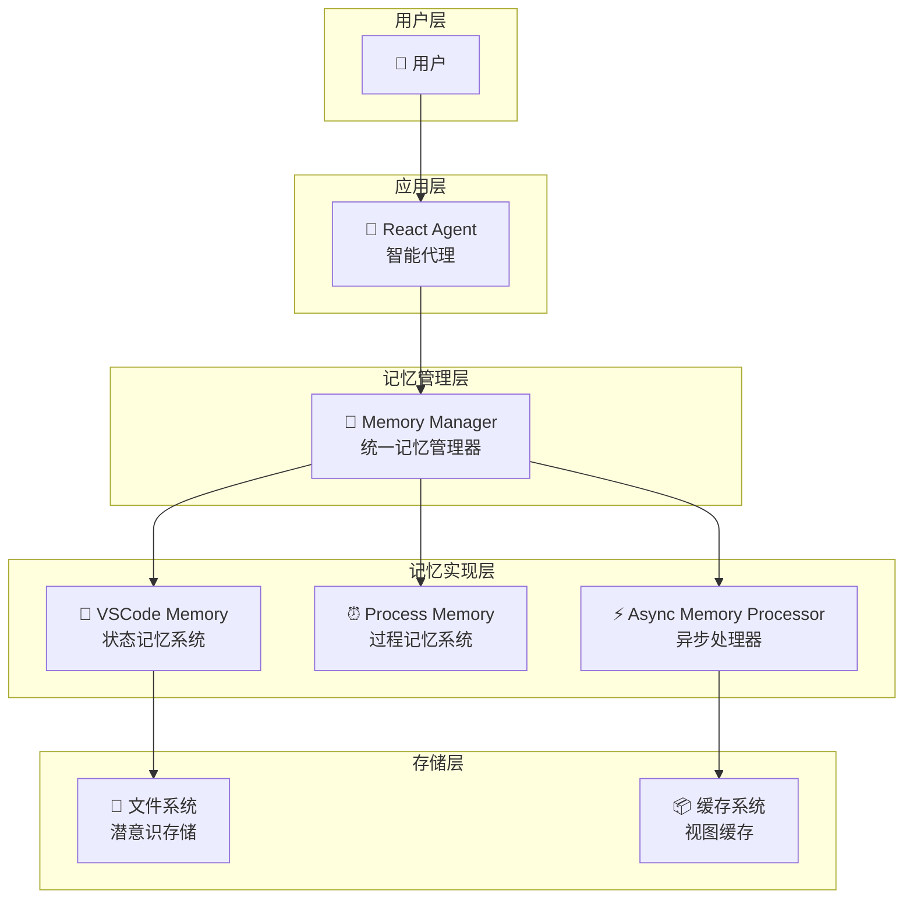
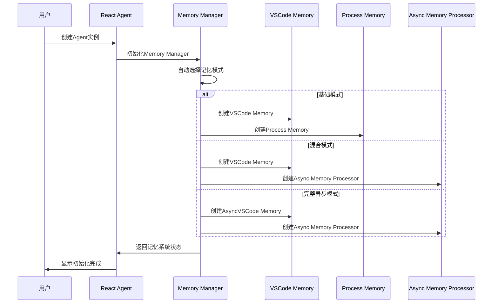
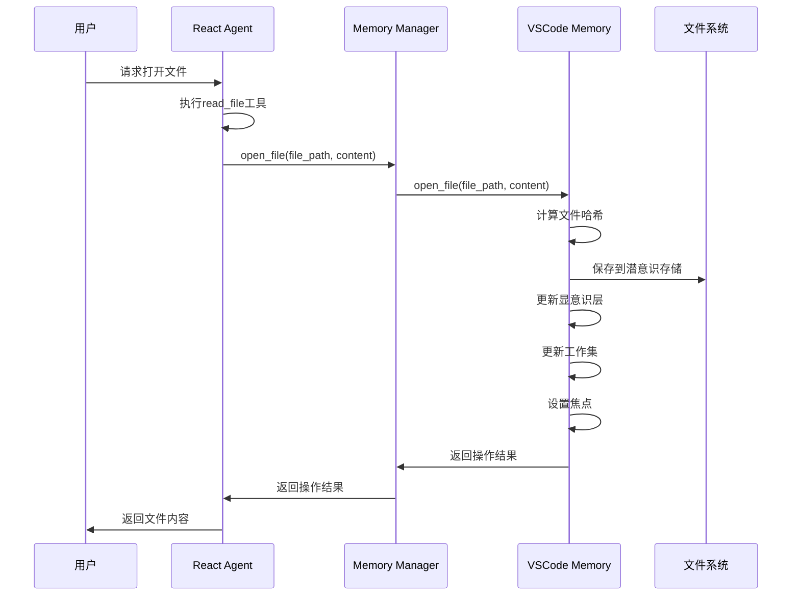
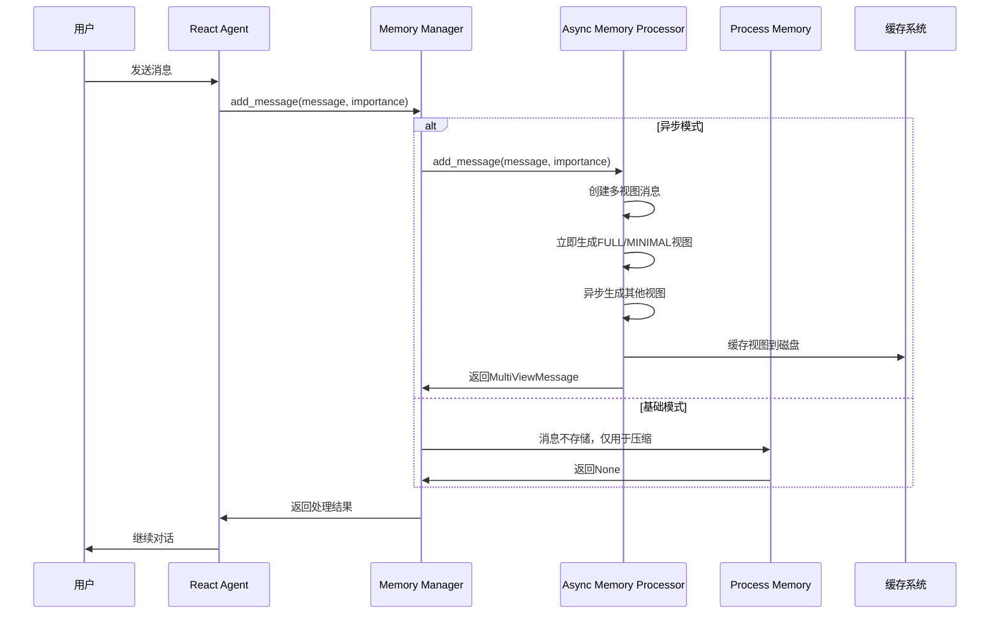
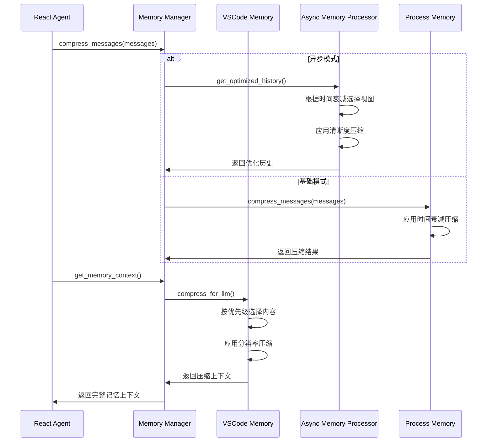
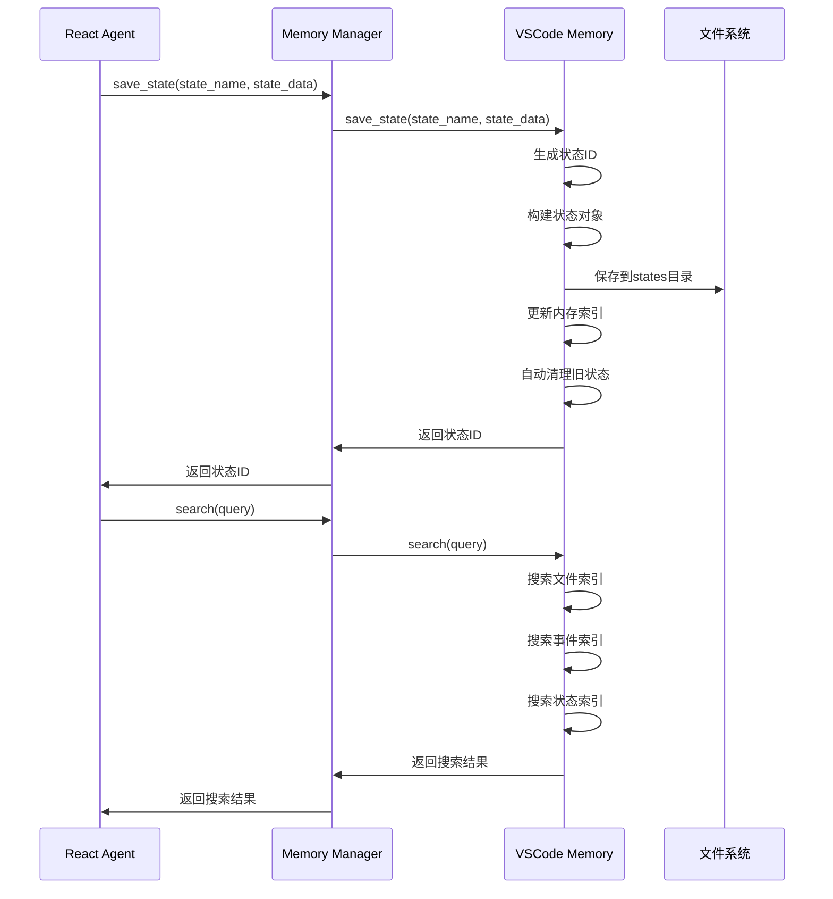
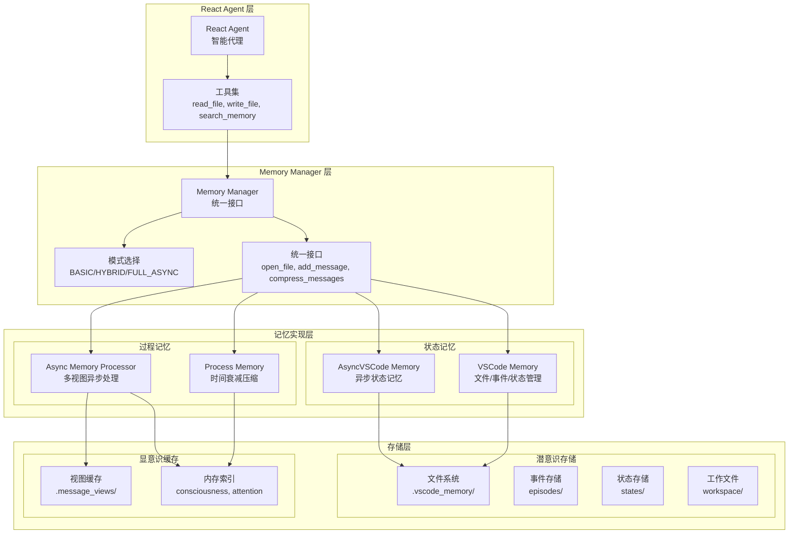
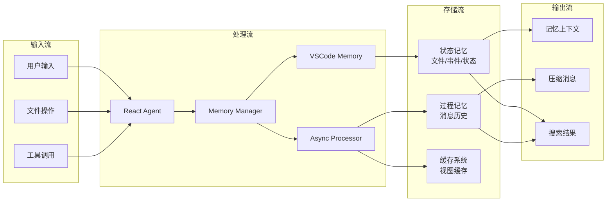

# React Agent、Memory Manager、VSCode Memory 交互架构图

## 🏗️ 整体架构概览



## 🔄 详细交互流程

### 1. 初始化阶段



### 2. 文件操作交互



### 3. 消息处理交互



### 4. 记忆压缩交互



### 5. 状态快照交互



## 🧠 记忆系统层次结构



## 🔧 核心交互接口

### Memory Manager 统一接口

```python
class MemoryManager:
    # 状态记忆接口
    def open_file(self, file_path: str, content: str)
    def close_file(self, file_path: str)
    def search(self, query: str) -> List[Dict]
    def save_episode(self, event: str, data: Dict)
    def save_state(self, state_name: str, state_data: Dict)

    # 过程记忆接口
    def add_message(self, message: Dict, importance: Optional[str] = None)
    def compress_messages(self, messages: List[Dict]) -> Tuple[List[Dict], Dict]

    # 统一接口
    def get_memory_context(self, extra_tokens: int = 0) -> str
    def optimize_message_history(self, messages: List[Dict], protected_count: int = 2) -> List[Dict]
    def should_optimize(self, round_num: int, message_count: int) -> bool
    def get_status(self) -> Dict
    def cleanup(self)
```

### React Agent 工具集成

```python
class ReactAgent:
    def _define_tools(self) -> List[Dict]:
        return [
            {
                "name": "read_file",
                "description": "读取文件内容",
                "parameters": {...}
            },
            {
                "name": "write_file",
                "description": "写入文件内容",
                "parameters": {...}
            },
            {
                "name": "search_memory",
                "description": "搜索记忆内容",
                "parameters": {...}
            }
        ]

    def _execute_tool(self, tool_name: str, arguments: Dict) -> str:
        if tool_name == "read_file":
            # 自动记录到记忆
            self.memory.open_file(file_path, content)
        elif tool_name == "write_file":
            # 自动记录到记忆
            self.memory.open_file(file_path, content)
        elif tool_name == "search_memory":
            # 使用记忆搜索
            return self.memory.search(query)
```

## 📊 数据流向图



## 🎯 交互模式总结

### 1. **初始化模式**

- React Agent 创建 Memory Manager
- Memory Manager 根据配置选择记忆模式
- 初始化相应的记忆组件

### 2. **文件操作模式**

- React Agent 执行文件工具
- 自动调用 Memory Manager 的 open_file
- VSCode Memory 处理文件存储和索引

### 3. **消息处理模式**

- React Agent 接收用户消息
- Memory Manager 根据模式选择处理器
- Async Memory Processor 或 Process Memory 处理消息

### 4. **记忆压缩模式**

- React Agent 需要优化上下文
- Memory Manager 协调状态和过程记忆压缩
- 返回优化后的记忆上下文

### 5. **状态管理模式**

- React Agent 保存项目状态
- Memory Manager 委托给 VSCode Memory
- VSCode Memory 管理状态快照和索引

这种分层架构设计实现了：

- **解耦合**：各层职责清晰，易于维护
- **可扩展**：支持多种记忆模式
- **高性能**：异步处理和缓存优化
- **易使用**：React Agent 提供统一接口


