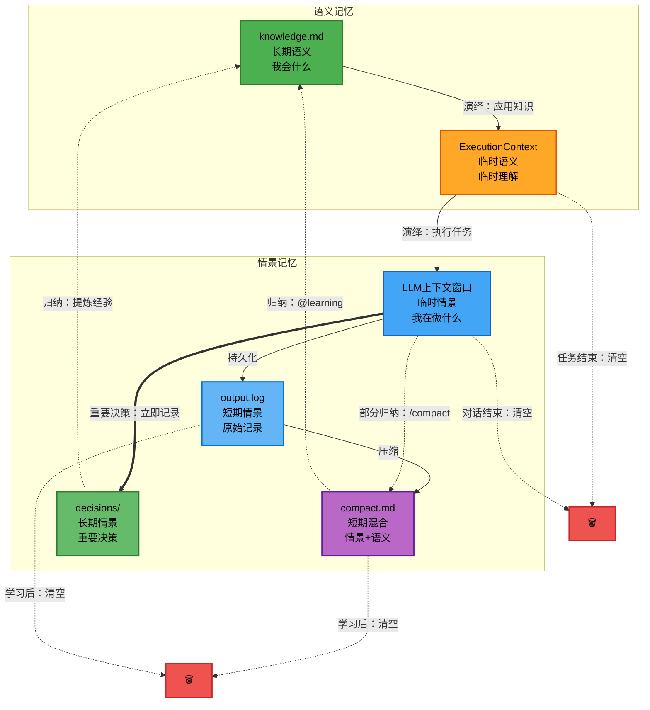

# 智能体记忆的二维模型

## 理论基础

**记忆可以从两个维度理解**（认知心理学的经典模型）

### 维度1：内容类型
- **语义记忆**（Semantic Memory）- "知道什么"、"会什么"
- **情景记忆**（Episodic Memory）- "经历了什么"、"做过什么"

### 维度2：时间跨度
- **短期/工作记忆**（Short-term/Working Memory）- 临时、易变、容量有限
- **长期记忆**（Long-term Memory）- 稳定、持久、容量无限

## 2x3记忆矩阵（完整模型）

|  | 临时/工作记忆 | 短期记忆 | 长期记忆 |
|--|------------|---------|---------|
| **情景记忆** | LLM上下文窗口<br/>"我在做什么"<br/>（运行时） | output.log<br/>compact.md*<br/>"我刚做了什么"<br/>（持久化，会清理） | decisions/<br/>"为什么做重要决策"<br/>（永久保留） |
| **语义记忆** | ExecutionContext<br/>"我临时理解了什么"<br/>（运行时） | compact.md*<br/>"我刚学到什么"<br/>（持久化，会清理） | knowledge.md<br/>"我会什么"<br/>（能力、技能） |

**注**：compact.md*是混合的，既包含情景（做了什么）也包含语义（学到了什么）

**关键理解**：
- 工作记忆**不是独立的第三类**，在两个维度中都有体现
  - 情景部分：LLM上下文窗口（隐藏在LLM大脑中）
  - 语义部分：ExecutionContext（外部化到文件系统）
- 短期记忆中，**compact.md是混合的**
  - 既记录经历（情景）也记录学习（语义）
  - 还没完全分离（分离发生在归纳到长期记忆时）

## 演绎-归纳流转图



**图例说明**：
- 实线箭头（→）：演绎流程（语义→情景，应用知识）
- 虚线箭头（-.→）：归纳流程（情景→语义，学习知识）
- 粗箭头（==>）：重要决策的直接记录
- 绿色：长期语义
- 蓝色：情景记忆系列
- 紫色：compact.md（混合）
- 橙色：临时语义
- 红色：清空操作

## 五个记忆位置的详细说明

### 位置1：临时情景记忆（工作记忆的情景部分）

**对应**：
- `LLM上下文窗口` - 最近几轮对话

**内容**：
- 当前对话的原始文本
- "我刚说了什么"
- "用户刚要求什么"

**特征**：
- 隐藏在LLM内部
- 容量有限（context window）
- 对话结束自动清空

**类比人类**：
- 工作记忆中的情景片段
- "我刚做了什么"
- 非常短暂

**流转**：
```
对话进行中 → 在LLM上下文窗口
              ↓
            对话继续
              ↓
          压缩到compact.md
              ↓
        对话结束，上下文清空
```

---

### 位置2：短期记忆（情景+语义混合）⭐

**对应文件**：
- `output.log` - 原始执行日志（纯情景）
- `compact.md` - 压缩的对话历史（**混合**）

**关键发现**：
- output.log：纯情景记忆（只有"做了什么"）
- **compact.md：混合记忆**（既有情景也有语义）
  - 情景部分："我做了什么决策"
  - 语义部分："我学到了什么规律"

**compact.md的混合性质**：
```markdown
# Compact记忆示例

## 对话历史（情景）：
- 2024-10-19创建了3个子智能体
- 执行了职责分离

## 关键学习（语义）：
- 用grep搜索比索引快
- 职责分离原则
- knowledge_file可以共享

→ 既有"做了什么"也有"学到了什么"
→ 短期记忆还没完全分离
```

**为什么混合**：
- compact过程中部分归纳已经发生
- 提取了关键学习点
- 但还没固化到knowledge.md

**特征**：
- 已持久化到文件
- 会被压缩或清理
- 混合了情景和语义

**类比人类**：
- "我今天做了什么，学到了什么"
- 回顾时既想起经历也想起心得
- 还没完全提炼成纯知识

**流转**：
```
LLM上下文窗口（临时情景）
  ↓ 同时写入
output.log（原始情景）
  ↓ /compact命令（部分归纳）
compact.md（情景+语义混合）
  ├→ 情景部分：保留对话要点
  └→ 语义部分：提取初步学习
  ↓ 达到阈值
@learning归纳学习（完全分离）
  ├→ 情景 → decisions/（长期情景）
  └→ 语义 → knowledge.md（长期语义）
  ↓ 学习后
清空compact.md
```

---

---

### 位置3：临时语义记忆（工作记忆的语义部分）

**对应**：
- `ExecutionContext.data` - 外部化的变量和状态

**内容**：
- 临时变量：x="kkk", y="pppqqq"
- 推理状态：current_task, tasks
- 临时理解："发现了X规律"

**特征**：
- 外部化（不在LLM内部）
- 任务结束清空
- 帮助LLM避免"遗忘"

**类比人类**：
- 草稿纸上的计算（外部化工作记忆）
- "临时记住这个数字"
- 任务结束就擦掉

**流转**：
```
执行任务中
  ↓
context.set_data("x", "kkk")
  ↓
任务进行中使用
  ↓
任务结束或归纳学习
  ↓
清空ExecutionContext
```

---

### 位置4：长期情景记忆

**对应文件**：
- `~/.agent/{name}/decisions/` - 重要决策的Event Log

**内容**：
- 重要决策的完整推理
- "为什么做这个决策"
- 困难选择的思考过程

**特征**：
- 完整、详细
- 永久保留
- 需要时查阅（不默认加载）

**类比人类**：
- "被欺骗的经历"（永久记住）
- "第一次创业的经历"
- 重要经历的完整记忆

**流转**：
```
做重要决策时
  ↓
立即写decisions/decision_xxx.md
  ↓
永久保留（不压缩、不删除）
  ↓
需要理解历史时查阅
```

**文档格式**：
```markdown
# 决策：{主题}
日期：{timestamp}

## 问题
## 分析
## 决策
## 原因
## 效果
## 经验
```

---

### 象限3：短期语义记忆 ⭐

**对应**：
- `ExecutionContext`中的data
- 当前推理链中的临时理解
- 还没固化的知识

**内容**：
- 刚理解的概念
- 临时发现的模式
- 推理中的中间结论

**特征**：
- 临时的理解
- 任务结束可能丢失
- 需要归纳才能固化

**类比人类**：
- "哦，原来是这样"（顿悟）
- "我好像发现了一个规律"（还没记牢）
- 需要重复才能进入长期记忆

**示例**：
```python
智能体执行任务时：
context.set_data("发现", "用grep搜索比索引快")
  ↓
这是临时理解（短期语义记忆）
  ↓
归纳学习后
  ↓
写入knowledge.md："用grep搜索知识函数"
  ↓
变成长期语义记忆
```

**流转**：
```
执行中理解概念
  ↓
存储在ExecutionContext.data
  ↓
归纳学习（@learning）
  ↓
提炼、验证、固化
  ↓
写入knowledge.md（长期语义记忆）
```

---

### 象限4：长期语义记忆

**对应文件**：
- `knowledge.md` - 能力定义、技能、知识

**内容**：
- 稳定的知识
- 掌握的技能
- 提炼的能力

**特征**：
- 去情境化（不记得从哪学的）
- 稳定、持久
- 总是加载

**类比人类**：
- "我会编程"
- "我懂数学"
- 稳固的知识和技能

**流转**：
```
从短期语义记忆提炼
  ↓
或从情景记忆归纳
  ↓
写入knowledge.md
  ↓
反复验证、巩固
  ↓
成为稳定的能力
```

## 记忆的流转（完整）

### 主要路径

```
执行任务（演绎）
  ↓
产生五个层次的记忆：

1. 临时情景（自动）：
   对话 → LLM上下文窗口（运行时）

2. 短期情景（自动）：
   LLM上下文 → 同时写入 → output.log（持久化原始记录）
   output.log → 压缩 → compact.md（持久化压缩版）

3. 长期情景（主动）：
   重要决策 → 立即写decisions/

4. 临时语义（自动）：
   理解概念 → ExecutionContext.data（运行时）

5. 长期语义（归纳）：
   @learning → knowledge.md
```

### 归纳过程（情景→语义）

```
触发：compact.md达到70k tokens

归纳：
├── 输入：
│   ├── 临时情景（LLM上下文窗口）
│   ├── 短期情景（compact.md）
│   └── 长期情景（decisions/）
│
├── 过程：
│   ├── 识别模式
│   ├── 提取规律
│   └── 提炼知识
│
└── 输出：
    └── 长期语义（knowledge.md）

清理：
├── 清空：临时和短期记忆（LLM上下文、compact.md、ExecutionContext）
└── 保留：长期记忆（decisions/、knowledge.md）
```

### 查询路径

**需要"是什么"**：
- 读取knowledge.md（长期语义）
- 或查询ExecutionContext（临时语义）

**需要"为什么"**：
- 查阅decisions/（长期情景）
- 或回顾compact.md（短期情景）
- 或查看LLM上下文（临时情景）

## 五个位置的相互关系

### 横向关系（时间维度）

**临时 → 短期 → 长期**：
```
情景维度：
LLM上下文（临时，运行时）
  ↓ 同时写入
output.log（短期，持久化原始）
  ↓ 压缩
compact.md（短期，持久化压缩）
  ↓ 选择性保留
decisions/（长期，永久）

特点：
- 从运行时到持久化到永久
- "座位号"丢失（短期记忆清空）
- "被欺骗"保留（写入decisions/）

语义维度：
ExecutionContext（临时，运行时）
  ↓ 归纳学习
knowledge.md（长期，持久化）

特点：
- 直接从临时固化到长期
- 没有短期层（语义要么临时要么长期）
- 需要归纳验证才能固化
```

### 纵向关系（内容维度）

**情景 → 语义**（归纳）：
```
临时情景 → 临时语义：
- 执行中理解概念
- "做了X，发现Y规律"

短期情景 → 长期语义：
- compact.md → 归纳 → knowledge.md

长期情景 → 长期语义：
- 回顾decisions/ → 提炼经验 → knowledge.md
```

**语义 → 情景**（演绎）：
```
长期语义 → 临时情景：
- 用knowledge执行任务
- 产生新的经历

临时语义 → 临时情景：
- ExecutionContext的理解
- 驱动执行过程
```

## 与人类认知科学的对应

### Atkinson-Shiffrin模型（1968）

**经典三阶段模型**：
```
感觉记忆（Sensory）
  ↓ 注意
短期记忆（Short-term）
  ↓ 编码
长期记忆（Long-term）
```

**我们的扩展**：
- 增加了内容维度（情景vs语义）
- 细化时间维度（临时/短期/长期）
- 形成2x3矩阵
- 更完整的模型

### Baddeley的工作记忆模型（1974）

**工作记忆的组成**：
```
中央执行系统 ≈ ExecutionContext（管理和控制）
语音回路 ≈ ExecutionContext中的语义理解
视觉空间 ≈ LLM上下文窗口中的情景片段
```

**对应我们的临时/工作记忆层**：
- 工作记忆不是独立的
- 在情景和语义两个维度都有体现
- Baddeley的多组件模型支持这个理解

## 智能体的优势

### 优于传统神经网络

**传统神经网络**：
```
只有：
✅ 长期语义记忆（权重）

缺少：
❌ 情景记忆（训练后丢弃数据）
❌ 短期记忆（无状态）
```

**智能体（完整2x3）**：
```
有：
✅ 临时情景（LLM上下文窗口）
✅ 短期情景（compact.md）
✅ 长期情景（decisions/）
✅ 临时语义（ExecutionContext）
✅ 长期语义（knowledge.md）

→ 完整的记忆系统
→ 可以理解"为什么"
→ 可以自我反思
```

### 未来的多Agent架构

**每个象限可以有专门的Agent**：

```
情景记忆Agent：
- 管理compact.md、decisions/
- 记录经历
- 提供回忆

语义记忆Agent：
- 管理knowledge.md
- 归纳学习
- 提供能力

短期记忆Agent：
- 管理工作记忆
- 快速访问
- 临时存储

长期记忆Agent：
- 管理持久化
- 归档整理
- 检索查询
```

## 实践指南

### 智能体应该理解的

**我有五个记忆层次**：
```python
# LLM上下文窗口      # 临时情景（LLM内部）
self.compact_path    # 短期情景
self.docs_dir        # 长期情景
# ExecutionContext   # 临时语义（运行时）
self.knowledge_path  # 长期语义
```

**何时使用**：
- 执行任务 → 产生临时记忆（LLM上下文、ExecutionContext）
- 对话积累 → 短期情景（compact.md）
- 重要决策 → 长期情景（decisions/）
- 归纳学习 → 长期语义（knowledge.md）

**何时清理**：
- @learning后 → 清空临时和短期记忆
- 保留 → 长期记忆

### 人类使用者应该理解的

**智能体的记忆不是黑盒**：
- 可以查看五个层次
- 理解智能体的思考和学习
- 调试和优化

**可见的记忆位置**：
- LLM上下文窗口 - 当前对话（运行时可见）
- compact.md - 最近做了什么
- decisions/ - 为什么做重要决策
- ExecutionContext - 当前在想什么（运行时）
- knowledge.md - 掌握了什么能力

## 总结

### 2x3记忆矩阵

**完整的记忆系统**：
- 不是单一的存储
- 是五个位置的协作
- 内容维度（情景/语义）× 时间维度（临时/短期/长期）

**符合认知科学**：
- 基于人类记忆研究
- Atkinson-Shiffrin + Baddeley + Tulving的综合
- 不是发明，是模仿

**工作记忆的正确理解**：
- 工作记忆不是独立的第三类
- 在情景和语义两个维度都有体现
- 情景部分：LLM上下文窗口
- 语义部分：ExecutionContext

**短期记忆的混合性质**：
- compact.md是混合的（横跨两个维度）
- 既有情景（做了什么）也有语义（学到了什么）
- /compact过程中已发生部分归纳
- 完全分离发生在@learning归纳到长期记忆时

**智能体的优势**：
- 比传统神经网络更完整（有情景记忆）
- 比简单系统更合理（区分三个时间层次）
- 模拟人类的认知架构
- compact.md的混合性质符合人类回顾的真实状态

### 关键价值

**2x3模型的价值**：
1. 解释了为什么需要5个存储位置
2. 明确了每个的作用和生命周期
3. 理解了记忆的流转路径
4. 提供了清晰的理论框架
5. 工作记忆不是独立的（在两个维度都有体现）
6. **compact.md的混合性质**（既有情景也有语义）
7. 分离是渐进的（临时→短期混合→长期分离）

**这是基于对人类认知的观察和讨论得出的设计，不是任意的技术选择。**

**说明**：
- 本文档中提到的Atkinson-Shiffrin、Baddeley、Tulving等模型名称
- 是用来说明我们的设计与认知心理学理论的对应关系
- 但设计本身来自对人类记忆的观察和深入讨论
- 不是基于阅读这些学术文献（诚实原则）

## Event Sourcing的完美对应 ⭐

### 从架构模式理解记忆

**语义记忆/情景记忆 更像 Event Sourcing的 物化视图/事件日志**

#### Event Sourcing模式

```
Event Store（事件存储）：
- 完整的事件序列
- 不可变（真相的源头）
- 可以重放

Read Model（读模型/物化视图）：
- 从事件重建的当前状态
- 优化查询
- 可以重建
```

#### 智能体记忆的对应

```
情景记忆 = Event Store（事件存储）：
├── decisions/（长期事件，不可变）
├── compact.md（短期事件，会清空）
└── output.log（原始事件，会清理）

语义记忆 = Read Model（物化视图）：
└── knowledge.md（从情景提炼的能力状态）
```

#### 工作流程的对应

**Event Sourcing**：
```
1. 执行命令 → 产生事件 → Event Store
2. 事件积累
3. 重建Read Model（从事件）
4. 查询用Read Model
5. 应用产生新事件...
```

**智能体记忆**：
```
1. 执行任务（演绎）→ 产生经历 → 情景记忆
2. 经历积累到阈值
3. @learning归纳 → 重建语义记忆（从情景）
4. 执行任务用knowledge.md（查询能力）
5. 应用产生新经历...
```

#### 为什么这个类比完美？

**解释了核心问题**：

1. **为什么情景记忆不能丢**：
   - 是真相的源头（Event Store）
   - 可以重建语义记忆

2. **为什么语义记忆可以重建**：
   - 是物化视图（Read Model）
   - 从情景记忆归纳得出

3. **为什么decisions/要永久保留**：
   - Event Store不可变
   - 是历史的完整记录

4. **为什么归纳是必需的**：
   - 重建物化视图（Rebuild Read Model）
   - 从事件序列提炼状态

5. **为什么演绎-归纳是闭环**：
   - 应用状态产生事件（Command → Event）
   - 事件重建状态（Event → State）
   - CQRS模式的完美体现

#### 与Class/Instance的对比

**Class/Instance**：
- ❌ 强调类型和实例
- ❌ 多实例共享类定义
- ❌ 不符合"Agent不区分类型和实例"

**Event Sourcing**：
- ✅ 强调历史和状态
- ✅ 状态从历史重建
- ✅ 符合演绎-归纳闭环
- ✅ 解释了记忆系统的本质

### 总结

**语义记忆/情景记忆 = 物化视图/事件日志**

这不是简单的类比，而是**架构同构**：
- 智能体的记忆系统
- 就是Event Sourcing模式
- 在认知层面的实现

**核心价值**：
- 用成熟的架构模式理解记忆
- 解释了为什么这样设计
- 不是发明，是模仿（Event Sourcing + 人类认知）
