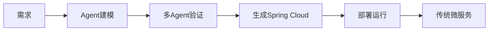
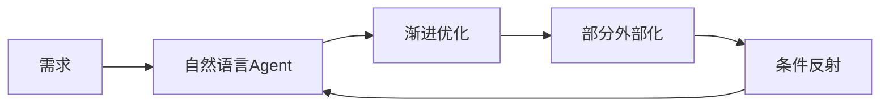
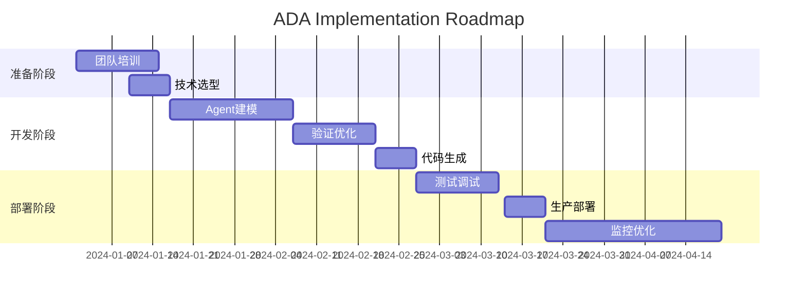

# ADA vs AIA：企业微服务架构的两种Agent范式

## 执行摘要

本文档比较了两种基于Agent的企业微服务架构方法：
- **ADA (Agent-Driven Architecture)**：Agent驱动架构 - 用Agent建模和生成传统微服务
- **AIA (Agent Is Architecture)**：Agent即架构 - Agent本身作为运行时微服务

关键结论：**ADA更适合当前企业采用，AIA代表未来方向**

---

## 一、概念定义

### ADA - Agent驱动架构
Agent作为**开发工具**，帮助设计、验证和生成传统微服务架构。



### AIA - Agent即架构
Agent作为**运行时组件**，直接构成微服务架构本身。



---

## 二、企业微服务场景对比

### 2.1 订单服务实现对比

#### ADA方式
```python
# Step 1: Agent建模
order_agent = Agent(
    specification="""
    订单服务：
    - 创建订单
    - 查询订单
    - 更新状态
    - 取消订单
    """
)

# Step 2: 生成Spring Boot代码
generated_code = """
@RestController
@RequestMapping("/orders")
public class OrderController {
    @PostMapping
    public Order createOrder(@RequestBody OrderDTO dto) {
        return orderService.create(dto);
    }

    @GetMapping("/{id}")
    public Order getOrder(@PathVariable Long id) {
        return orderService.findById(id);
    }
}
"""

# Step 3: 部署运行（Agent退出）
deploy_to_kubernetes(generated_code)
```

#### AIA方式
```python
# Step 1: Agent直接服务
class OrderAgent:
    def handle_request(self, request):
        # 自然语言理解
        if "创建订单" in request:
            return self.create_order(request)

        # 渐进优化：热路径外部化
        if self.is_crud_operation(request):
            return self.external_tool.execute(request)

        # 条件反射：高频模式
        if pattern := self.reflex_match(request):
            return self.instant_response(pattern)

        # 复杂逻辑：Agent思考
        return self.think(request)

# Agent永远在运行，持续优化
order_agent.run_forever()
```

---

## 三、核心差异分析

### 3.1 开发模式

| 维度 | ADA | AIA |
|------|-----|-----|
| **开发流程** | 设计→生成→部署 | 运行→观察→优化 |
| **迭代速度** | 需要重新生成 | 实时调整 |
| **代码形态** | Java/Spring代码 | 自然语言知识 |
| **测试方式** | 单元测试+集成测试 | 对话式验证 |
| **部署单元** | JAR/Docker镜像 | Agent实例 |

### 3.2 运行时特性

| 特性 | ADA | AIA |
|------|-----|-----|
| **性能** | ✅ 原生代码速度 | ⚠️ 需要推理时间 |
| **灵活性** | ❌ 修改需重新部署 | ✅ 实时适应 |
| **可预测性** | ✅ 确定性行为 | ⚠️ 可能有意外 |
| **资源消耗** | ✅ 传统JVM消耗 | ⚠️ 需要GPU/大内存 |
| **故障处理** | ❌ 代码崩溃即崩溃 | ✅ 可优雅降级 |

### 3.3 企业采用门槛

| 因素 | ADA | AIA |
|------|-----|-----|
| **技术栈兼容** | ✅ 生成标准Spring代码 | ⚠️ 需要Agent运行时 |
| **团队学习** | ✅ 沿用现有技能 | ❌ 需要新思维模式 |
| **监控运维** | ✅ 使用现有工具链 | ❌ 需要新的监控体系 |
| **合规审计** | ✅ 代码可审查 | ⚠️ 行为难预测 |
| **成本模型** | ✅ 一次生成多次运行 | ⚠️ 持续推理成本 |

---

## 四、实际案例：电商订单系统

### 场景描述
构建包含订单、支付、库存、物流四个核心服务的电商系统。

### 4.1 ADA实现路径

```yaml
Phase 1 - 建模（1-2周）:
  - 4个Agent分别建模各服务
  - Agent间模拟交互验证流程
  - 发现并解决集成问题

Phase 2 - 生成（3-5天）:
  - Generator Agent生成Spring Cloud代码
  - 生成API文档和测试代码
  - 生成Kubernetes部署文件

Phase 3 - 部署（1-2天）:
  - 代码审查和调整
  - CI/CD流水线部署
  - 传统微服务开始运行

维护模式:
  - 需求变更 → 重新建模 → 重新生成
  - Agent不参与运行时
```

### 4.2 AIA实现路径

```yaml
Phase 1 - 初始版本（2-3天）:
  - 4个Agent直接提供服务
  - 自然语言描述业务逻辑
  - 立即可用但性能不佳

Phase 2 - 渐进优化（持续）:
  Week 1: 识别CRUD操作，添加条件反射
  Week 2: 高频查询添加缓存
  Week 3: 关键路径外部化为Spring服务
  Week 4: 性能监控和自动优化

最终形态:
  - 80% 请求走条件反射（<10ms）
  - 15% 请求走外部工具（<100ms）
  - 5% 复杂请求Agent思考（>1s）
```

---

## 五、选型决策框架

### 5.1 选择ADA的场景

✅ **适合ADA的企业特征**：
- 有成熟的微服务技术栈（Spring Cloud等）
- 重视代码可控性和可审计性
- 性能要求严格（金融交易、实时系统）
- 团队不熟悉Agent技术
- 需要满足严格合规要求

✅ **适合ADA的项目特征**：
- 业务逻辑相对稳定
- 需要与现有系统深度集成
- 有明确的性能SLA要求
- 预算模型基于一次性开发

### 5.2 选择AIA的场景

✅ **适合AIA的企业特征**：
- 创新型企业，愿意尝试新技术
- 业务快速迭代，需求频繁变化
- 已有AI技术积累
- 重视系统灵活性超过性能

✅ **适合AIA的项目特征**：
- 业务规则复杂且经常变化
- 需要自然语言交互界面
- 原型验证或MVP开发
- 知识密集型应用

---

## 六、技术需求对比

### 6.1 ADA技术栈

```yaml
必需:
  - LLM API (GPT-4/Claude级别)
  - 代码生成能力
  - Spring Cloud/微服务框架
  - 传统CI/CD工具链

可选:
  - Agent框架 (LangChain等)
  - 代码质量工具
  - 自动化测试框架
```

### 6.2 AIA技术栈

```yaml
必需:
  - Agent运行时环境
  - LLM推理能力（本地或API）
  - 向量数据库（知识存储）
  - 消息队列（Agent通信）

可选:
  - GPU集群（本地推理）
  - 条件反射引擎
  - 外部工具框架
  - Agent监控平台
```

---

## 七、成本分析

### 7.1 ADA成本结构

| 成本项 | 一次性 | 持续性 | 规模 |
|--------|--------|--------|------|
| Agent建模 | ✅ 高 | ❌ 无 | 2-4周人力 |
| 代码生成 | ✅ 中 | ❌ 无 | API调用费 |
| 运行成本 | ❌ 无 | ✅ 低 | 传统服务器 |
| 维护成本 | ⚠️ 中 | ✅ 中 | 需重新生成 |

**总成本特点**：前期投入大，运行成本低

### 7.2 AIA成本结构

| 成本项 | 一次性 | 持续性 | 规模 |
|--------|--------|--------|------|
| 初始开发 | ✅ 低 | ❌ 无 | 1周人力 |
| Agent推理 | ❌ 无 | ✅ 高 | 按请求计费 |
| 优化成本 | ❌ 无 | ✅ 中 | 持续优化 |
| 基础设施 | ⚠️ 中 | ✅ 中 | GPU/内存 |

**总成本特点**：前期投入小，运行成本高但递减

---

## 八、风险评估

### 8.1 ADA风险

| 风险类型 | 概率 | 影响 | 缓解措施 |
|----------|------|------|----------|
| 生成代码有缺陷 | 中 | 高 | 充分测试+代码审查 |
| 需求理解偏差 | 中 | 中 | 迭代验证+原型确认 |
| 集成复杂度 | 低 | 中 | 标准化接口 |
| 维护困难 | 中 | 中 | 保留Agent建模能力 |

### 8.2 AIA风险

| 风险类型 | 概率 | 影响 | 缓解措施 |
|----------|------|------|----------|
| 性能不达标 | 高 | 高 | 条件反射+外部化 |
| 行为不可预测 | 中 | 高 | 严格测试+监控 |
| 成本超支 | 中 | 中 | 优化策略+缓存 |
| 技术栈不成熟 | 高 | 中 | 渐进式采用 |

---

## 九、实施路线图

### 9.1 ADA实施路线（6个月）



### 9.2 AIA实施路线（渐进式）

```yaml
Month 1 - MVP:
  - 部署基础Agent
  - 实现核心功能
  - 收集使用数据

Month 2 - 优化:
  - 识别热点路径
  - 添加条件反射
  - 性能调优

Month 3 - 外部化:
  - 关键功能外部化
  - 混合架构运行
  - A/B测试

Month 4-6 - 成熟:
  - 持续优化
  - 扩展功能
  - 生产就绪
```

---

## 十、结论与建议

### 10.1 核心洞察

1. **ADA是过渡，AIA是未来**
   - ADA适合当前企业技术成熟度
   - AIA代表架构演进方向
   - 可以从ADA逐步过渡到AIA

2. **选择依据**
   - **技术成熟度**：低→ADA，高→AIA
   - **业务稳定性**：稳定→ADA，多变→AIA
   - **性能要求**：严格→ADA，灵活→AIA
   - **成本模型**：一次性→ADA，持续→AIA

### 10.2 企业建议

#### 对于传统企业
```yaml
推荐路径: ADA优先
原因:
  - 风险可控
  - 与现有体系兼容
  - 团队容易接受
策略:
  - 先用ADA生成基础架构
  - 保留Agent建模能力
  - 逐步引入AIA特性
```

#### 对于创新企业
```yaml
推荐路径: AIA试点
原因:
  - 快速迭代
  - 差异化竞争
  - 技术领先
策略:
  - 非关键系统先试点
  - 收集数据和经验
  - 逐步推广到核心系统
```

### 10.3 未来展望

**2024-2025**：ADA为主，AIA试点
**2025-2027**：ADA/AIA混合架构
**2027以后**：AIA成为主流

关键转折点将是：
- Agent自我认知能力的突破
- 推理成本降到可接受水平
- 企业级Agent运行时成熟

---

## 附录A：技术术语表

| 术语 | 定义 |
|------|------|
| Agent | 具有自主能力的智能程序 |
| 条件反射 | 模式匹配后的即时响应机制 |
| 外部化 | 将Agent功能转为传统代码 |
| 自我认知 | Agent理解和修改自身的能力 |
| Generator Agent | 专门生成代码的Agent |

## 附录B：参考实现

- ADA示例：https://github.com/example/ada-demo
- AIA示例：https://github.com/example/aia-demo
- 条件反射路由器：见本项目examples/

## 附录C：评估清单

```yaml
ADA评估项:
  ☐ 团队是否熟悉Spring Cloud
  ☐ 是否有代码审查流程
  ☐ 性能要求是否明确
  ☐ 是否接受重新生成的成本

AIA评估项:
  ☐ 团队是否理解Agent架构
  ☐ 是否接受推理延迟
  ☐ 是否有GPU资源
  ☐ 业务是否需要高灵活性
```