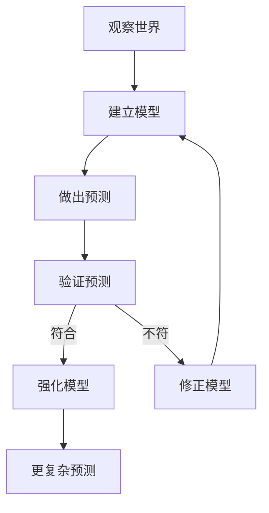
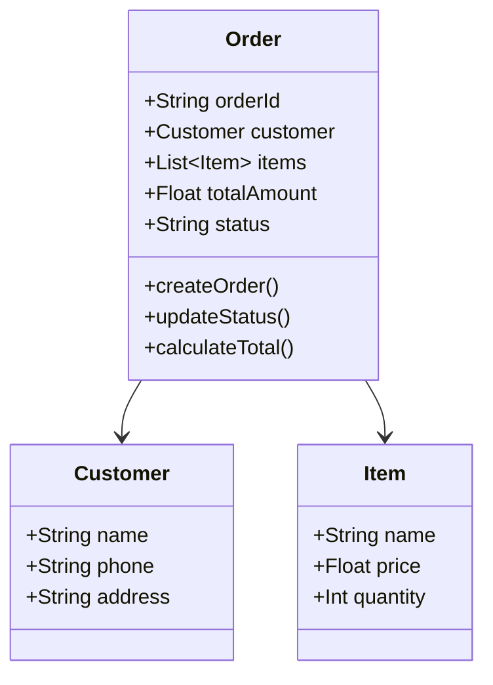
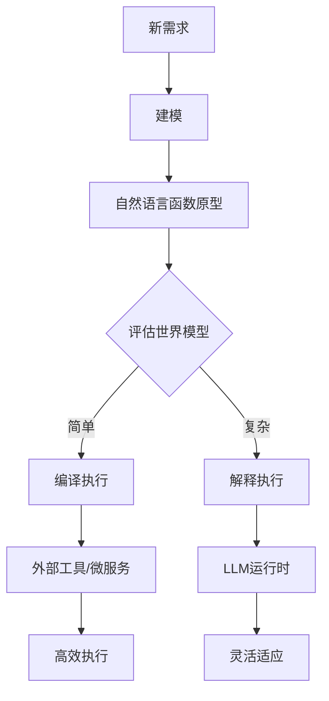
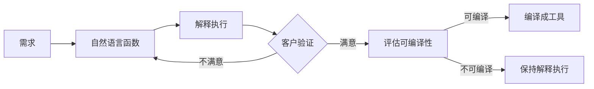
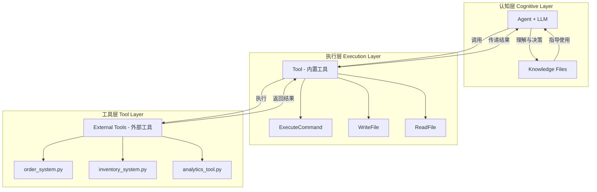
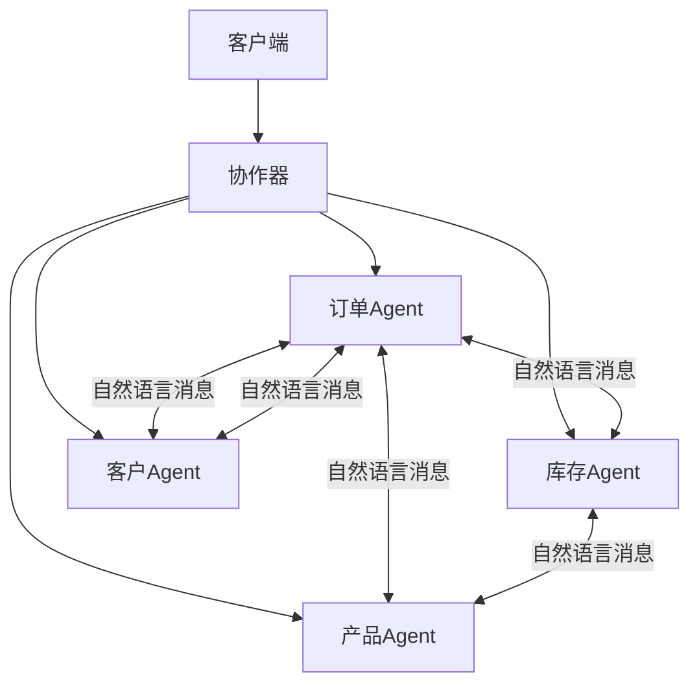
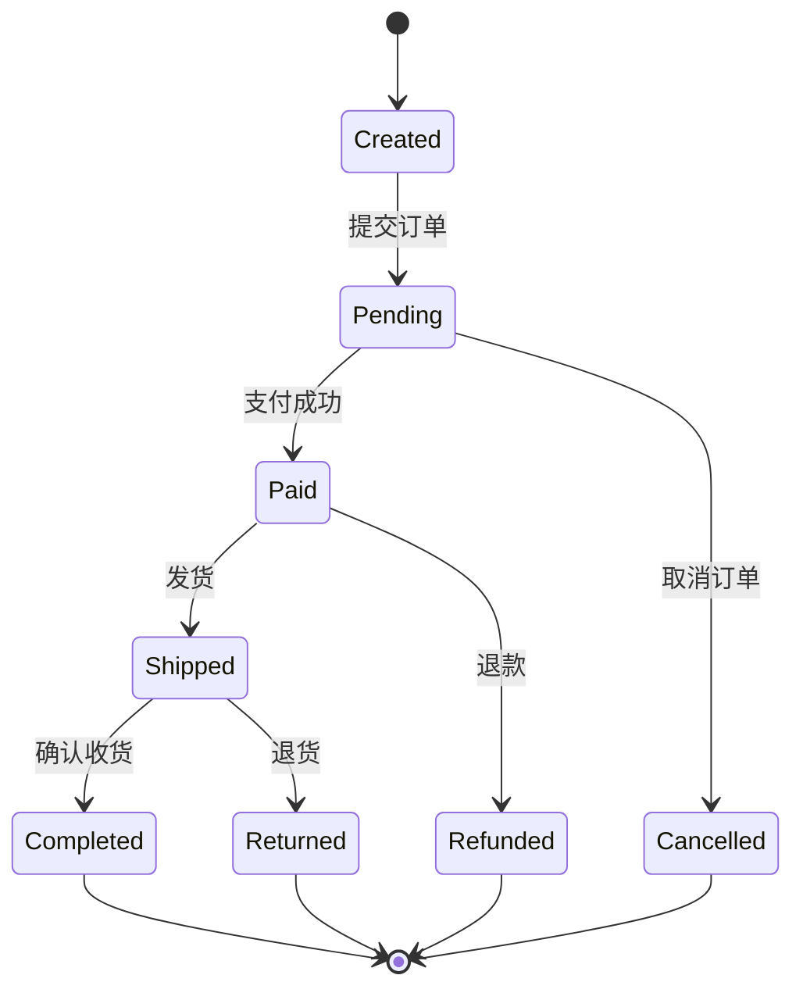

# 自适应软件开发范式：从UML到智能工具

## 1. 核心理念

### 1.1 建模是一切的本质

> **"编程的本质是建模，不是编码。智能的本质就是建模。如果理论无法对外部世界建模，就是不可证伪，就是形而上学、宗教、占星术。"**

三个等价命题：
- **编程的本质 = 建模**（对问题域建模）
- **智能的本质 = 建模**（对世界建模）
- **科学的本质 = 建模**（对自然建模）

### 1.2 可证伪性：区分科学与伪科学

根据波普尔的科学划界标准：

| 类型 | 建模能力 | 可证伪性 | 例子 |
|------|---------|----------|------|
| **真智能** | 建立世界模型 | 预测可验证/反驳 | "订单创建会扣减库存"（可验证） |
| **伪智能** | 仅模式匹配 | 无法验证 | "一切皆有可能"（空话） |
| **形而上学** | 无模型 | 不可证伪 | "命运天注定"（无法反驳） |

### 1.3 自适应实现策略

软件系统根据其**世界模型复杂度**选择不同的实现策略：
- **简单世界模型** → 编译执行（编译成Python/Java/C#）
- **复杂世界模型** → 解释执行（LLM理解并执行）

## 2. 科学方法与软件开发的统一

### 2.1 建模-验证循环



这个循环同时适用于：
- **科学研究**：观察现象 → 建立理论 → 实验验证
- **智能系统**：输入数据 → 建立模型 → 预测输出
- **软件开发**：理解需求 → 建模设计 → 运行验证

### 2.2 为什么传统编程不是智能

**传统编程**：
```
需求 → 编码 → 测试
（机械翻译，没有真正建模）
```

**智能开发**：
```
观察 → 建模 → 验证 → 优化
（真正理解世界）
```

关键区别：
- 传统程序只是**规则执行器**，没有世界模型
- 智能系统能**建立和修正模型**，适应新情况

## 3. 四步开发流程：解决UML不可执行的历史难题

### 历史痛点与突破
> **"我做了很多年的软件架构师，知道这是最佳实践。以前有个痛点，UML不可执行。现在这个痛点解决了。"**

**传统痛点**：
- UML是死的图表，无法验证正确性
- 从UML到代码存在巨大鸿沟
- 需求理解错误要到编码后才发现

**革命性突破**：
- 自然语言函数 = 可执行的UML
- 建模即可运行，立即验证
- 错误在建模阶段就能发现

### Step 1: 建模（自然语言 + Mermaid）

**为什么是自然语言而非UML？**
- 自然语言可被LLM直接执行
- Mermaid提供可视化结构
- 建模结果立即可验证

**示例：订单系统建模**



**自然语言描述**：
```
订单系统管理客户的购买行为。
每个订单包含客户信息、商品列表和状态。
状态流转：pending → paid → shipped → completed
业务规则：VIP客户8折，满1000减100
```

### Step 2: 自然语言函数执行（可执行的建模）

**关键原则**：
> **即使是可编译模型，也要先做自然语言函数，解释执行验证可行性，再做编译。**

这是最佳实践，因为：
1. **早期验证**：在建模阶段就发现问题
2. **低成本试错**：修改自然语言比改代码便宜
3. **需求确认**：让用户看到"活的"原型
4. **平滑过渡**：验证后的模型可直接编译

使用自然语言函数快速验证业务逻辑：

```markdown
## 函数：创建订单
接收客户信息和商品列表，
验证库存，计算价格（考虑折扣），
生成订单号，保存订单。

## 函数：更新订单状态
验证状态转换合法性，
更新状态，记录日志，
触发相应业务流程。
```

**执行验证**：
```python
agent.execute(task="为张三创建订单，购买iPhone，使用VIP折扣")
# 观察执行过程，验证业务逻辑
```

### Step 3: 评估可编译性（两维度分析）

#### 3.1 可编译性的两个关键维度

**维度1：世界模型复杂度**
- 简单模型 → 可编译
- 复杂模型 → 需解释执行

**维度2：模型来源（人造 vs 自然）**
- 人造模型 → 天然可编译
- 自然模型 → 编译困难

#### 3.2 为什么人造模型天然可编译

**关键洞察**：
> 人造模型（订单系统、企业管理、社会制度）是人类创造的规则系统，可以脱离物理世界进行正确性验证（单元测试）。自然模型（天气、生物、物理）需要在真实世界中验证，成本极高。

**验证成本对比**：
| 模型类型 | 例子 | 验证方式 | 验证成本 |
|---------|------|----------|----------|
| **人造模型** | 订单系统 | 单元测试 | 低（毫秒级） |
| **人造模型** | 税务系统 | 规则验证 | 低（纯逻辑） |
| **自然模型** | 天气预报 | 等待天气 | 高（需要时间） |
| **自然模型** | 药物效果 | 临床试验 | 极高（需要年） |

#### 3.3 可编译性评估矩阵

| 维度 | 人造模型 | 自然模型 |
|------|---------|----------|
| **简单** | ✅ 强可编译<br>订单、CRUD、状态机 | ⚠️ 理论可编译<br>简单物理定律 |
| **复杂** | ⚡ 中等可编译<br>企业ERP、政府系统 | ❌ 不可编译<br>生态系统、人类行为 |

#### 3.4 判断标准细化

| 特征 | 可编译 | 不可编译 |
|------|--------|----------|
| **复杂度** | 规则明确 | 需要推理 |
| **模型来源** | 人造系统 | 自然现象 |
| **验证方式** | 单元测试 | 实世界验证 |
| **验证成本** | 低（秒级） | 高（天/年级） |
| **确定性** | 100%确定 | 概率性 |
| **可证伪性** | 强 | 弱 |

**订单系统评估**：
- ✅ 规则确定（状态机明确）
- ✅ 上下文独立（每个订单独立）
- ✅ 异常可枚举（库存不足、支付失败）
- ✅ 业务稳定（订单流程标准）
- ✅ 无创造性（纯业务逻辑）

**结论**：简单世界模型 → 可以编译成外部工具

### Step 4: 编译成外部工具（如需要）

**自动生成FastAPI服务**：

```python
from fastapi import FastAPI, HTTPException
from pydantic import BaseModel
from typing import List
import sqlite3

app = FastAPI()

class OrderCreate(BaseModel):
    customer_name: str
    customer_phone: str
    items: List[dict]
    discount: float = 0

@app.post("/orders")
def create_order(order: OrderCreate):
    """从自然语言函数编译而来"""
    # 验证库存
    # 计算价格
    # 生成订单号
    # 保存数据库
    return {"order_id": "...", "total": "..."}

@app.get("/orders/{customer}")
def query_orders(customer: str):
    """从自然语言函数编译而来"""
    # 查询数据库
    return orders

@app.patch("/orders/{order_id}/status")
def update_status(order_id: str, new_status: str):
    """从自然语言函数编译而来"""
    # 验证状态转换
    # 更新数据库
    return {"status": new_status}
```

## 3. 决策树



## 4. 实际案例分类（基于两维度分析）

### 4.1 强可编译（人造+简单）
✅ **完全人造系统**：
- 订单管理系统（商业规则）
- 用户认证系统（安全规则）
- 库存管理系统（库存规则）
- 支付网关（支付规则）
- 税务计算（税法规则）
- 会计系统（会计准则）
- 投票系统（选举规则）

**特点**：人类定义的规则，可完全单元测试

### 4.2 中等可编译（人造+复杂）
⚡ **复杂人造系统**：
- 企业ERP（业务流程复杂）
- 政府管理系统（政策复杂）
- 银行核心系统（规则繁多）
- 供应链系统（多方协作）

**特点**：规则复杂但仍是人造，可分模块编译

### 4.3 弱可编译（自然+简单）
⚠️ **简单自然规律**：
- 物理计算（牛顿定律）
- 简单化学反应
- 基础几何计算

**特点**：规律简单但需实验验证

### 4.4 不可编译（自然+复杂）
❌ **复杂自然系统**：
- 天气预报（混沌系统）
- 医疗诊断（生物复杂性）
- 生态预测（系统复杂）
- 人类行为（心理复杂）
- 股市预测（群体行为）
- 创意设计（创造性）

**特点**：需要真实世界验证，成本极高

### 混合模式
某些系统可以混合使用：
- **电商平台**：
  - 订单处理 → 外部工具
  - 商品推荐 → 自然语言函数
  - 客服对话 → 自然语言函数
  
- **企业系统**：
  - 数据CRUD → 外部工具
  - 报表生成 → 外部工具
  - 智能分析 → 自然语言函数

## 5. 优势分析

### 效率优势
| 阶段 | 传统开发 | 新范式 |
|------|---------|--------|
| 需求分析 | 2周 | 2小时（UML+自然语言） |
| 原型开发 | 1月 | 1天（自然语言函数） |
| 测试验证 | 2周 | 实时（执行即测试） |
| 生产优化 | 1月 | 1周（编译成工具） |

### 成本优势
- **探索成本低**：自然语言函数快速试错
- **生产成本低**：简单任务不消耗LLM
- **维护成本低**：知识文件易于理解

### 适应性优势
- **需求变化**：修改自然语言描述即可
- **复杂度变化**：可以随时切换实现方式
- **技术演进**：工具层可独立升级

## 6. 实施建议

### Phase 1: 建立评估标准
1. 定义世界模型复杂度指标
2. 建立决策矩阵
3. 积累案例库

### Phase 2: 工具链建设
1. UML到自然语言函数转换器
2. 自然语言函数到代码编译器
3. 性能监控和切换机制

### Phase 3: 实践优化
1. A/B测试（工具 vs 函数）
2. 性能基准测试
3. 成本效益分析

## 7. 哲学思考

### 7.1 建模的层次与智能的本质

```
科学方法 = 建模 + 验证
智能系统 = 建模 + 预测  
编程活动 = 建模 + 实现

核心都是：对世界建模
```

**深刻洞察**：
> "不能建模的系统不是智能，不能验证的模型不是科学"

这解释了：
- **为什么LLM是真智能**：能建立世界模型并做出可验证预测
- **为什么数据库不是智能**：只存储不建模
- **为什么占星术不是科学**：预测模糊不可证伪

### 7.2 智能的分层与执行模式

```
高阶智能（创造、理解）→ 自然语言函数 → 解释执行（LLM）
 ↓ 可以降级为
低阶智能（规则、流程）→ 外部工具 → 编译执行（传统程序）
```

**执行模式对比**：
| 模式 | 特点 | 适用场景 |
|------|------|----------|
| **解释执行** | 灵活、理解语义、适应性强 | 复杂推理、创造性任务 |
| **编译执行** | 高效、确定性、成本低 | 规则明确、重复性任务 |

### 7.3 软件的本质重新定义

**传统观点**：
```
软件 = 算法 + 数据结构（Wirth, 1976）
```

**新观点**：
```
软件 = 世界模型 + 执行策略
```

其中：
- **简单世界模型** = 可形式化规则 → 编译执行
- **复杂世界模型** = 不可形式化理解 → 智能执行

### 7.4 编程范式的演进

```
1. 机械时代：人类写代码 → 机器执行
2. 理解时代：人类写意图 → LLM理解 → 生成代码 → 机器执行
3. 智能时代：人类建模型 → 系统自动选择 → [解释执行 | 编译执行]
```

**执行策略的智能选择**：
```
if (模型复杂度高 && 需要理解语义) {
    return 解释执行;  // LLM运行时
} else {
    return 编译执行;  // 传统程序
}
```

**最终形态**：
```
编程 = 建模 + 验证
不再是编码，而是教会机器理解世界
```

## 8. 关键洞察

### 8.1 可编译性的深层规律

> **"人造模型天然可编译，因为验证不需要物理世界"**

这解释了为什么：
- **商业软件易开发**：都是人造规则
- **科学软件难开发**：需要实验验证
- **社会系统可数字化**：法律、金融都是人造的

### 8.2 智能资源的合理分配

1. **人造简单系统** → 直接编译（无需智能）
2. **人造复杂系统** → 模块化编译（部分智能）
3. **自然简单系统** → 公式化编译（已验证规律）
4. **自然复杂系统** → 解释执行（需要智能）

### 8.3 验证成本决定架构

**低成本验证（人造）**：
```
编写 → 单元测试 → 编译 → 部署
```

**高成本验证（自然）**：
```
假设 → 实验 → 修正 → 持续学习（LLM）
```

### 8.4 软件工程的新分类

不再按技术栈分类，而是按**模型来源**分类：
- **人造系统工程**：企业软件、政府系统
- **自然系统工程**：科学计算、AI预测
- **混合系统工程**：自动驾驶、机器人

## 9. 最佳实践：先解释后编译

### 9.1 为什么这是最佳实践

**软件架构师的经验**：
1. **需求总是不完整的**：客户说不清楚想要什么
2. **理解总有偏差**：架构师的理解 ≠ 客户的意图
3. **错误发现越晚越贵**：编码后改需求成本极高

**解决方案**：
```
自然语言建模 → 解释执行验证 → 客户确认 → 编译优化
```

### 9.2 实践流程



### 9.3 案例对比

**传统方式（瀑布）**：
```
需求文档(2周) → 设计(1周) → 编码(1月) → 测试(2周) → 返工(？)
总计：2月+
```

**新范式**：
```
自然语言函数(2小时) → 解释执行(立即) → 验证(1天) → 编译(1周)
总计：1周
```

## 10. Agent系统三层架构设计

### 10.1 架构概述

Agent系统模仿人类文明的进化模式，将系统分为三个层次：大脑（思考）、身体（基础能力）和外部工具（文明产物）。这种设计确保了系统的稳定性、可扩展性和进化能力。



### 10.2 三层架构详解

#### 认知层（Cognitive Layer）- 大脑

**组成**：
- Agent + LLM：理解任务、制定计划、做出决策
- Knowledge Files：存储如何使用工具的知识

**职责**：
- 理解用户意图
- 分解复杂任务
- 选择合适的工具
- 协调工具执行
- 学习和积累经验

**特点**：
- 持续进化（通过知识积累）
- 高度灵活（理解自然语言）
- 具有世界模型（理解因果）

#### 执行层（Execution Layer）- 身体

**组成**：
- ExecuteCommand：执行外部命令
- WriteFile：创建文件
- ReadFile：读取文件
- 其他基础Tool

**职责**：
- 提供基础执行能力
- 连接认知层和工具层
- 处理输入输出

**特点**：
- 保持稳定（不轻易改变）
- 接口简单（易于使用）
- 通用性强（不绑定具体业务）

#### 工具层（Tool Layer）- 外部工具

**组成**：
- 独立的Python程序
- 专用的数据库
- 特定的算法实现

**职责**：
- 执行具体业务逻辑
- 管理持久化数据
- 提供专业能力

**特点**：
- 独立进化（可单独升级）
- 可替换（接口一致即可）
- 专业化（针对特定领域）

### 10.3 设计原则

#### 进化原则

```
人类文明进化模式          Agent系统进化模式
----------------          ----------------
身体不变                  Tool层保持稳定
知识增长                  Knowledge持续更新
工具进步                  External Tools独立进化
```

#### 分离原则

| 层次 | 关注点 | 变化频率 | 复杂度 |
|------|--------|----------|--------|
| 认知层 | What & Why | 高 | 高 |
| 执行层 | How (基础) | 低 | 低 |
| 工具层 | How (具体) | 中 | 中 |

#### 接口原则

**命令行接口标准**：
```bash
# 标准格式
python tool_name.py <command> [args...]

# 返回格式
JSON格式，包含成功结果或错误信息
```

### 10.4 与传统架构对比

| 特性 | 传统微服务架构 | 三层Agent架构 |
|------|---------------|--------------|
| 接口定义 | 需要精确API | 自然语言描述 |
| 集成成本 | 高（需要编码） | 低（Agent理解） |
| 灵活性 | 低（固定接口） | 高（语义理解） |
| 维护成本 | 高（版本管理） | 低（知识更新） |
| 学习曲线 | 陡峭 | 平缓 |

### 10.5 架构优势

1. **认知优势**：Agent理解意图，不需要精确指令
2. **进化优势**：工具独立进化，不影响系统稳定性
3. **复用优势**：基础Tool通用，外部工具专业化
4. **维护优势**：知识文件易于理解和修改
5. **测试优势**：外部工具可独立测试

### 10.6 何时创建外部工具

✅ **适合场景**：
- 需要持久化存储（数据库）
- 复杂的业务逻辑
- 性能敏感的计算
- 需要事务支持
- 多Agent共享的功能

❌ **不适合场景**：
- 简单的文本处理
- 一次性脚本
- 纯UI操作
- 临时数据处理

### 10.7 外部工具设计准则

1. **单一职责**：每个工具专注一个领域
2. **命令行接口**：统一使用命令行+JSON
3. **错误处理**：返回清晰的错误信息
4. **幂等性**：重复执行不产生副作用
5. **版本兼容**：保持向后兼容

### 10.8 知识文件编写规范

```markdown
## 函数：[功能名称]

### 用途
[简要说明功能用途]

### 调用方式
python [tool_name].py [command] [参数说明]

### 示例
[具体的调用示例]

### 注意事项
[使用时的注意事项]
```

### 10.9 哲学思考：架构模仿自然

#### 文明的本质

人类文明的进步不是通过改变身体，而是通过创造更好的工具。同样，Agent系统的进化也应该遵循这个模式：

- **身体（Tool）保持稳定**：就像人类的手几万年没变
- **工具不断进化**：从石器到量子计算机
- **知识持续积累**：从口述到维基百科

#### 智能的本质

智能不是执行指令的能力，而是理解世界并使用工具改变世界的能力：

```
智能 = 理解（Agent+LLM） + 执行（Tool） + 创造（External Tools）
```

#### 架构的本质

好的架构模仿自然：
- 大脑负责思考（认知层）
- 身体提供基础能力（执行层）
- 工具扩展能力（工具层）

这种分层不是技术选择，而是认知规律的体现。

## 11. 实际案例：订单系统的完整流程

### 11.1 实现案例：订单系统

#### 文件结构

```
react_is_all_you_need/
├── core/
│   └── react_agent_minimal.py      # Agent核心
├── knowledge/
│   ├── external_tools_usage.md     # 工具使用知识
│   └── order_system_knowledge.md   # 订单领域知识
├── external_tools/
│   ├── order_system.py            # 订单管理工具
│   ├── inventory_system.py        # 库存管理工具
│   └── customer_system.py         # 客户管理工具
└── examples/
    └── external_tool_demo.py      # 使用示例
```

#### 知识文件示例

```markdown
# 订单系统外部工具使用

## 创建订单
调用命令：
python order_system.py create "{客户名}" "{电话}" '{商品JSON}' {折扣}

示例：
python order_system.py create "张三" "13800138000" '[{"name":"iPhone","price":8999}]' 0.2
```

#### 外部工具实现

```python
class OrderSystem:
    """订单管理外部工具"""
    
    def __init__(self, db_path):
        self.conn = sqlite3.connect(db_path)
        self._init_tables()
    
    def create_order(self, customer, items, discount):
        # 业务逻辑实现
        pass
    
    def query_orders(self, filters):
        # 查询逻辑实现
        pass
```

#### Agent调用示例

```python
agent = ReactAgentMinimal(
    knowledge_files=["knowledge/external_tools_usage.md"]
)

result = agent.execute(task="""
    为客户张三创建一个订单，购买iPhone，使用VIP折扣
""")
```

### 11.2 微服务架构 + 自然语言函数

这是一个革命性的微服务实现：**用自然语言函数替代传统API**。



#### 核心创新

1. **自然语言替代API**
   - 传统：`POST /api/orders` + JSON Body
   - 新范式："为客户CUST001创建订单，购买iPhone和AirPods"

2. **语义理解替代协议**
   - 无需定义精确的API接口
   - Agent通过理解语义自动协作
   - 灵活处理各种请求格式

3. **知识驱动替代代码**
   - 每个服务的逻辑在知识文件中
   - 修改业务规则只需更新Markdown
   - 非程序员也能理解和修改

#### 协作流程示例

```
1. 客户端 → 协作器："为VIP客户创建订单"
2. 协作器 → 客户服务："获取客户信息和折扣"
3. 协作器 → 产品服务："获取商品价格"
4. 协作器 → 库存服务："检查库存"
5. 协作器 → 订单服务："创建订单"
6. 订单服务 → 库存服务："扣减库存"
7. 完成
```

#### 优势对比

| 特性 | 传统微服务 | 自然语言微服务 |
|------|-----------|---------------|
| API定义 | 需要精确定义 | 自然语言描述 |
| 接口文档 | Swagger/OpenAPI | Markdown知识文件 |
| 版本管理 | API版本地狱 | 语义兼容 |
| 集成测试 | 复杂 | 自然语言测试 |
| 学习曲线 | 陡峭 | 平缓 |
| 灵活性 | 低 | 高 |

### Step 1: UML建模


### Step 2: 自然语言函数验证
```
执行32轮，验证所有业务逻辑正确
```

### Step 3: 评估
```
维度1：简单世界模型（状态机明确，规则固定）✅
维度2：人造模型（商业规则，可单元测试）✅
结论：强可编译
```

### Step 4: 编译成外部工具
```python
# 2轮完成同样的任务
# 效率提升16倍
```

## 12. 实证验证：订单系统案例

### 验证数据
- **自然语言函数**：32轮完成（探索阶段）
- **外部工具**：2轮完成（生产阶段）
- **效率提升**：16倍
- **预测验证**：库存扣减、状态流转全部正确

### 可证伪性检验
1. **预测**：创建订单会扣减库存
2. **验证**：库存从8变为7 ✅
3. **结论**：模型正确，可编译为工具

## 13. 结论：从编码到建模的范式转换

### 13.1 解决了软件工程的历史难题

**UML的梦想与现实**：
- **梦想**（1990s）：图形化建模，自动生成代码
- **现实**：UML成了画图工具，无法执行验证
- **痛点**：架构师的设计无法直接验证

**自然语言函数的突破**：
- **可执行的建模**：模型立即可运行
- **实时验证**：设计错误立即发现
- **平滑演进**：从原型到生产无缝过渡

> **"作为多年软件架构师，我知道'先解释执行，后编译'是最佳实践。现在终于有了完美的工具。"**

这个四步流程是**革命性的**，因为它统一了三个领域：

### 13.2 理论贡献

**统一框架**：
```
科学 = 建模 + 实验验证
智能 = 建模 + 预测学习
编程 = 建模 + 自适应执行（解释/编译）
```

### 13.3 实践价值

1. **理论正确**：基于可证伪性的科学方法
2. **实践可行**：订单系统已完整验证
3. **经济高效**：探索便宜，生产高效
4. **适应性强**：根据模型复杂度自动选择

### 13.4 哲学意义

这不仅是一个开发流程，更是对三个本质问题的回答：

1. **什么是智能？**
   > 智能是建立世界模型并做出可验证预测的能力

2. **什么是科学？**
   > 科学是建立可证伪模型并通过实验验证的方法

3. **什么是编程？**
   > 编程是将世界模型转化为可执行系统的过程

### 13.5 最终愿景

```
过去：程序员写代码
现在：程序员建模型
未来：模型自动选择最优执行策略
```

**核心转变**：
- 从**编码**到**建模**
- 从**机械执行**到**智能理解**
- 从**固定实现**到**自适应选择**

### 13.6 三层架构的核心洞察

三层架构不仅是一种软件设计模式，更是对人类认知和文明进化的深刻理解。通过将系统分为认知层、执行层和工具层，我们创造了一个既稳定又能持续进化的系统。

**核心洞察**：
1. 进化应该发生在正确的地方（知识和工具，而非基础能力）
2. 复杂性应该被封装在合适的层次
3. 接口应该符合人类认知（自然语言优于API）
4. 系统应该模仿成功的模式（人类文明）

这个架构证明了：**简单的基础 + 丰富的工具 + 智能的协调 = 无限的可能**。

```
过去：程序员写代码
现在：程序员建模型
未来：模型自动选择最优执行策略
```

**核心转变**：
- 从**编码**到**建模**
- 从**机械执行**到**智能理解**
- 从**固定实现**到**自适应选择**

---

> **"编程的本质是建模，不是编码。我们不是在写程序，而是在教会机器理解世界。"**

*这是软件工程的下一次革命：从代码时代到模型时代。*

*"我们不是在构建软件，而是在构建文明的延续。"*