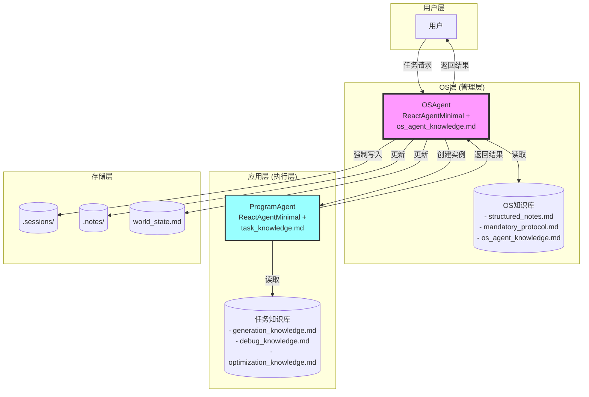
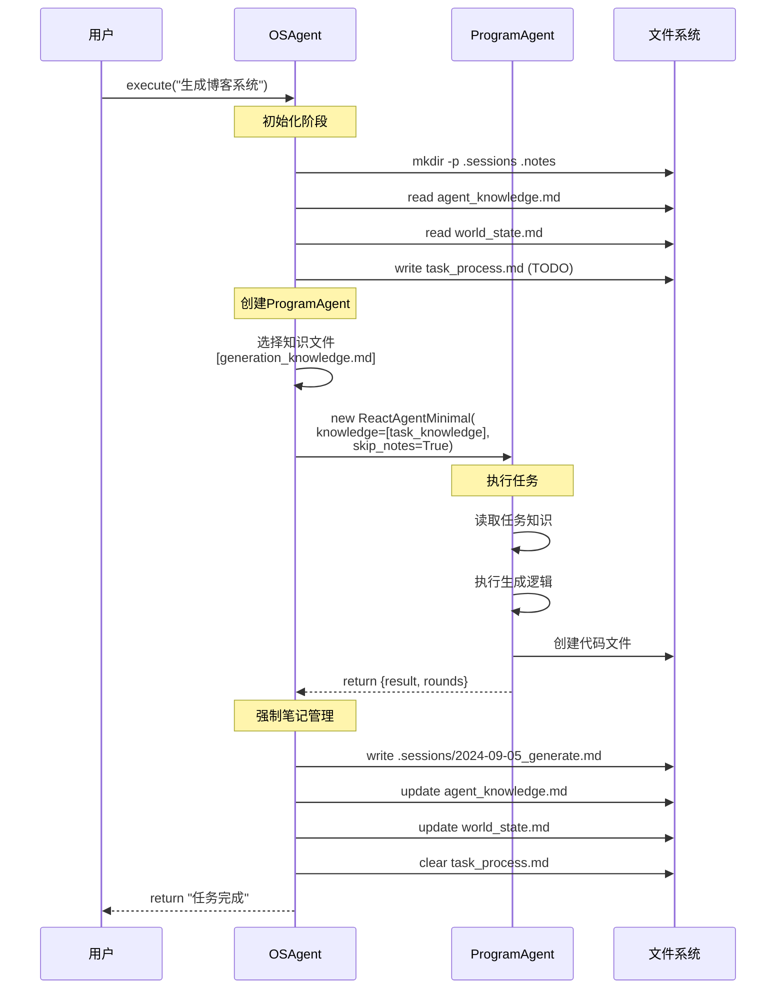
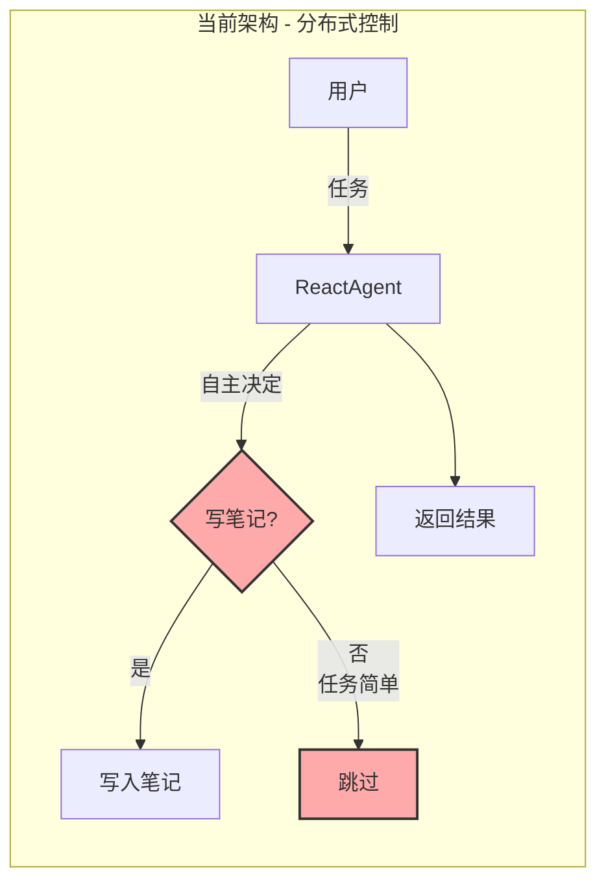
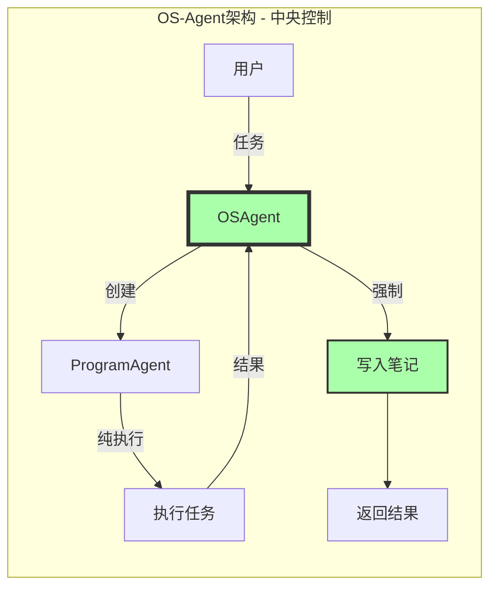
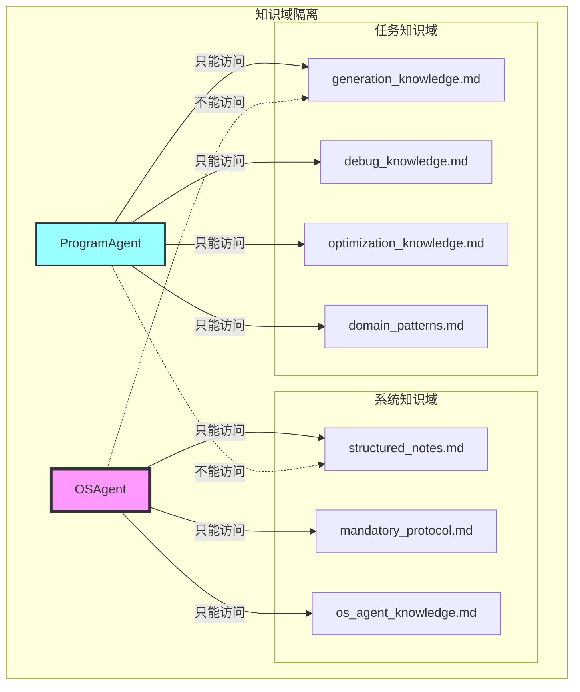
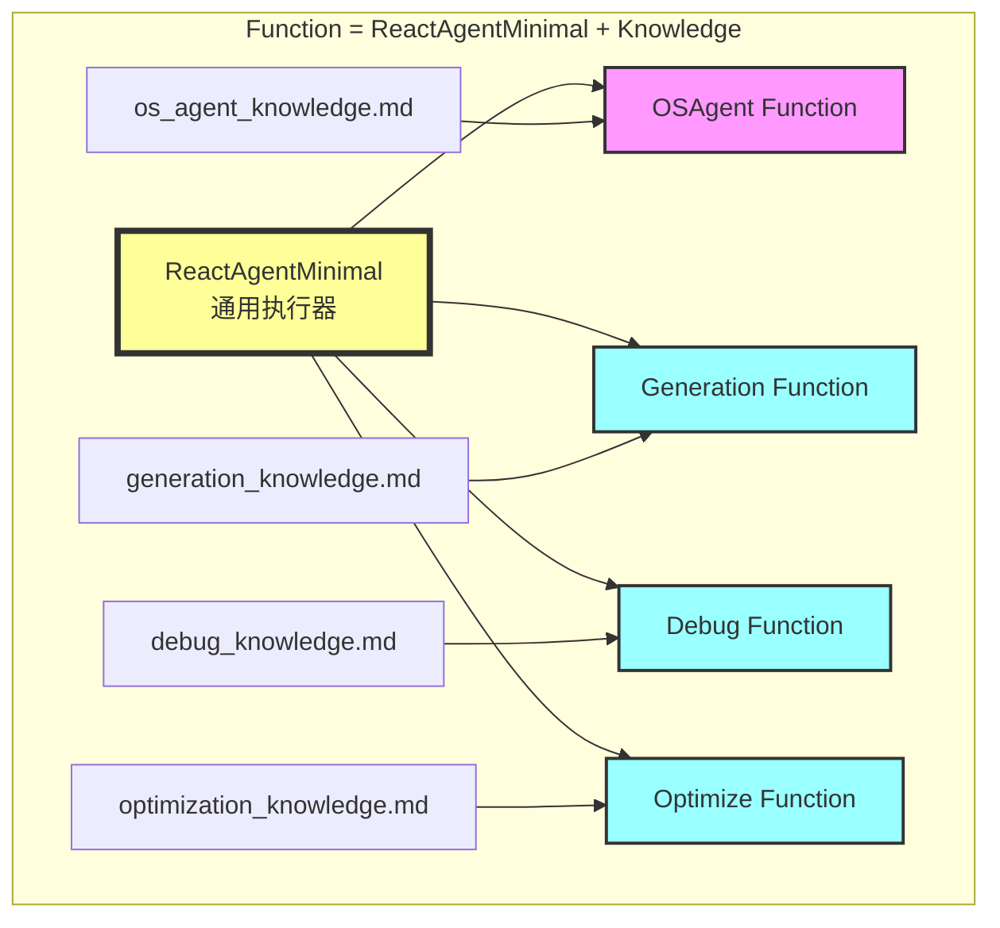
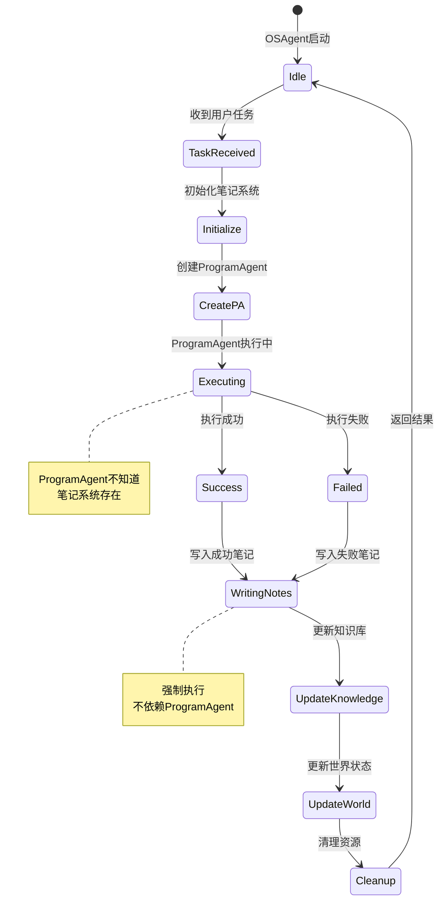
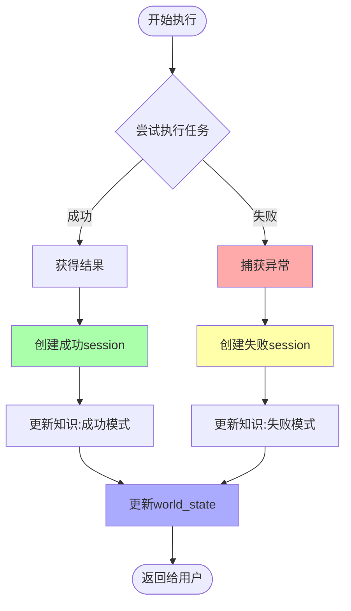

# OS-Agent与Program-Agent交互架构图

## 1. 整体架构图



## 2. 执行时序图



## 3. 控制流对比图

### 3.1 当前架构（脆弱）



### 3.2 OS-Agent架构（强壮）



## 4. 知识隔离图



## 5. Function组合图



## 6. 生命周期管理图



## 7. 错误处理流程图



## 8. Linux类比图

```mermaid
graph TD
    subgraph "Linux内核架构"
        Kernel[Linux Kernel]
        Process[User Process]
        PageTable[(Page Table)]
        VFS[(VFS)]
        
        Kernel -->|fork()| Process
        Process -->|malloc()| Kernel
        Kernel -->|管理| PageTable
        Kernel -->|管理| VFS
    end
    
    subgraph "OS-Agent架构"
        OSAgent1[OSAgent]
        ProgramAgent1[ProgramAgent]
        Notes1[(.notes/)]
        Sessions1[(.sessions/)]
        
        OSAgent1 -->|创建| ProgramAgent1
        ProgramAgent1 -->|返回结果| OSAgent1
        OSAgent1 -->|管理| Notes1
        OSAgent1 -->|管理| Sessions1
    end
    
    Kernel -.->|对应| OSAgent1
    Process -.->|对应| ProgramAgent1
    PageTable -.->|对应| Notes1
    VFS -.->|对应| Sessions1
    
    style Kernel fill:#f9f
    style OSAgent1 fill:#f9f
    style Process fill:#9ff
    style ProgramAgent1 fill:#9ff
```

## 关键点总结

1. **控制权永不转移**：OSAgent始终掌控全局
2. **知识域隔离**：系统知识与任务知识完全分离
3. **结构性保证**：笔记创建是结构化的，不是可选的
4. **Function组合**：通过知识组合创建不同的Agent Function
5. **生命周期管理**：OSAgent负责ProgramAgent的完整生命周期

这个架构通过清晰的层次分离和控制流设计，确保了笔记系统的可靠性和系统的健壮性。