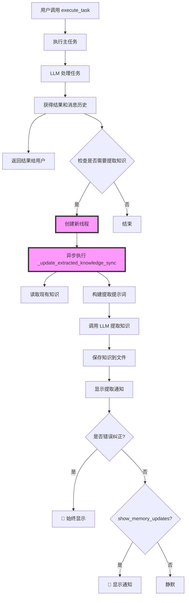

# 异步知识提取执行流程

## 执行流程图



## 详细步骤说明

### 1. 主线程执行流程

```python
def execute_task(self, task: str) -> str:
    # 1. 执行主任务（同步）
    result = self._execute_internal_task(task)
    
    # 2. 立即返回结果给用户
    return output
    
    # 3. 同时启动异步知识提取（如果满足条件）
```

### 2. 触发条件

```python
# 在 execute_task 方法末尾（约1458行）
if "messages" in result and self.config.knowledge_extraction_limit > 0:
    # 只有当：
    # 1. 有消息历史（result["messages"]）
    # 2. 启用了知识提取（knowledge_extraction_limit > 0）
    # 才会触发异步提取
```

### 3. 异步执行机制

```python
# 创建新线程（约1460行）
knowledge_thread = threading.Thread(
    target=self._update_extracted_knowledge_sync,  # 执行的方法
    args=(result["messages"],),                     # 传入消息历史
    daemon=False,                                   # 非守护线程，确保完成
    name=f"knowledge_extraction_{self.name}"
)
knowledge_thread.start()  # 启动线程

# 跟踪线程（确保程序退出时等待完成）
_memory_update_threads.append(knowledge_thread)
```

### 4. 知识提取过程

```python
def _update_extracted_knowledge_sync(self, messages):
    # 1. 读取已有知识
    existing_knowledge = self.knowledge_file.read_text()
    
    # 2. 格式化任务历史
    task_history = self._format_messages_for_memory(messages)
    
    # 3. 构建提示词，让 LLM 提取知识
    prompt = self._build_knowledge_extraction_prompt(
        existing_knowledge, 
        task_history
    )
    
    # 4. 调用 LLM（这是最耗时的部分）
    extracted_knowledge = self.llm.invoke(prompt).content
    
    # 5. 保存知识
    self.knowledge_file.write_text(extracted_knowledge)
    
    # 6. 显示通知（新增的 MVP 功能）
    if "错误" in extracted_knowledge:
        print("🚨 [记忆更新] 发现错误纠正...")
    elif self.config.show_memory_updates:
        print("💭 [记忆更新] 学到了新知识...")
```

## 关键特性

### 1. 非阻塞设计
- 主任务完成后立即返回结果
- 知识提取在后台进行
- 用户不需要等待提取完成

### 2. 线程安全
- 使用独立线程，不影响主线程
- 非守护线程，程序退出时会等待完成
- 全局线程跟踪，确保优雅关闭

### 3. 条件触发
- 只有配置了 `knowledge_extraction_limit > 0` 才会提取
- 需要有消息历史（不是空对话）
- 默认启用（limit 根据模型自动设置）

### 4. 错误处理
```python
try:
    # 提取知识
except Exception as e:
    # 静默失败，不影响主任务
    if os.environ.get('DEBUG'):
        logger.error(f"Failed to extract knowledge: {e}")
```

## 时序示例

```
时间线 ────────────────────────────────────────────>

主线程:  [执行任务]──[返回结果]──[结束]
              │
              └─>[创建线程]
                      │
子线程:              [提取知识]────[保存]──[通知]──[结束]

用户视角: [提交任务]──[立即看到结果]────────[看到记忆更新通知]
```

## 配置控制

### 1. 完全禁用知识提取
```python
config = ReactAgentConfig(
    knowledge_extraction_limit=0  # 设为 0 禁用
)
```

### 2. 控制通知显示
```python
config = ReactAgentConfig(
    show_memory_updates=False  # 隐藏普通更新（错误仍显示）
)
```

### 3. 调整提取大小限制
```python
config = ReactAgentConfig(
    knowledge_extraction_limit=100*1024  # 100KB
)
```

## 默认行为

1. **知识提取**：默认启用（limit 根据模型自动设置）
2. **通知显示**：默认显示（show_memory_updates=True）
3. **错误优先**：错误纠正始终显示
4. **线程管理**：程序退出时等待所有提取完成

这就是整个异步知识提取的执行逻辑 - 简单但有效！