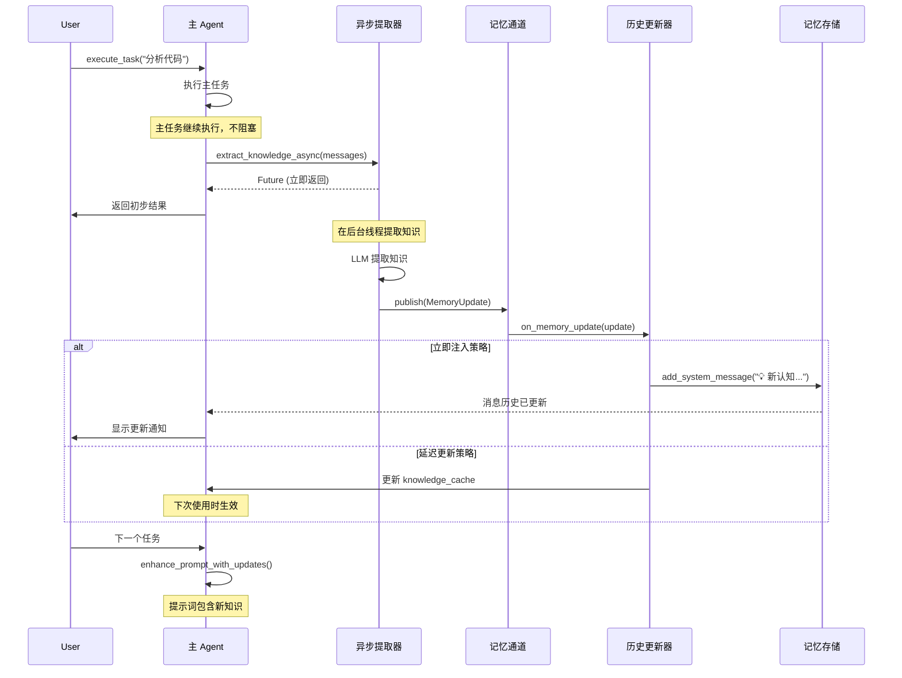
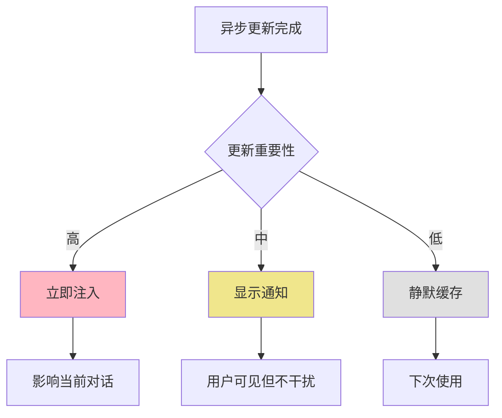

# 异步记忆更新序列图

## 完整的异步更新流程



## 三种更新策略对比

### 策略1：立即注入（Immediate Injection）


**优点**：
- ✅ 实时反馈
- ✅ 透明度高
- ✅ 用户体验好

**缺点**：
- ❌ 可能打断对话流程
- ❌ 消息历史变长

### 策略2：上下文增强（Context Enhancement）


**优点**：
- ✅ 不打断当前对话
- ✅ 自然融入
- ✅ 性能影响小

**缺点**：
- ❌ 延迟生效
- ❌ 用户无感知

### 策略3：混合策略（Hybrid Approach）



## 实现细节

### 1. 线程安全的消息注入

```python
class ThreadSafeMessageInjector:
    def __init__(self, memory):
        self.memory = memory
        self._lock = threading.Lock()
        
    def inject_message(self, message):
        with self._lock:
            # 获取当前位置
            current_idx = len(self.memory.chat_memory.messages)
            
            # 注入消息
            self.memory.chat_memory.add_message(message)
            
            # 记录注入位置
            return current_idx
```

### 2. 更新优先级队列

```python
class PriorityUpdateQueue:
    def __init__(self):
        self.queue = queue.PriorityQueue()
        
    def add_update(self, update: MemoryUpdate):
        # 根据类型确定优先级
        priority = self._get_priority(update.type)
        
        # 加入队列（优先级越小越先处理）
        self.queue.put((priority, update))
        
    def _get_priority(self, update_type: UpdateType) -> int:
        priorities = {
            UpdateType.ERROR_CORRECTION: 1,      # 最高优先级
            UpdateType.PATTERN_DISCOVERED: 2,
            UpdateType.KNOWLEDGE_EXTRACTION: 3,
            UpdateType.ENVIRONMENT_LEARNING: 4   # 最低优先级
        }
        return priorities.get(update_type, 5)
```

### 3. 更新批处理

```python
class UpdateBatcher:
    def __init__(self, batch_size=5, timeout=2.0):
        self.batch_size = batch_size
        self.timeout = timeout
        self.pending = []
        self.timer = None
        
    def add_update(self, update):
        self.pending.append(update)
        
        if len(self.pending) >= self.batch_size:
            self._flush()
        else:
            self._reset_timer()
            
    def _flush(self):
        if not self.pending:
            return
            
        # 批量处理更新
        batch_summary = self._summarize_batch(self.pending)
        self._apply_batch(batch_summary)
        
        self.pending.clear()
```

## 最佳实践

### 1. 配置建议

```python
async_memory_config = {
    # 基础配置
    'enable_async': True,
    'max_concurrent_extractions': 3,
    
    # 更新策略
    'injection_strategy': 'hybrid',  # immediate/delayed/hybrid
    'importance_threshold': 0.7,     # 重要性阈值
    
    # 性能优化
    'batch_updates': True,
    'batch_size': 5,
    'batch_timeout': 2.0,
    
    # 用户体验
    'show_notifications': True,
    'notification_level': 'important',  # all/important/none
    
    # 错误处理
    'retry_failed_extractions': True,
    'max_retries': 2,
    'fallback_to_sync': True
}
```

### 2. 监控和调试

```python
class AsyncMemoryMonitor:
    """异步记忆系统监控"""
    
    def __init__(self):
        self.metrics = {
            'total_updates': 0,
            'successful_updates': 0,
            'failed_updates': 0,
            'average_latency': 0,
            'queue_size': 0
        }
        
    def log_update(self, update: MemoryUpdate, success: bool, latency: float):
        self.metrics['total_updates'] += 1
        
        if success:
            self.metrics['successful_updates'] += 1
        else:
            self.metrics['failed_updates'] += 1
            
        # 更新平均延迟
        self._update_average_latency(latency)
        
    def get_health_status(self) -> Dict[str, Any]:
        return {
            'status': 'healthy' if self._is_healthy() else 'degraded',
            'metrics': self.metrics,
            'timestamp': datetime.now().isoformat()
        }
```

### 3. 测试策略

```python
async def test_async_memory_updates():
    """测试异步记忆更新"""
    
    # 1. 测试更新延迟
    start_time = time.time()
    update = await memory_system.extract_knowledge_async(test_messages)
    latency = time.time() - start_time
    assert latency < 0.1  # 应该立即返回
    
    # 2. 测试更新到达
    update_received = asyncio.Event()
    
    def on_update(update):
        update_received.set()
        
    memory_channel.subscribe(on_update)
    
    # 等待更新
    await asyncio.wait_for(update_received.wait(), timeout=5.0)
    
    # 3. 测试消息注入
    assert "新认知" in agent.get_recent_messages()
```

## 总结

异步动态记忆系统通过以下机制实现了真正的"活"记忆：

1. **非阻塞提取**：主任务不等待知识提取
2. **实时通知**：完成后立即通知主进程
3. **灵活注入**：多种策略更新消息历史
4. **优雅降级**：错误时回退到同步模式

这让 Agent 能够在执行任务的同时不断学习和更新认知。