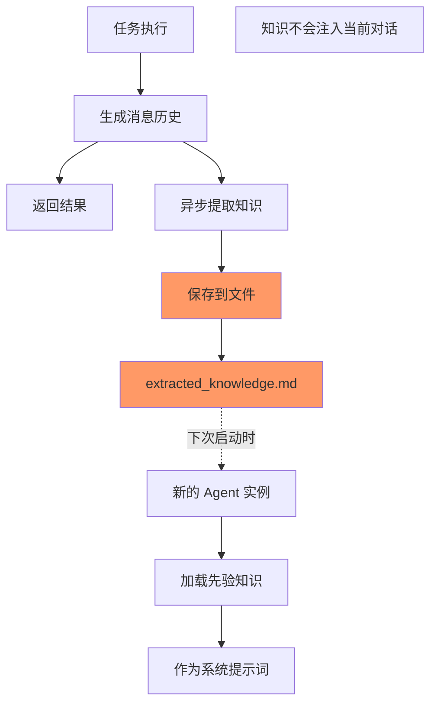

# 当前限制：异步知识不更新消息列表

## 现状

当前的 MVP 实现中，异步提取的知识**不会**更新主进程的消息列表。

### 工作流程



### 具体实现

1. **知识存储**（当前会话）：
```python
# 异步线程中
def _update_extracted_knowledge_sync(self, messages):
    # ... 提取知识 ...
    # 仅保存到文件
    self.knowledge_file.write_text(extracted_knowledge)
    # 显示通知
    print("💭 [记忆更新] 学到了...")
    # 但不更新 memory.chat_memory
```

2. **知识使用**（下次会话）：
```python
# Agent 初始化时
def __init__(self):
    # 加载之前保存的知识
    self.prior_knowledge = self._load_prior_knowledge()
    
# 创建系统提示词时
def _create_system_prompt(self):
    # 将知识作为系统提示词的一部分
    return template.format(prior_knowledge=self.prior_knowledge)
```

## 为什么这样设计？

### 1. 经验主义：够用就好
- 大多数场景下，知识用于下次对话就够了
- 避免了复杂的线程同步问题
- 代码简单，易于维护

### 2. 技术考虑
- 线程安全：避免多线程修改消息历史
- 一致性：消息历史保持线性
- 简单性：不需要复杂的同步机制

### 3. 用户体验
- 当前对话不受干扰
- 知识在下次对话中自然融入
- 通过通知让用户知道学到了什么

## 潜在的改进方向

如果用户反馈需要实时更新，可以考虑：

### 方案1：缓存新知识（最简单）
```python
class GenericReactAgent:
    def __init__(self):
        self.pending_knowledge = []  # 新增
        
    def _update_extracted_knowledge_sync(self):
        # ... 提取知识 ...
        self.pending_knowledge.append(extracted)  # 缓存
        
    def execute_task(self, task):
        # 检查待应用的知识
        if self.pending_knowledge:
            # 可以加到下个任务的上下文中
            task = f"{task}\n\n[最新认知]\n{self.pending_knowledge}"
```

### 方案2：系统消息注入（需要线程同步）
```python
def _update_extracted_knowledge_sync(self):
    # ... 提取知识 ...
    
    # 线程安全地注入消息
    with self._message_lock:
        if self.memory and hasattr(self.memory, 'chat_memory'):
            system_msg = SystemMessage(
                content=f"[知识更新] {knowledge_summary}"
            )
            self.memory.chat_memory.add_message(system_msg)
```

### 方案3：事件通知（更复杂）
```python
class KnowledgeUpdateEvent:
    def __init__(self, knowledge, timestamp):
        self.knowledge = knowledge
        self.timestamp = timestamp
        
# 发布事件，让主进程决定如何处理
self.knowledge_events.put(KnowledgeUpdateEvent(...))
```

## 总结

当前实现遵循经验主义原则：
1. **简单优先**：知识保存到文件，下次使用
2. **避免复杂**：不处理线程同步
3. **够用就好**：满足大部分使用场景

如果真的需要实时更新消息列表，等用户提出需求后再改进！