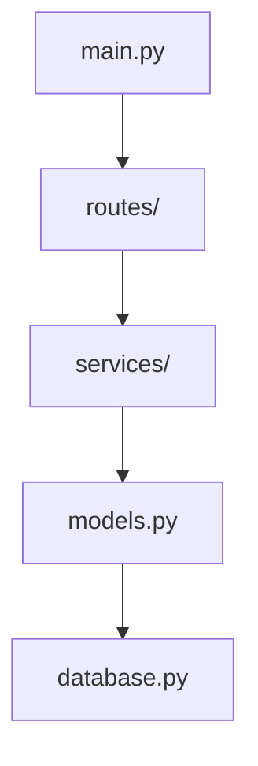

# 统一环境认知设计

## 核心理念

废除独立的 `world_overview.md`，将环境认知整合到动态记忆系统中。Agent 通过实际使用来理解环境，而非预先扫描。

## 设计原则

1. **使用即理解**：通过实际交互逐步构建环境认知
2. **主客观统一**：环境信息与使用经验融合
3. **动态演化**：环境理解随使用深入而深化
4. **最小化假设**：只记录实际接触过的内容

## 新的记忆层级

```yaml
long_term_data/
├── environment/           # 环境认知层（新增）
│   ├── workspace.md      # 工作空间理解
│   ├── file_purposes.md  # 文件用途映射
│   └── project_nature.md # 项目性质推断
├── methods/              # 方法层（原 meta-knowledge）
├── principles/           # 原理层
├── interfaces/           # 接口层
└── implementations/      # 实现层
```

## 环境认知层详细设计

### 1. 工作空间理解（workspace.md）

```markdown
# 工作空间理解

## 探索历史
- 首次进入：2024-12-14
- 累计交互：15 次
- 最后更新：2024-12-15

## 目录结构认知
基于实际访问构建的理解：

### 已探索区域
- `/src` - [用途：源代码] 最常访问，包含主要业务逻辑
- `/tests` - [用途：测试文件] 包含单元测试
- `/docs` - [用途：文档] 发现了API文档和设计文档

### 未探索区域
- `/scripts` - 尚未接触
- `/data` - 尚未接触

## 项目特征
通过实际使用推断：
- 类型：Python Web API（基于文件类型和框架使用）
- 主要技术：FastAPI, SQLAlchemy（从导入语句推断）
- 开发模式：TDD（测试文件比例高）
```

### 2. 文件用途映射（file_purposes.md）

```markdown
# 文件用途理解

基于实际使用经验的文件理解：

## 高频访问文件
| 文件 | 用途 | 访问次数 | 最后修改 |
|------|------|----------|----------|
| main.py | API入口点 | 12 | 2天前 |
| models.py | 数据模型定义 | 8 | 1周前 |
| config.py | 配置管理 | 6 | 稳定 |

## 文件关系图


## 使用模式
- 修改 API 时的典型路径：routes → services → models
- 调试时的关注点：logs/ 和 tests/
```

### 3. 渐进式学习策略

```python
class EnvironmentCognition:
    """环境认知子系统"""
    
    def __init__(self):
        self.workspace_graph = nx.DiGraph()  # 文件关系图
        self.access_frequency = {}  # 访问频率
        self.file_purposes = {}  # 推断的用途
        self.confidence_scores = {}  # 理解置信度
        
    def learn_from_file_access(self, file_path: Path, context: str):
        """从文件访问中学习"""
        # 更新访问频率
        self.access_frequency[file_path] = self.access_frequency.get(file_path, 0) + 1
        
        # 推断文件用途
        if file_path not in self.file_purposes:
            purpose = self._infer_purpose(file_path, context)
            self.file_purposes[file_path] = purpose
            self.confidence_scores[file_path] = 0.6
        else:
            # 验证和调整理解
            self._refine_understanding(file_path, context)
            
    def _infer_purpose(self, file_path: Path, context: str) -> str:
        """推断文件用途"""
        # 基于文件名
        if 'test' in file_path.name.lower():
            return "测试文件"
        if file_path.suffix == '.md':
            return "文档"
            
        # 基于路径
        parts = file_path.parts
        if 'models' in parts:
            return "数据模型"
        if 'routes' in parts or 'views' in parts:
            return "路由处理"
            
        # 基于使用上下文
        if "import" in context:
            return "库/模块"
        if "配置" in context or "config" in context.lower():
            return "配置文件"
            
        return "待确定"
        
    def get_environment_summary(self) -> str:
        """生成环境理解摘要"""
        # 不是预设的模板，而是基于实际经验
        explored_ratio = len(self.file_purposes) / self._estimate_total_files()
        
        summary = f"""
## 环境理解程度
- 探索程度：{explored_ratio:.1%}
- 高置信度理解：{sum(1 for c in self.confidence_scores.values() if c > 0.8)}个文件
- 核心工作区：{self._identify_core_areas()}

## 项目性质推断
{self._infer_project_nature()}

## 关键发现
{self._summarize_key_findings()}
"""
        return summary
```

## 迁移计划

### 第一步：停止生成 world_overview

```python
class ReactAgentConfig:
    def __init__(self, ...):
        # 移除这个配置项
        # self.enable_world_overview = enable_world_overview
        self.enable_environment_cognition = True  # 新配置
```

### 第二步：修改初始化逻辑

```python
class GenericReactAgent:
    def __init__(self, config):
        # 移除 world_overview 检查
        # if config.enable_world_overview:
        #     self._check_world_overview()
        
        # 初始化环境认知
        if config.enable_environment_cognition:
            self.env_cognition = EnvironmentCognition()
```

### 第三步：在工具使用时学习

```python
def read_file(self, file_path: str) -> str:
    """增强的文件读取，带环境学习"""
    content = self._original_read_file(file_path)
    
    # 学习环境
    if self.env_cognition:
        self.env_cognition.learn_from_file_access(
            Path(file_path),
            context=f"读取文件，前100字符：{content[:100]}"
        )
    
    return content
```

### 第四步：整合到长期记忆

```python
def _update_extracted_knowledge_sync(self, messages):
    """更新知识时包含环境认知"""
    # ... 原有逻辑
    
    # 添加环境认知部分
    env_summary = self.env_cognition.get_environment_summary()
    
    # 将环境理解作为知识的一部分
    knowledge_sections = {
        'environment': env_summary,
        'methods': extracted_methods,
        'experiences': extracted_experiences
    }
```

## 优势

1. **更自然**：符合人类认知模式
2. **更准确**：基于实际使用，而非假设
3. **更简洁**：一套系统，减少复杂度
4. **更灵活**：动态适应项目变化

## 示例：新旧对比

### 旧方式（world_overview）
```markdown
# World Overview
生成时间：2024-12-14 10:00:00

## 目录结构
[一次性扫描的完整结构]

## 项目类型
[基于特征文件的猜测]
```

### 新方式（环境认知）
```markdown
# 环境认知记录

## 我的理解
通过15次交互，我了解到：
- 这是一个 FastAPI 项目（从实际import和使用推断）
- 主要工作区在 /src（80%的修改集中在此）
- 测试覆盖良好（每个功能都有对应测试）

## 尚未探索
- /scripts 目录（可能包含部署脚本）
- /migrations（可能是数据库迁移）

## 使用模式
- 开发流程：先写测试 → 实现功能 → 运行测试
- 常用命令：pytest, uvicorn main:app --reload
```

这种方式让 Agent 的环境理解更像人类——通过使用来认识，而非机械扫描。