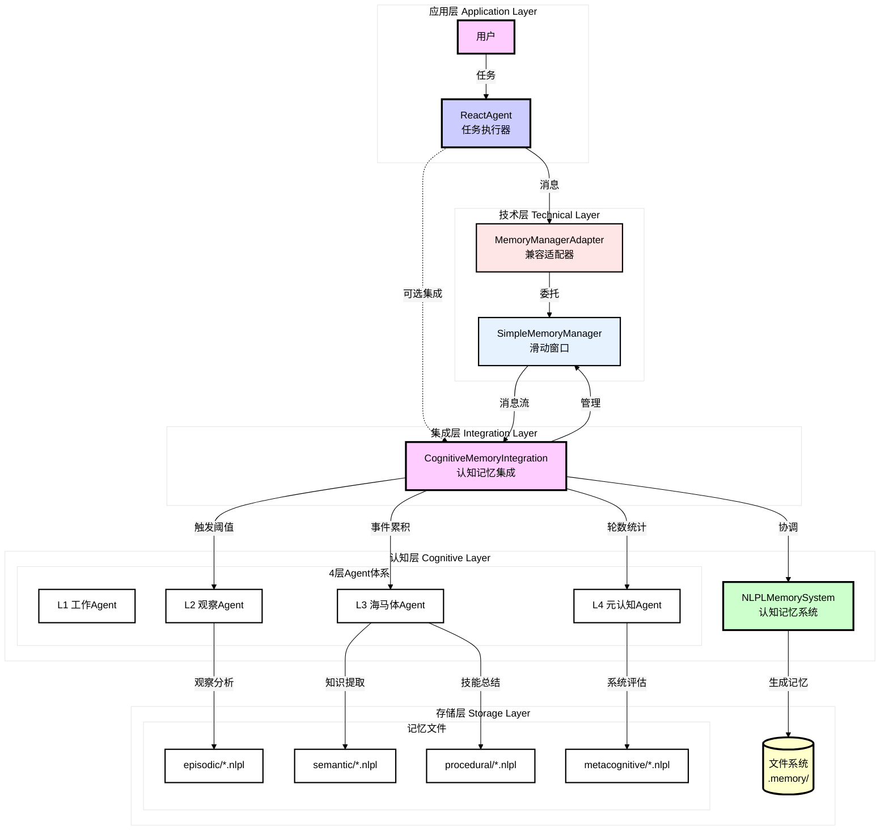
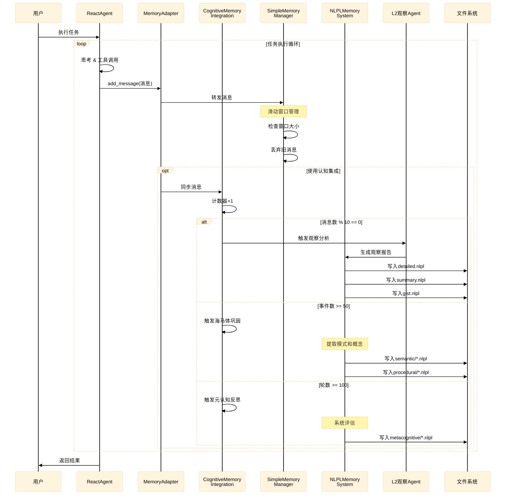
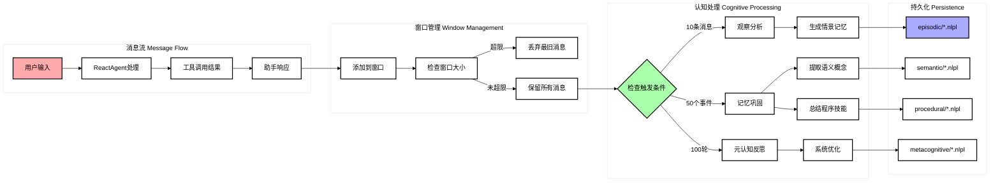
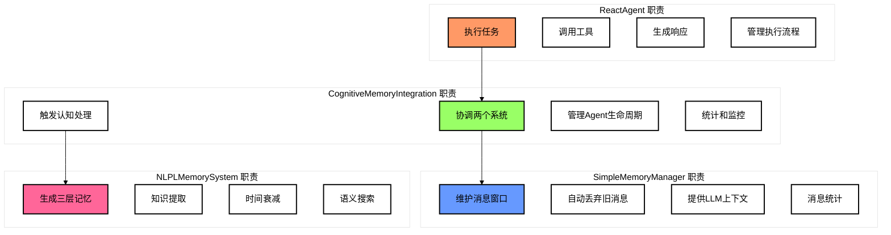
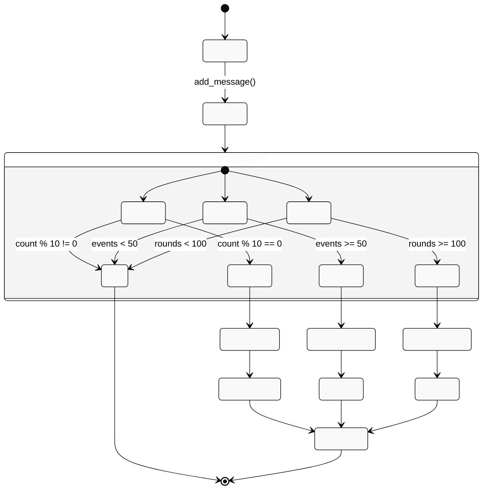
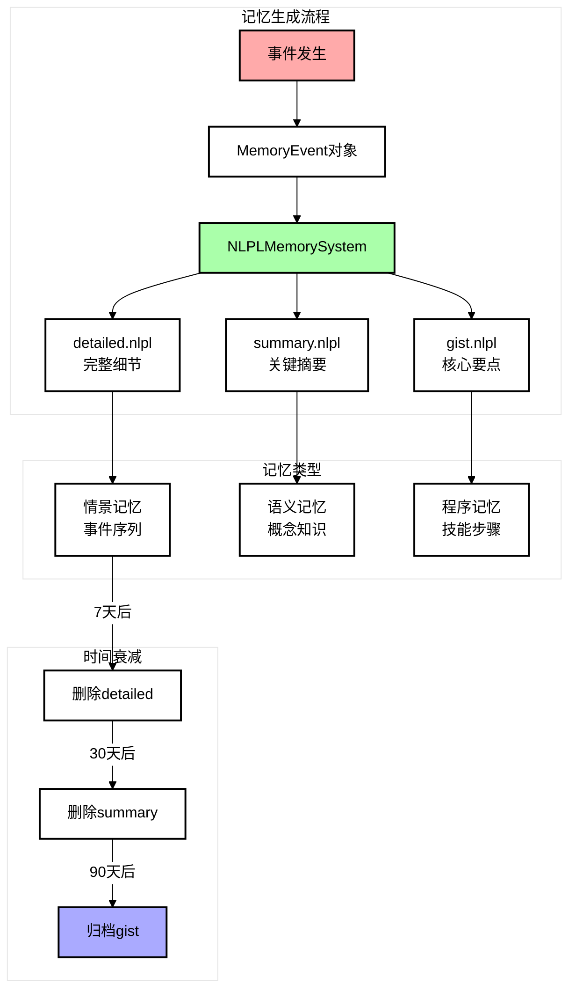
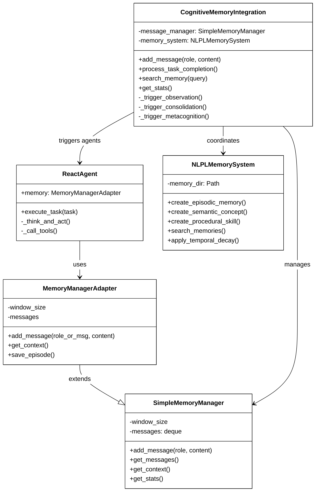

# 记忆系统架构交互图

本文档详细说明 ReactAgent、CognitiveMemoryIntegration 和 NLPLMemorySystem 三者的交互关系。

## 整体架构交互图



## 详细交互流程



## 数据流向图



## 组件职责分工



## 触发机制详解



## 记忆类型与清晰度



## API 调用关系



## 关键交互点

### 1. ReactAgent → MemoryManagerAdapter
- **时机**：每次生成消息或调用工具
- **数据**：消息字典或分离的参数
- **目的**：维护对话上下文

### 2. CognitiveMemoryIntegration → SimpleMemoryManager
- **时机**：接收新消息
- **数据**：role 和 content
- **目的**：管理滑动窗口

### 3. CognitiveMemoryIntegration → NLPLMemorySystem
- **时机**：达到触发阈值
- **数据**：MemoryEvent 对象
- **目的**：生成认知记忆

### 4. NLPLMemorySystem → 文件系统
- **时机**：创建记忆
- **数据**：NLPL 格式文本
- **目的**：持久化存储

## 使用模式

### 模式1：独立使用 ReactAgent
```python
agent = ReactAgent(work_dir=".", memory_mode=None)
agent.memory = MemoryManagerAdapter()
result = agent.execute_task(task)
```

### 模式2：集成认知记忆
```python
cognitive = CognitiveMemoryIntegration(work_dir=".")
# 在任务执行中调用
cognitive.add_message(role, content)
cognitive.process_task_completion(task_name, success, rounds)
```

### 模式3：直接使用 NLPL
```python
memory = NLPLMemorySystem(".memory")
event = MemoryEvent(...)
detailed, summary, gist = memory.create_episodic_memory(event)
```

## 总结

这个三层架构实现了：
1. **分离关注点**：技术层（消息管理）与认知层（记忆生成）分离
2. **灵活集成**：各组件可独立使用或组合使用
3. **智能触发**：基于阈值的自动认知处理
4. **认知真实**：模拟人类记忆的三层清晰度和时间衰减