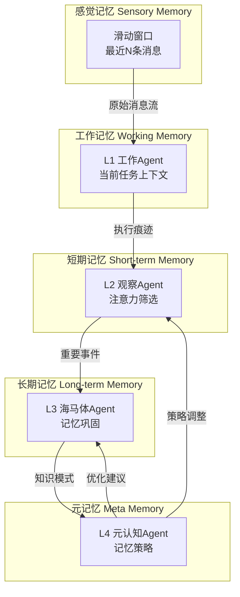
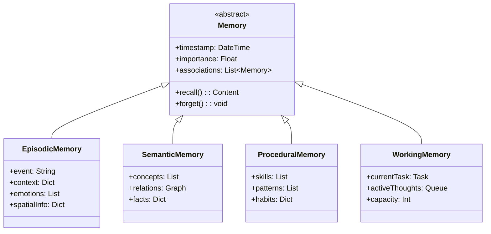
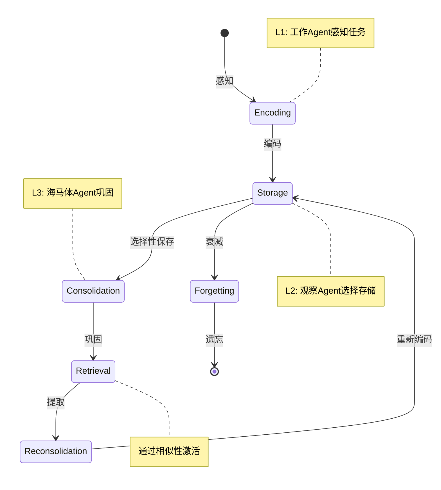
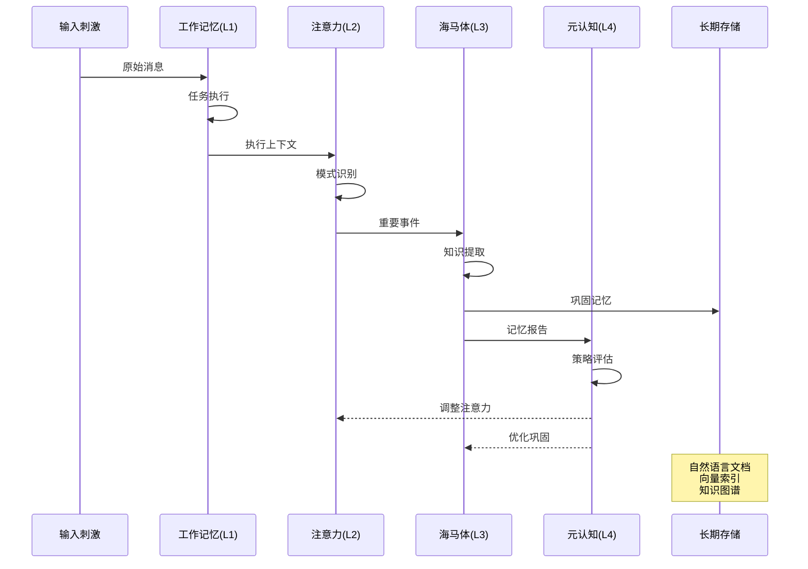
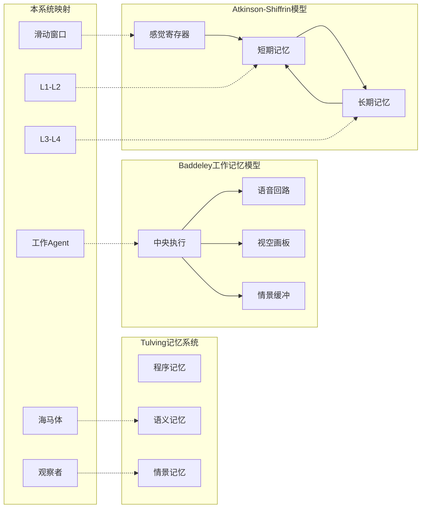
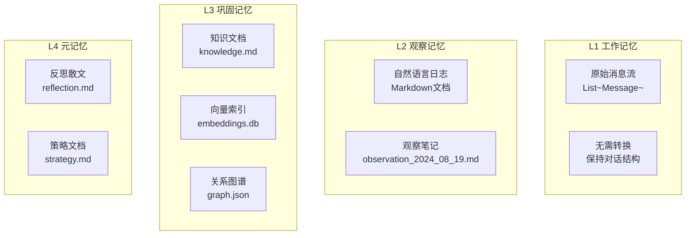
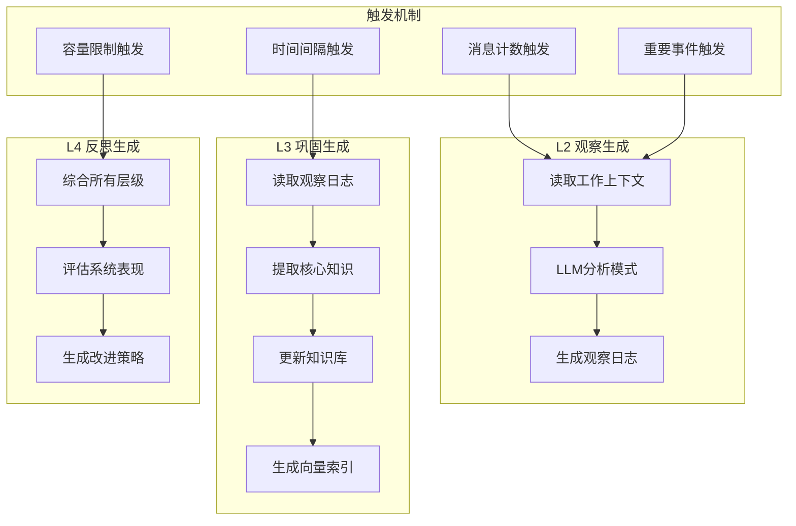

# 认知记忆系统设计文档

## 1. UML模型层 - 记忆的理论模型

### 1.1 记忆系统架构图



### 1.2 记忆类型模型



### 1.3 记忆生命周期



### 1.4 记忆处理流程



### 1.5 认知理论基础



## 2. 实现层

### 2.1 存储层 - 记忆如何表达

#### 2.1.1 多态记忆表达架构



#### 2.1.2 存储格式规范

##### L1 工作记忆 - 原始消息格式
```python
messages = [
    {"role": "user", "content": "创建计算器模块"},
    {"role": "assistant", "content": "开始创建...", "tool_calls": [...]},
    {"role": "tool", "content": "文件创建成功"},
    # 保持原始对话流，不做任何处理
]
```

##### L2 观察记忆 - Markdown日志
```markdown
# 观察日志 - 2024-08-19 14:30:00

## 任务概述
工作Agent处理了一个计算器模块创建任务。

## 执行时间线
- **14:30:15** - 接收任务，开始分析需求
- **14:30:18** - 第1轮：调用write_file创建calculator.py
- **14:30:22** - 第2轮：识别任务完成，结束执行

## 行为模式观察
### 决策风格
Agent展现出"快速执行者"特征，倾向于立即行动而非过度规划。

### 工具使用模式
- 精准使用write_file，无冗余调用
- 未使用验证类工具（如read_file检查）

## 关键洞察
1. **效率优先**：2轮完成任务，效率极高
2. **置信度高**：不做额外验证，相信自己的执行
3. **模式稳定**：类似任务表现一致
```

##### L3 巩固记忆 - 知识文档 + 向量索引
```markdown
# 知识库 - 代码生成模式

## 模式：简单文件创建
**触发条件**：任务包含"创建文件"关键词
**执行策略**：直接write_file，最少轮次
**成功率**：95%
**适用场景**：单文件、明确需求

## 相关经验
- [2024-08-18: 创建hello.py](./episodes/ep_001.md)
- [2024-08-19: 创建calculator.py](./episodes/ep_002.md)

## 抽象原则
当需求明确且简单时，直接执行优于过度规划。
```

向量索引（用于相似性检索）：
```python
{
    "embedding": [0.23, -0.45, 0.67, ...],  # 768维向量
    "content": "创建计算器模块任务",
    "timestamp": "2024-08-19T14:30:00",
    "file_ref": "./episodes/ep_002.md"
}
```

##### L4 元记忆 - 哲学反思
```markdown
# 系统反思 - 2024年8月

## 关于效率与谨慎的平衡

系统当前偏向快速执行，这在简单任务上表现优异，
但可能在复杂任务上缺乏必要的规划深度。

### 效率的代价
快速不总是好的。有时，慢下来思考能避免更大的返工。
当前的2轮完成模式，是否过于追求表面的效率指标？

### 信任与验证
Agent对自己的执行有很高的置信度，很少回头检查。
这种自信来自哪里？是经验的积累，还是设计的偏向？

## 未来演化方向

也许我们需要的不是固定的策略，而是情境感知的适应性。
简单任务快速执行，复杂任务深思熟虑。
关键是：如何让系统自己学会这种判断？
```

### 2.2 计算层 - 如何生成记忆

#### 2.2.1 记忆生成架构



#### 2.2.2 记忆生成算法

##### 观察层生成算法
```python
class ObservationGenerator:
    def __init__(self, trigger_threshold=10):
        self.message_buffer = []
        self.trigger_threshold = trigger_threshold
    
    def on_message(self, message):
        self.message_buffer.append(message)
        
        if len(self.message_buffer) >= self.trigger_threshold:
            self.generate_observation()
    
    def generate_observation(self):
        # 准备上下文
        context = {
            "messages": self.message_buffer,
            "timestamp": datetime.now(),
            "task": self.extract_task()
        }
        
        # LLM生成观察
        prompt = f"""
        分析以下执行上下文，生成观察日志：
        
        {context}
        
        请识别：
        1. 执行模式和决策风格
        2. 工具使用习惯
        3. 关键时刻和转折点
        4. 潜在问题和优化机会
        
        用自然语言叙述，像实验观察笔记。
        """
        
        observation = llm.generate(prompt)
        
        # 保存为Markdown
        filename = f"observation_{datetime.now():%Y%m%d_%H%M%S}.md"
        save_markdown(observation, filename)
        
        # 清空缓冲区
        self.message_buffer.clear()
```

##### 海马体巩固算法
```python
class ConsolidationEngine:
    def __init__(self, consolidation_interval=50):
        self.observation_history = []
        self.knowledge_base = KnowledgeBase()
        self.vector_store = VectorStore()
        
    def consolidate(self, observations):
        # 提取模式
        patterns = self.extract_patterns(observations)
        
        # 生成知识
        for pattern in patterns:
            knowledge = self.generate_knowledge(pattern)
            
            # 更新知识库
            self.knowledge_base.add(knowledge)
            
            # 生成向量索引
            embedding = self.generate_embedding(knowledge)
            self.vector_store.add(embedding, knowledge.id)
        
        # 知识关联
        self.link_related_knowledge()
        
        # 生成知识文档
        self.export_knowledge_document()
    
    def extract_patterns(self, observations):
        prompt = f"""
        从以下观察中提取可复用的模式：
        
        {observations}
        
        寻找：
        - 重复出现的行为
        - 成功的策略
        - 失败的教训
        - 抽象的原则
        """
        
        return llm.extract_patterns(prompt)
    
    def generate_embedding(self, knowledge):
        # 使用句子嵌入模型
        return embedding_model.encode(knowledge.content)
```

##### 元认知反思算法
```python
class MetaCognitionEngine:
    def __init__(self, reflection_interval=100):
        self.system_history = SystemHistory()
        
    def reflect(self):
        # 收集所有层级的信息
        working_memory = self.get_working_memory_stats()
        observations = self.get_recent_observations()
        knowledge = self.get_knowledge_summary()
        
        # 生成系统级反思
        reflection = self.generate_reflection(
            working_memory, 
            observations, 
            knowledge
        )
        
        # 生成优化策略
        strategies = self.generate_strategies(reflection)
        
        # 保存反思文档
        self.save_reflection(reflection, strategies)
        
        # 反馈给其他层
        self.feedback_to_layers(strategies)
    
    def generate_reflection(self, wm, obs, know):
        prompt = f"""
        基于系统运行数据，进行深度反思：
        
        工作记忆统计：{wm}
        近期观察：{obs}
        知识积累：{know}
        
        请思考：
        1. 系统的优势和弱点
        2. 效率与质量的平衡
        3. 学习和适应的表现
        4. 长期发展方向
        
        用哲学性的语言，探讨深层问题。
        """
        
        return llm.reflect(prompt)
```

#### 2.2.3 记忆检索机制

```python
class MemoryRetrieval:
    def __init__(self):
        self.vector_store = VectorStore()
        self.knowledge_base = KnowledgeBase()
        
    def recall(self, query, k=5):
        # 1. 向量相似性搜索
        query_embedding = embedding_model.encode(query)
        similar_memories = self.vector_store.search(query_embedding, k)
        
        # 2. 关键词匹配
        keyword_matches = self.knowledge_base.search_keywords(query)
        
        # 3. 时间相关性
        recent_memories = self.get_recent_memories()
        
        # 4. 关联激活
        activated_memories = self.spread_activation(
            similar_memories + keyword_matches
        )
        
        # 5. 综合排序
        ranked_memories = self.rank_memories(
            similar_memories,
            keyword_matches, 
            recent_memories,
            activated_memories
        )
        
        return ranked_memories[:k]
    
    def spread_activation(self, initial_memories):
        """激活相关联的记忆"""
        activated = set(initial_memories)
        
        for memory in initial_memories:
            # 获取关联记忆
            related = self.knowledge_base.get_related(memory.id)
            activated.update(related)
        
        return list(activated)
```

## 3. 实施路线图

### 第一阶段：简化MemoryManager
- 退化为简单滑动窗口
- 移除所有压缩和优化逻辑
- 仅保留add()和get_context()方法

### 第二阶段：改造存储格式
- L2观察层：JSON → Markdown日志
- L3海马体：JSON → 知识文档 + 向量索引
- L4元认知：JSON → 反思散文

### 第三阶段：实现记忆生成
- 实现基于触发器的观察生成
- 实现模式提取和知识巩固
- 实现系统级反思机制

### 第四阶段：建立检索系统
- 集成向量数据库（如FAISS）
- 实现多模式检索（相似性、关键词、时间）
- 实现关联激活机制

### 第五阶段：优化和评估
- 调整触发阈值
- 优化LLM提示词
- 评估记忆质量和检索效果
- 迭代改进

## 4. 核心设计原则

1. **认知真实性**：模拟人类记忆机制，而非数据存储
2. **语义保真**：用自然语言保留理解的丰富性
3. **多态表达**：不同层级用最适合的表达形式
4. **涌现而非设计**：让记忆模式自然涌现
5. **人机共生**：记忆对人类和AI都可理解

## 5. 与现有系统的对比

| 方面 | 传统系统 | 本系统 |
|------|---------|--------|
| 理论基础 | 数据库理论 | 认知科学 |
| 存储方式 | 结构化JSON | 自然语言文档 |
| 处理方式 | 规则算法 | LLM理解 |
| 检索方式 | 精确匹配 | 语义相似 |
| 遗忘机制 | 定时删除 | 自然衰减 |
| 学习能力 | 无 | 持续演化 |

## 6. 结论

这个设计将记忆系统从"数据存储"范式转向"认知理解"范式，真正实现了连接主义的记忆架构。通过自然语言和向量表示，保留了记忆的语义丰富性；通过4层Agent协作，实现了记忆的智能处理；通过多态表达，适应了不同层级的需求。

这不仅是一个技术架构，更是对"什么是记忆"这一根本问题的回答：**记忆是理解的痕迹，而非数据的堆积**。