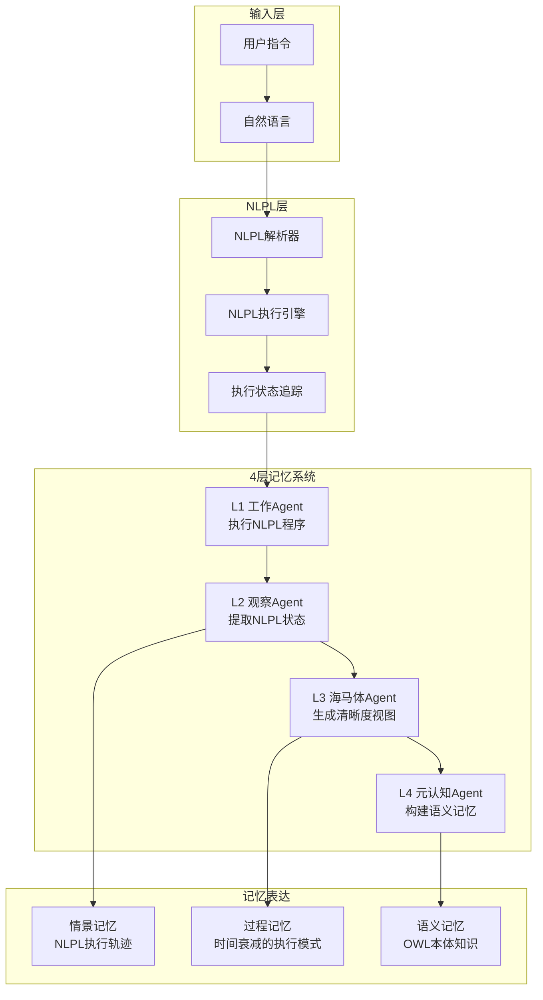

# NLPL-Based Memory System Integration Design
NLPL驱动的记忆系统集成设计文档

## 1. 架构概述

### 1.1 核心理念
将NLPL作为记忆系统的基础层，用户指令通过NLPL表达和执行，执行状态成为记忆的原材料。



### 1.2 数据流向

```
用户指令 → NLPL程序 → 执行状态 → 记忆生成
```

1. **用户输入**：自然语言任务描述
2. **NLPL转换**：将任务转换为NLPL程序（可选，纯自然语言也是合法NLPL）
3. **程序执行**：NLPL引擎执行程序，生成状态轨迹
4. **状态提取**：L2观察者从执行轨迹提取关键状态
5. **记忆生成**：不同层级生成不同类型的记忆

## 2. NLPL执行引擎设计

### 2.1 核心组件

```python
class NLPLEngine:
    """NLPL执行引擎"""
    
    def __init__(self):
        self.parser = NLPLParser()
        self.interpreter = NLPLInterpreter()
        self.state_tracker = StateTracker()
        self.tool_registry = ToolRegistry()
    
    def execute(self, nlpl_program: str) -> ExecutionTrace:
        """执行NLPL程序并返回执行轨迹"""
        # 1. 解析程序
        ast = self.parser.parse(nlpl_program)
        
        # 2. 初始化状态
        state = self.state_tracker.initialize(ast)
        
        # 3. 执行程序
        trace = ExecutionTrace()
        for step in ast.main_flow:
            # 记录执行前状态
            trace.record_pre_state(step, state)
            
            # 执行步骤
            result = self.interpreter.execute_step(step, state)
            
            # 更新状态
            state = self.state_tracker.update(state, result)
            
            # 记录执行后状态
            trace.record_post_state(step, state, result)
        
        return trace
```

### 2.2 状态表示

```python
class NLPLState:
    """NLPL程序执行状态"""
    
    def __init__(self):
        self.input_vars = {}      # 输入变量
        self.internal_vars = {}   # 内部状态
        self.output_vars = {}     # 输出变量
        self.step_counter = 0     # 当前步骤
        self.execution_path = []  # 执行路径
        self.tool_calls = []      # 工具调用历史
        self.errors = []          # 错误记录
        
    def to_memory_format(self) -> dict:
        """转换为记忆格式"""
        return {
            "snapshot": {
                "step": self.step_counter,
                "variables": {
                    "input": self.input_vars,
                    "internal": self.internal_vars,
                    "output": self.output_vars
                }
            },
            "trajectory": self.execution_path,
            "interactions": self.tool_calls,
            "anomalies": self.errors
        }
```

### 2.3 执行轨迹

```python
class ExecutionTrace:
    """NLPL程序执行轨迹"""
    
    def __init__(self):
        self.program_name = ""
        self.start_time = None
        self.end_time = None
        self.steps = []  # 步骤列表
        self.state_transitions = []  # 状态转换
        self.decision_points = []  # 决策点
        self.tool_interactions = []  # 工具交互
        
    def to_episodic_memory(self) -> dict:
        """转换为情景记忆"""
        return {
            "event": self.program_name,
            "duration": self.end_time - self.start_time,
            "narrative": self._generate_narrative(),
            "key_moments": self.decision_points,
            "outcomes": self._extract_outcomes()
        }
```

## 3. 记忆层级设计

### 3.1 L1 工作层 - NLPL执行器

```markdown
# L1 工作Agent知识

## 角色
我是NLPL程序执行器，负责：
1. 接收用户的自然语言指令
2. 识别或构造NLPL程序结构
3. 执行NLPL程序
4. 生成执行状态轨迹

## NLPL执行规则
- 任何自然语言都是合法的NLPL程序
- 可以增加结构化标记提高精确性
- 使用Markdown语法表示程序结构
- 保持完整的执行状态记录

## 状态输出格式
每次执行后输出：
```json
{
  "program": "程序名称或任务描述",
  "execution_trace": {
    "steps": [...],
    "state_changes": [...],
    "tool_calls": [...],
    "decisions": [...]
  }
}
```
```

### 3.2 L2 观察层 - NLPL状态提取器

```markdown
# L2 观察Agent知识

## 角色
我是NLPL执行状态观察者，负责：
1. 观察工作Agent的NLPL执行轨迹
2. 提取关键状态转换
3. 识别执行模式
4. 生成情景记忆

## 观察焦点
- **状态转换**：变量如何变化
- **决策路径**：条件分支的选择
- **工具使用**：何时调用什么工具
- **错误处理**：异常和恢复
- **执行效率**：步骤数和时间

## 情景记忆格式
```json
{
  "episode": {
    "program": "NLPL程序名",
    "execution_pattern": "识别的模式",
    "state_trajectory": [...],
    "critical_decisions": [...],
    "performance_metrics": {...}
  }
}
```
```

### 3.3 L3 海马体 - 清晰度视图生成器

```markdown
# L3 海马体Agent知识

## 角色
我是记忆巩固器，负责：
1. 从情景记忆生成不同清晰度的视图
2. 实现时间衰减的过程记忆
3. 提取可复用的执行模式
4. 构建知识索引

## 清晰度层级
### 高清晰度（近期）
- 完整的NLPL执行细节
- 所有状态变化
- 详细的工具调用参数

### 中清晰度（中期）
- 主要执行步骤
- 关键状态转换
- 重要决策点

### 低清晰度（远期）
- 执行模式摘要
- 核心知识点
- 经验教训

## 过程记忆格式
```json
{
  "pattern_name": "识别的模式",
  "clarity_level": "high|medium|low",
  "temporal_decay": 0.8,
  "reusable_template": "NLPL模板",
  "learned_rules": [...]
}
```
```

### 3.4 L4 元认知 - 语义记忆构建器

```markdown
# L4 元认知Agent知识

## 角色
我是语义记忆构建者，负责：
1. 从过程记忆提取抽象知识
2. 构建OWL本体
3. 生成编程领域的语义网络
4. 形成系统级理解

## OWL本体结构
```turtle
@prefix prog: <http://nlpl.memory/programming#> .
@prefix task: <http://nlpl.memory/task#> .

prog:Function a owl:Class ;
    rdfs:subClassOf prog:CodeEntity .

prog:Variable a owl:Class ;
    rdfs:subClassOf prog:DataEntity .

task:FileOperation a owl:Class ;
    rdfs:subClassOf task:Operation ;
    prog:uses prog:FileSystem .
```

## 语义记忆格式
```json
{
  "ontology": {
    "classes": [...],
    "properties": [...],
    "individuals": [...],
    "axioms": [...]
  },
  "semantic_network": {
    "nodes": [...],
    "edges": [...],
    "patterns": [...]
  }
}
```
```

## 4. NLPL程序示例

### 4.1 用户指令转NLPL

```markdown
# 用户输入
"创建一个计算器模块"

# 自动增强为NLPL程序
# 创建计算器模块

## 目标
创建包含基本运算功能的计算器模块

## 状态
### 输出
- **calculator.py**: null
- **test_calculator.py**: null
- **完成**: false

## 主流程

### 步骤1: 创建计算器模块
- **工具**: `write_file`
- **参数**:
  - path: "calculator.py"
  - content: |
    def add(a, b):
        return a + b
    
    def subtract(a, b):
        return a - b
    
    def multiply(a, b):
        return a * b
    
    def divide(a, b):
        if b == 0:
            raise ValueError("Cannot divide by zero")
        return a / b
- **更新**: > 状态.输出.calculator.py = "已创建"

### 步骤2: 创建测试文件
- **工具**: `write_file`
- **参数**:
  - path: "test_calculator.py"
  - content: |
    import unittest
    from calculator import add, subtract, multiply, divide
    
    class TestCalculator(unittest.TestCase):
        def test_add(self):
            self.assertEqual(add(2, 3), 5)
        
        def test_subtract(self):
            self.assertEqual(subtract(5, 3), 2)
        
        def test_multiply(self):
            self.assertEqual(multiply(3, 4), 12)
        
        def test_divide(self):
            self.assertEqual(divide(10, 2), 5)
            with self.assertRaises(ValueError):
                divide(10, 0)
- **更新**: 
  - > 状态.输出.test_calculator.py = "已创建"
  - > 状态.输出.完成 = true

### 步骤3: 验证
- **工具**: `execute_python`
- **参数**: "python -m pytest test_calculator.py"
- **成功时**: 报告测试通过
- **失败时**: 显示错误信息
```

### 4.2 执行状态示例

```json
{
  "execution_trace": {
    "program": "创建计算器模块",
    "start_time": "2024-08-21T10:00:00Z",
    "steps": [
      {
        "step_id": "步骤1",
        "action": "创建计算器模块",
        "tool": "write_file",
        "pre_state": {
          "output": {
            "calculator.py": null,
            "test_calculator.py": null,
            "完成": false
          }
        },
        "post_state": {
          "output": {
            "calculator.py": "已创建",
            "test_calculator.py": null,
            "完成": false
          }
        },
        "result": "成功",
        "duration_ms": 150
      },
      {
        "step_id": "步骤2",
        "action": "创建测试文件",
        "tool": "write_file",
        "pre_state": {
          "output": {
            "calculator.py": "已创建",
            "test_calculator.py": null,
            "完成": false
          }
        },
        "post_state": {
          "output": {
            "calculator.py": "已创建",
            "test_calculator.py": "已创建",
            "完成": true
          }
        },
        "result": "成功",
        "duration_ms": 120
      }
    ],
    "state_transitions": [
      {
        "from": "初始",
        "to": "文件创建中",
        "trigger": "步骤1开始"
      },
      {
        "from": "文件创建中",
        "to": "测试创建中",
        "trigger": "步骤1完成"
      },
      {
        "from": "测试创建中",
        "to": "完成",
        "trigger": "步骤2完成"
      }
    ]
  }
}
```

## 5. 实现路线图

### 第一阶段：NLPL基础设施（当前）
1. 实现NLPL解析器
2. 实现NLPL执行引擎
3. 实现状态追踪系统
4. 创建基础工具库

### 第二阶段：集成4层系统
1. 修改L1工作Agent支持NLPL执行
2. 修改L2观察Agent提取NLPL状态
3. 实现L3清晰度视图生成
4. 实现L4 OWL本体构建

### 第三阶段：记忆表达优化
1. 实现情景记忆的NLPL轨迹表示
2. 实现过程记忆的时间衰减
3. 实现语义记忆的OWL本体
4. 建立记忆检索机制

### 第四阶段：标准库建设
1. 创建NLPL标准库
2. 实现常用执行模式
3. 建立模式库索引
4. 支持模式复用

### 第五阶段：评估与优化
1. 测试NLPL执行效率
2. 评估记忆质量
3. 优化状态提取算法
4. 完善OWL本体

## 6. 关键创新点

### 6.1 NLPL作为通用接口
- 自然语言即程序
- 结构可选，渐进增强
- 保留语义丰富性

### 6.2 执行状态即记忆
- 执行轨迹 = 情景记忆
- 状态模式 = 过程记忆
- 抽象知识 = 语义记忆

### 6.3 多清晰度视图
- 时间衰减模拟遗忘
- 不同抽象层级
- 按需重建细节

### 6.4 OWL本体知识
- 编程领域本体
- 语义推理能力
- 知识图谱构建

## 7. 与现有系统的关系

### 7.1 保留的组件
- ReactAgent框架
- 工具系统
- 文件操作

### 7.2 替换的组件
- 消息格式 → NLPL程序
- JSON记忆 → NLPL轨迹
- 规则提取 → 状态分析

### 7.3 新增的组件
- NLPL解析器
- NLPL执行引擎
- 状态追踪器
- OWL本体生成器

## 8. 预期效果

### 8.1 更自然的交互
- 用户用自然语言描述任务
- 系统理解并执行
- 记忆保留执行语义

### 8.2 更智能的记忆
- 从执行中学习模式
- 构建领域知识
- 支持推理和复用

### 8.3 更清晰的架构
- NLPL统一接口
- 层次分明的记忆
- 可解释的执行

## 9. 技术栈

### 9.1 NLPL层
- Python 3.10+
- Markdown解析：markdown-it-py
- AST构建：自定义

### 9.2 记忆层
- OWL处理：owlready2
- 向量索引：faiss
- 图数据库：networkx

### 9.3 LLM层
- OpenRouter API
- 模型：qwen/qwen3-coder
- 工具调用：OpenAI格式

## 10. 总结

通过将NLPL作为基础，我们实现了：

1. **统一的接口**：自然语言即编程语言
2. **丰富的语义**：执行状态保留完整语义
3. **智能的记忆**：从执行轨迹生成多层记忆
4. **可复用的知识**：OWL本体支持推理

这个设计将记忆系统从"存储"提升到"理解"，从"数据"提升到"知识"，真正实现了连接主义的认知架构。