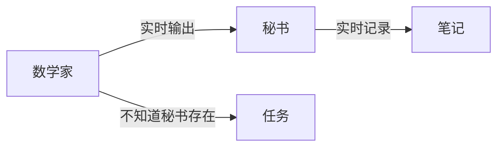
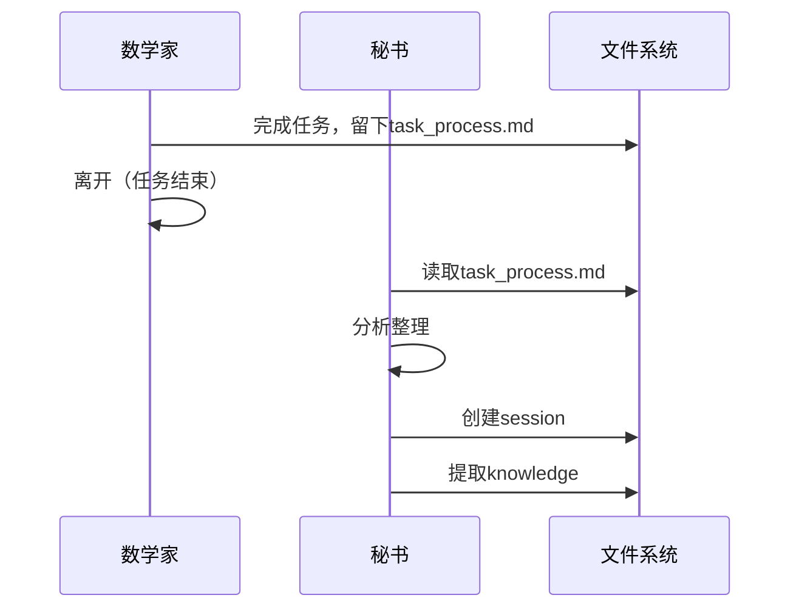
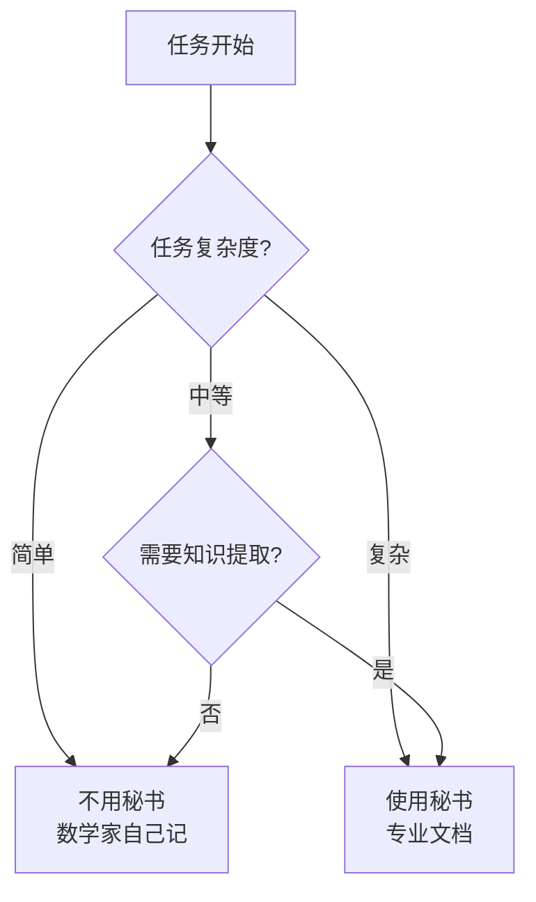

# Secretary Agent架构：是否需要一个秘书？

## 核心问题

数学家（ProgramAgent）应该：
- ✅ 写草稿纸（task_process.md）- 这是思考的一部分
- ❓ 写正式文档（sessions）- 这是额外负担吗？
- ❓ 提取知识（knowledge）- 这会分散注意力吗？

## 两种哲学路线

### 路线1：自给自足（No Secretary）

```
ProgramAgent既是数学家又是秘书
- 执行任务
- 更新task_process.md  
- 创建session
- 提取knowledge
```

**类比**：独立研究者，自己做所有事

**优点**：
- ✅ 简单，一个Agent搞定
- ✅ 不需要协调
- ✅ 信息不会丢失

**缺点**：
- ❌ 分散注意力
- ❌ 需要额外知识（如何写文档）
- ❌ 违反单一职责原则

### 路线2：专业分工（With Secretary）

```
ProgramAgent（数学家）      SecretaryAgent（秘书）
- 专注执行任务             - 观察ProgramAgent
- 写task_process.md        - 整理session
- 产生结果                 - 提取knowledge
                          - 更新world_state
```

**类比**：教授+助理模式

**优点**：
- ✅ 关注点分离
- ✅ 专业的事专业做
- ✅ ProgramAgent更简单纯粹

**缺点**：
- ❌ 需要两个Agent
- ❌ 可能理解偏差
- ❌ 增加复杂度

## Secretary Agent的设计方案

### 方案A：实时秘书（Synchronous Secretary）

```python
class SecretaryAgent:
    def observe_and_record(self, mathematician_agent):
        # 实时观察数学家的工作
        while mathematician_agent.is_working():
            action = mathematician_agent.current_action()
            
            if is_significant(action):
                self.record_to_session(action)
            
            if found_pattern(action):
                self.extract_to_knowledge(action)
```

**工作模式**：


### 方案B：事后秘书（Post-hoc Secretary）

```python
class SecretaryAgent:
    def summarize_after_task(self, task_process_file, agent_outputs):
        # 任务结束后整理
        
        # 1. 读取数学家的草稿
        drafts = read_file(task_process_file)
        
        # 2. 分析执行过程
        process = analyze_execution(agent_outputs)
        
        # 3. 创建正式文档
        create_session(drafts, process)
        extract_knowledge(process)
        update_world_state()
```

**工作模式**：


### 方案C：智能秘书（Intelligent Secretary）

```python
class IntelligentSecretary:
    def __init__(self):
        # 秘书也是一个ReactAgentMinimal！
        self.agent = ReactAgentMinimal(
            knowledge_files=["secretary_knowledge.md"]
        )
    
    def work(self, mathematician_results):
        # 秘书执行自己的任务
        task = f"""
        数学家刚完成了任务，留下了：
        - task_process.md：{read_file('task_process.md')}
        - 输出结果：{mathematician_results}
        
        请你作为秘书：
        1. 创建session记录
        2. 提取关键知识点
        3. 更新world_state
        """
        
        self.agent.execute(task)
```

## 是否需要Secretary？深度分析

### 支持Secretary的理由

1. **认知负载分离**
   - 数学家专注于问题求解
   - 秘书专注于知识管理
   - 类似左右脑分工

2. **专业化优势**
   - 秘书可以有专门的文档整理知识
   - 秘书可以跨任务学习模式
   - 秘书可以优化文档质量

3. **错误隔离**
   - 数学家出错不影响文档
   - 文档出错不影响计算
   - 关注点分离降低错误传播

### 反对Secretary的理由

1. **信息损失风险**
   - 秘书可能误解数学家意图
   - 重要细节可能被忽略
   - 二手信息不如一手准确

2. **复杂度增加**
   - 需要管理两个Agent
   - 需要定义交互协议
   - 调试更困难

3. **效率问题**
   - 两次处理增加延迟
   - 资源消耗翻倍
   - 可能过度工程化

## 混合方案：按需秘书（On-demand Secretary）

```python
def execute_task_with_optional_secretary(task, need_secretary=None):
    # 自动判断是否需要秘书
    if need_secretary is None:
        need_secretary = is_complex_task(task) or requires_documentation(task)
    
    # 执行任务
    mathematician = ReactAgentMinimal(knowledge_files=["task_knowledge.md"])
    result = mathematician.execute(task)
    
    # 按需调用秘书
    if need_secretary:
        secretary = SecretaryAgent()
        secretary.document_work(result, mathematician.task_process_file)
    else:
        # 简单任务，数学家自己写个简单记录
        create_minimal_session(result)
    
    return result
```

### 决策树



## 生物学类比：大脑的分工

人脑的工作方式：
- **前额叶**（数学家）：执行复杂推理
- **海马体**（秘书）：整理记忆，形成长期记忆
- **工作记忆**（task_process.md）：临时存储
- **长期记忆**（knowledge.md）：持久知识

这暗示：**分工可能是自然选择的结果**

## 最终建议

### 渐进式实施

**Phase 1：No Secretary（现在）**
- 让ProgramAgent自己管理一切
- 通过知识文件引导
- 收集经验数据

**Phase 2：Optional Secretary（优化）**
- 对复杂任务使用Secretary
- 简单任务继续自管理
- A/B测试效果

**Phase 3：Intelligent Secretary（未来）**
- Secretary自主学习如何整理
- 自动识别重要信息
- 跨任务知识提取

### 架构选择指南

| 如果你的系统... | 选择 | 原因 |
|----------------|------|------|
| 任务简单明确 | No Secretary | 不值得增加复杂度 |
| 任务复杂多变 | With Secretary | 分工提高效率 |
| 需要高质量文档 | With Secretary | 秘书更专业 |
| 资源受限 | No Secretary | 减少开销 |
| 需要跨任务学习 | With Secretary | 秘书可以跨任务视角 |

## 哲学结论

> "The question is not whether we need a secretary, but when we need one."

Secretary不是必需的，但在某些场景下是有价值的：

1. **复杂任务**：分工提高效率
2. **知识密集**：专业提取知识
3. **团队协作**：统一文档标准

就像现实中：
- 学生自己记笔记（No Secretary）
- 教授有助理（With Secretary）
- CEO有秘书团（Multiple Secretaries）

**关键洞察**：Secretary是一种优化，不是必需品。先让系统工作，再考虑优化。

> "Premature optimization is the root of all evil" - Donald Knuth
>
> 但是，"架构要预留优化空间" - 系统设计智慧