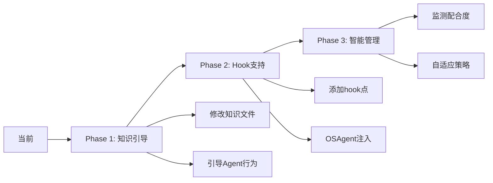

# task_process.md管理决策指南

## 🎯 核心洞察

task_process.md既是**程序的堆栈**（应由程序管理），又是**系统的关键组件**（需要保证存在）。

## 推荐架构（基于实际情况）

### 🏆 最佳实践：Hook轻量注入

```python
# 最小化修改ReactAgentMinimal
class ReactAgentMinimal:
    def execute(self, task, **kwargs):
        # 新增：任务开始hook
        if hasattr(self, 'on_task_start'):
            self.on_task_start(task)
        
        # 原有执行逻辑...
        for round in range(max_rounds):
            thought = self.think()
            
            # 新增：思考后hook
            if hasattr(self, 'on_after_think'):
                self.on_after_think(thought, round)
        
        # 新增：任务结束hook
        if hasattr(self, 'on_task_end'):
            self.on_task_end(result)
```

### OSAgent注入行为

```python
# OSAgent为ProgramAgent注入task_process管理
def create_managed_program_agent(task_knowledge):
    agent = ReactAgentMinimal(knowledge_files=task_knowledge)
    
    # 注入hook
    agent.on_task_start = lambda t: write_file(
        ".notes/program/task_process.md",
        create_initial_todo(t)
    )
    
    agent.on_after_think = lambda thought, round: update_file(
        ".notes/program/task_process.md",
        add_progress(thought, round)
    )
    
    return agent
```

## 为什么这是最佳方案

### 1. 平衡性完美
- **ProgramAgent视角**：我在正常执行任务
- **OSAgent视角**：我通过hook确保task_process被管理
- **用户视角**：系统可靠运行

### 2. 实现简单
- 只需要给ReactAgentMinimal添加3个hook点
- 不改变现有逻辑
- 向后完全兼容

### 3. 灵活可控
```python
# 可以选择性启用
if need_task_process:
    agent.on_after_think = update_task_process
else:
    # 不注入hook，保持原样
    pass
```

## 实施路线图



## 快速决策表

| 如果你... | 选择方案 | 原因 |
|-----------|----------|------|
| 想立即使用，不改代码 | 自主管理（知识引导） | 零成本 |
| 需要可靠保证 | Hook注入 | 平衡最好 |
| 面对不可信Agent | Shadow记录 | 强制管理 |
| 追求极简 | 自主管理 | 最简单 |
| 追求完美 | 混合智能 | 最灵活 |

## 代码示例：最小化实现

### Step 1: 添加Hook支持（5行代码）
```python
# 在ReactAgentMinimal.execute()中添加
if hasattr(self, 'on_after_think'):  # 1行
    self.on_after_think(thought)       # 1行
```

### Step 2: OSAgent使用Hook
```python
# 创建带管理的ProgramAgent
program = ReactAgentMinimal(knowledge)
program.on_after_think = lambda t: update_task_process(t)
result = program.execute(task)
```

## 最终答案

**推荐：Hook轻量注入模式**

原因：
1. ✅ 最小代码改动（<10行）
2. ✅ 完全向后兼容
3. ✅ 可选择性启用
4. ✅ 保证task_process.md被管理
5. ✅ 不影响ProgramAgent的自主性

这就像Linux的信号机制：进程可以忽略大部分信号，但SIGKILL无法忽略。我们的hook就是那个"友好的SIGKILL"。