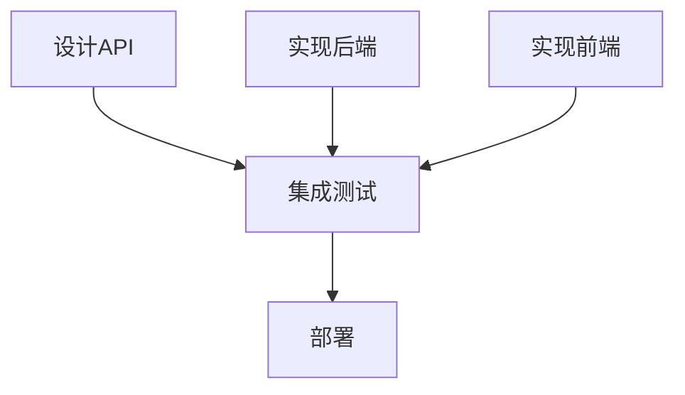

# TODO作为计算图：正确的设计理论

## 核心洞察

TODO不应该是简单的任务列表，而应该是**图灵完备的计算图**。

### 类型层 vs 实例层

```
类型层（算法）          实例层（执行）
─────────────────────────────────────
TODO图                 ExecutionContext树
所有可能的路径         一次具体的执行
依赖关系              执行历史
并行/选择/循环        顺序记录
```

## 为什么TODO应该是图？

### 1. 任务有复杂依赖



任务D被多个任务依赖 = 必须是图

### 2. 任务可以并行

```
并行执行：
├── 后端开发
├── 前端开发
└── 文档编写

这不是树的父子关系，是图的并行分支
```

### 3. 任务可能循环

```
repeat:
    开发 -> 测试 -> 评审
    if (评审通过) break
    else continue
```

循环 = 图特有的结构

## 图灵完备的TODO语言

### 最小指令集

```yaml
# 1. 顺序执行
sequence:
  - task: A
  - task: B

# 2. 并行执行
parallel:
  - task: A
  - task: B

# 3. 条件分支
if:
  condition: "测试通过"
  then:
    task: 部署
  else:
    task: 修复bug

# 4. 循环
while:
  condition: "还有bug"
  do:
    - task: 修复
    - task: 测试

# 5. 依赖等待
wait_for:
  - task: A
  - task: B
then:
  task: C
```

### 这就是图灵完备！

- **顺序** = 基本计算
- **分支** = 条件跳转
- **循环** = 无限计算能力
- **并行** = 现代计算特性
- **依赖** = 同步机制

## 具体设计

### TODO图定义

```python
class TodoGraph:
    """任务依赖图（类型层）"""

    def __init__(self):
        self.nodes = {}  # 任务节点
        self.edges = {}  # 依赖边
        self.conditions = {}  # 条件

    def add_task(self, name, action):
        """添加任务节点"""
        self.nodes[name] = {
            'action': action,
            'status': 'pending'
        }

    def add_dependency(self, from_task, to_task):
        """添加依赖边（可多对多）"""
        if to_task not in self.edges:
            self.edges[to_task] = []
        self.edges[to_task].append(from_task)

    def add_condition(self, task, condition):
        """添加条件分支"""
        self.conditions[task] = condition

    def get_ready_tasks(self):
        """获取所有可执行的任务（依赖已满足）"""
        ready = []
        for task in self.nodes:
            if self.nodes[task]['status'] == 'pending':
                deps = self.edges.get(task, [])
                if all(self.nodes[d]['status'] == 'completed' for d in deps):
                    ready.append(task)
        return ready
```

### ExecutionContext树记录

```python
class ExecutionContext:
    """执行记录树（实例层）"""

    def __init__(self):
        self.tree = []  # 执行历史（树形）
        self.stack = []  # 调用栈

    def execute(self, task):
        """记录任务执行"""
        timestamp = datetime.now()
        self.tree.append({
            'timestamp': timestamp,
            'task': task,
            'depth': len(self.stack)
        })

    def push(self, context):
        """进入子上下文"""
        self.stack.append(context)

    def pop(self):
        """退出子上下文"""
        return self.stack.pop()
```

## 实例：真实的任务图

### 软件发布流程

```yaml
name: 软件发布
tasks:
  - name: 开发特性
    parallel:
      - feature_a
      - feature_b

  - name: 代码审查
    wait_for: [feature_a, feature_b]

  - name: 自动测试
    wait_for: [代码审查]

  - name: 判断结果
    if:
      condition: "测试全部通过"
      then:
        sequence:
          - 构建发布包
          - 部署到生产
      else:
        sequence:
          - 生成错误报告
          - goto: 开发特性  # 循环回去
```

这是一个真正的**计算图**，不是简单的TODO列表！

## 为什么不用工作流引擎？

工作流引擎（如Airflow、Temporal）太重了：
- 需要独立部署
- 复杂的配置
- 外部依赖

我们只需要：
- 轻量级的图定义
- Agent能理解的格式
- 与现有工具集成

## 实现策略

### 第一阶段：扩展现有TODO

```python
# 向后兼容的扩展
todos = [
    {"task": "A", "depends_on": []},
    {"task": "B", "depends_on": ["A"]},
    {"task": "C", "depends_on": ["A", "B"]}  # 多依赖=图
]
```

### 第二阶段：YAML格式

```yaml
todos:
  design:
    action: "设计系统架构"

  backend:
    action: "开发后端"
    depends_on: [design]

  frontend:
    action: "开发前端"
    depends_on: [design]

  testing:
    action: "集成测试"
    depends_on: [backend, frontend]
```

### 第三阶段：完整计算图

支持条件、循环、并行等所有控制流。

## 与Agent的结合

```python
class SmartAgent:
    def __init__(self):
        self.todo_graph = TodoGraph()
        self.execution_context = ExecutionContext()

    def plan(self, goal):
        """将目标分解为任务图"""
        # 分析目标
        # 生成任务节点
        # 建立依赖关系
        return self.todo_graph

    def execute(self):
        """执行任务图"""
        while True:
            ready_tasks = self.todo_graph.get_ready_tasks()
            if not ready_tasks:
                break

            # 可以并行执行ready_tasks
            for task in ready_tasks:
                self.execution_context.execute(task)
                self.todo_graph.nodes[task]['status'] = 'completed'
```

## 数学基础

### 图的属性

- **DAG（有向无环图）**：无循环依赖时
- **强连通分量**：循环任务组
- **拓扑排序**：执行顺序
- **关键路径**：最长依赖链

### 计算复杂度

- **调度问题**：NP-完全
- **启发式算法**：贪心、动态规划
- **并行度分析**：最大独立集

## 优势

1. **表达能力强**：可以描述任意复杂的流程
2. **执行灵活**：支持并行、条件、循环
3. **易于优化**：可以分析关键路径
4. **自然建模**：符合实际任务关系

## 结论

TODO不应该是树，应该是**图灵完备的计算图**：

- **图结构**：表达复杂依赖
- **控制流**：条件、循环、并行
- **类型层**：定义所有可能
- **实例层**：记录实际执行

这不是过度设计，而是**认识到TODO的本质就是程序**。

每个TODO列表都是一个待执行的算法，每次执行都产生一棵执行树。

**TODO图 + ExecutionContext树 = 完整的计算模型**