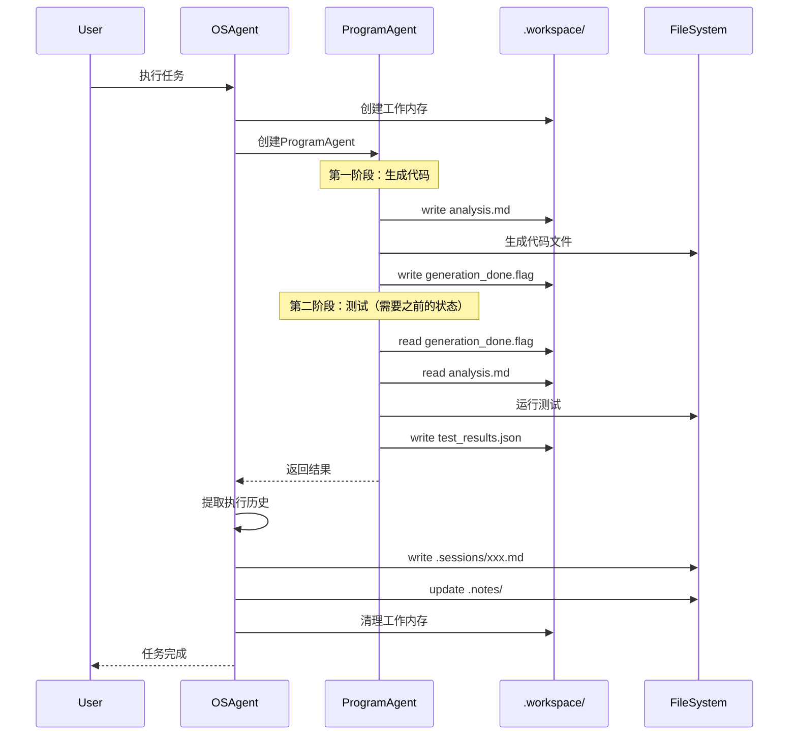

# 冯·诺依曼Agent架构 - 正确设计

## 核心理解：内存访问是必需的

### 错误理解（之前）
```
ProgramAgent不能访问文件系统 → Agent只能处理有限状态 → 不是图灵完备
```

### 正确理解（现在）
```
ProgramAgent必须能访问文件系统 → Agent可以处理无限状态 → 图灵完备
```

## 冯·诺依曼架构映射

| 冯·诺依曼组件 | Agent架构组件 | 功能 |
|---------------|---------------|------|
| **CPU** | ReactAgentMinimal | 执行引擎 |
| **寄存器** | 消息历史（50条窗口） | 工作寄存器 |
| **RAM** | .workspace/ 目录 | 工作内存 |
| **硬盘** | 整个文件系统 | 持久存储 |
| **MMU** | OSAgent | 内存管理单元 |
| **页表** | .sessions/ + .notes/ | 内存映射 |

## 内存层次结构

```
寄存器（最快，最小）
├── Agent消息历史：50条滑动窗口
└── 当前思考上下文

L1缓存
├── .workspace/current_task.md：当前任务状态
└── .workspace/temp_results.json：临时结果

L2缓存
├── .workspace/：工作目录
└── world_state.md：全局状态快照

主内存
├── .notes/{agent}/：Agent私有内存
└── 项目文件：代码和数据

硬盘（最慢，最大）
├── .sessions/：历史记录（只追加）
└── 知识文件：长期知识
```

## 正确的架构设计

### 1. OSAgent（内存管理器）

```python
OSAgent = ReactAgentMinimal + 管理知识

职责：
1. 创建和管理ProgramAgent进程
2. 分配工作内存（.workspace/）
3. 管理页表（.sessions/、.notes/）
4. 处理缺页中断（Agent需要更多内存时）
5. 垃圾回收（清理临时文件）
```

### 2. ProgramAgent（用户进程）

```python
ProgramAgent = ReactAgentMinimal + 任务知识

权限：
1. ✅ 读写 .workspace/（自己的堆栈）
2. ✅ 读 world_state.md（共享内存）
3. ✅ 读写项目文件（工作数据）
4. ❌ 不能写 .sessions/（内核空间）
5. ❌ 不能写 .notes/（由OS管理）
```

### 3. 内存访问模式

```python
# ProgramAgent的知识文件中
"""
## 工作内存管理

我可以使用.workspace/目录作为工作内存：

### 保存中间状态
write_file(".workspace/analysis_result.json", result)

### 读取之前的分析
previous = read_file(".workspace/analysis_result.json")

### 创建检查点
write_file(".workspace/checkpoint_1.md", current_state)

### 读取全局状态（只读）
world = read_file("world_state.md")

这让我能处理超出上下文窗口的复杂任务！
"""
```

## 执行流程

### 用户任务："生成并测试博客系统"



## 关键优势：处理无限大的隐变量

### 场景：调试一个复杂bug

```python
# ProgramAgent可以这样工作：

# 轮次1-10：收集信息
for file in suspicious_files:
    analysis = analyze(file)
    write_file(f".workspace/analysis_{file}.json", analysis)

# 轮次11-20：关联分析（之前的分析还在！）
all_analysis = []
for file in glob(".workspace/analysis_*.json"):
    all_analysis.append(read_file(file))

pattern = find_pattern(all_analysis)
write_file(".workspace/bug_pattern.md", pattern)

# 轮次21-30：生成修复（基于之前的所有分析）
bug_pattern = read_file(".workspace/bug_pattern.md")
for file in files_to_fix:
    fix = generate_fix(file, bug_pattern)
    apply_fix(file, fix)
```

**这是50轮上下文窗口无法完成的，但有了工作内存就可以！**

## 与纯Tool模式的对比

| 方面 | 纯Tool模式（错误） | 冯·诺依曼模式（正确） |
|------|-------------------|---------------------|
| 状态管理 | 无状态，每次重新开始 | 有状态，可以续传 |
| 处理能力 | 受限于上下文窗口 | 无限（通过文件系统） |
| 复杂任务 | 无法处理 | 可以处理 |
| 中间结果 | 丢失 | 保存在.workspace/ |
| 调试能力 | 困难 | 可以检查中间状态 |

## 实现要点

### 1. 修改OSAgent知识

```markdown
## 创建ProgramAgent时

分配工作内存：
- 创建 .workspace/ 目录
- 设置权限：ProgramAgent可读写
- 初始化：清空或保留（根据任务类型）

告诉ProgramAgent：
- 你可以使用.workspace/作为工作内存
- 你可以读world_state.md了解全局状态
- 你可以读写项目文件完成任务
```

### 2. 修改ProgramAgent知识

```markdown
## 我的内存使用策略

1. 使用.workspace/保存所有中间状态
2. 为长任务创建检查点
3. 分阶段处理，每阶段保存结果
4. 下一阶段可以读取之前的结果
5. 这让我能处理任意复杂的任务
```

## 哲学意义

### React + 文件系统 = 完整的计算机

```
React Agent ≈ CPU：有限的执行能力
文件系统 ≈ 内存：无限的存储能力
组合 = 图灵完备的计算系统
```

### 为什么这是关键

1. **突破上下文限制**：50轮窗口 + 无限文件 = 无限计算
2. **真正的程序**：可以保存状态、创建检查点、断点续传
3. **复杂任务可行**：多阶段任务通过文件系统协调
4. **调试友好**：所有中间状态可检查

## 结论

**ProgramAgent必须能访问文件系统！**

这不是设计缺陷，而是冯·诺依曼架构的核心要求。就像Linux程序必须能访问内存一样，Agent必须能访问文件系统才能成为真正的通用计算器。

关键区别在于**访问权限**：
- ProgramAgent：可以读写工作内存（.workspace/）
- OSAgent：管理整个内存结构（.sessions/、.notes/）

这样既保证了计算能力，又维护了系统完整性。