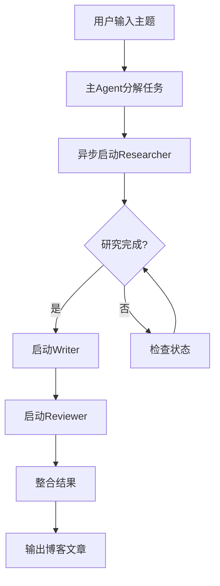

# 自然语言虚拟机概念验证 Use Case

## 1. 概述

本文档定义了一个用于验证自然语言虚拟机（NLVM）可行性的概念验证案例。通过实现一个博客文章自动生成系统，我们将验证 NLVM 的核心能力。

## 2. Use Case：智能博客生成系统

### 2.1 系统描述

创建一个能够自动生成高质量技术博客文章的智能系统。系统通过多个专业 Agent 协作，完成从研究到写作再到审核的完整流程。

### 2.2 业务价值

- 自动化内容创作流程
- 确保文章质量一致性
- 展示多 Agent 协作能力
- 验证异步执行机制

## 3. 系统架构

### 3.1 目录结构

```
blog_generator/
├── 先验知识.md              # 博客生成系统总体知识
├── 工具规范.md              # 系统对外能力描述
├── workspace/              # 工作目录
│   ├── research/          # 研究资料
│   ├── drafts/            # 文章草稿
│   └── final/             # 最终文章
└── agents/
    ├── researcher/         # 研究员 Agent
    │   ├── 先验知识.md
    │   ├── 工具规范.md
    │   └── workspace/
    ├── writer/            # 写作 Agent
    │   ├── 先验知识.md
    │   ├── 工具规范.md
    │   └── workspace/
    └── reviewer/          # 审核 Agent
        ├── 先验知识.md
        ├── 工具规范.md
        └── workspace/
```

### 3.2 Agent 职责定义

#### 主 Agent（Blog Generator）
- 接收用户的博客主题
- 协调子 Agent 的工作
- 整合最终结果

#### Researcher Agent
- 搜集相关技术资料
- 分析技术趋势
- 整理参考文献
- 生成研究报告

#### Writer Agent
- 基于研究报告撰写文章
- 确保文章结构清晰
- 添加代码示例
- 优化可读性

#### Reviewer Agent
- 检查技术准确性
- 评估文章质量
- 提出改进建议
- 给出评分

## 4. 执行流程

### 4.1 主流程



### 4.2 详细步骤

1. **任务接收**
   ```
   输入: "写一篇关于 'React Agent 设计模式' 的技术博客"
   ```

2. **任务分解**
   ```
   - 研究任务: "研究 React Agent 设计模式的最新进展和最佳实践"
   - 写作任务: "基于研究报告，撰写一篇 2000 字的技术博客"
   - 审核任务: "审核文章的技术准确性和可读性"
   ```

3. **异步执行**
   ```python
   # 主 Agent 的执行逻辑（自然语言描述）
   1. task_id = execute_agent_async("researcher", research_task)
   2. 等待研究完成，每 30 秒检查一次状态
   3. research_result = get_agent_result(task_id)
   4. 将研究结果传递给 writer
   5. writing_result = execute_agent("writer", write_task + research_result)
   6. review_result = execute_agent("reviewer", review_task + writing_result)
   7. 整合所有结果，生成最终文章
   ```

## 5. 知识文件示例

### 5.1 主 Agent 先验知识

```markdown
# 博客生成系统先验知识

## 系统目标
生成高质量的技术博客文章，确保内容准确、结构清晰、易于理解。

## 工作流程
1. 研究阶段：收集资料，了解技术背景
2. 写作阶段：基于研究撰写文章
3. 审核阶段：确保质量符合标准

## 质量标准
- 技术准确性：所有技术细节必须正确
- 结构清晰：包含引言、主体、结论
- 代码示例：提供可运行的代码
- 可读性：语言简洁，逻辑清晰

## 协调策略
- 研究阶段可能耗时较长，使用异步执行
- 写作完成后立即启动审核
- 如果审核不通过，要求 writer 修改
```

### 5.2 Researcher Agent 先验知识

```markdown
# 研究员 Agent 先验知识

## 研究方法
1. 搜索官方文档
2. 查找相关论文和文章
3. 分析实际项目案例
4. 总结最佳实践

## 研究重点
- 核心概念解释
- 技术优势分析
- 实际应用场景
- 常见问题解决方案

## 输出格式
生成结构化的研究报告：
- 技术概述
- 核心原理
- 使用案例
- 参考资料列表
```

## 6. 测试场景

### 6.1 测试用例 1：正常流程

**输入**
```
请写一篇关于 "React Agent 设计模式" 的技术博客
```

**预期结果**
- 生成包含以下部分的博客文章：
  - 引言：介绍 React Agent 的背景
  - 核心概念：解释关键技术点
  - 实践案例：提供代码示例
  - 最佳实践：总结使用建议
  - 结论：展望未来发展

**验证点**
- [ ] 文章结构完整
- [ ] 技术内容准确
- [ ] 包含可运行的代码示例
- [ ] 审核评分 ≥ 80 分

### 6.2 测试用例 2：异步执行

**测试步骤**
1. 启动博客生成任务
2. 立即查询 researcher 状态
3. 等待 10 秒后再次查询
4. 验证状态变化

**预期行为**
```
初始状态: "running - 正在搜集资料"
10秒后: "running - 已完成 30%"
最终: "completed - 研究报告已生成"
```

### 6.3 测试用例 3：错误处理

**场景 1：Researcher 超时**
- 设置 researcher 执行时间超过限制
- 验证系统能够检测超时并采取措施

**场景 2：Writer 生成失败**
- 模拟 writer 返回错误
- 验证系统能够重试或优雅降级

**场景 3：Reviewer 拒绝**
- Reviewer 评分低于阈值
- 验证系统要求 writer 重写

### 6.4 测试用例 4：并发能力

**测试步骤**
1. 同时提交 3 个不同主题的博客请求
2. 验证所有任务能够并发执行
3. 检查资源使用情况

**预期结果**
- 3 个任务同时进行
- 互不干扰
- 合理的资源分配

## 7. 验证指标

### 7.1 功能性指标

| 指标 | 目标值 | 测量方法 |
|------|--------|----------|
| 任务完成率 | > 95% | 成功生成文章数/总请求数 |
| 文章质量分数 | > 80 | Reviewer 评分平均值 |
| 异步执行成功率 | 100% | 异步任务成功数/总异步任务数 |

### 7.2 性能指标

| 指标 | 目标值 | 测量方法 |
|------|--------|----------|
| 平均完成时间 | < 5分钟 | 从请求到生成文章的时间 |
| 并发处理能力 | ≥ 3 | 同时处理的任务数 |
| 资源利用率 | < 80% | CPU/内存峰值使用率 |

### 7.3 可靠性指标

| 指标 | 目标值 | 测量方法 |
|------|--------|----------|
| 错误恢复率 | > 90% | 错误后成功恢复数/总错误数 |
| 超时处理率 | 100% | 正确处理的超时数/总超时数 |
| 数据一致性 | 100% | 检查工作空间文件完整性 |

## 8. 实施计划

### 第一阶段：基础实现（2天）
1. 创建目录结构
2. 编写各 Agent 的先验知识和工具规范
3. 实现基本的同步执行流程

### 第二阶段：异步机制（3天）
1. 在 GenericReactAgent 中实现异步执行
2. 添加状态查询和结果获取功能
3. 测试异步执行能力

### 第三阶段：完善和测试（2天）
1. 添加错误处理机制
2. 实现所有测试用例
3. 优化性能和稳定性

## 9. 成功标准

1. **核心功能验证**
   - [ ] 能够生成完整的博客文章
   - [ ] 多 Agent 协作正常
   - [ ] 知识隔离有效

2. **异步能力验证**
   - [ ] 异步执行机制工作正常
   - [ ] 状态查询准确
   - [ ] 并发执行无冲突

3. **可靠性验证**
   - [ ] 错误能被正确处理
   - [ ] 系统能从失败中恢复
   - [ ] 长时间运行稳定

4. **性能验证**
   - [ ] 满足性能指标要求
   - [ ] 资源使用合理
   - [ ] 扩展性良好

## 10. 风险和缓解措施

| 风险 | 影响 | 缓解措施 |
|------|------|----------|
| LLM 响应不稳定 | 结果不确定 | 添加重试机制和结果验证 |
| 异步执行复杂度 | 开发难度大 | 先实现简单版本，逐步优化 |
| 性能瓶颈 | 响应时间长 | 引入缓存和并行处理 |
| 知识描述不准确 | Agent 行为异常 | 迭代优化知识文件 |

## 11. 总结

通过这个博客生成系统的概念验证，我们将全面验证自然语言虚拟机的核心能力：

1. **模块化设计**：每个 Agent 独立且可复用
2. **自然语言编程**：所有逻辑用自然语言表达
3. **异步执行**：支持长时间运行的任务
4. **错误处理**：系统具有自我恢复能力
5. **实用价值**：生成的博客文章具有实际价值

成功完成这个 use case 将证明 NLVM 不仅是一个有趣的概念，更是一个可以解决实际问题的强大工具。